# Nostrautica — Průvodce pro organizátory

Nostrautica je aplikace pro akce postavená na jedné myšlence: **na vaší akci nejvíc záleží na tom, kdo koho potká**. Účastníci si nahrají krátké video, ve kterém se představí, a volitelný AI koordinátor jim na jeho základě řekne, s kým by se měli bavit a proč. Tento průvodce vás provede od úplného začátku až po běžící akci.

## Co vás čeká

1. Vytvoření identity (jednou).
2. Vytvoření akce — volitelně rovnou s připojeným AI koordinátorem, nebo později.
3. Sdílení akce — otevřený odkaz, pozvánkové kódy, nebo obojí.
4. Schvalování účastníků (nebo necháte pozvánkové kódy schvalovat automaticky).
5. Zveřejňování novinek, úprava vzhledu stránky akce a běh akce.

Všechno běží ve vašem prohlížeči. Nic se nenastavuje na serveru — aplikace ukládá data akce zašifrovaná na otevřené síti Nostr. Klíče akce drží váš prohlížeč, proto **používejte jeden prohlížeč, který si necháte** (a jakmile vás k tomu aplikace vyzve, zazálohujte si identitu).

> **Poznámka k uspořádání aplikace.** Jakmile jste uvnitř akce, spodní lišta je *vázaná na danou akci* — **Přehled**, **Lidé**, **Spojení**, **Novinky** a **Více** se týkají akce, ve které právě jste, a kompaktní hlavička nad nimi ukazuje její název a váš status. Další dvě karty, **Přednášky** a **Chat**, se objeví jen tehdy, když tyto funkce zapnete (§6.5) — pro vás i pro účastníky. Vaše globální věci (všechny vaše akce, zprávy, nastavení, vaše identita) jsou v nabídce **Více**. Jako organizátor tam navíc najdete **Správa akce**, která otevře administraci popsanou v §3.

## 1. Vytvoření identity

Otevřete aplikaci. Na úvodní obrazovce napište své jméno a klepněte na **Vytvořit mou identitu** (můžete přidat i fotku). Žádný e-mail, žádné heslo — účet vznikne okamžitě. Pokud už Nostr používáte, klepněte na **Už jste na Nostru? Přihlaste se** a místo toho použijte svůj klíč, rozšíření prohlížeče nebo vzdálený podepisovač.

> **Tip:** tento krok nemusíte dělat zvlášť — pokud se odhlášení rovnou pustíte do vytváření akce, aplikace vám organizátorskou identitu vytvoří v rámci téhož odeslání.

Jakmile se vaše identita vytvoří, zobrazí se vám **karta se zálohou**. Udělejte to hned: klepněte na **Kopírovat můj tajný klíč** a vložte ho někam bezpečně (do správce hesel). Kdokoli má tento klíč, *je* vámi; bez něj ztracený profil prohlížeče znamená ztracenou akci. Nabídka „Další způsoby zálohování" nabízí i obnovovací odkaz e-mailem nebo soubor chráněný heslem.

## 2. Vytvoření akce

Zvolte **Vytvořit akci** a vyplňte formulář:

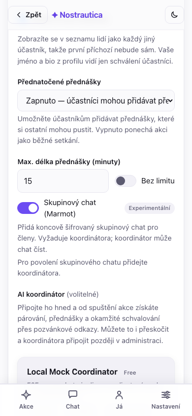

- **Název, shrnutí, začátek/konec, místo** — veřejně viditelné pro kohokoli s odkazem.
- **Schvalování** — jak se lidé dostanou dovnitř:
  - *Ruční posouzení*: každá žádost čeká na vaše schválení.
  - *Pouze pozvánkové kódy*: dovnitř se dostanete jen přes pozvánkový odkaz, jinak nijak.
  - *Pozvánkové kódy + ruční*: pozvánkové odkazy schvalují automaticky (je-li připojen koordinátor); ostatní čekají na vás. **Doporučeno pro většinu akcí.**
- **Jazyk akce** — viz níže.
- **AI párování** — nastavte na *Zapnuto*, pokud plánujete připojit koordinátora (§5). Koordinátora můžete připojit i později; toto nastavení teď nechte zapnuté.
- **AI koordinátor** (volitelné) — vyberte si ho rovnou tady na formuláři, stejný seznam jako v §5, takže akce s pozvánkovými kódy může schvalovat automaticky a párovat hned od spuštění. Přeskočte to a připojte koordinátora později přes **Administrace → Nastavení**, pokud se chcete rozhodnout až podle toho, jak se akce zaplňuje — na zbytku formuláře to nic nemění.

  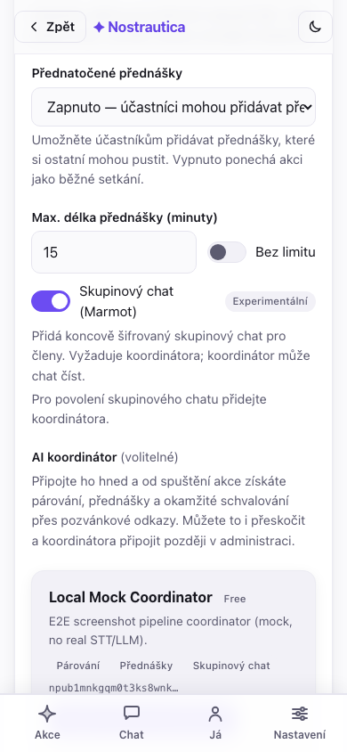
- **Přidat se mezi účastníky** — ve výchozím stavu zaškrtnuto: jste zapsáni jako kterýkoli jiný účastník, takže první člověk, který se připojí, uvidí v seznamu **Lidé** aspoň vás místo prázdného seznamu (a jakmile nahrajete představení, může být spárován i s vámi). Vaše jméno a bio vidí jen schválení účastníci; zrušte zaškrtnutí, pokud chcete akci organizovat, aniž byste se objevili v seznamu.
- **Pokročilé** (sbalené) — nahrání ikony a banneru akce (jinak se vygenerují z názvu) a nastavení limitu délky videa s představením. Ikonu a banner můžete vybrat a oříznout **ještě dřív, než máte identitu** — pokud akci vytváříte nepřihlášeni, aplikace oříznuté obrázky podrží lokálně a nahraje je za vás hned poté, co při odeslání vytvoří vaši identitu, takže se nemusíte zastavovat a přihlašovat.

### Jazyk akce

Vyberte jazyk, ve kterém vaše akce běží. Začněte psát a vyhledejte ho — podle názvu jazyka ve vašem vlastním jazyce *nebo* podle dvoupísmenného kódu (napište „česk" nebo „cs" a najdete češtinu). Váš vlastní jazyk, jazyky preferované vaším prohlížečem a angličtina/slovenština/čeština jsou připnuté nahoře; zbytek následuje abecedně.

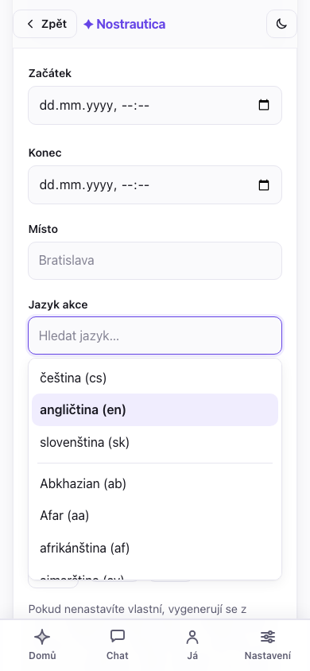

Jazyk dělá tři věci. Nastavuje **výchozí jazyk rozhraní** pro účastníky, kteří vaši akci otevřou (i tak si ho mohou přepnout v Nastavení). Nastavuje jazyk, ve kterém píše AI: **odůvodnění spojení a shrnutí profilů jsou vždy v jazyce vaší akce**, bez ohledu na to, jakým jazykem daný účastník skutečně mluví nebo v jakém nahrává — někdo může nahrát své představení anglicky na české akci a všichni si přesto přečtou, proč by se s ním měli potkat, česky. A když účastník napíše své bio v jiném jazyce, koordinátor **zveřejní překlad do jazyka akce**, aby si ho mohl přečíst zbytek místnosti — původní text dané osoby zůstává vždy zachovaný a zobrazený také. Výchozí je angličtina; pro anglickou akci ji neměňte.

(Kvůli tomu nikdy nic nemusíte spouštět znovu: když účastník aktualizuje své představení, systém automaticky přepočítá jen spojení, jejichž je součástí.)

Všimněte si poznámky pod formulářem: **rotace klíčů funguje jen dopředu** — odebrání někoho (§4) chrání *budoucí* obsah, ne to, co už viděl. Retenční období nastavíte v **Administrace → Nastavení → Smazat data účastníků po akci** (počet dní, nebo prázdné pole pro neomezené uchování) — účastníci vidí deklarované období při připojení, a jakmile uplyne, koordinátor smaže i své vlastní kopie, nejen zveřejněné záznamy. Jde o skutečný úklid, ne o absolutní záruku, že každá poslední kopie je všude pryč (smazání na relayích je jen nejlepší snaha a zálohy jsou samostatná věc) — přesné limity popisuje [Šifrování a soukromí](ENCRYPTION-AND-PRIVACY.md).

Po vytvoření dostanete **odkaz ke sdílení**, kontrolní seznam dalších kroků
a **potvrzenku** — každý zveřejňovací krok se hlásí samostatně, takže
částečné selhání je zjevné a dá se zopakovat, ne tiše chybí:

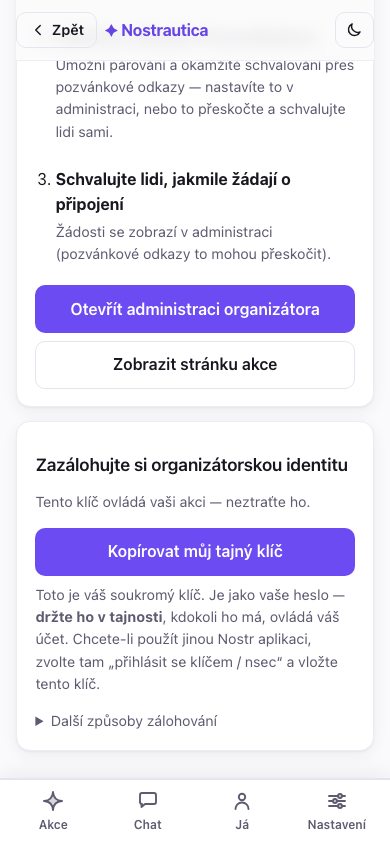

Samotná akce, pokud jste se dostali až sem, se vytvoří vždy. Dva vedlejší
kroky mohou selhat nezávisle na sobě při špatném připojení — zápis vás mezi
účastníky a odeslání instalačního grantu koordinátorovi, pokud jste ho
vybrali na formuláři — a každý má vlastní tlačítko **Zkusit znovu** přímo v
potvrzence, místo aby vás nutil vyplňovat celý formulář znovu. Třetí řádek,
**záloha čeká**, jen znamená, že jste si ještě neuložili klíč (viz krok 1) —
není to chyba.

**Pořádáte stejnou akci znovu za měsíc?** Jakmile existuje, otevřete ji a
použijte **Duplikovat akci** z menu akce: nový formulář na vytvoření,
předvyplněný názvem, popisem, obrázky, jazykem a nastaveními této akce
(název se změní na „Kopie …") — pořád ho musíte projít a odeslat a vznikne z
něj úplně nová akce s vlastními klíči a prázdným seznamem účastníků, ne
kopie dat.

## 3. Otevření administrace a sdílení

Klepněte na **Otevřít administraci organizátora** (kdykoli dostupné i přes **Více → Správa akce**). Ovládací panel má dvě záložky, takže běžný provoz akce nikdy neznamená rolovat přes jednorázová nastavení:

- **Administrace** — záložka, na které přistanete, a ta, na kterou se budete vracet nejčastěji: stavový řádek (počet čekajících, s odkazem na jedno klepnutí), **žádosti o připojení** úplně nahoře, generování pozvánkových kódů, seznam schválených účastníků (odebrat/zpracovat znovu), moderování přednášek a **Komunikace** (příspěvky/novinky).
- **Nastavení** — jednorázové věci pro danou akci: AI koordinátor (§5), menu a rozložení stránky akce, vzhled/téma CSS, režim přednatočených přednášek, skupinový chat a spoluorganizátoři. Pokud jste koordinátora vybrali už na formuláři při vytváření (§2), tady už uvidíte, že je připojený.

Čerstvá akce, zatím žádné žádosti:

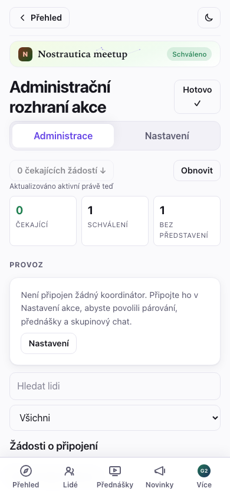

### Přehledový pás

Nahoře v Administraci, před jakýmkoli detailem o jednotlivcích, kompaktní
**přehled** ukáže stav celé akce na jeden pohled: počty čekajících /
schválených / bez představení, jestli jsou v pořádku párování, koordinátor a
fakturace, a cokoli, co si opravdu žádá vaši pozornost (selhané úlohy,
přednášky čekající na kontrolu), zobrazené nad běžným detailem, ne
zapadlé v něm. Pod ním **vyhledávací pole a filtr** naráz zúží frontu
žádostí i seznam schválených — podle jména, nebo podle stavu (čeká,
schválený, bez představení, zpracování selhalo, poslaná přednáška) —
takže u 200členné akce nemusíte rolovat, abyste našli toho jednoho, kdo vám
napsal e-mail:

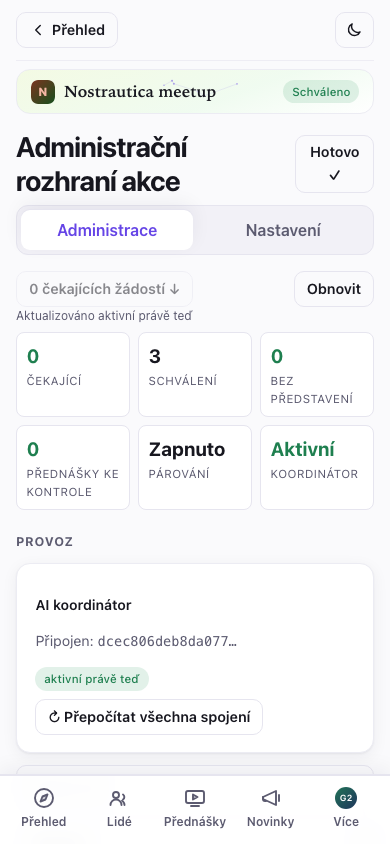

Klepnutím na řádek kohokoli otevřete **detailní panel** — jeho odeslaný
profil, média a provozní historii (stav koordinátora, odeslané přednášky) —
aniž byste opustili seznam.

Ke sdílení máte tři druhy odkazů:

- **Otevřený odkaz na akci** (`…#/e/<akce>/join`, zobrazený blíž ke spodku s tlačítkem **Kopírovat pozvánkový odkaz**) — kdokoli si může prohlédnout veřejnou stránku akce a požádat o připojení. Dejte ho na svůj web nebo sociální sítě.
- **Pozvánkové kódy** — jednorázové odkazy, které držitele automaticky schválí *je-li připojen koordinátor*. Nastavte počet a klepněte na **Vygenerovat**; dostanete jeden odkaz + QR kód na kód. Pošlete jeden na osobu, nebo QR kódy vytiskněte. Kód se veze ve fragmentu URL a nikdy se nedostane na server — s každým odkazem zacházejte jako s lístkem.
- **Sdílený vstupní kód** — jeden QR kód, který naskenuje celý sál najednou, místo jednoho odkazu na osobu. Nastavte počet lidí (0 znamená bez limitu) a na kolik hodin má kód platit, pak klepněte na **Vytvořit sdílený kód** a dostanete jeden odkaz + QR na úvodní snímek. Existuje jen v tomto okně prohlížeče — zkopírujte ho nebo ukažte, než stránku zavřete, protože se pak už nedá znovu získat. Platnost držte krátkou: jakmile vyprší, opozdilci prostě skončí ve frontě na schválení, místo aby byli odmítnuti.

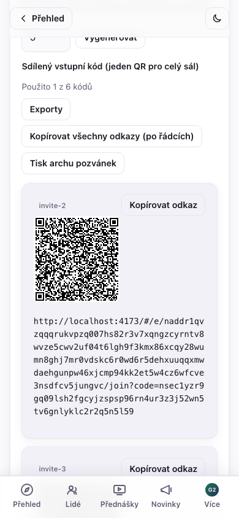

Víc než pár kódů se už nepohodlně rozdává odkaz po odkazu — **Kopírovat
vše** / **Stáhnout** vezmou všechny vygenerované odkazy jako obyčejný text
pro hromadnou korespondenci a **Vytisknout pozvánkový list** rozloží po
jednom QR kódu na kód, víc na stránku, připravené k rozstříhání a rozdání u
dveří.

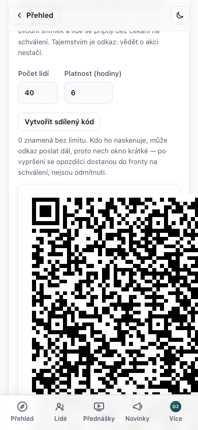

## 4. Schvalování účastníků

Žádosti o připojení se objevují v sekci **Žádosti o připojení** — každá zobrazuje jméno osoby, krátké id, její dovednosti, značku **pozvánka**, pokud použila kód, a značku 🎥, pokud už nahrála představení. Tlačítko „N čekajících žádostí ↓" nahoře vás tam přesune.

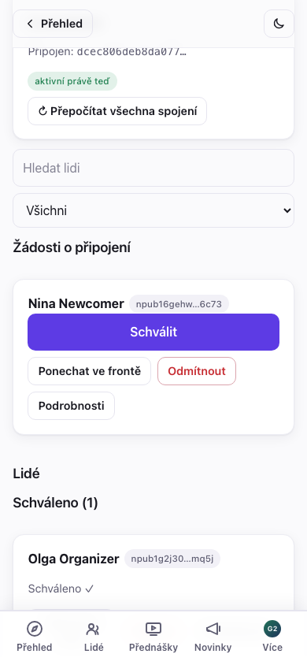

Klepněte na **Schválit** u lidí, které chcete pustit dovnitř jednoho po
druhém, nebo na **Schválit všechny (N)**, abyste prošli všechny čekající
naráz. Hromadné schvalování hlásí výsledek pro každého zvlášť — ve frontě →
zveřejňuje se → potvrzeno, nebo selhalo —, takže výpadek připojení u jednoho
člověka nikdy neschová, jestli prošlo i zbylých devět; souhrnný řádek („N
schváleno, M je potřeba zopakovat") to na konci shrne a každé selhání má
vlastní tlačítko **Zkusit znovu**, místo abyste museli opakovat celou dávku.

Ne každý čekající potřebuje ano nebo ne hned teď: **Odmítnout** žádost
lokálně schová (účastník se to nedozví a dá se to vrátit zpět z malého
pruhu „N odmítnutých"), a **Nechat čekat** ji jen označí jako
prohlédnutou, aniž byste se museli rozhodnout — obojí je jen vaše lokální
poznámka, ne akce v protokolu, takže si to můžete kdykoli rozmyslet.

Schválení lidé se přesunou do sekce **Schváleno**. Každá schválená karta má **Zpracovat znovu** (znovu zveřejní záznam v adresáři / přepočítá spojení) a **Odebrat**.

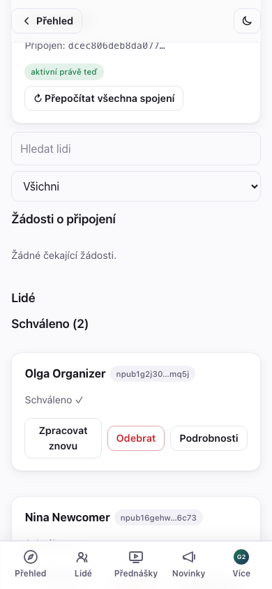

Schválení účastníci získají přístup k zašifrovanému seznamu účastníků,
představovacím videím ostatních a (s připojeným koordinátorem) svým
spojením. Schvalování funguje stejně bez ohledu na to, jestli je připojen
koordinátor; jeho připojení (§5) se pořád vyplatí kvůli automatickému
schvalování a spojením, už ale není nutné jen k tomu, aby fungovalo ruční
schvalování.

### Odebrání někoho

Klepněte na **Odebrat** u schválené karty. Dostanete potvrzení vysvětlující důsledek:

> *„Odebrat {jméno}? Ztratí přístup ke všemu novému. To, co už viděl, se vzít zpět nedá."*

Potvrzení automaticky otočí klíč akce pro všechny ostatní, takže odebraná osoba nedokáže dešifrovat nic zveřejněného od tohoto bodu dál. To, co už viděla, se „odvidět" nedá — pokud si nejste jistí, odeberte dřív.

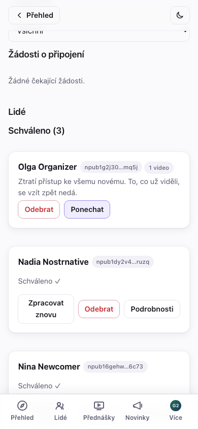

## 5. Připojení AI koordinátora (párování)

Koordinátor je malá služba, která přepisuje představovací videa, sestavuje profil každého účastníka a počítá, kdo by měl koho potkat. Bez něj akce pořád plně funguje — seznam účastníků, videa, sledování — jen bez automatických spojení a pozvánkové odkazy potřebují vaše ruční schválení.

Vybrat si ho můžete rovnou na formuláři při vytváření (§2), aby běžel od začátku, nebo ho připojit později — stejný seznam, jen na jiném místě: u existující akce je to v **Administrace → Nastavení → AI koordinátor**, ne v Administraci (ta záložka je pro věci, které děláte opakovaně; připojení koordinátora je jednorázové nastavení). Tak či onak si **vyberete koordinátora ze seznamu** — každý se na Nostru ohlašuje svým jménem, funkcemi, zveřejněním ochrany soukromí (které kroky AI opouštějí zabezpečenou enklávu) a svým ceníkem (referenční koordinátor je **Zdarma**). Klepněte na **Použít tohoto koordinátora**:

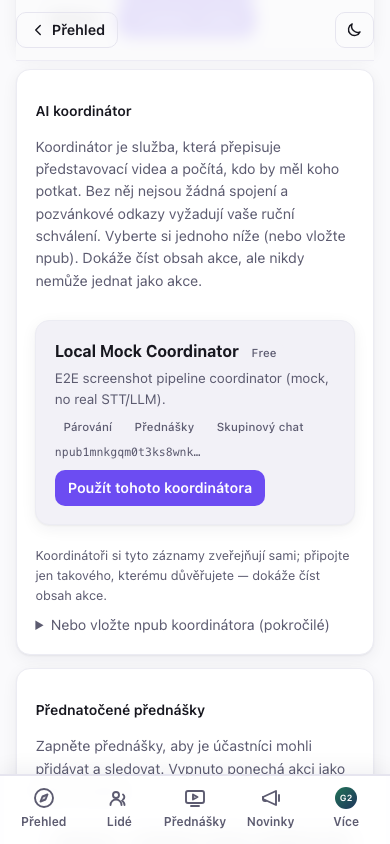

Chcete provozovat vlastního, nebo vám byl dán konkrétní? Rozbalte **Nebo vložte npub koordinátora (pokročilé)** a místo toho vložte jeho veřejný klíč. Tak či onak uvidíte potvrzení:

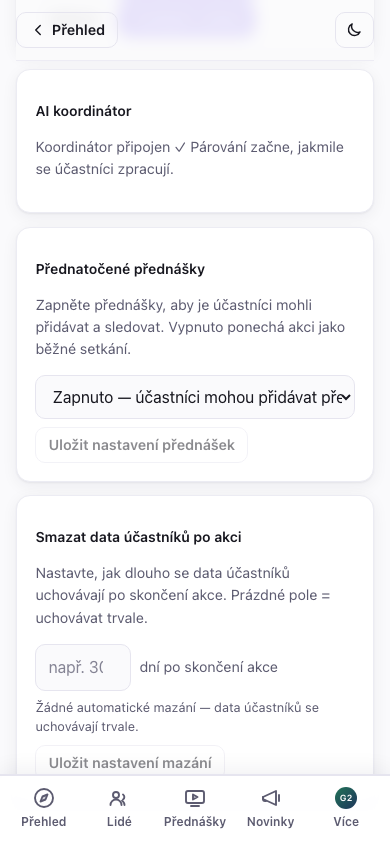

> **Placení koordinátoři.** Koordinátor může být zpoplatněný (náklady na AI párování rostou s počtem účastníků), takže záznam může ukazovat cenu nebo bezplatnou úroveň (např. „do 20 účastníků zdarma"). Je-li kdy potřeba platba, obrazovka Nastavení zobrazí banner **Vyžaduje se platba** s odkazem na platbu — současný referenční koordinátor je zdarma.

Koordinátor umí číst přihlášky a zveřejňovat jménem akce — záznamy v adresáři, seznam účastníků, spojení, přednášky — ale nikdy nedokáže vydávat se za vás ani měnit nastavení vaší akce. Vyberte si operátora, kterému s touto pravomocí důvěřujete. Na záložce **Administrace** se objeví tlačítko **↻ Přepočítat všechna spojení** (je to opakovaná akce, ne nastavení); použijte ho po náporu nových účastníků.

### Výměna nebo odpojení koordinátora

Nejste spokojení s tím, kterého jste si vybrali, nebo za něj už nechcete
platit? V **Nastavení → AI koordinátor** vám **Vyměnit** otevře stejný
seznam k výběru (nebo pole na npub) pro přepnutí na jiného koordinátora —
otočí se tím klíč akce a novému koordinátorovi se udělí grant; starý od té
chvíle ztrácí přístup. **Odpojit** ho odstraní úplně, bez náhrady.

Obojí je pro koordinátora, kterého opouštíte, nevratné — jakmile je vyměněný nebo odpojený, nemůže už nad akcí později znovu získat pravomoc. Odpojení konkrétně znamená:

- **Párování se zastaví**, dokud nepřipojíte jiného koordinátora.
- **Správa chatu zůstane bez majitele**, pokud jste měli zapnutý skupinový
  chat — nikdo aktivně nepřidává nové členy do zašifrované místnosti, dokud
  se ujme jiný koordinátor (stávající členové si přístup zachovají; viz
  poznámka o organizátorských zařízeních v §6.5).
- Starší obsah zůstává přesně tak čitelný, jako byl vždy — odpojení zpětně
  nic neschovává, jen zastaví budoucí zpracování.

### Připojení nebo odpojení během akce

Obě operace jsou bezpečné i během běžící akce, ale restart koordinátora
zahodí to, co právě zpracovával v danou chvíli — logika opakování úloh to
obnoví, ale pokud aktivně běží akce, je ohleduplnější k účastníkům udělat
takovou změnu mezi nápory zpracování (hned po tom, co se vlna nových
příchozích uklidní), ne zrovna ve chvíli, kdy někomu odchází představení.

> Spuštění koordinátora je samostatný, technický krok (malý démon, který potřebuje `ffmpeg` a klíč k poskytovateli LLM/přepisu řeči). Podívejte se na [`packages/coordinator/coordinator.example.toml`](../packages/coordinator/coordinator.example.toml), [operační příručku](COORDINATOR-OPERATOR-GUIDE.md) a README repozitáře. Jeho relaye nasměrujte na stejný relay, který používá vaše akce.

## 6. Zveřejňování příspěvků pro účastníky

Karta **Příspěvky akce** (v administraci pod **Komunikace**) je váš oznamovací kanál — „program je hotový", „změna místa konání", „dnešní večeře je v…". Zadejte titulek a volitelné shrnutí/hlavičkový obrázek, napište text (**funguje Markdown** — nadpisy, seznamy, odkazy, tučné písmo) a vyberte, **kdo ho může číst**:

- **Veřejný** — vidí ho kdokoli s odkazem na akci, přihlášený i nepřihlášený. Jde o standardní dlouhé Nostr příspěvky zveřejněné pod identitou akce, takže jsou vidět i v jiných Nostr čtečkách.
- **Jen pro členy** — zašifrovaný pro vaše schválené účastníky. Neschválení (i veřejnost) vidí jen zámek a výzvu „připojte se k akci a přečtěte si to", nikdy obsah. Použijte to na adresu afterparty, kód od dveří, cokoli, co má zůstat uvnitř místnosti.

Klepněte na **Zveřejnit příspěvek**. Viditelnost je po zveřejnění pevná (text můžete později upravit, ale veřejný příspěvek se potichu nedá přepnout na jen pro členy a naopak). Přímo z výběru v editoru můžete taky vložit odkaz na existující příspěvek a připnout příspěvek nahoru stránky akce.

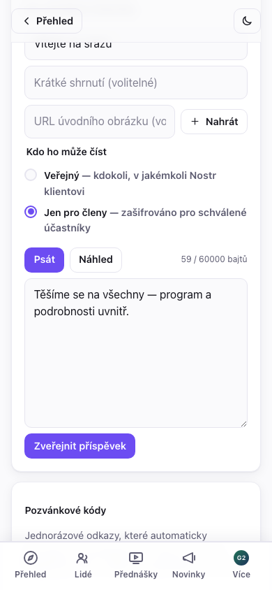

Veřejné příspěvky se zobrazují na **stránce akce** pro každého; příspěvky jen pro členy se schváleným účastníkům zobrazují v **Novinkách** a v pruhu „Poslední" na **Přehledu** akce, označené visacím zámkem. Takhle vypadá zámek příspěvku jen pro členy účastníkovi, který se ještě nepřipojil:

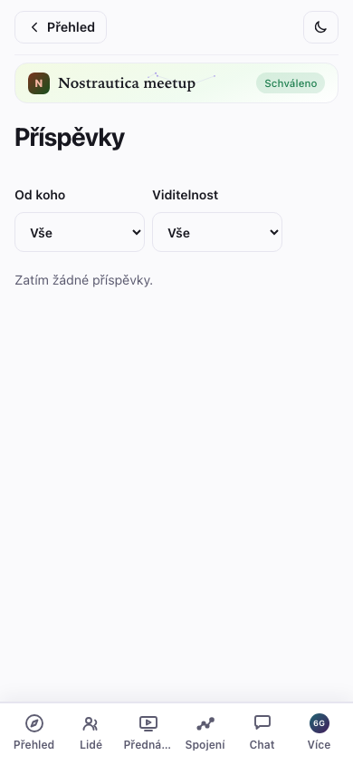

### Přizpůsobení stránky akce a jejího vzhledu

V **Administrace → Nastavení** jsou ještě dva ovládací prvky:

- **Stránka akce** (kind 31608) — místo výchozího rozložení si sestavíte vlastní menu a uspořádáte sekce (které příspěvky se kde zobrazují) na veřejné stránce akce. Pořadí měníte tlačítky ↑/↓.
- **Vzhled** (kind 31609) — vložíte vlastní CSS a naladíte vzhled stránek *této akce*. Před **Zveřejněním vzhledu** máte živý **Náhled**; opuštění administrace bez zveřejnění obnoví všem poslední *zveřejněný* vzhled, ale vaše neodeslané CSS se uloží jako koncept a po návratu se v editoru obnoví (s tlačítkem Zahodit, kterým ho zrušíte), takže odchod z obrazovky už nepřijde o rozpracovanou práci — totéž platí pro neodeslaný příspěvek akce a neuložené úpravy profilu. Vrství se nad vestavěným barevným nádechem aplikace pro danou akci, takže stačí málo. (Vkládejte jen CSS, které jste napsali sami nebo kterému důvěřujete — stylizuje stránku každému účastníkovi. Poznámka: váš vzhled platí napříč stránkami akce *kromě* pár tras, které zobrazují citlivé údaje — předání zařízení chatu a obrazovky pozvánek/koordinátora v administraci se záměrně vykreslují bez něj, takže nepřátelský vzhled se na těchto konkrétních obrazovkách nedá zneužít k vylákání klíčů nebo pozvánkových kódů.)

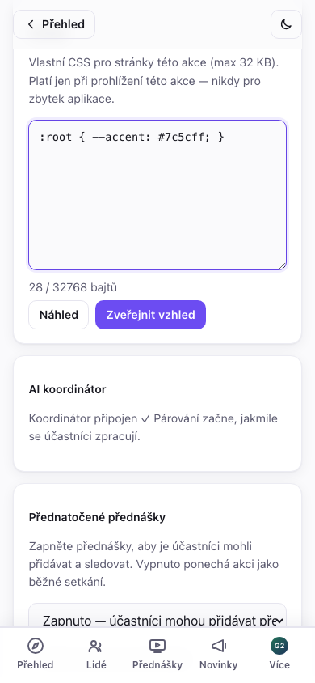

**Nejste si jistí, jak vaše změny vypadají někomu, kdo ještě není uvnitř?**
Menu akce má přepínač **Zobrazit jako návštěvník** — schová všechno, co je
jen pro členy (uzamčené příspěvky, sekce a položky menu jen pro členy),
takže vidíte přesně to, co vidí cizí člověk s odkazem, s opouštěcím pruhem
pro okamžitý návrat do běžného organizátorského pohledu. Záměrně
neexistuje ekvivalentní režim „zobrazit jako člen" — váš vlastní
organizátorský pohled *je* pohledem člena pro všechno, co není specifické
pro návštěvníka.

## 6.5 Přednášky a skupinový chat (obojí novinka, obojí volitelné)

**Přednatočené přednášky.** V **Administrace → Nastavení → Přednatočené přednášky** to přepněte na *Zapnuto* (nebo *Nejprve nahrávka*, což v navigaci účastníků posune Přednášky před Lidi — vhodné pro formát „podívejte se předem, setkejte se na místě") a **Uložte**. Schválení účastníci pak mohou přidávat krátké přednášky — nahrané v prohlížeči, nahrané jako soubor, nebo zadané jako neveřejná **YouTube / .mp4 URL** (vhodné pro přednášky příliš velké na nahrání; koordinátor tyto nikdy nestahuje, takže URL přednášky jsou jen ke sledování).

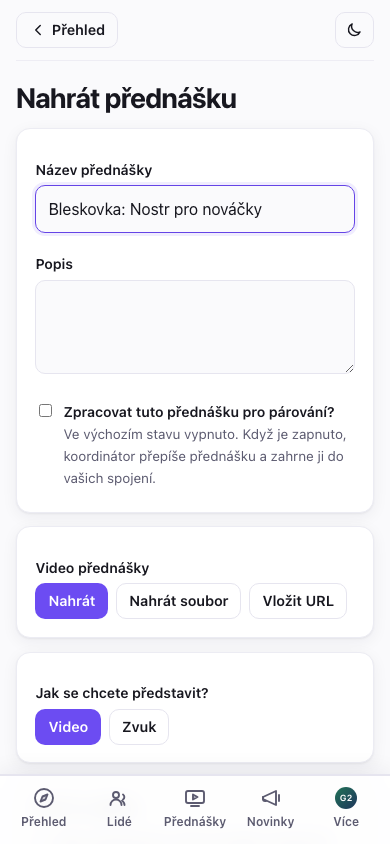

Všimněte si, že **přednášky už ve výchozím stavu nevstupují do párování**: řečník u každé přednášky zvolí, zda zaškrtne *„Zpracovat tuto přednášku pro párování?"*. Mějte to na paměti, pokud se odeslaná přednáška neobjeví ve zdůvodnění něčích spojení — to je očekávané, pokud se řečník nepřihlásil (a u URL přednášek se to nestane nikdy). Šetří to náklady na přepis přednášek, které nikdo nechtěl párovat.

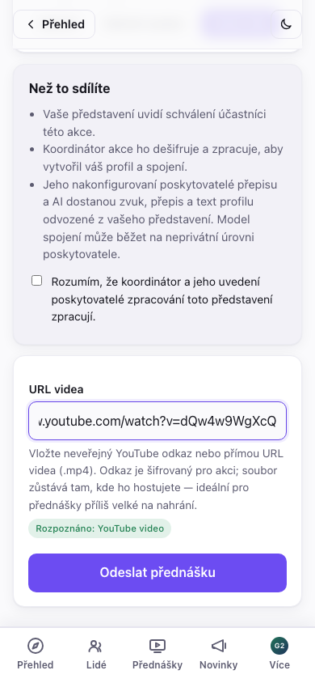

Odeslané přednášky se samy nezveřejní. Karta **Moderování přednášek** níž v **Administraci** zobrazuje všechno, co čeká na kontrolu — u každé klepněte na **Ukázka**, pak ji buď **Zveřejněte**, aby si ji účastníci mohli pustit, nebo **Zamítněte**. Dokud to tady neuděláte, nikdo kromě vás nic, co účastník pošle, neuvidí (zveřejnění navíc potřebuje připojeného koordinátora, stejně jako zbytek administrace). Vyhledávání/filtr v Lidech (§3) má filtr **Poslaná přednáška**, takže se na rušné akci můžete přesunout rovnou k těm, co na vás čekají, bez rolování celým seznamem.

**Skupinový chat (Marmot, experimentální).** V **Administrace → Nastavení** přepněte **Skupinový chat** a uložte — potřebuje připojeného koordinátora (koordinátor provozuje zašifrovanou skupinu: přidává lidi při schválení, odebírá je při odebrání). Jakmile je zapnutý, schválení účastníci dostanou záložku **Chat**: jedna koncově šifrovaná místnost pro celou akci, oddělená od soukromých zpráv — normální konverzace, která běží, bez čehokoli, co by si museli sami nastavovat, a každé zařízení, na kterém ji otevřou, se připojí automaticky (podrobnosti o jednotlivých zařízeních, které vidí účastníci, jsou v průvodci pro účastníky, část „Skupinový chat").

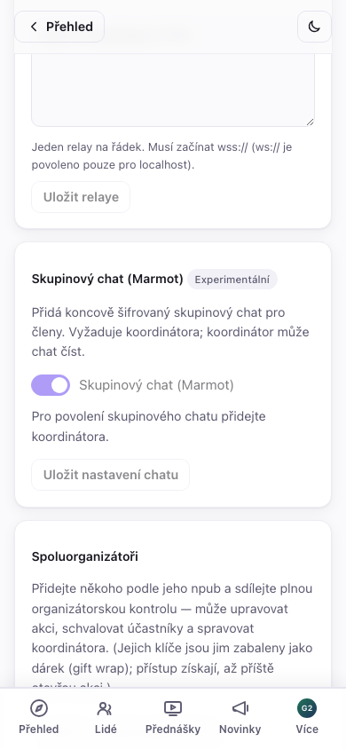

Tohle je zatím v rané fázi: připojení do skupiny může na straně serveru chvíli trvat i po zapnutí, a v rozhraní je záměrně označené jako *Experimentální* — zatím se na něj nespoléhejte jako na jediný způsob, jak se dostat k účastníkům během akce. Příspěvky (§6) zůstávají spolehlivým kanálem.

**Tichá pojistka.** Skupinu den co den spravuje koordinátor, ale každé
zařízení, které si k chatu připojí **schválený organizátor**, se
automaticky povýší i na spoluadministrátora — bez jakéhokoli přihlašování,
prostě se to stane. Pokud se někdy ztratí databáze vašeho koordinátora bez
zálohy (viz [operační příručku](COORDINATOR-OPERATOR-GUIDE.md#9-recovery-mls-admin-and-detach)),
vaše vlastní zařízení pořád dokážou přidávat nebo odebírat členy a udržet
místnost v chodu, než si zajistíte náhradního koordinátora. Udržování
aktuálních záloh koordinátora zůstává skutečným plánem obnovy; tohle je
záchranná síť pro případ, že tento plán selže.

## 7. Během akce

- **Seznam účastníků se doplňuje naživo** — schválení účastníci se objevují, jak se připojují; seznamy spojení se obnovují, jak se zpracovávají nová představení.
- **Přepočítání spojení** — po náporu nových příchozích klepněte na **↻ Přepočítat všechna spojení** (vyžaduje koordinátora).
- **Spoluorganizátoři** — v **Administrace → Nastavení → Spoluorganizátoři** přidejte někoho podle jeho npub a sdílejte plnou organizátorskou kontrolu (úprava akce, schvalování, správa koordinátora). Jejich klíče jsou jim zabaleny jako dárek; přístup získají, až příště otevřou akci. Tohle je zároveň vaše záchranná síť, pokud vám spadne prohlížeč.
- **Podporujte představení včas.** Spojení existují jen pro lidi, kteří nahráli představení — nejlepší, co můžete pro kvalitu spojení udělat, je dostat všechny k nahrání ještě před začátkem akce. Nahrání je pro účastníky volitelné a aplikace jim to i říká, ale vyplatí se na to tlačit: nahrané představení dá AI víc na práci, umožní ostatním účastníkům předem zjistit, jestli by si s daným člověkem opravdu sedli, ještě než k němu přijdou — párování není jen o projektech a dovednostech, je to i pocit, který AI sama o sobě nedokáže zachytit — a jde-li o video, pomůže lidem poznat svá spojení naživo.

## Řešení problémů a časté dotazy

- **Co vidí účastníci, dokud nejsou schválení?** Jen veřejnou stránku akce — název, shrnutí, data, místo a vaše zveřejněné novinky. Seznam účastníků, videa a spojení jsou zašifrované pro schválené účastníky.

- **Otevřel(a) jsem akci na jiném zařízení a není tam tlačítko administrace.** Přihlaste se se stejnou identitou (vložte tajný klíč, který jste si zazálohovali při vytváření účtu) a znovu otevřete akci — organizátorský přístup ke každé akci, kterou jste vytvořili, se automaticky obnoví z tohoto jediného klíče, žádná samostatná záloha akce není potřeba. Vaše klíče akce se načtou z relayů ve chvíli přihlášení, takže na novém zařízení dejte aplikaci pár vteřin, než usoudíte, že to nefunguje. (Přidání **spoluorganizátora** z původního zařízení, s npub nového zařízení, je pořád nejrychlejší možnost, pokud máte původní zařízení po ruce.)

- **Pozvánkový odkaz někoho automaticky neschválil.** Automatické schvalování potřebuje připojeného *a běžícího* koordinátora. Bez něj žádosti z pozvánek stále přijdou do vašeho seznamu **Žádosti o připojení** — schvalte je tam. (Budou mít značku **pozvánka**.)

- **Žádost o připojení se nezobrazuje.** Klepněte na **Obnovit** v hlavičce administrace — žádosti se načítají na vyžádání. Pokud se pořád neobjeví, účastník může mít nestabilní připojení; požádejte ho, ať znovu otevře odkaz na akci a žádost odešle znovu.

- **Jak promítnu seznam účastníků / tabuli spojení / přehled administrace na
  místě konání?** Otevřete příslušnou stránku v prohlížeči promítacího
  počítače, přihlášení jako schválená identita (vy sami). Jsou to normální
  stránky — dejte je na celou obrazovku:

  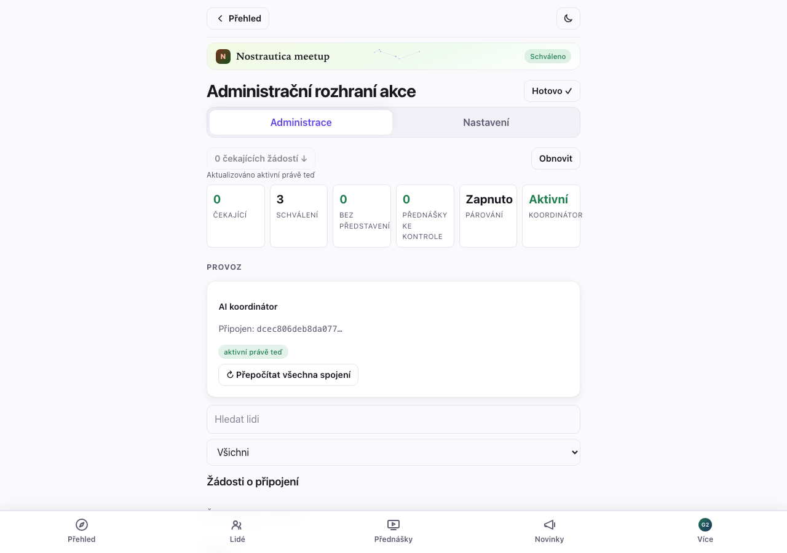

- **Můžu akci po vytvoření upravit?** Ano. V **Administrace → Nastavení → Podrobnosti akce** upravíte základní pole — název, shrnutí, začátek/konec, místo i ikonu/banner — a znovu je zveřejníte. (Opětovné zveřejnění se řídí monotónním pravidlem pořadí protokolu, takže úprava nikdy neprohraje souběh ve stejné sekundě.) Novinky můžete zveřejňovat a upravovat volně a akci mohou spravovat i spoluorganizátoři. Při změně programu nebo místa se stejně vyplatí zveřejnit novinku, aby účastníci dostali upozornění, ne jen tiše změněné pole.

- **Kolik mě to bude stát?** Ve výchozím stavu nic — referenční koordinátor
  je zdarma a všechno, co koordinátora nepotřebuje (seznam účastníků,
  videa, příspěvky, ruční schvalování), nemá náklady nikdy. Pokud připojíte
  koordinátora, jehož operátor si účtuje poplatek, uvidíte to jasně na jeho
  záznamu a — pokud se někdy spustí fakturace — banner **Vyžaduje se
  platba** s odkazem na platbu v Nastavení, nikdy překvapivý poplatek.

- **Účastník upravil své představení, ale nikdo jiný změnu nevidí.** Bez připojeného koordinátora se úpravy napsaného textu představení samy nešíří — klepněte na **Zpracovat znovu** na jeho kartě v seznamu Schváleno (§4), aby se úprava projevila.

- **Proč se odpojený nebo vyměněný koordinátor nemůže vrátit k pravomoci?** Každé připojení, výměna nebo odpojení zvýší interní číslo instalační generace a koordinátoři důvěřují vždy jen té aktuální, takže starý grant se už nedá přehrát zpátky do platnosti. Není tu nic, co byste museli dělat — je to prostě důvod, proč je odpojení nebo výměna pro opouštěného koordinátora nevratná.

## Příloha: sledování pozvánkových kódů, když prodáváte vstupenky jinde (volitelné)

Všechno výše je pro většinu organizátorů celý příběh. Tahle část je jen pro konkrétní případ, kdy prodáváte vstupenky mimo Nostrautiku — přes Eventbrite, vlastní e-shop, nebo v hotovosti u dveří — kde o kupujícím víte jedinou věc: jeho e-mailovou adresu. Každému pošlete jeden pozvánkový odkaz; někteří se připojí hned, jiní se k tomu nikdy nedostanou, a pár dní před akcí chcete připomenout přesně těm, kdo se ještě nezaregistrovali.

**Tohle si ujasněte hned na začátku: aplikace se nikdy nedozví ničí
e-mailovou adresu a sama nikomu neposílá žádný e-mail.** Rozeslání kódů i
spárování kódu s konkrétním člověkem je celé vaše vlastní práce ve vašich
vlastních nástrojích — hromadná korespondence, tabulka, případně prodejní
systém, který už používáte. Aplikace vám umí říct jediné: která *čísla*
kódů už byla použita.

### Každý kód má svoje číslo

Každý vygenerovaný pozvánkový kód má u sebe označení — **invite-1,
invite-2** a tak dál — ať se objeví kdekoli. Tohle číslo je jediné, co kód
spojuje s konkrétním člověkem, a víte to jen vy: zapište si ho do sloupce
vedle jeho e-mailu ve chvíli, kdy mu kód posíláte, do vlastního souboru.

Číslování se nikdy nevrací zpátky na začátek. Dnes vygenerujete 20 kódů a
za týden dalších 10 — nová dávka začne na **invite-21**, žádný z už
rozdaných kódů si číslo nezmění ani se nezopakuje.

### Dva exporty pro dvě různé chvíle

Otevřete **Exporty** pod pozvánkovými kódy v administraci (§3). Záměrně
jsou tu dva různé soubory ke stažení, protože odpovídají na dvě různé
otázky ve dvou různých chvílích:

- **Kódy k rozeslání** vám dají skutečné kódy a odkazy k vložení do
  hromadné korespondence — ale jen tu dávku, kterou právě vidíte na
  obrazovce, a jen právě teď. Pozvánkové kódy jsou jednorázové tajemství,
  které aplikace záměrně nikde neukládá, takže dávku exportujte (nebo
  aspoň zkopírujte) dřív, než vygenerujete další nebo opustíte stránku —
  pak jsou kódy z dané dávky nenávratně pryč. Jejich čísla zůstanou
  „rezervovaná", jen je už nemáte komu dát.
- **Kdo se už připojil** ukáže, která čísla kódů byla použita. Nepotřebuje
  k tomu žádné kódy, takže si ho můžete otevřít kdykoli — o týdny i
  měsíce později, na kterémkoli zařízení, kde jste přihlášení jako
  organizátor. K tomuhle exportu se budete vracet.

### Doporučený postup

1. **Vygenerujte kódy** a hned potom exportujte **Kódy k rozeslání**
   (formát pro tabulkový program, CSV).
2. **Udělejte hromadnou korespondenci** proti seznamu kupujících — u
   každého e-mailu si ve vlastním souboru poznamenejte číslo
   odpovídajícího kódu.
3. Blíž k akci — nebo kdykoli později — znovu otevřete **Exporty** a
   stáhněte **Kdo se už připojil**, s vybraným **Jen nepoužité kódy**.
4. **Spárujte** tato čísla zpátky s e-mailovými adresami ve vlastním
   souboru.
5. **Napište znovu** jen téhle kratší skupině, místo abyste psali úplně
   všem znovu.

### Jaký formát zvolit

Soubor pro tabulkový program je výchozí a je to ten, který chcete na
hromadnou korespondenci — otevře se přímo v Excelu, Google Sheets nebo v
čemkoli, co už používáte. Obyčejný seznam odkazů je tu spíš pro ty, kdo si
rozesílání řeší vlastním skriptem.

### Jedna upřímná poznámka

„Použito" počítá jen dopředu: jakmile aplikace jednou uvidí kód jako
použitý, zůstane tak označený navždy. „Nepoužito" je ale slabší signál, než
se zdá — u akce, která skončila už dávno, nebo pokud jste od připojení
některých lidí administraci jednoduše neotevřeli, se pár kódů může pořád
tvářit jako nepoužitých, přestože se dotyční lidé skutečně připojili.
Berte **použito** jako jisté a **nepoužito** jako „asi ještě ne — vyplatí
se to ověřit, než někomu napíšete znovu". Drobná nepříjemnost pro člověka,
který se už připojil, je lepší než žádná připomínka pro toho, kdo se
nepřipojil — ale je dobré předem vědět, že se to může stát, než aby vás to
zaskočilo.

### U dveří

Pozvánkový list (§3) sám o sobě vynechává každý už použitý kód, takže když
si ho vytisknete znovu blíž k akci, každý, kdo se mezitím připojil online,
na něm už prostě nebude.
