# Nostrautica: Leitfaden für Organisierende

Nostrautica ist eine Event-App mit einer einzigen Grundidee: **worum es bei
deinem Event geht, ist, wer wen trifft**. Teilnehmende nehmen kurze
Vorstellungsvideos auf, und ein optionaler KI-Coordinator wertet sie aus und
sagt jeder Person, mit wem sie sprechen sollte und warum. Dieser Leitfaden
begleitet dich von null bis zum laufenden Event.

## Was dich erwartet

1. Deine Identität erstellen (einmalig).
2. Das Event erstellen, optional gleich mit angebundenem KI-Coordinator,
   oder erst später.
3. Das Event teilen: offener Link, Einladungscodes, oder beides.
4. Teilnehmende genehmigen (oder Einladungscodes das automatisch erledigen
   lassen).
5. Neuigkeiten posten, die Eventseite anpassen und das Event durchführen.

Alles läuft in deinem Browser. Du musst keinen Server einrichten. Die App
speichert die Eventdaten verschlüsselt im offenen Nostr-Netzwerk. Die
Schlüssel des Events liegen in deinem Browser, verwende deshalb **einen
Browser, den du behältst** (und sichere deine Identität, sobald die App
dich dazu auffordert).

> **Eine Anmerkung zum Aufbau der App.** Sobald du in einem Event bist,
> bezieht sich die untere Leiste immer auf genau dieses Event: **Übersicht**,
> **Personen**, **Updates** und **Mehr** wirken alle auf das Event, in dem du
> gerade bist, mit einer kompakten Kopfzeile darüber, die den Namen des
> Events und deinen Status zeigt. Matches, sofern jemand welche hat, erscheinen
> oben in **Personen**. Zwei weitere Reiter tauchen erst auf, wenn du diese
> Funktionen einschaltest (§6.5), und zwar für dich wie für die
> Teilnehmenden: **Talks** liegt zwischen Übersicht und Personen, wenn Talks
> vorab angeschaut werden sollen („prerecord-first“), sonst gleich nach
> Personen; **Chat** kommt ebenfalls nach Personen, und wenn beides
> eingeschaltet ist, nach Talks. Deine globalen Dinge (alle deine Events,
> Nachrichten, Einstellungen, deine Identität) liegen unter **Mehr**. Als
> veranstaltende Person findest du dort zusätzlich **Event verwalten**, was
> die in §3 beschriebene Verwaltung öffnet.

## 1. Deine Identität erstellen

Öffne die App. Tippe auf dem Startbildschirm deinen Namen ein und tippe auf
**Meine Identität erstellen** (du kannst auch ein Foto hinzufügen). Keine
E-Mail, kein Passwort: Das Konto entsteht sofort. Nutzt du Nostr schon,
tippe auf **Schon auf Nostr? Anmelden** und verwende stattdessen deinen
Schlüssel, eine Browser-Erweiterung oder einen entfernten Signer.

> **Tipp:** Diesen Schritt musst du nicht getrennt erledigen. Machst du dich
> abgemeldet direkt an die Erstellung eines Events, legt die App deine
> Organisator-Identität im selben Vorgang mit an.

Sobald deine Identität steht, siehst du eine **Backup-Karte**. Erledige das
gleich: Tippe auf **Meinen geheimen Schlüssel kopieren** und füge ihn
irgendwo sicher ein, zum Beispiel in einen Passwort-Manager. Wer diesen
Schlüssel hat, *ist* du; ohne ihn bedeutet ein verlorenes Browserprofil ein
verlorenes Event. Unter **Weitere Möglichkeiten zum Sichern** findest du
außerdem einen per E-Mail verschickten Wiederherstellungslink oder eine
passwortgeschützte Datei.

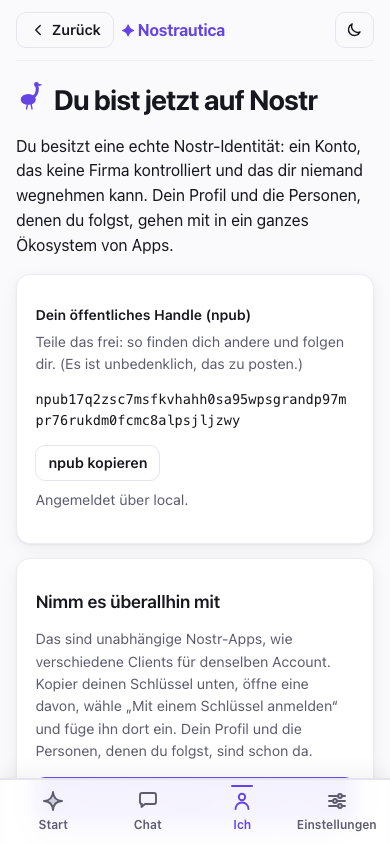

## 2. Das Event erstellen

Wähle **Event erstellen** und fülle das Formular aus:

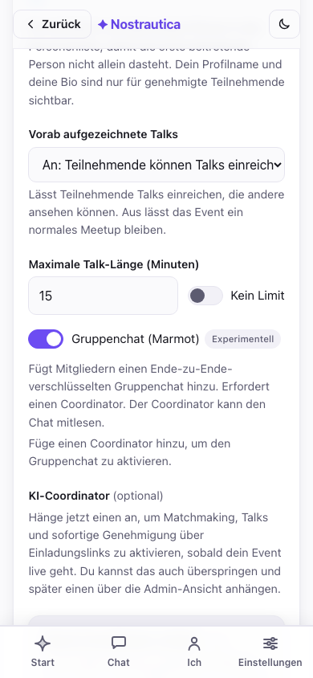

- **Titel, Zusammenfassung, Beginn/Ende, Ort**: für alle mit dem Link
  öffentlich sichtbar.
- **Genehmigung** legt fest, wie Leute hineinkommen:
  - *Manuelle Prüfung*: Jede Anfrage wartet auf deine Genehmigung.
  - *Nur Einladungscodes*: Nur über einen Einladungslink kommt man hinein,
    sonst gar nicht.
  - *Einladungscodes + manuell*: Einladungslinks genehmigen automatisch
    (wenn ein Coordinator angebunden ist); alle anderen warten auf dich.
    **Für die meisten Events empfohlen.**
- **Event-Sprache**: siehe unten.
- **KI-Matchmaking**: stell es auf *Ein*, wenn du einen Coordinator
  anbinden willst (§5). Du kannst den Coordinator auch später anbinden,
  lass diese Einstellung jetzt trotzdem schon an.
- **KI-Coordinator** (optional): wähl gleich hier im Erstellungsformular
  einen aus, aus derselben Liste, die auch in §5 beschrieben ist, damit ein
  Event mit Einladungscodes von Anfang an automatisch genehmigt und
  gematcht werden kann. Überspring das und binde später über
  **Verwaltung → Einstellungen** einen an, wenn du dich lieber erst
  entscheiden willst, nachdem du gesehen hast, wie sich das Event füllt.
  Der Rest des Formulars hängt davon nicht ab.

  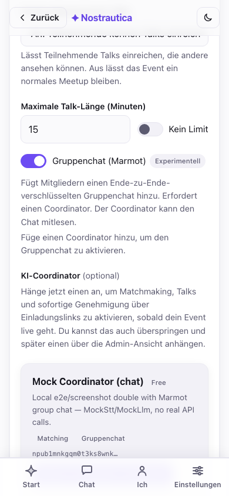

- **Selbst teilnehmen**: standardmäßig angehakt: Du bist eingetragen wie
  jede andere teilnehmende Person, damit die erste Person, die beitritt,
  in **Personen** wenigstens dich sieht statt einer leeren Liste (und auch
  dir kann gematcht werden, sobald du ein Intro aufnimmst). Deinen Namen
  und deine Bio sehen nur genehmigte Teilnehmende; nimm den Haken heraus,
  wenn du das Event organisieren willst, ohne selbst in der Liste
  aufzutauchen.
- **Erweitert** (eingeklappt): ein Event-Icon und ein Banner hochladen
  (sonst wird eines aus dem Titel erzeugt) und die maximale Länge des
  Vorstellungsvideos festlegen. Icon und Banner kannst du auswählen und
  zuschneiden, **noch bevor du eine Identität hast**. Erstellst du das
  Event abgemeldet, hält die App die zugeschnittenen Bilder lokal vor und
  lädt sie hoch, sobald sie beim Absenden deine Identität angelegt hat, du
  musst also nicht extra anhalten und dich zuerst anmelden.

### Event-Sprache

Wähl die Sprache, in der dein Event laufen soll. Fang an zu tippen und such
nach dem Sprachnamen in deiner eigenen Sprache *oder* nach dem
zweibuchstabigen Code (tipp „deut“ oder „de“ für Deutsch). Deine eigene
Sprache, die von deinem Browser bevorzugten Sprachen sowie alle Sprachen, in
die die App selbst übersetzt ist, stehen oben angeheftet, der Rest folgt
alphabetisch.

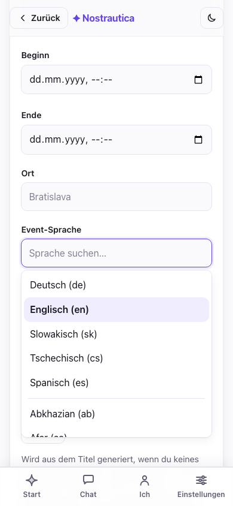

Die Sprache erledigt drei Dinge. Sie legt die **Standard-Interface-Sprache**
für Teilnehmende fest, die dein Event öffnen (in den Einstellungen können
sie trotzdem umschalten). Sie legt fest, in welcher Sprache die KI
schreibt: **Begründungen zu Matches und Profilzusammenfassungen stehen
immer in der Sprache deines Events**, egal welche Sprache eine Person
tatsächlich spricht oder für ihre Aufnahme verwendet. Jemand kann sein
Intro bei einem deutschen Event auf Englisch aufnehmen, und trotzdem liest
der ganze Raum auf Deutsch, warum man diese Person treffen sollte. Und
schreibt jemand seine Bio in einer anderen Sprache, veröffentlicht der
Coordinator **eine Übersetzung in die Sprache des Events**, damit der Rest
des Raums sie lesen kann. Der ursprüngliche Text bleibt dabei immer
erhalten und wird ebenfalls angezeigt. Standard ist Englisch, für ein
englischsprachiges Event lässt du das einfach so.

(Dafür musst du nie etwas neu anstoßen: Aktualisiert jemand sein Intro,
berechnet das System automatisch nur die Matches neu, an denen diese
Person beteiligt ist.)

Beachte den Hinweis unter dem Formular: **Die Rotation der Schlüssel wirkt
nur nach vorn.** Jemanden zu widerrufen (§4) schützt *künftigen* Inhalt,
nicht das, was die Person schon gesehen hat. Einen **Aufbewahrungszeitraum**
stellst du unter **Verwaltung → Einstellungen → Mitgliederdaten nach dem
Event löschen** ein (eine Anzahl Tage, oder leer lassen für unbegrenzte
Aufbewahrung). Teilnehmende sehen den angegebenen Zeitraum schon beim
Beitritt, und sobald er verstreicht, räumt der Coordinator zusätzlich seine
eigenen Kopien auf, nicht nur die veröffentlichten Datensätze. Das ist ein
echtes Aufräumen, keine absolute Garantie, dass jede letzte Kopie überall
verschwindet (Löschung auf Relays ist Best-Effort, und Backups sind eine
eigene Angelegenheit). Die genauen Grenzen beschreibt
[Verschlüsselung und Datenschutz](ENCRYPTION-AND-PRIVACY.md).

Nach dem Erstellen bekommst du einen **teilbaren Link**, eine Checkliste
für die nächsten Schritte und eine **Quittung**: Jeder
Veröffentlichungsschritt wird einzeln gemeldet, ein teilweises Scheitern
fällt also auf und lässt sich erneut versuchen, statt still zu fehlen:

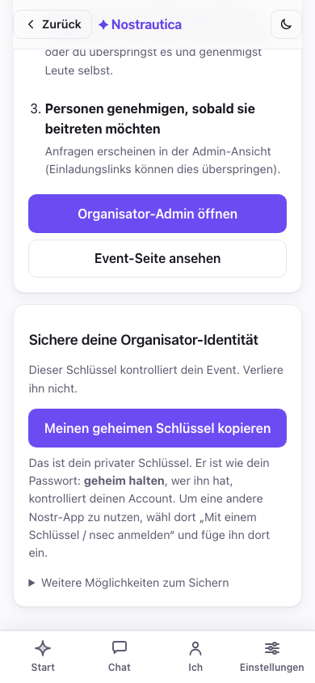

Das Event selbst gelingt immer, wenn du bis hierher gekommen bist. Zwei
weitere Schritte können bei einer schlechten Verbindung unabhängig
voneinander scheitern: dich als Teilnehmenden einzutragen und, falls im
Formular ausgewählt, dem Coordinator seine Installationsberechtigung zu
schicken. Beide haben direkt in der Quittung ihr eigenes **Erneut
versuchen**, statt dass du das ganze Formular neu ausfüllen musst. Eine
dritte Zeile, **Ausstehend**, bedeutet nur, dass du deinen Schlüssel noch
nicht gesichert hast (siehe Schritt 1). Das ist kein Fehler.

**Veranstaltest du dasselbe Event nächsten Monat noch einmal?** Sobald es
existiert, öffne es und nutze **Event duplizieren** aus dem Eventmenü: ein
frisches Erstellungsformular, vorausgefüllt mit Titel, Beschreibung,
Bildern, Sprache und Einstellungen dieses Events (der Titel wird zu „Kopie
von …“). Du prüfst und sendest es trotzdem noch einmal ab, und daraus
entsteht ein brandneues Event mit eigenen Schlüsseln und leerer
Teilnehmerliste, keine Kopie der Daten.

## 3. Die Verwaltung öffnen und teilen

Tippe auf **Organisator-Admin öffnen** (jederzeit auch über **Mehr → Event
verwalten** erreichbar). Dein Kontrollzentrum ist in zwei Reiter geteilt,
damit der Alltag des Events nie heißt, an einmaligen Einstellungen
vorbeizuscrollen:

- **Verwaltung** ist der Reiter, auf dem du landest, und der, zu dem du am
  häufigsten zurückkehrst: eine Statuszeile (Anzahl der Ausstehenden, mit
  Sprung per einem Tipp), **Beitrittsanfragen** ganz oben, damit das
  Zulassen von Leuten nie untergeht, das Erzeugen von Einladungscodes, die
  Liste der genehmigten Teilnehmenden (widerrufen/erneut verarbeiten),
  Talk-Moderation und **Kommunizieren** (Beiträge/Updates).
- **Einstellungen**: das, was pro Event nur einmal anfällt: der
  KI-Coordinator (§5), Menü und Layout der Eventseite, Erscheinungsbild/CSS,
  der Modus für vorab aufgezeichnete Talks, der Gruppenchat und die
  Mitorganisierenden. Hast du im Erstellungsformular (§2) schon einen
  Coordinator ausgewählt, siehst du ihn hier bereits als angebunden.

Frisches Event, noch keine Anfragen:

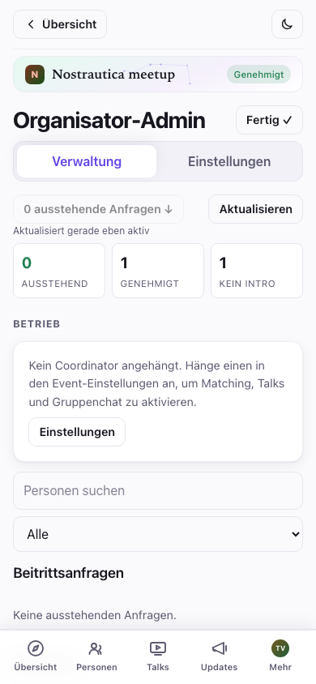

### Der Übersichtsstreifen

Oben in der Verwaltung, noch vor jedem Detail zu einzelnen Personen, zeigt
dir eine kompakte **Übersicht** den Zustand des gesamten Events auf einen
Blick: Zahl der Ausstehenden / Genehmigten / Personen ohne Intro, ob
Matching, Coordinator und Abrechnung in Ordnung sind, und alles, was
wirklich deine Aufmerksamkeit braucht (fehlgeschlagene Jobs, auf Prüfung
wartende Talks), oben statt im Routinedetail versteckt. Darunter grenzen
ein **Suchfeld und ein Filter** gleichzeitig die Warteschlange der
Beitrittsanfragen und die Liste der Genehmigten ein, nach Namen oder nach
Status (ausstehend, genehmigt, ohne Intro, Verarbeitung fehlgeschlagen,
Talk eingereicht), damit du bei einem Event mit 200 Leuten nicht scrollen
musst, um die eine Person zu finden, die dir gemailt hat:

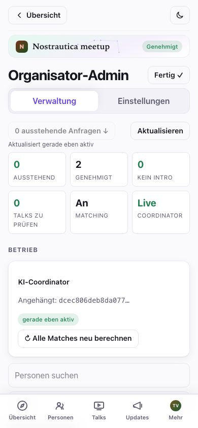

Tippe auf die Zeile einer Person, um eine **Detailschublade** mit ihrem
übermittelten Profil, ihren Medien und ihrer Verlaufsgeschichte
(Coordinator-Status, eingereichte Talks) zu öffnen, ohne die Liste zu
verlassen.

Zum Teilen hast du drei Arten von Links:

- **Der offene Event-Link** (`…#/e/<event>/join`, weiter unten mit dem
  Button **Einladungslink kopieren** angezeigt). Den kann jeder mit dem
  Link öffnen: Die öffentliche Eventseite ansehen und den Beitritt
  beantragen. Stell ihn auf deine Website oder in die sozialen Netzwerke.
- **Einladungscodes**: einmalig verwendbare Links, die die Person, die sie
  öffnet, automatisch genehmigen, *wenn ein Coordinator angebunden ist*.
  Leg eine Anzahl fest und tippe auf **Erstellen**; du bekommst pro Code
  einen Link plus QR-Code. Schick jeder Person einen, oder druck die
  QR-Codes aus. Der Code steckt im URL-Fragment und erreicht nie einen
  Server, behandle jeden Link also wie ein Ticket.
- **Geteilter Eintrittscode**: ein einziger QR-Code, den der ganze Raum auf
  einmal scannt, statt eines Links pro Person. Leg eine Personenzahl und
  ein Gültigkeitsfenster fest, tippe dann auf **Geteilten Code erstellen**
  für einen einzigen Link plus QR-Code für die Eröffnungsfolie. **0**
  funktioniert in beiden Feldern und heißt in beiden „kein Limit“: 0
  Personen ist eine beliebige Anzahl davon, 0 Stunden ist ein Code, der nie
  abläuft. Das Formular sagt in Worten, was der Code, den du gerade
  erstellst, tun wird (etwa „Läuft am 15. September 2026 um 23:26 Uhr ab.“
  oder „Dieser Code läuft nie ab.“), und das erzeugte Feld wiederholt das
  unter dem QR-Code, prüf also, ob dort steht, was du wolltest, bevor du
  den Link herausgibst. Der Code existiert nur in diesem Browser-Tab,
  kopier oder zeig ihn also, bevor du die Seite schließt, denn danach lässt
  er sich nicht mehr abrufen. Ein kurzes Fenster ist sicherer, weil wer den
  Code scannt, den Link weiterleiten kann; und läuft ein Code ab, wird er
  nicht abgelehnt, wer später kommt, landet einfach in der
  Genehmigungswarteschlange.

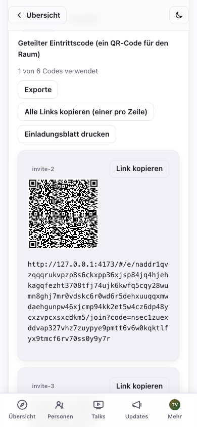

Mehr als eine Handvoll Codes wird mühsam, wenn man sie einzeln herausgibt.
**Alle Links kopieren** und **Als .txt herunterladen** holen alle
erzeugten Links als reinen Text für einen Serienbrief, und
**Einladungsblatt drucken** legt pro Code einen QR-Code an, mehrere pro
Seite, bereit zum Ausschneiden und Verteilen an der Tür.

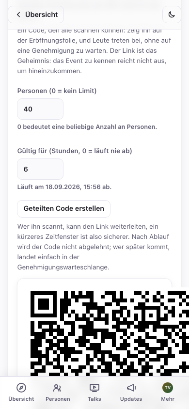

## 4. Teilnehmende genehmigen

Beitrittsanfragen erscheinen im Abschnitt **Beitrittsanfragen**. Jede zeigt
den Namen der Person, eine kurze ID, ihre Fähigkeiten, ein Abzeichen
**Einladung**, wenn sie einen Code verwendet hat, und ein 🎥-Abzeichen, wenn
sie bereits ein Intro aufgenommen hat. Der Button „N ausstehende Anfragen
↓“ oben springt dorthin.

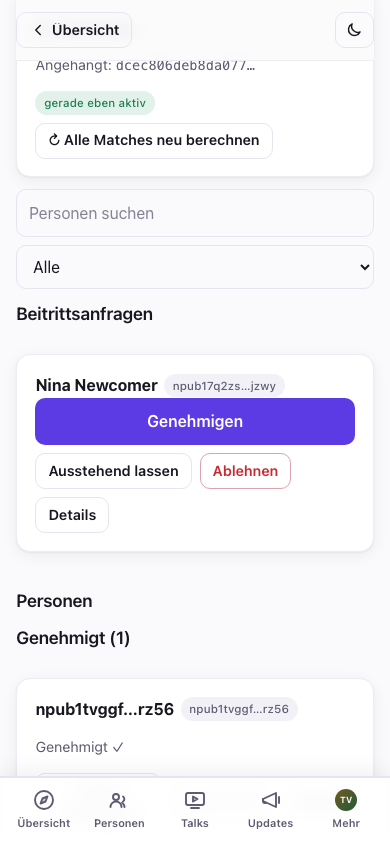

Tippe auf **Genehmigen** bei den Leuten, die du einzeln hereinlassen
willst, oder auf **Alle genehmigen (N)**, um alle Wartenden auf einmal
durchzugehen. Die Sammelgenehmigung meldet das Ergebnis für jede Person
einzeln (eingereiht → wird veröffentlicht → bestätigt, oder
fehlgeschlagen), eine wacklige Verbindung bei einer Person verdeckt also
nie, ob die anderen neun durchgekommen sind. Eine Zusammenfassungszeile
(„N genehmigt, M benötigen einen erneuten Versuch“) fasst das am Ende
zusammen, und jedes Scheitern bekommt sein eigenes **Erneut versuchen**,
statt dass du die ganze Gruppe wiederholen musst.

Nicht jede wartende Person braucht sofort ein Ja oder Nein: **Ablehnen**
blendet eine Anfrage nur lokal aus (die Person wird nicht benachrichtigt,
und es lässt sich über einen kleinen Streifen „N abgelehnt“ rückgängig
machen), und **Ausstehend lassen** markiert sie nur als geprüft, ohne dich
festzulegen. Beides ist reine Buchführung bei dir, keine
Protokoll-Aktion, du kannst es dir also jederzeit anders überlegen.

Genehmigte Leute wandern in den Abschnitt **Genehmigt**. Jede genehmigte
Karte hat **Erneut verarbeiten** (veröffentlicht den Verzeichniseintrag neu
und berechnet die Matches neu) und **Widerrufen**.

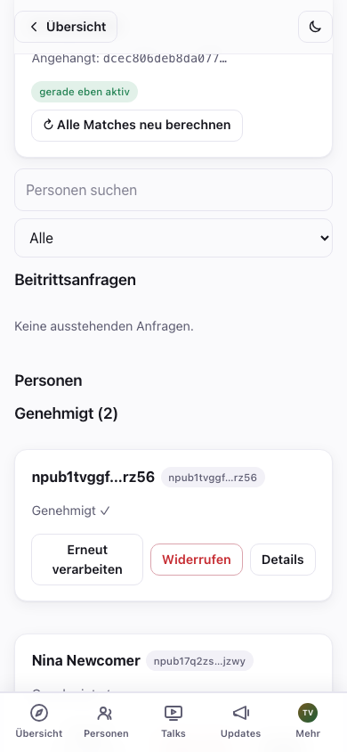

Genehmigte Teilnehmende bekommen Zugriff auf die verschlüsselte
Teilnehmerliste, die Vorstellungsvideos der anderen und, mit angebundenem
Coordinator, ihre Matches. Das Genehmigen funktioniert gleich, egal ob ein
Coordinator angebunden ist; einen anzubinden (§5) lohnt sich trotzdem wegen
der automatischen Genehmigung und der Matches, ist aber nicht mehr nötig,
damit die manuelle Genehmigung funktioniert.

### Jemanden entfernen

Tippe auf **Widerrufen** bei einer genehmigten Karte. Du bekommst eine
Bestätigung, die die Folge erklärt:

> „{name} widerrufen? Die Person verliert den Zugriff auf alles Neue. Was
> sie bereits gesehen hat, lässt sich nicht zurücknehmen.“

Das Bestätigen dreht den Event-Schlüssel für alle anderen automatisch, die
widerrufene Person kann also ab diesem Zeitpunkt nichts mehr entschlüsseln,
was veröffentlicht wird. Was sie schon gesehen hat, lässt sich nicht
ungesehen machen, widerrufe im Zweifel also lieber früh.

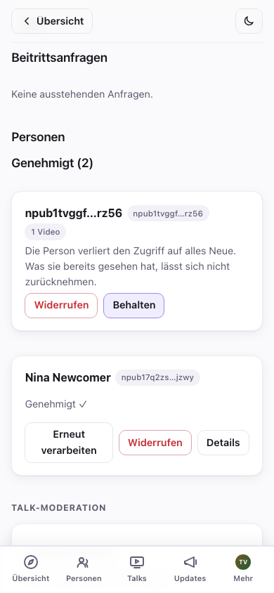

## 5. Den KI-Coordinator anbinden (Matchmaking)

Der Coordinator ist ein kleiner Dienst, der Vorstellungsvideos
transkribiert, aus ihnen ein Profil jeder Person baut und berechnet, wer
wen treffen sollte. Ohne ihn funktioniert das Event trotzdem vollständig:
Teilnehmerliste, Videos und Follows bleiben alle erhalten. Es gibt nur
keine automatischen Matches, und Einladungslinks brauchen deine manuelle
Genehmigung.

Du kannst gleich im Erstellungsformular (§2) einen auswählen, damit er von
Anfang an läuft, oder ihn später anbinden. Es ist dieselbe Liste, nur an
anderer Stelle: Bei einem bestehenden Event liegt sie unter
**Einstellungen → KI-Coordinator**, nicht in der Verwaltung (dieser Reiter
ist für Dinge, die du regelmäßig machst; einen Coordinator anzubinden ist
eine einmalige Einrichtung). So oder so **wählst du einen Coordinator aus
der Liste**. Jeder kündigt sich auf Nostr mit seinem Namen, seinen
Funktionen, einer Datenschutzangabe (welche KI-Schritte die sichere Enklave
verlassen) und seinem Preis an (der Referenz-Coordinator ist
**kostenlos**). Tippe auf **Diesen Coordinator verwenden**:

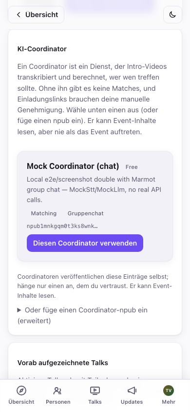

Willst du lieber einen eigenen betreiben, oder wurde dir ein bestimmter
genannt? Klapp **Oder füge einen Coordinator-npub ein (erweitert)** auf und
füge stattdessen dessen öffentlichen Schlüssel ein. So oder so siehst du
die Bestätigung:

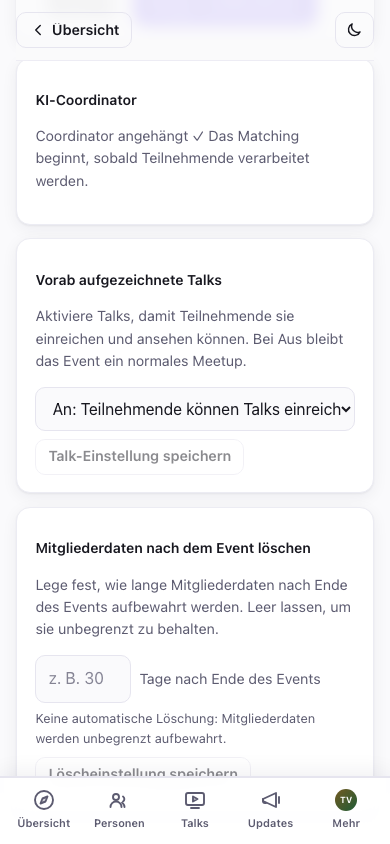

> **Kostenpflichtige Coordinators.** Ein Coordinator kann kostenpflichtig
> sein (KI-Matchmaking kostet mehr, je mehr Teilnehmende es gibt), ein
> Eintrag kann also einen Preis oder eine kostenlose Stufe zeigen (zum
> Beispiel „bis zu 20 Teilnehmende kostenlos“). Wird jemals eine Zahlung
> fällig, zeigt der Einstellungsbildschirm ein Banner **Zahlung
> erforderlich** mit einem Link zur Kasse. Der aktuelle Referenz-Coordinator
> ist kostenlos.

Der Coordinator kann Einreichungen lesen und im Namen des Events
veröffentlichen: Verzeichniseinträge, Teilnehmerlisten, Matches, Talks. Er
kann sich aber nie als du ausgeben oder die Einstellungen deines Events
ändern. Wähl nur einen Coordinator von einer Stelle, der du diese Befugnis
anvertraust. Auf dem Reiter **Verwaltung** erscheint ein Button
**↻ Alle Matches neu berechnen** (das ist eine wiederkehrende Aktion, keine
Einrichtung); nutze ihn nach einem Schwung neuer Teilnehmender.

### Coordinator ersetzen oder trennen

Nicht zufrieden mit dem, den du gewählt hast, oder willst du nicht mehr
dafür zahlen? Zurück unter **Einstellungen → KI-Coordinator** öffnet
**Ersetzen** dieselbe Liste (oder das npub-Feld), um zu einem anderen
Coordinator zu wechseln. Das dreht die Schlüssel des Events und erteilt dem
neuen Coordinator die Berechtigung neu; der alte verliert ab diesem
Zeitpunkt den Zugriff. **Trennen** entfernt ihn ganz, ohne Ersatz.

Beides ist für den Coordinator, den du verlässt, unumkehrbar: Einmal
ersetzt oder getrennt, bekommt er die Befugnis über das Event nie wieder
zurück. Trennen bedeutet konkret:

- **Das Matching stoppt**, bis du einen anderen Coordinator anbindest.
- **Die Chat-Verwaltung bleibt herrenlos**, falls du den Gruppenchat
  eingeschaltet hattest. Niemand fügt aktiv neue Mitglieder zum
  verschlüsselten Raum hinzu, bis ein neuer Coordinator übernimmt
  (bestehende Mitglieder behalten ihren Zugriff, siehe die Anmerkung zu
  Organisator-Geräten als Rückfallebene in §6.5).
- Ältere Inhalte bleiben genau so lesbar, wie sie es immer waren. Trennen
  versteckt nichts rückwirkend, es stoppt nur die künftige Verarbeitung.

### Anbinden oder Trennen während des Events

Beide Vorgänge sind auch bei einem laufenden Event unbedenklich, aber ein
Neustart des Coordinators verwirft, was er in dem Moment gerade
verarbeitet hat. Die Wiederholungslogik für Jobs holt das nach, aber wenn
gerade ein Event läuft, ist es rücksichtsvoller gegenüber den
Teilnehmenden, so eine Änderung zwischen zwei Verarbeitungsschüben zu
machen (gleich nachdem sich eine Welle neuer Ankömmlinge gelegt hat), statt
genau in dem Moment, in dem gerade jemandes Intro hochlädt.

> Den Coordinator zu betreiben ist ein eigener, technischer Schritt (ein
> kleiner Daemon, der `ffmpeg` und einen Schlüssel für einen
> LLM-/Transkriptionsanbieter braucht). Sieh dir
> [`packages/coordinator/coordinator.example.toml`](../packages/coordinator/coordinator.example.toml),
> [die Betreiber-Anleitung](COORDINATOR-OPERATOR-GUIDE.md) und die README des
> Repositorys an. Richte seine Relays auf dasselbe Relay, das dein Event
> verwendet.

## 6. An deine Teilnehmenden posten

Die Karte **Event-Beiträge** (unter **Kommunizieren** in der Verwaltung)
ist dein Ankündigungskanal: „der Zeitplan steht“, „Ortswechsel“, „das
heutige Abendessen ist um …“. Gib ihr einen Titel und optional eine
Zusammenfassung mit Titelbild, schreib den Text (**Markdown funktioniert**:
Überschriften, Listen, Links, Fettdruck) und wähle, **wer ihn lesen darf**:

- **Öffentlich**: sehen alle mit dem Event-Link, angemeldet oder nicht.
  Das sind normale lange Nostr-Beiträge, veröffentlicht unter der Identität
  des Events, sichtbar also auch in anderen Nostr-Readern.
- **Nur für Mitglieder**: verschlüsselt für deine genehmigten
  Teilnehmenden. Wer nicht Mitglied ist, und die Öffentlichkeit, sieht nur
  ein Schloss und die Aufforderung „tritt dem Event bei, um das zu
  lesen“, nie den Inhalt. Nutz das für die Adresse der Afterparty, den
  Türcode, alles, was im Raum bleiben soll.

Tippe auf **Beitrag veröffentlichen**. Die Sichtbarkeit steht nach der
Veröffentlichung fest (den Text kannst du später bearbeiten, aber ein
öffentlicher Beitrag lässt sich nicht im Stillen auf „nur für Mitglieder“
umstellen, und umgekehrt genauso wenig). Direkt aus der Auswahl im Editor
kannst du außerdem einen Link auf einen bestehenden Beitrag einfügen und
einen Beitrag oben auf der Eventseite anheften.

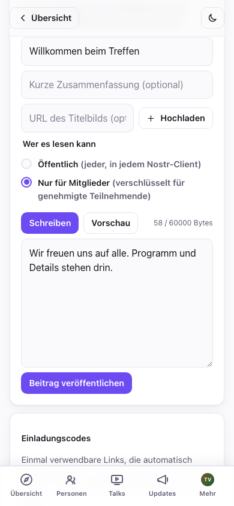

Öffentliche Beiträge erscheinen für alle auf der **Eventseite**; Beiträge
nur für Mitglieder zeigen sich genehmigten Teilnehmenden unter **Updates**
und im Streifen „Neuestes“ auf der **Übersicht** des Events, markiert mit
einem Schloss-Abzeichen. So sieht das Schloss eines Beitrags nur für
Mitglieder für jemanden aus, der noch nicht beigetreten ist:

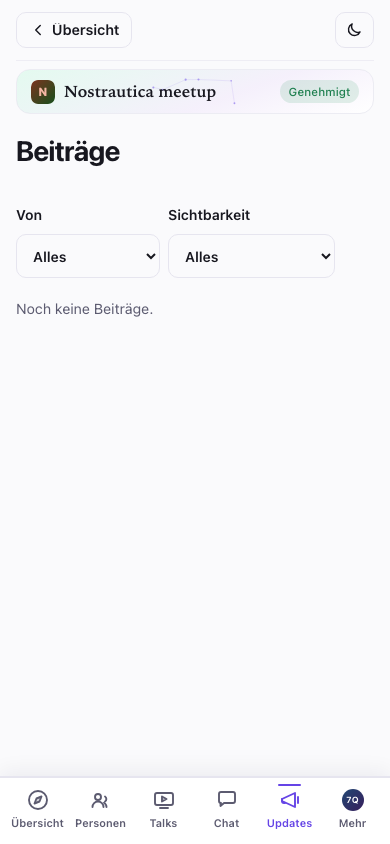

### Die Eventseite und ihr Aussehen anpassen

Zwei weitere Regler liegen unter **Verwaltung → Einstellungen**:

- **Eventseite** (kind 31608): bau ein eigenes Menü und ordne Abschnitte
  (welche Beiträge wo erscheinen) für die öffentliche Eventseite an, statt
  des Standardlayouts. Die Reihenfolge änderst du mit den Pfeilen ↑/↓.
- **Erscheinungsbild** (kind 31609): füg eigenes CSS ein, um die Seiten
  *dieses* Events zu gestalten. Es gibt eine Live-**Vorschau**, bevor du auf
  **Design veröffentlichen** tippst; verlässt du die Verwaltung, ohne zu
  veröffentlichen, stellt sich für alle das zuletzt *veröffentlichte*
  Design wieder her, aber dein nicht abgeschicktes CSS bleibt als Entwurf
  erhalten und wird im Editor wiederhergestellt, wenn du zurückkommst (mit
  einem Button **Verwerfen**, um ihn zu löschen). Navigierst du weg, verlierst
  du also keine angefangene Arbeit mehr. Dasselbe gilt für einen nicht
  abgeschickten Event-Beitrag und ungespeicherte Profiländerungen. Es legt
  sich über den eingebauten Farbton der App für dieses Event, ein bisschen
  reicht also schon. (Füg nur CSS ein, das du selbst geschrieben hast oder
  dem du vertraust: Es gestaltet die Seite für jede teilnehmende Person.
  Hinweis: Dein Design gilt auf den Seiten des Events überall *außer* auf
  ein paar Routen, die heikles Material zeigen. Die Geräteübergabe des
  Chats und die Verwaltungsbildschirme für Einladungen und Coordinator
  werden absichtlich ohne dein CSS gerendert, ein feindliches Design lässt
  sich auf genau diesen Bildschirmen also nicht dazu missbrauchen,
  Schlüssel oder Einladungscodes abzugreifen.)

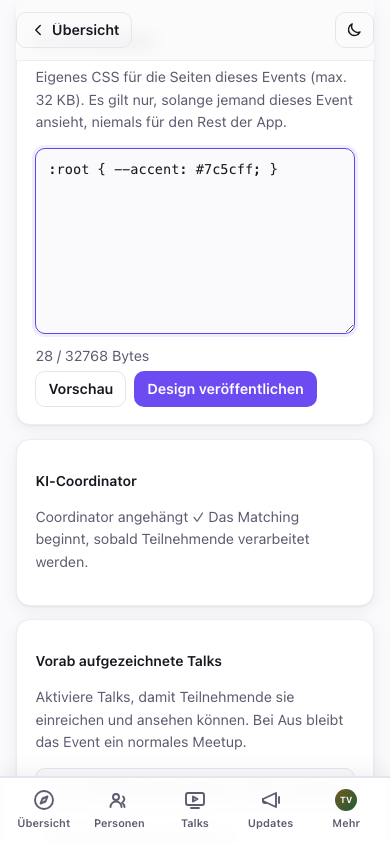

**Nicht sicher, wie deine Änderungen für jemanden aussehen, der noch nicht
drin ist?** Das Eventmenü hat einen Umschalter **Als Besuchende ansehen**.
Er blendet alles aus, was nur für Mitglieder ist (gesperrte Beiträge,
Menüeinträge und Abschnitte nur für Mitglieder), du siehst also genau das,
was jemand Fremdes mit dem Link sieht, mit einer Ausstiegsleiste, um
jederzeit zu deiner normalen Organisator-Ansicht zurückzuspringen. Einen
entsprechenden Modus „als Mitglied ansehen“ gibt es absichtlich nicht,
denn deine eigene Organisator-Ansicht *ist* bereits die Mitglieder-Ansicht
für alles, was nicht besuchsspezifisch ist.

## 6.5 Talks und Gruppenchat (beide neu, beide optional)

**Vorab aufgezeichnete Talks.** Stell unter **Verwaltung → Einstellungen →
Vorab aufgezeichnete Talks** den Schalter auf *Ein* (oder auf *Vorab-Aufzeichnung
zuerst*, was in der Navigation der Teilnehmenden Talks vor Personen
setzt, gut für ein Format nach dem Motto „vorher ansehen, sich vor Ort
treffen“) und **speichere**. Genehmigte Teilnehmende können danach kurze
Talks einreichen: im Browser aufgenommen, als Datei hochgeladen, oder als
nicht gelisteter **YouTube-Link oder direkte .mp4-URL** angegeben
(nützlich für Talks, die zum Hochladen zu groß sind; der Coordinator ruft
diese nie ab, URL-Talks sind also nur zum Ansehen).

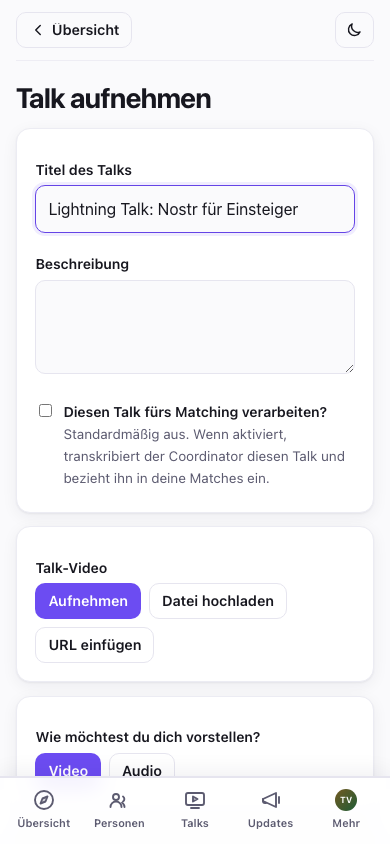

Beachte, dass **Talks standardmäßig nicht mehr ins Matching einfließen**:
Wer spricht, entscheidet pro Talk, ob sie oder er *„Diesen Talk fürs
Matching verarbeiten?“* ankreuzt. Denk daran, wenn ein eingereichter Talk
in niemandes Match-Begründung auftaucht. Das ist zu erwarten, außer die
sprechende Person hat dem zugestimmt (und bei URL-Talks passiert es nie).
Das spart Transkriptionskosten für Talks, die niemand zum Matching wollte.

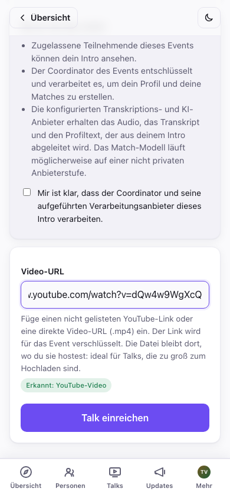

Eingereichte Talks gehen nicht von selbst online. Eine Karte
**Talk-Moderation** weiter unten in der **Verwaltung** listet alles, was
auf Prüfung wartet. Tippe bei jedem auf **Vorschau**, dann entweder auf
**Veröffentlichen**, damit Teilnehmende ihn ansehen können, oder auf
**Ablehnen**. Was jemand einreicht, sieht niemand sonst, solange du hier
nichts damit machst (und das Veröffentlichen braucht ebenso wie der Rest
der Verwaltung einen angebundenen Coordinator). Die Suche und der Filter
bei Personen (§3) haben einen Filter **Talk eingereicht**, damit du bei
einem vollen Event direkt zu denen springen kannst, die auf dich warten,
ohne die ganze Liste durchzuscrollen.

**Gruppenchat (Marmot, experimentell).** Schalte unter
**Verwaltung → Einstellungen** **Gruppenchat (Marmot)** ein und speichere.
Er braucht einen angebundenen Coordinator (der Coordinator betreibt die
verschlüsselte Gruppe: fügt Leute hinzu, sobald sie genehmigt sind, entfernt
sie beim Widerruf). Einmal eingeschaltet, bekommen genehmigte Teilnehmende
einen Reiter **Chat**: einen einzigen Ende-zu-Ende-verschlüsselten Raum für
das ganze Event, getrennt von Direktnachrichten: eine normale laufende
Unterhaltung, nichts zum Einrichten, und jedes Gerät, auf dem sie ihn
öffnen, tritt automatisch bei (die Details pro Gerät, die Teilnehmende
sehen, stehen im Abschnitt „Gruppenchat“ im Leitfaden für Teilnehmende).

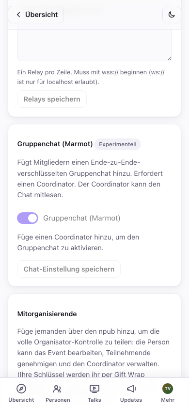

Das ist noch früh dran: Der Beitritt zur Gruppe kann serverseitig etwas
dauern, selbst nachdem er eingeschaltet wurde, und er ist in der
Oberfläche absichtlich als *Experimentell* markiert. Verlass dich noch
nicht darauf als einzigen Weg, Teilnehmende während eines Events zu
erreichen. Beiträge (§6) bleiben der verlässliche Kanal.

**Ein stilles Sicherheitsnetz.** Der Coordinator verwaltet die Gruppe im
Alltag, aber jedes Gerät, mit dem sich eine **genehmigte veranstaltende
Person** im Chat anmeldet, wird automatisch auch zum Mitadministrator
befördert, ganz ohne eigenen Einrichtungsschritt: Es passiert einfach.
Geht die Datenbank deines Coordinators jemals ohne Backup verloren (siehe
die [Betreiber-Anleitung](COORDINATOR-OPERATOR-GUIDE.md#9-recovery-mls-admin-and-detach)),
können deine eigenen Geräte trotzdem Mitglieder hinzufügen oder entfernen
und den Raum am Laufen halten, während du einen Ersatz-Coordinator
organisierst. Aktuelle Backups des Coordinators zu pflegen bleibt der
eigentliche Wiederherstellungsplan, das hier ist nur das Netz für den
Fall, dass dieser Plan versagt.

## 7. Während des Events

- **Die Teilnehmerliste füllt sich live**: Genehmigte Teilnehmende
  erscheinen, sobald sie beitreten; ihre Matches, oben in Personen
  angezeigt, aktualisieren sich, sobald neue Intros verarbeitet werden.
- **Matches neu berechnen**: Tippe nach einem Ansturm neuer Ankömmlinge auf
  **↻ Alle Matches neu berechnen** (Coordinator erforderlich).
- **Mitorganisierende**: Füg unter **Verwaltung → Einstellungen →
  Mitorganisierende** eine Person über ihr npub hinzu, um die volle
  Organisator-Kontrolle zu teilen (Event bearbeiten, genehmigen, Coordinator
  verwalten). Ihre Schlüssel werden ihr per Gift Wrap zugestellt; den
  Zugriff bekommt sie, sobald sie das Event das nächste Mal öffnet. Das ist
  auch dein Sicherheitsnetz, falls dein Browser den Geist aufgibt.
- **Ermutige zu frühen Intros.** Matches gibt es nur für Leute, die ein
  Intro aufgenommen haben. Das Beste, was du für die Qualität der Matches
  tun kannst, ist also, alle dazu zu bringen, schon vor Beginn des Events
  aufzunehmen. Das Aufnehmen ist für Teilnehmende optional, und die App
  sagt ihnen das auch, trotzdem lohnt es sich, darauf zu drängen: Ein
  aufgenommenes Intro gibt der KI mehr, womit sie arbeiten kann, gibt
  anderen Teilnehmenden schon vorher ein Gefühl dafür, ob es mit einem
  Match passen würde, noch bevor man sich persönlich trifft (denn beim
  Matching zählt neben Projekten und Fähigkeiten auch ein Gefühl, das die
  KI allein nicht einfangen kann), und ist es ein Video, hilft es außerdem,
  die eigenen Matches persönlich wiederzuerkennen.

## Problemlösung und häufige Fragen

- **Was sehen Teilnehmende, bevor sie genehmigt sind?** Nur die öffentliche
  Eventseite: Titel, Zusammenfassung, Termine, Ort und deine geposteten
  Updates. Teilnehmerliste, Videos und Matches sind für genehmigte
  Teilnehmende verschlüsselt.

- **Ich habe das Event auf einem anderen Gerät geöffnet, und es gibt
  keinen Admin-Button.** Melde dich mit derselben Identität an (füge den
  geheimen Schlüssel ein, den du beim Erstellen des Kontos gesichert hast)
  und öffne das Event erneut. Der Organisator-Zugriff auf jedes Event, das
  du erstellt hast, wird allein aus diesem einen Schlüssel automatisch
  wiederhergestellt, keine separate Event-Sicherung nötig. Die App liest
  deine Event-Schlüssel in dem Moment, in dem du dich anmeldest, von den
  Relays zurück, gib ihr auf einem neuen Gerät also ein paar Sekunden,
  bevor du daraus schließt, dass es nicht funktioniert hat. (Über
  **Mitorganisierende** eine Person vom ursprünglichen Gerät aus
  hinzuzufügen, mit dem npub des neuen Geräts, ist immer noch die
  schnellste Option, wenn du das ursprüngliche Gerät noch zur Hand hast.)

- **Ein Einladungslink hat jemanden nicht automatisch genehmigt.** Die
  automatische Genehmigung braucht einen angebundenen *und laufenden*
  Coordinator. Ohne einen kommen Einladungsanfragen trotzdem in deiner
  Liste **Beitrittsanfragen** an, genehmige sie dort. (Sie tragen ein
  Abzeichen **Einladung**.)

- **Eine Beitrittsanfrage taucht nicht auf.** Tippe im Verwaltungskopf auf
  **Aktualisieren**, denn Anfragen werden bei Bedarf abgerufen. Erscheint
  sie immer noch nicht, hat die Person vielleicht eine wacklige
  Verbindung; bitte sie, den Event-Link erneut zu öffnen und die Anfrage
  neu abzuschicken.

- **Wie projiziere ich die Teilnehmerliste, das Match-Board oder die
  Verwaltungsübersicht am Veranstaltungsort?** Öffne die betreffende Seite
  im Browser des Rechners am Beamer, angemeldet als genehmigte Identität
  (du selbst). Das sind normale Seiten, häng sie also in den
  Vollbildmodus:

  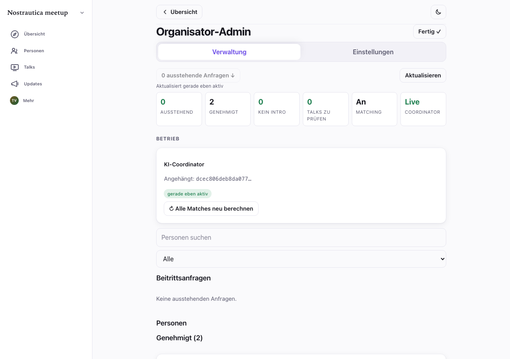

- **Kann ich ein Event nach dem Erstellen noch bearbeiten?** Ja. Unter
  **Verwaltung → Einstellungen → Event-Details** bearbeitest du die
  Kernfelder (Titel, Zusammenfassung, Beginn/Ende, Ort und Icon/Banner) und
  veröffentlichst sie erneut. (Die erneute Veröffentlichung folgt der
  monotonen Reihenfolgeregel des Protokolls, eine Änderung verliert also
  nie gegen ein Rennen in derselben Sekunde.) Updates kannst du außerdem
  frei posten und bearbeiten, und auch Mitorganisierende können das Event
  verwalten. Bei einer Programm- oder Ortsänderung lohnt es sich trotzdem,
  zusätzlich ein Update zu posten, damit Teilnehmende eine Benachrichtigung
  bekommen und nicht nur ein still geändertes Feld.

- **Was kostet mich das?** Standardmäßig nichts: Der Referenz-Coordinator
  ist kostenlos, und alles, wofür kein Coordinator nötig ist
  (Teilnehmerliste, Videos, Beiträge, manuelle Genehmigung), kostet
  ohnehin nie etwas. Bindest du einen kostenpflichtigen Coordinator an,
  siehst du das deutlich in seinem Eintrag, und falls jemals eine
  Abrechnung greift, ein Banner **Zahlung erforderlich** mit einem Link
  zur Kasse in den Einstellungen. Nie eine überraschende Abbuchung.

- **Jemand hat sein Intro bearbeitet, aber niemand sonst sieht die
  Änderung.** Ohne angebundenen Coordinator verbreiten sich Änderungen an
  getipptem Intro-Text nicht von selbst, tippe also auf **Erneut
  verarbeiten** bei der jeweiligen Karte in der Liste der Genehmigten
  (§4), um die Aktualisierung zu übernehmen.

- **Warum kann ein Coordinator, den ich ersetzt oder getrennt habe, nicht
  wieder in die Befugnis zurückkommen?** Jedes Anbinden, Ersetzen oder
  Trennen erhöht eine interne Generationsnummer, und Coordinators
  vertrauen immer nur der aktuellen, ein alter Grant lässt sich also nicht
  mehr zurückspielen. Hier musst du nichts tun. Es ist einfach der Grund,
  warum Trennen oder Ersetzen für den Coordinator, den du verlässt,
  endgültig ist.

## Anhang: Einladungscodes verfolgen, wenn du Tickets woanders verkaufst (optional)

Alles oben ist die ganze Geschichte für die meisten Organisierenden. Dieser
Abschnitt gilt nur für den speziellen Fall, dass du Tickets woanders als
über Nostrautica verkaufst (Eventbrite, dein eigener Webshop, Bargeld an
der Tür), wo das Einzige, was du über eine kaufende Person weißt, ihre
E-Mail-Adresse ist. Du schickst jeder einen Einladungslink; manche treten
sofort bei, manche kommen nie dazu, und ein paar Tage vor dem Event willst
du genau die anstupsen, die noch nicht aufgetaucht sind.

**Stell das gleich zu Beginn klar: Die App erfährt nie die E-Mail-Adresse
von irgendjemandem, und sie verschickt selbst nie eine E-Mail.** Codes zu
verschicken und einen Code wieder der Person zuzuordnen, an die du ihn
geschickt hast, ist ganz allein deine eigene Aufgabe, mit deinen eigenen
Werkzeugen: ein Serienbrief, eine Tabelle, was auch immer für ein
Ticketsystem du schon verwendest. Alles, was dir die App je sagen kann,
ist, welche Code-*Nummern* verwendet wurden.

### Jeder Code trägt eine Nummer

Jeder Einladungscode, den du erzeugst, trägt eine Bezeichnung wie
**invite-1, invite-2** und so weiter, direkt daneben, wo immer er
auftaucht. Diese Nummer ist das Einzige, was einen Code mit einer Person
verbindet, und nur du weißt, mit welcher: Schreib sie in eine Spalte neben
die E-Mail-Adresse der Person, in dem Moment, in dem du den Code
verschickst, in eine Datei, die dir gehört.

Die Nummerierung zählt immer weiter. Erzeugst du heute 20 Codes und
nächste Woche noch 10, fangen die neuen bei **invite-21** an. Keiner der
schon vergebenen Codes ändert seine Nummer, und keiner wird wiederverwendet.

### Zwei Exporte für zwei verschiedene Momente

Öffne **Exporte**, unter den Einladungscodes in der Verwaltung (§3). Es
gibt hier absichtlich zwei Downloads, weil sie zwei verschiedene Fragen zu
zwei verschiedenen Zeitpunkten beantworten:

- **Codes zum Verschicken** gibt dir die tatsächlichen Codes und Links zum
  Einfügen in einen Serienbrief, aber nur für die Charge, die gerade auf
  dem Bildschirm steht, und nur genau jetzt. Einladungscodes sind einmalige
  Geheimnisse, von denen die App absichtlich nirgends eine Kopie behält,
  exportier (oder kopier zumindest) eine Charge also, bevor du die nächste
  erzeugst oder die Seite verlässt. Machst du eines von beidem, sind die
  Codes dieser Charge unwiderruflich weg. Ihre Nummern bleiben reserviert,
  du hast nur niemanden mehr, dem du sie geben kannst.
- **Wer beigetreten ist** sagt dir, welche Code-Nummern verwendet wurden.
  Dafür braucht es überhaupt keine Codes, du kannst es also jederzeit
  öffnen, Wochen oder Monate später, auf jedem Gerät, auf dem du als
  veranstaltende Person angemeldet bist. Zu diesem Export kommst du zurück.

### Der Ablauf

1. **Erzeug deine Codes** und exportier gleich danach **Codes zum
   Verschicken** im Tabellenformat (CSV).
2. **Mach daraus einen Serienbrief** gegen deine Ticketliste, wobei du die
   Nummer jedes Codes in einer Spalte neben der passenden E-Mail-Adresse
   festhältst, in einer Datei, die dir gehört.
3. Näher am Event, oder jederzeit danach, öffne wieder **Exporte** und lad
   **Wer beigetreten ist** herunter, mit ausgewähltem **Nur unbenutzte
   Codes**.
4. **Gleich diese Nummern** mit den E-Mail-Adressen in deiner Datei ab.
5. **Schick nur dieser kürzeren Liste** eine neue Nachricht, statt alle
   noch einmal anzuschreiben.

### Welches Format wählen

Die Tabellendatei ist die Standardeinstellung und die, die du für einen
Serienbrief nimmst: öffne sie direkt in Excel, Google Sheets oder was auch
immer du schon verwendest. Die einfache Liste mit Links ist eher für
Leute da, die ihren Versand selbst skripten.

### Ein ehrlicher Vorbehalt

„Verwendet“ zählt nur nach oben: Hat die App einen Code einmal als
verwendet gesehen, bleibt er dauerhaft so markiert. Aber „unbenutzt“ ist
ein schwächeres Signal, als es aussieht. Bei einem Event, das schon eine
Weile vorbei ist, oder wenn du die Organisator-Ansicht seit dem Beitritt
einiger Leute einfach nicht geöffnet hast, können sich ein paar Codes noch
als unbenutzt zeigen, obwohl diese Leute tatsächlich beigetreten sind.
Behandle **verwendet** als sicher und **unbenutzt** als „wahrscheinlich
noch nicht, eine kurze Prüfung wert, bevor du jemandem erneut schreibst“.
Eine kleine Unannehmlichkeit für jemanden, der schon beigetreten ist, ist
besser als gar keine Erinnerung für jemanden, der es nicht getan hat, aber
es lohnt sich zu wissen, dass das passieren kann, statt davon überrascht
zu werden.

### An der Tür

Das Einladungsblatt (§3) lässt jeden bereits verwendeten Code ohnehin
schon weg, druckst du es also kurz vor dem Event noch einmal, ist jede
Person, die in der Zwischenzeit online beigetreten ist, einfach nicht mehr
auf der Seite.
