# Nostrautica: Guía para organizadores de eventos

Nostrautica es una aplicación para eventos construida sobre una idea:
**lo que importa en tu evento es quién conoce a quién**. Los asistentes graban
un video de presentación breve; un coordinador de IA opcional lo analiza y le
dice a cada asistente con quién debería hablar y por qué. Esta guía te lleva
desde cero hasta un evento en marcha.

## Lo que vas a hacer

1. Crea tu identidad (una vez).
2. Crea el evento y, si quieres, conecta ahí mismo un coordinador de IA, o
   hazlo más tarde.
3. Comparte el evento: enlace abierto, códigos de invitación, o ambos.
4. Aprueba asistentes (o deja que los códigos de invitación los aprueben
   automáticamente).
5. Publica novedades, personaliza la página de tu evento y dirige el evento.

Todo funciona en tu navegador. No hay ningún servidor que configurar. La
aplicación guarda los datos del evento, cifrados, en la red abierta de Nostr.
Tu navegador guarda las claves del evento, así que **usa un navegador que
vayas a conservar** (y haz una copia de seguridad de tu identidad cuando la
aplicación te lo pida).

> **Una nota sobre cómo está organizada la aplicación.** Una vez que estás
> dentro de un evento, la barra inferior queda *ligada a ese evento*:
> **Resumen**, **Personas**, **Novedades** y **Más** actúan sobre el evento en
> el que estás, con un encabezado compacto que muestra su nombre y tu estado.
> Las coincidencias, para los asistentes que tengan alguna, aparecen arriba de
> todo en **Personas**. Dos pestañas más aparecen solo cuando activas esas
> funciones (§6.5), tanto para ti como para los asistentes: **Charlas** se
> ubica entre Resumen y Personas si las charlas están configuradas para verse
> antes del evento ("pregrabado primero"), y justo después de Personas en
> caso contrario; **Chat** viene después de Personas también, y después de
> Charlas cuando ambas están activadas. Tus cosas globales (todos tus
> eventos, mensajes, ajustes, tu identidad) viven bajo **Más**. Como
> organizador, ahí también encuentras **Administrar evento**, que abre la
> administración descrita en §3.

## 1. Crea tu identidad

Abre la aplicación. En la pantalla de bienvenida, escribe tu nombre y toca
**Crear mi identidad** (también puedes agregar una foto). Sin correo, sin
contraseña: la cuenta se crea al instante. Si ya usas Nostr, toca **¿Ya
tienes Nostr? Inicia sesión** y usa tu clave, tu extensión del navegador o un
firmador remoto en su lugar.

> **Consejo:** no hace falta hacer esto como un paso aparte. Si vas directo a
> crear un evento sin haber iniciado sesión, la aplicación crea tu identidad
> de organizador dentro del mismo envío.

Cuando tu identidad se crea, verás una **tarjeta de copia de seguridad**.
Hazlo ahora mismo: toca **Copiar mi clave secreta** y pégala en algún lugar
seguro (un gestor de contraseñas). Quien tenga esa clave *eres* tú; sin ella,
un perfil de navegador perdido significa un evento perdido. "Más formas de
hacer una copia de seguridad" te da un enlace de recuperación por correo o un
archivo protegido con contraseña.

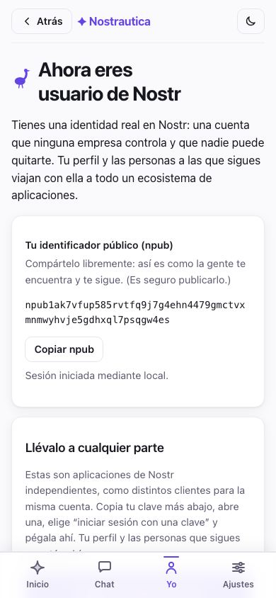

## 2. Crea el evento

Elige **Crear un evento** y completa el formulario:

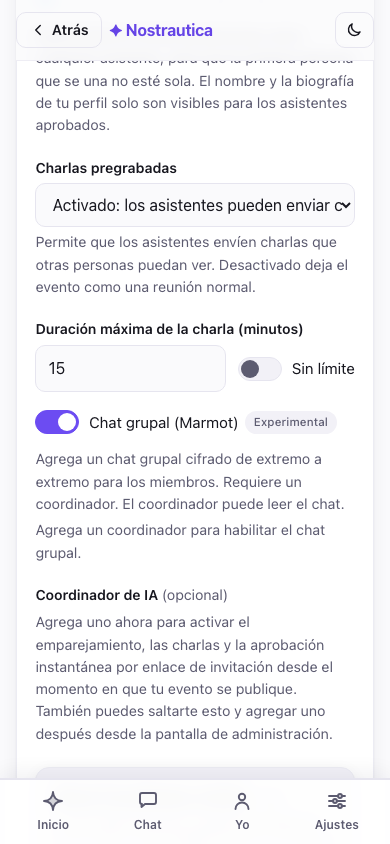

- **Título, resumen, inicio, fin y ubicación**: visibles públicamente para
  cualquiera que tenga el enlace.
- **Aprobación** decide cómo entra la gente:
  - *Revisión manual*: cada solicitud espera tu aprobación.
  - *Solo códigos de invitación*: se entra únicamente con un enlace de
    invitación, de ninguna otra forma.
  - *Códigos de invitación + manual*: los enlaces de invitación aprueban
    automáticamente (con un coordinador conectado); quienes no tengan código
    esperan tu aprobación. **Recomendado para la mayoría de los eventos.**
- **Idioma del evento**: ver más abajo.
- **Emparejamiento con IA**: ponlo en *Activado* si piensas conectar un
  coordinador (§5). Puedes conectar el coordinador más adelante; por ahora
  deja este ajuste activado.
- **Coordinador de IA** (opcional): elígelo aquí mismo en el formulario, en
  la misma lista de descubrimiento descrita en §5, para que un evento con
  códigos de invitación pueda aprobar automáticamente y empezar a emparejar
  desde el momento en que se publica. Sáltatelo y conecta uno más tarde desde
  **Administración → Ajustes** si prefieres decidir después de ver cómo se
  llena el evento. Nada más en este formulario depende de esto.

  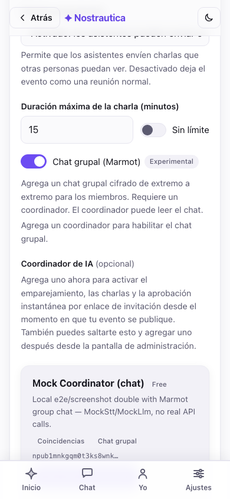

- **Únete tú también como participante**: marcado de forma predeterminada:
  quedas inscrito como cualquier otro asistente, así que la primera persona
  que se une ve al menos a ti en **Personas** en lugar de una lista vacía (y
  también puedes recibir coincidencias, una vez que grabes tu presentación).
  Tu nombre y tu bio los ven solo los asistentes aprobados; desmárcalo si
  prefieres organizar sin aparecer en la lista.
- **Avanzado** (colapsado): sube un ícono y un banner para el evento (si no,
  se genera un diseño a partir del título) y define el límite de duración del
  video de presentación. Puedes elegir y recortar el ícono y el banner
  **incluso antes de tener una identidad**. Si estás creando el evento sin
  haber iniciado sesión, la aplicación guarda las imágenes recortadas
  localmente y las sube por ti justo después de crear tu identidad al enviar
  el formulario, así que no tienes que detenerte a iniciar sesión primero.

### Idioma del evento

Elige el idioma en el que funciona tu evento. Empieza a escribir para
buscarlo por su nombre en tu propio idioma, o por su código de dos letras
(escribe "esp" o "es" para encontrar español). Tu propio idioma, los que
prefiere tu navegador, y todos los idiomas a los que está traducida la propia
aplicación quedan fijados arriba; el resto sigue en orden alfabético.

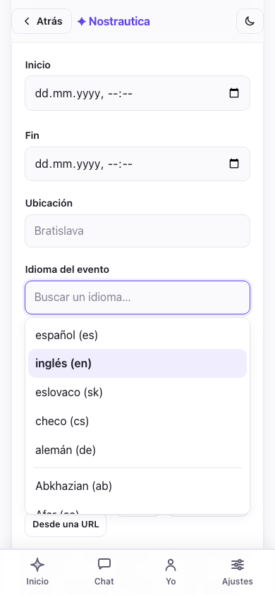

El idioma hace tres cosas. Fija el **idioma predeterminado de la interfaz**
para los asistentes que abren tu evento (igual pueden cambiarlo en Ajustes).
Fija el idioma en el que escribe la IA: **los motivos de las coincidencias y
los resúmenes de perfil siempre están en el idioma de tu evento**, sin
importar en qué idioma hable o grabe cada asistente. Alguien puede grabar su
presentación en inglés en un evento en español, y todos igual van a leer en
español por qué deberían conocerlo. Y cuando un asistente escribe su bio en
otro idioma, el coordinador **publica una traducción al idioma del evento**
para que el resto de la sala pueda leerla. El texto original de la persona
siempre se conserva y también se muestra. El predeterminado es inglés;
déjalo así para un evento en inglés.

(Nunca tienes que volver a ejecutar nada por esto: cuando un asistente
actualiza su presentación, el sistema recalcula automáticamente solo las
coincidencias en las que esa persona participa.)

Fíjate en la nota debajo del formulario: **la rotación de claves solo
funciona hacia adelante**. Revocar a alguien (§4) protege el contenido
*futuro*, no lo que ya vio.

Configura una **ventana de retención** en **Administración → Ajustes →
Eliminar los datos de los miembros después del evento** (un número de días, o
déjalo en blanco para conservarlos de forma indefinida). Los asistentes ven
el período declarado al unirse, y una vez que pasa, el coordinador también
limpia sus propias copias, no solo los registros publicados. Es una limpieza
real, no una garantía absoluta de que cada última copia desaparezca de todas
partes (el borrado en los relays se hace en la medida de lo posible, y las
copias de seguridad son un asunto aparte). Consulta [Cifrado y
privacidad](ENCRYPTION-AND-PRIVACY.md) para conocer los límites exactos.

Después de crear el evento obtienes un **enlace para compartir**, una lista
de próximos pasos y un **comprobante**: cada paso de publicación se informa
por separado, así que un fallo parcial es evidente y se puede reintentar en
lugar de pasar inadvertido:

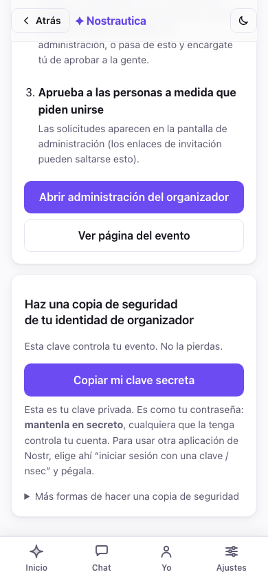

El evento en sí siempre se crea si llegaste hasta aquí. Dos pasos
secundarios pueden fallar de forma independiente por una mala conexión:
inscribirte como participante, y enviarle al coordinador su permiso de
instalación si elegiste uno en el formulario. Cada uno tiene su propio botón
**Reintentar** justo en el comprobante, en vez de obligarte a rehacer todo el
formulario. Una tercera línea, **copia de seguridad pendiente**, solo
significa que todavía no guardaste tu clave (ver el paso 1). No es un error.

**¿Vas a organizar este mismo evento otra vez el próximo mes?** Una vez que
existe, ábrelo y usa **Duplicar evento** desde el menú del evento: un
formulario de creación nuevo, precompletado con el título, la descripción,
las imágenes, el idioma y los ajustes de este (el título pasa a ser "Copia
de …"). Igual tienes que revisarlo y enviarlo, y se convierte en un evento
completamente nuevo, con sus propias claves y una lista de asistentes vacía,
no en una copia de los datos.

## 3. Abre la administración y comparte

Toca **Abrir administración del organizador** (también accesible en
cualquier momento desde **Más → Administrar evento**). Tu panel de control
está dividido en dos pestañas, para que llevar el evento día a día nunca
signifique desplazarte por encima de la configuración de una sola vez:

- **Administración** es la pestaña donde aterrizas, y a la que vas a volver
  más seguido: una línea de estado (cantidad pendiente, con un salto
  directo), **solicitudes de unión** arriba de todo para que admitir gente
  nunca quede enterrado, generación de códigos de invitación, la lista de
  asistentes aprobados (revocar o volver a procesar), moderación de charlas
  y **Comunicar** (publicaciones y novedades).
- **Ajustes**: lo que se configura una sola vez por evento: el coordinador de
  IA (§5), el menú y la disposición de la página del evento, la apariencia o
  tema CSS, el modo de charlas pregrabadas, el chat grupal y los
  coorganizadores. Si elegiste un coordinador en el formulario de creación
  (§2), aquí ya lo vas a ver conectado.

Evento recién creado, todavía sin solicitudes:

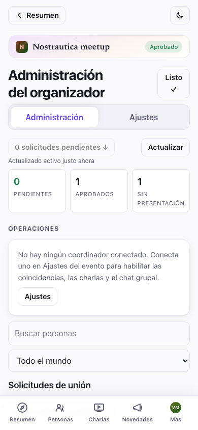

### La franja de resumen

Arriba de Administración, antes de cualquier detalle por persona, un
**resumen** compacto muestra el estado de todo el evento de un vistazo:
cantidades de pendientes, aprobados y sin presentación; si el emparejamiento,
el coordinador y la facturación están en orden; y cualquier cosa que
realmente necesite tu atención (trabajos fallidos, charlas esperando
revisión), mostrada por encima del detalle rutinario en vez de escondida
entre él. Debajo, un **cuadro de búsqueda y un filtro** acotan a la vez la
cola de solicitudes y la lista de aprobados, por nombre o por estado
(pendiente, aprobado, sin presentación, procesamiento fallido, charla
enviada), así en un evento de 200 personas no tienes que desplazarte para
encontrar a esa única persona que te escribió por correo:

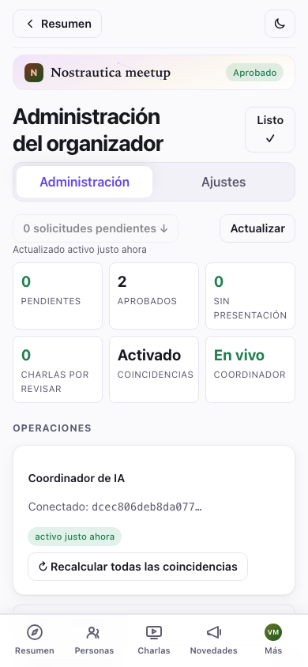

Toca la fila de cualquier persona para abrir un **panel de detalle** con su
perfil enviado, sus archivos y su historial operativo (estado del
coordinador, charlas enviadas), sin salir de la lista.

Tienes tres tipos de enlaces para compartir:

- **El enlace abierto del evento** (`…#/e/<evento>/join`, que se muestra
  cerca del final con un botón **Copiar enlace de invitación**). Cualquiera
  puede ver la página pública del evento y pedir unirse. Publícalo en tu
  sitio o en redes sociales.
- **Códigos de invitación**: enlaces de un solo uso que aprueban
  automáticamente a quien los tenga *cuando hay un coordinador conectado*.
  Define una cantidad y toca **Generar**; obtienes un enlace y un QR por
  código. Envía uno por persona, o imprime los códigos QR. El código viaja en
  el fragmento de la URL y nunca toca un servidor, así que trata cada enlace
  como una entrada.
- **Código de acceso compartido**: un solo QR que escanea toda la sala a la
  vez, en lugar de un enlace por persona. Define una cantidad de personas y
  una ventana de validez, y toca **Crear código compartido** para obtener un
  único enlace y QR para poner en la primera diapositiva. **0** funciona en
  ambos campos y en los dos significa "sin límite": 0 personas es cualquier
  cantidad de ellas, 0 horas es un código que nunca caduca. El formulario
  dice en palabras qué va a hacer el código que estás por crear ("Caduca el
  15 sep 2026, 23:26." o "Este código nunca caduca."), y el panel generado lo
  repite debajo del QR, así que revisa que diga lo que querías antes de
  entregar el enlace. El código solo existe en esta pestaña del navegador,
  así que cópialo o muéstralo antes de cerrar la página, porque no se puede
  recuperar de nuevo. Una ventana corta es más segura, porque cualquiera que
  escanee el código puede reenviar el enlace; y cuando un código caduca no se
  rechaza, los rezagados simplemente terminan en la cola de aprobación.

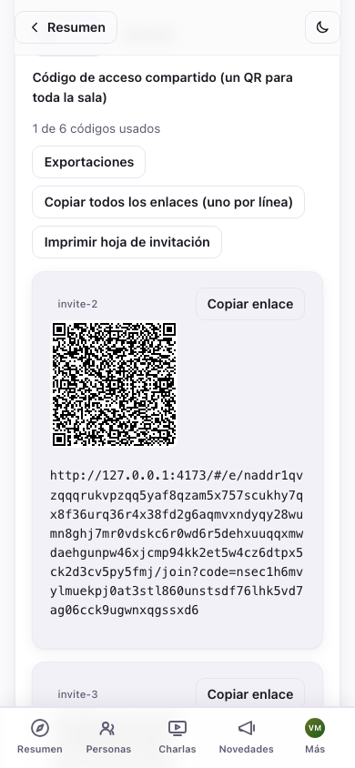

Más de un puñado de códigos se vuelve tedioso para entregar uno por uno.
**Copiar todos los enlaces** y **Descargar como .txt** te dan todos los
enlaces generados como texto plano para una combinación de correspondencia,
y **Imprimir hoja de invitación** organiza un QR por código, varios por
página, listos para recortar y repartir en la puerta.

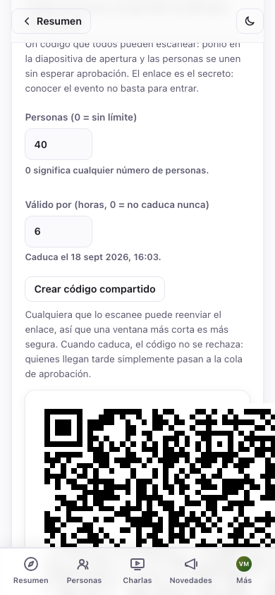

## 4. Aprueba asistentes

Las solicitudes de unión aparecen en la sección **Solicitudes de unión**.
Cada una muestra el nombre de la persona, un id corto, sus habilidades, una
insignia de **invitación** si usó un código, y una insignia de 🎥 si ya
grabó una presentación. El botón "N solicitudes pendientes ↓" arriba de todo
te lleva directo ahí.

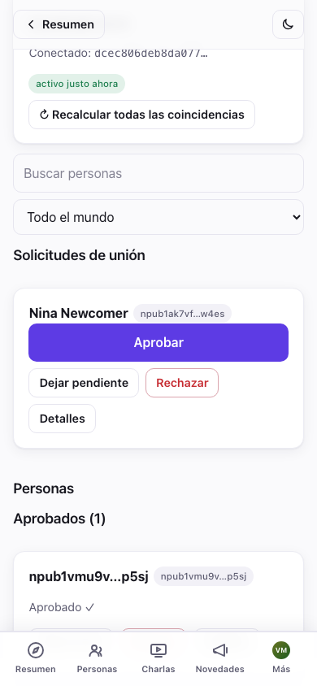

Toca **Aprobar** en las personas que quieres dejar entrar de a una, o
**Aprobar todas (N)** para procesar a todas las que esperan. La aprobación
masiva informa el resultado de cada persona por separado (en cola →
publicándose → confirmado, o falló), así que una conexión inestable de una
persona nunca esconde si las otras nueve pasaron; una línea de resumen ("N
aprobadas, M necesitan reintento") lo cierra al final, y cada fallo tiene su
propio botón **Reintentar**, en lugar de obligarte a repetir todo el lote.

No todas las personas que esperan necesitan un sí o un no en este momento:
**Rechazar** oculta una solicitud de forma local (el asistente no recibe
ningún aviso, y se puede deshacer desde una pequeña franja de "N
rechazadas"), y **Dejar pendiente** simplemente la marca como revisada sin
comprometerte con ninguna de las dos opciones. Ambas son anotaciones tuyas,
locales, no acciones del protocolo, así que puedes cambiar de opinión sobre
ellas cuando quieras.

Las personas aprobadas pasan a la sección **Aprobados**. Cada tarjeta
aprobada tiene **Reprocesar** (vuelve a publicar su entrada en el directorio
y recalcula sus coincidencias) y **Revocar**.

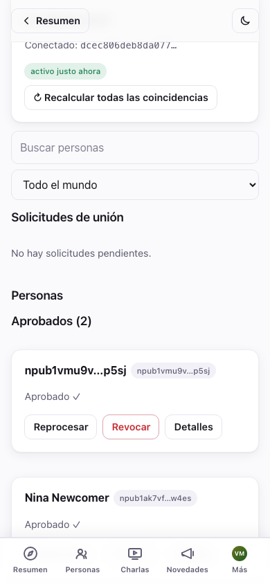

Los asistentes aprobados obtienen acceso a la lista de asistentes cifrada, a
los videos de presentación de los demás y, con un coordinador conectado, a
sus coincidencias. Aprobar a alguien funciona igual haya o no un coordinador
conectado; conectar uno (§5) sigue valiendo la pena por la aprobación
automática y las coincidencias, solo que ya no es necesario para que
funcione la aprobación manual.

### Eliminar a alguien

Toca **Revocar** en una tarjeta aprobada. Vas a ver una confirmación que
explica la consecuencia:

> *"¿Revocar a {name}? Pierde el acceso a todo lo nuevo. Lo que ya vio no se
> puede revertir."*

Confirmar rota automáticamente la clave del evento para todos los demás, así
que la persona revocada no puede descifrar nada publicado desde ese punto en
adelante. Lo que ya vio no se puede "desver", así que si tienes dudas, revoca
antes que después.

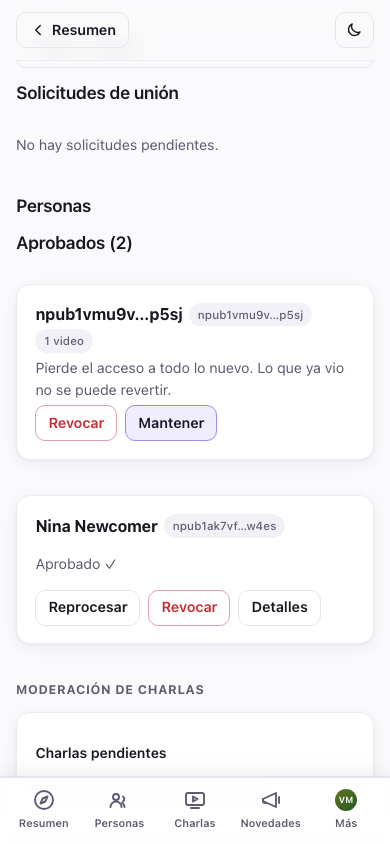

## 5. Conecta el coordinador de IA (emparejamiento)

El coordinador es un servicio pequeño que transcribe los videos de
presentación, arma un perfil de cada asistente y calcula quién debería
conocer a quién. Sin él, el evento sigue funcionando por completo, con la
lista de asistentes, los videos y los seguimientos intactos. Solo que no hay
coincidencias automáticas, y los enlaces de invitación necesitan tu
aprobación manual.

Puedes elegir uno directamente en el formulario de creación (§2) para que
esté activo desde el inicio, o conectarlo más tarde. Es la misma lista de
descubrimiento en ambos casos, solo que en otro lugar: en un evento ya
existente está en **Administración → Ajustes → Coordinador de IA**, no en
Administración (esa pestaña es para lo que haces repetidamente; conectar un
coordinador es una configuración de una sola vez). De cualquier forma,
**eliges un coordinador de la lista**. Cada uno se anuncia en Nostr con su
nombre, sus funciones, una divulgación de privacidad (qué pasos de la IA
salen del enclave seguro) y su precio (el de referencia es **Gratis**). Toca
**Usar este coordinador**:

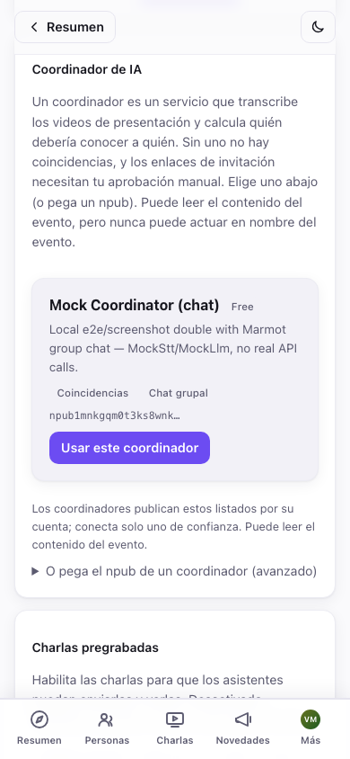

¿Prefieres correr el tuyo propio, o te dieron uno en particular? Despliega
**O pega el npub de un coordinador (avanzado)** y pega su clave pública en su
lugar. De cualquier forma, lo verás confirmado:

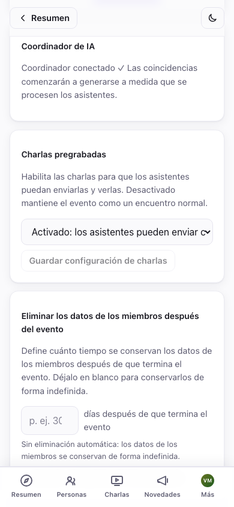

> **Coordinadores de pago.** Un coordinador puede cobrar (el costo del
> emparejamiento con IA crece con la cantidad de asistentes), así que un
> anuncio puede mostrar un precio o un nivel gratuito (por ejemplo, "hasta 20
> asistentes gratis"). Si en algún momento hace falta un pago, la pantalla de
> Ajustes muestra un aviso de **Pago requerido** con un enlace para pagar. El
> coordinador de referencia actual es gratis.

El coordinador puede leer las postulaciones y publicar en nombre del evento:
entradas del directorio, listas de asistentes, coincidencias, charlas. Nunca
puede hacerse pasar por ti ni cambiar los ajustes de tu evento. Elige un
operador en el que confíes con esa autoridad. En la pestaña
**Administración** aparece un botón **↻ Recalcular todas las coincidencias**
(es una acción recurrente, no una configuración); úsalo después de una ola
de nuevos asistentes.

### Reemplazar o desconectar un coordinador

¿No estás conforme con el que elegiste, o necesitas dejar de pagarlo? En
**Ajustes → Coordinador de IA**, **Reemplazar** abre la misma lista de
descubrimiento (o el campo de npub) para cambiar a otro coordinador. Esto
rota las claves del evento y le otorga permiso al nuevo coordinador; el
anterior pierde el acceso desde ese momento. **Desconectar** lo quita por
completo, sin reemplazo.

Ambas acciones son irreversibles para el coordinador del que te alejas: una
vez reemplazado o desconectado, ya no puede recuperar autoridad sobre el
evento más adelante. Desconectar significa en concreto:

- **El emparejamiento se detiene** hasta que conectes otro coordinador.
- **La administración del chat queda huérfana** si tenías el chat grupal
  activado. Nadie agrega activamente nuevos miembros a la sala cifrada hasta
  que otro coordinador se haga cargo (los miembros existentes conservan su
  acceso; ver la nota sobre los dispositivos del organizador como respaldo en
  §6.5).
- El contenido anterior sigue siendo exactamente tan legible como siempre
  fue. Desconectar no oculta nada de forma retroactiva, solo detiene el
  procesamiento futuro.

### Conectar o desconectar a mitad del evento

Ambas operaciones son seguras de hacer con un evento en marcha, pero un
reinicio del coordinador descarta lo que estaba procesando justo en ese
instante. La lógica de reintento de trabajos lo retoma, pero si estás
llevando un evento activo, es más considerado con tus asistentes hacer este
tipo de cambio entre ráfagas de procesamiento (justo después de que se calme
una ola de llegadas) que justo cuando se está subiendo la presentación de
alguien.

> Ejecutar el coordinador es un paso aparte y técnico (un pequeño demonio
> que necesita `ffmpeg` y una clave de un proveedor de LLM o de transcripción
> de voz). Consulta
> [`packages/coordinator/coordinator.example.toml`](../packages/coordinator/coordinator.example.toml),
> [la guía del operador](COORDINATOR-OPERATOR-GUIDE.md) y el README del
> repositorio. Apunta sus relays al mismo relay que usa tu evento.

## 6. Publica para tus asistentes

La tarjeta **Publicaciones del evento** (bajo **Comunicar** en
administración) es tu canal de anuncios: "el programa ya está listo",
"cambio de sede", "la cena de esta noche es en…". Ponle un título y, si
quieres, un resumen o una imagen de encabezado, escribe el cuerpo
(**se admite Markdown**: encabezados, listas, enlaces, negrita), y elige
**quién puede leerla**:

- **Pública**: la ve cualquiera con el enlace del evento, con sesión iniciada
  o no. Son publicaciones largas estándar de Nostr, publicadas bajo la
  identidad del evento, así que también se ven en otros lectores de Nostr.
- **Solo miembros**: cifrada para tus asistentes aprobados. Quienes no son
  miembros (y el público) solo ven un candado y una invitación a "unirte al
  evento para leer esto", nunca el contenido. Úsala para la dirección de la
  fiesta posterior, el código de la puerta, cualquier cosa que quieras que
  quede dentro de la sala.

Toca **Publicar publicación**. La visibilidad queda fija una vez publicada
(puedes editar el texto después, pero una publicación pública no se puede
pasar en silencio a solo miembros, ni al revés). También puedes soltar un
enlace a una publicación existente directamente desde el selector del
editor, y fijar una publicación arriba de todo en la página del evento.

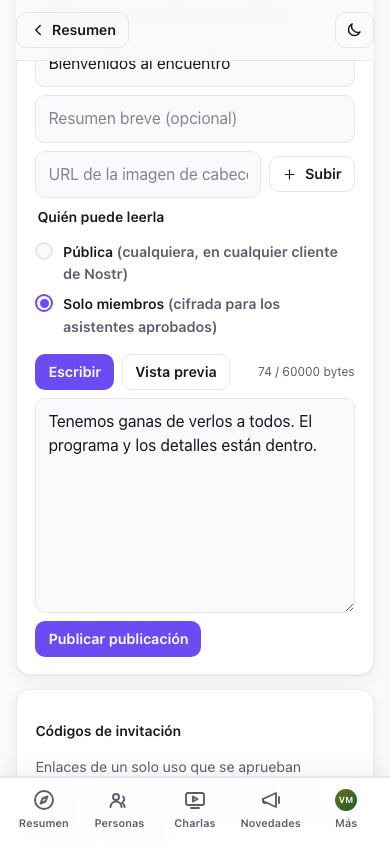

Las publicaciones públicas se muestran en la **página del evento** para
todos; las de solo miembros aparecen para los asistentes aprobados en
**Novedades** y en la franja "Más reciente" del **Resumen** del evento,
marcadas con una insignia de candado. Así es como ve el candado de una
publicación de solo miembros un asistente que todavía no se unió:

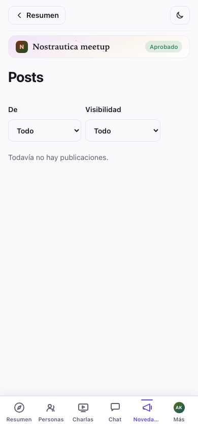

### Personaliza la página del evento y su aspecto

En **Administración → Ajustes** hay dos controles más:

- **Página del evento** (kind 31608): arma un menú a medida y organiza las
  secciones (qué publicaciones se muestran dónde) para la página pública del
  evento, en lugar de la disposición predeterminada. Reordena con los
  controles ↑/↓.
- **Apariencia** (kind 31609): pega CSS a medida para darle tema a las
  páginas *de este evento*. Hay una **Vista previa** en vivo antes de
  **Publicar tema**; salir de administración sin publicar restaura para
  todos el último tema *publicado*, pero tu CSS sin enviar se guarda como
  borrador y se restaura en el editor cuando vuelves (con un botón
  **Descartar** para eliminarlo), así que salir de la pantalla ya no hace
  perder el trabajo en curso. Lo mismo vale para una publicación de evento
  sin enviar y para ediciones de perfil sin guardar. Se aplica encima del
  tinte de color propio de la aplicación para cada evento, así que con poco
  alcanza. (Pega solo CSS que hayas escrito tú o en el que confíes: le da
  estilo a la página para todos los asistentes. Nota: tu tema se aplica en
  todas las páginas del evento *excepto* algunas rutas que muestran material
  sensible. La entrega de dispositivo del chat y las pantallas de
  invitaciones o de coordinador en administración deliberadamente se
  muestran sin él, para que un tema hostil no se pueda usar para pescar
  claves o códigos de invitación en esas pantallas específicas.)

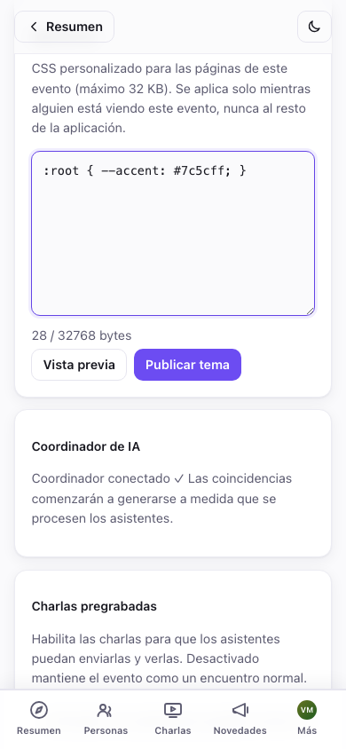

**¿No estás seguro de cómo se ven tus cambios para alguien que todavía no
entró?** El menú del evento tiene un interruptor **Ver como visitante**.
Oculta todo lo que sea solo para miembros (publicaciones bloqueadas,
secciones y elementos de menú solo para miembros), así que ves exactamente
lo que ve un desconocido con el enlace, con una barra de salida para volver
a tu vista normal de organizador en cualquier momento. Deliberadamente no
existe un modo equivalente "ver como miembro", porque tu propia vista de
organizador ya *es* la vista de miembro para todo lo que no es específico de
visitante.

## 6.5 Charlas y chat grupal (ambas novedades, ambas opcionales)

**Charlas pregrabadas.** En **Administración → Ajustes → Charlas
pregrabadas**, ponlo en *Activado* (o *Pregrabado primero*, que en la
navegación de los asistentes pone Charlas antes que Personas, bueno para un
formato de "mirar antes, encontrarse en el lugar") y **Guarda**. Los
asistentes aprobados pueden entonces enviar charlas cortas: grabadas en el
navegador, subidas como archivo, o entregadas como una URL no listada de
**YouTube o .mp4** (útil para charlas demasiado pesadas para subir; el
coordinador nunca las descarga, así que las charlas por URL son solo para
ver).

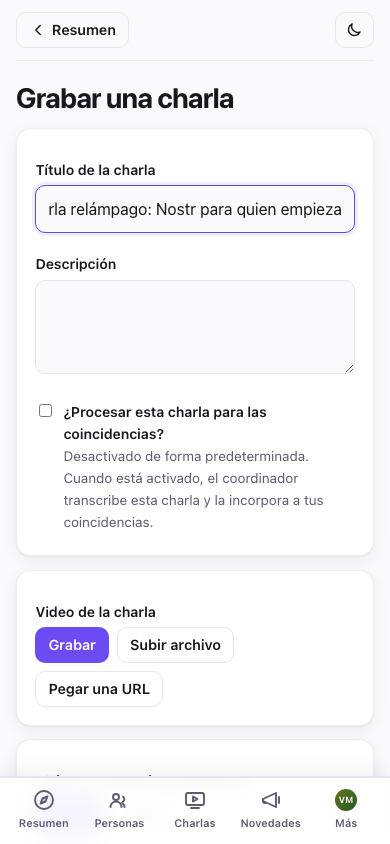

Ten en cuenta que **las charlas ya no alimentan el emparejamiento de forma
predeterminada**: quien da la charla elige, en cada una, si marca *"¿Procesar
esta charla para las coincidencias?"*. Tenlo presente si una charla enviada
no aparece en el razonamiento de las coincidencias de nadie. Es lo esperado,
a menos que quien habla lo haya activado (y con las charlas por URL nunca
sucede). Esto evita gastar en transcripción charlas que nadie pidió
emparejar.

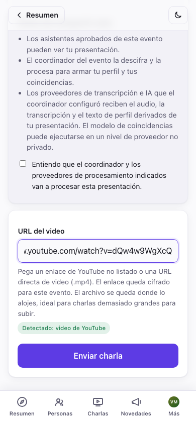

Las charlas enviadas no se publican solas. Más abajo en **Administración**,
una tarjeta de **Moderación de charlas** lista todo lo que espera revisión.
Usa **Vista previa** en cada una, y después **Publica** para que los
asistentes puedan verla, o **Rechaza**. Nada de lo que envía un asistente es
visible para nadie más hasta que actúes aquí (y publicar necesita un
coordinador conectado, igual que el resto de administración). La búsqueda y
el filtro de Personas (§3) tienen un filtro de **Charla enviada**, así que en
un evento con mucho movimiento puedes ir directo a quién está esperando por
ti, sin desplazarte por toda la lista.

**Chat grupal (Marmot, experimental).** En **Administración → Ajustes**,
activa **Chat grupal (Marmot)** y guarda. Necesita un coordinador conectado
(el coordinador administra el grupo cifrado: agrega gente a medida que se
aprueba, la quita al revocarla). Una vez activado, los asistentes aprobados
obtienen una pestaña **Chat**: una sola sala cifrada de extremo a extremo
para todo el evento, separada de los mensajes uno a uno: una conversación
normal en marcha, sin nada que tengan que configurar, y cada dispositivo en
el que la abren se une automáticamente (ver la sección "Chat grupal" de la
guía del participante para los detalles por dispositivo que ven los
asistentes).

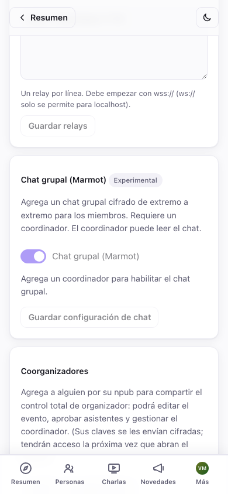

Esto es algo temprano: unirse al grupo puede tardar un poco del lado del
servidor incluso una vez activado, y está marcado a propósito como
*Experimental* en la interfaz. Todavía no te apoyes en esto como la única
forma de llegar a los asistentes durante un evento. Las publicaciones (§6)
siguen siendo el canal confiable.

**Una red de seguridad silenciosa.** El coordinador administra el grupo día
a día, pero cada dispositivo que un **organizador aprobado** conecta al chat
se promueve automáticamente también a coadministrador, sin ningún paso de
inscripción: simplemente sucede. Si alguna vez se pierde la base de datos de
tu coordinador sin una copia de seguridad (ver la [guía del
operador](COORDINATOR-OPERATOR-GUIDE.md#9-recovery-mls-admin-and-detach)),
tus propios dispositivos todavía pueden agregar o quitar miembros y mantener
la sala funcionando mientras consigues un coordinador de reemplazo. Mantener
al día las copias de seguridad del coordinador sigue siendo el verdadero plan
de recuperación; esto es el respaldo para cuando ese plan falla.

## 7. Durante el evento

- **La lista de asistentes se completa en vivo**: los asistentes aprobados
  aparecen a medida que se unen; sus coincidencias, mostradas arriba de todo
  en Personas, se actualizan a medida que se procesan nuevas presentaciones.
- **Recalcular coincidencias**: después de una ola de llegadas, toca **↻
  Recalcular todas las coincidencias** (necesita un coordinador).
- **Coorganizadores**: en **Administración → Ajustes → Coorganizadores**,
  agrega a alguien por su npub para compartir el control total de
  organizador (editar el evento, aprobar, administrar el coordinador). Sus
  claves les llegan envueltas como regalo; obtienen acceso la próxima vez que
  abren el evento. Esta es también tu red de seguridad si se te muere el
  navegador.
- **Fomenta las presentaciones desde temprano.** Las coincidencias solo
  existen para la gente que grabó una presentación, así que lo mejor que
  puedes hacer por la calidad del emparejamiento es lograr que todos graben
  antes de que empiece el evento. Grabar es opcional para los asistentes, y
  la aplicación se los dice, pero vale la pena insistir: una presentación
  grabada le da más a la IA para trabajar, deja que otros asistentes vean de
  antemano si de verdad conectarían con una coincidencia antes de acercarse
  (emparejar no es solo cuestión de proyectos y habilidades, también es una
  sensación que la IA sola no puede captar), y si es un video, ayuda a la
  gente a reconocer a sus coincidencias en persona.

## Solución de problemas y preguntas frecuentes

- **¿Qué ven los asistentes antes de ser aprobados?** Solo la página pública
  del evento: título, resumen, fechas, ubicación y tus novedades publicadas.
  La lista de asistentes, los videos y las coincidencias están cifrados para
  los asistentes aprobados.

- **Abrí el evento en otro dispositivo y no hay ningún botón de
  administración.** Inicia sesión con la misma identidad (pega la clave
  secreta que respaldaste al crear la cuenta) y vuelve a abrir el evento. El
  acceso de organizador a cada evento que creaste se recupera automáticamente
  a partir de esa única clave, sin necesidad de una copia de seguridad aparte
  del evento. Tus claves del evento se recuperan de los relays en el momento
  en que inicias sesión, así que dale unos segundos en un dispositivo nuevo
  antes de concluir que no funcionó. (Agregar un **coorganizador** desde el
  dispositivo original, con el npub del dispositivo nuevo, sigue siendo la
  opción más rápida si todavía tienes a mano el dispositivo original.)

- **Un enlace de invitación no aprobó a alguien automáticamente.** La
  aprobación automática necesita un coordinador conectado *y en
  funcionamiento*. Sin uno, las solicitudes de invitación igual llegan a tu
  lista de **Solicitudes de unión**, así que apruébalas ahí. (Van a tener una
  insignia de **invitación**.)

- **Una solicitud de unión no aparece.** Toca **Actualizar** en el
  encabezado de administración, porque las solicitudes se buscan bajo
  demanda. Si sigue sin aparecer, es posible que el asistente tenga una
  conexión inestable; pídele que vuelva a abrir el enlace del evento y envíe
  la solicitud de nuevo.

- **¿Cómo proyecto la lista de asistentes, el tablero de coincidencias o el
  resumen de administración en el lugar del evento?** Abre la página que
  corresponda en el navegador del proyector, con sesión iniciada como una
  identidad aprobada (tú mismo). Son páginas normales, así que ponlas en
  pantalla completa:

  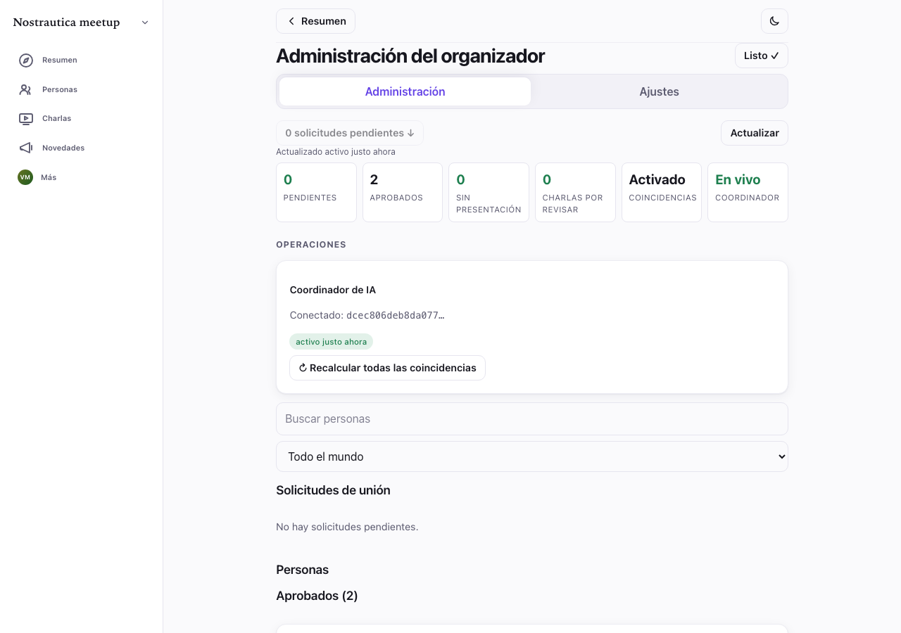

- **¿Puedo editar un evento después de crearlo?** Sí. En **Administración →
  Ajustes → Detalles del evento** editas los campos principales (título,
  resumen, inicio o fin, ubicación, y el ícono o banner) y los vuelves a
  publicar. (La nueva publicación sigue la regla de orden monótono del
  protocolo, así que una edición nunca pierde frente a una carrera en el
  mismo segundo.) También puedes publicar novedades y editarlas libremente,
  y los coorganizadores también pueden administrar el evento. Para un cambio
  de horario o de sede, igual vale la pena publicar una novedad, para que
  los asistentes reciban un aviso en lugar de solo un campo cambiado en
  silencio.

- **¿Cuánto me cuesta esto?** Nada, de forma predeterminada: el coordinador
  de referencia es gratis, y todo lo que no involucra a un coordinador
  (lista de asistentes, videos, publicaciones, aprobación manual) nunca
  tiene costo, pase lo que pase. Si conectas un coordinador cuyo operador
  cobra, lo vas a ver claramente en su anuncio y, si alguna vez arranca la
  facturación, un aviso de **Pago requerido** con un enlace para pagar en
  Ajustes. Nunca un cargo sorpresa.

- **Un asistente editó su presentación pero nadie más ve el cambio.** Sin un
  coordinador conectado, las ediciones al texto escrito de la presentación no
  se propagan solas, así que toca **Reprocesar** en su tarjeta dentro de la
  lista de Aprobados (§4) para que se registre la actualización.

- **¿Por qué un coordinador que reemplacé o desconecté no puede volver a
  tener autoridad?** Cada conexión, reemplazo o desconexión aumenta un
  número interno de generación, y los coordinadores solo confían siempre en
  el actual, así que un permiso viejo no se puede reproducir después. No hay
  nada que tengas que hacer aquí. Es simplemente por qué desconectar o
  reemplazar es definitivo para el coordinador del que te alejas.

## Apéndice: seguimiento de códigos de invitación cuando vendes entradas en otro lado (opcional)

Todo lo anterior es la historia completa para la mayoría de los
organizadores. Esta sección es solo para el caso específico de vender
entradas en algún lugar distinto de Nostrautica (Eventbrite, tu propia tienda
en línea, efectivo en la puerta), donde lo único que tienes de un comprador
es su dirección de correo. Le mandas a cada uno un enlace de invitación;
algunos se unen enseguida, otros nunca llegan a hacerlo, y unos días antes
del evento quieres darles un empujón exactamente a los que todavía no
aparecieron.

**Deja esto claro desde el principio: la aplicación nunca llega a conocer el
correo de nadie, y nunca le manda un correo a nadie.** Mandar los códigos por
correo, y hacer coincidir un código con la persona a la que se lo enviaste,
es enteramente tu propio trabajo, hecho con tus propias herramientas: una
combinación de correspondencia, una planilla, o el sistema de venta de
entradas que ya uses. Lo único que la aplicación te puede decir es qué
*números* de código se usaron.

### Cada código lleva un número

Cada código de invitación que generas queda etiquetado como **invite-1,
invite-2**, y así en adelante, justo al lado dondequiera que aparezca. Ese
número es lo único que conecta un código con una persona, y solo tú lo
sabes: anótalo en una columna al lado de su correo en el momento en que
mandas el código, en un archivo tuyo.

Los números siguen contando hacia arriba. Genera 20 códigos hoy y 10 más la
próxima semana, y los nuevos empiezan en **invite-21**. Nada de lo ya
entregado cambia de número, y ninguno se reutiliza.

### Dos exportaciones para dos momentos distintos

Abre **Exportaciones**, bajo los códigos de invitación en Administración
(§3). Hay dos descargas aquí, a propósito, porque responden preguntas
distintas en momentos distintos:

- **Códigos para enviar por correo** te da los códigos y enlaces reales para
  pegar en una combinación de correspondencia, pero solo del lote que tienes
  en pantalla en este momento, y solo en este momento. Los códigos de
  invitación son secretos de un solo uso que la aplicación deliberadamente
  nunca guarda en ningún lado, así que exporta (o al menos copia) un lote
  antes de generar el siguiente o de salir de la página. Una vez que hagas
  cualquiera de las dos cosas, los códigos de ese lote desaparecen para
  siempre. Sus números quedan reservados; simplemente ya no tienes a quién
  dárselos.
- **Quién se unió** te dice qué números de código se usaron. No necesita
  ningún código para funcionar, así que puedes abrirla en cualquier momento,
  semanas o meses después, en cualquier dispositivo donde tengas sesión
  iniciada como organizador. A esta vas a volver.

### El flujo de trabajo

1. **Crea tus códigos**, y de inmediato exporta **Códigos para enviar por
   correo** en formato de planilla (CSV).
2. **Haz la combinación de correspondencia** contra tu lista de entradas,
   anotando el número de cada código en una columna al lado del correo
   correspondiente, en un archivo tuyo.
3. Más cerca del evento, o en cualquier momento después, vuelve a abrir
   **Exportaciones** y descarga **Quién se unió**, con **Solo códigos sin
   usar** seleccionado.
4. **Haz coincidir** esos números con los correos en tu archivo.
5. **Reenvía** solo a esa lista más corta, en lugar de escribirle a todos de
   nuevo.

### Qué formato elegir

El archivo de planilla es el predeterminado, y es el que conviene usar para
una combinación de correspondencia: se abre directo en Excel, Google Sheets,
o lo que ya uses. La lista simple de enlaces está ahí sobre todo para quienes
resuelven su propio envío con un script.

### Una advertencia honesta

"Usado" solo cuenta hacia adelante: una vez que la aplicación ve un código
como usado, queda marcado así para siempre. Pero "sin usar" es una señal más
débil de lo que parece. Para un evento que terminó hace un tiempo, o si
simplemente no abriste la vista de organizador desde que se unieron algunas
personas, un puñado de códigos puede seguir apareciendo como sin usar aunque
esas personas de verdad se hayan unido. Toma **usado** como algo seguro, y
**sin usar** como "probablemente todavía no, vale la pena revisar antes de
volver a escribirle a alguien". Una pequeña molestia para quien ya se unió es
mejor que ningún recordatorio para quien no lo hizo, pero vale la pena saber
que esto puede pasar en vez de que te agarre desprevenido.

### En la puerta

La hoja de invitación (§3) ya deja afuera cualquier código que se haya
usado, así que si la imprimes de nuevo cerca del evento, cualquiera que se
haya unido en línea mientras tanto simplemente ya no va a estar en la
página.
