# Nostrautica — Príručka organizátora

Nostrautica je aplikácia pre podujatia postavená na jednej myšlienke: **najdôležitejšie na vašom podujatí je, kto koho stretne**. Účastníci si nahrajú krátke predstavovacie video a voliteľný AI koordinátor im na základe neho povie, s kým by sa mali porozprávať a prečo. Táto príručka vás prevedie od úplného začiatku až po bežiace podujatie.

## Čo vás čaká

1. Vytvorenie identity (raz).
2. Vytvorenie podujatia — voliteľne rovno s pripojeným AI koordinátorom, alebo neskôr.
3. Zdieľanie podujatia — otvorený odkaz, pozývacie kódy, alebo oboje.
4. Schvaľovanie účastníkov (alebo necháte pozývacie kódy schvaľovať automaticky).
5. Zverejňovanie noviniek, úprava vzhľadu stránky podujatia a beh podujatia.

Všetko beží vo vašom prehliadači. Nič netreba nastavovať na serveri — aplikácia ukladá dáta podujatia zašifrované na otvorenej sieti Nostr. Kľúče podujatia drží váš prehliadač, preto **používajte jeden prehliadač, ktorý si necháte** (a keď vás na to aplikácia vyzve, zálohujte si identitu).

> **Poznámka k usporiadaniu aplikácie.** Keď ste vnútri podujatia, spodná lišta je *viazaná na dané podujatie* — **Prehľad**, **Ľudia**, **Spojenia**, **Novinky** a **Viac** sa vzťahujú na podujatie, v ktorom práve ste, a kompaktná hlavička nad nimi ukazuje jeho názov a váš status. Ďalšie dve karty, **Prednášky** a **Chat**, sa objavia len vtedy, keď tieto funkcie zapnete (§6.5) — pre vás aj pre účastníkov. Vaše globálne veci (všetky vaše podujatia, správy, nastavenia, vaša identita) sú v ponuke **Viac**. Ako organizátor tam navyše nájdete **Správa podujatia**, ktorá otvorí administráciu popísanú v §3.

## 1. Vytvorenie identity

Otvorte aplikáciu. Na úvodnej obrazovke napíšte svoje meno a klepnite na **Vytvoriť moju identitu** (môžete pridať aj fotku). Žiadny e-mail, žiadne heslo — účet vznikne okamžite. Ak už Nostr používate, klepnite na **Už ste na Nostri? Prihláste sa** a namiesto toho použite svoj kľúč, rozšírenie prehliadača alebo vzdialený podpisovač.

> **Tip:** tento krok nemusíte robiť samostatne — ak sa odhlásení rovno pustíte do vytvárania podujatia, aplikácia si vašu organizátorskú identitu vytvorí v rámci toho istého odoslania.

Keď sa vaša identita vytvorí, zobrazí sa vám **záložná karta**. Urobte to hneď: klepnite na **Kopírovať môj tajný kľúč** a vložte ho niekam bezpečne (do správcu hesiel). Kto má tento kľúč, *je* vami; bez neho stratený profil prehliadača znamená stratené podujatie. Ponuka „Ďalšie spôsoby zálohovania" ponúka aj obnovovací odkaz e-mailom alebo súbor chránený heslom.

## 2. Vytvorenie podujatia

Zvoľte **Vytvoriť podujatie** a vyplňte formulár:

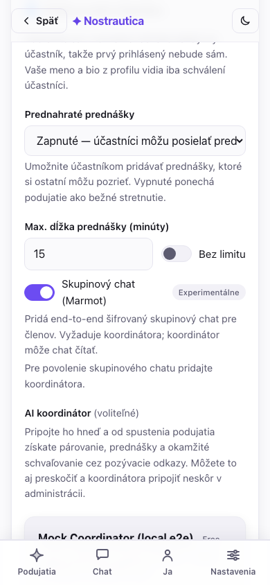

- **Názov, zhrnutie, začiatok/koniec, miesto** — verejne viditeľné pre kohokoľvek s odkazom.
- **Schvaľovanie** — ako sa ľudia dostanú dnu:
  - *Manuálne posúdenie*: každá žiadosť čaká na vaše schválenie.
  - *Iba pozývacie kódy*: dnu sa dostanete len cez pozývací odkaz, inak nijako.
  - *Pozývacie kódy + manuálne*: pozývacie odkazy schvaľujú automaticky (keď je pripojený koordinátor); ostatní čakajú na vás. **Odporúčané pre väčšinu podujatí.**
- **Jazyk podujatia** — pozri nižšie.
- **AI párovanie** — nastavte na *Zapnuté*, ak plánujete pripojiť koordinátora (§5). Koordinátora môžete pripojiť aj neskôr; toto nastavenie nechajte teraz zapnuté.
- **AI koordinátor** (voliteľné) — vyberte si ho rovno tu na formulári, ten istý zoznam ako v §5, takže podujatie s pozývacími kódmi môže schvaľovať automaticky a párovať hneď od spustenia. Preskočte to a pripojte koordinátora neskôr cez **Administrácia → Nastavenia**, ak sa chcete rozhodnúť až podľa toho, ako sa podujatie zapĺňa — na zvyšku formulára to nič nemení.

  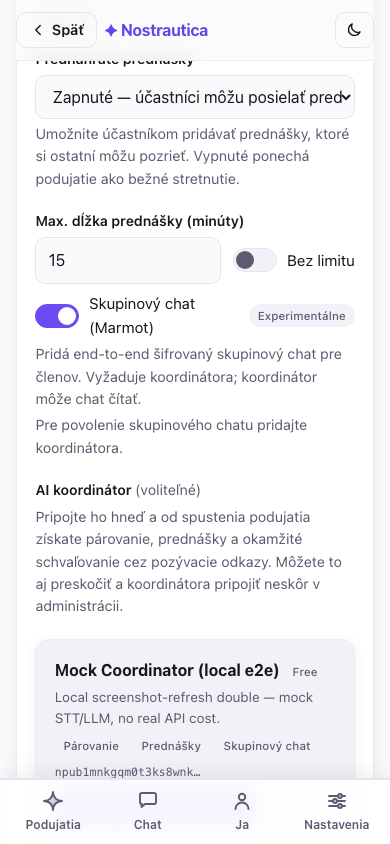
- **Pridať sa medzi účastníkov** — predvolene zaškrtnuté: ste zapísaní ako ktorýkoľvek iný účastník, takže prvý človek, ktorý sa pripojí, uvidí v zozname **Ľudia** aspoň vás namiesto prázdneho zoznamu (a raz, keď nahráte predstavenie, môžete byť aj vy niekomu spárovaní). Vaše meno a bio vidia len schválení účastníci; odškrtnite to, ak chcete podujatie organizovať bez toho, aby ste sa objavili v zozname.
- **Rozšírené** (zbalené) — nahratie ikony a banneru podujatia (inak sa vygenerujú z názvu) a nastavenie limitu dĺžky predstavovacieho videa. Ikonu a banner môžete vybrať a orezať **ešte skôr, než máte identitu** — ak vytvárate podujatie neprihlásení, aplikácia orezané obrázky podrží lokálne a nahrá ich za vás hneď po tom, ako pri odoslaní vytvorí vašu identitu, takže sa nemusíte zastavovať a prihlasovať.

### Jazyk podujatia

Vyberte jazyk, v ktorom vaše podujatie beží. Začnite písať a vyhľadajte ho — podľa názvu jazyka vo vašom vlastnom jazyku *alebo* podľa dvojpísmenového kódu (napíšte „slov" alebo „sk" a nájdete slovenčinu). Váš vlastný jazyk, jazyky preferované vaším prehliadačom a angličtina/slovenčina/čeština sú pripnuté navrchu; zvyšok nasleduje abecedne.

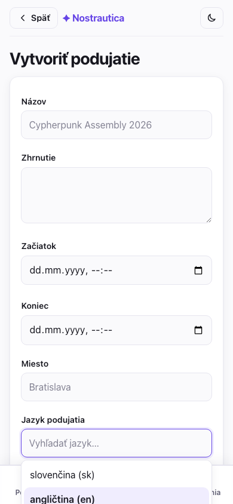

Jazyk robí tri veci. Nastavuje **predvolený jazyk rozhrania** pre účastníkov, ktorí otvoria vaše podujatie (aj tak si ho môžu prepnúť v Nastaveniach). Nastavuje jazyk, v akom píše AI: **odôvodnenia spojení a zhrnutia profilov sú vždy v jazyku vášho podujatia**, bez ohľadu na to, akým jazykom daný účastník skutočne hovorí alebo v akom nahráva — niekto môže nahrať svoje predstavenie po anglicky na slovenskom podujatí a všetci si aj tak prečítajú, prečo by sa s ním mali stretnúť, po slovensky. A keď účastník napíše svoje bio v inom jazyku, koordinátor **zverejní preklad do jazyka podujatia**, aby si ho vedel prečítať zvyšok miestnosti — pôvodný text danej osoby zostáva vždy zachovaný a zobrazený tiež. Predvolená je angličtina; pre anglické podujatie ju nemeňte.

(Nič kvôli tomu nikdy nemusíte spúšťať znova: keď účastník aktualizuje svoje predstavenie, systém automaticky prepočíta iba spojenia, ktorých je súčasťou.)

Všimnite si poznámku pod formulárom: **rotácia kľúčov funguje len dopredu** — ktokoľvek niekedy držal dešifrovací kľúč, dokáže dešifrovať obsah zverejnený, kým bol tento kľúč platný. Odobratie niekoho (§4) chráni *budúci* obsah, nie minulý.

**Retenčné obdobie** nastavíte v **Administrácia → Nastavenia → Zmazať údaje
účastníkov po podujatí**. Zadajte kladný počet dní alebo nechajte pole
prázdne pre neobmedzené uchovávanie. Účastníci obdobie vidia pri pripojení
aj na stránke podujatia. Keď obdobie uplynie (a takisto keď niekto podujatie
opustí), koordinátor teraz zmaže **aj svoje vlastné kópie** — profily, AI profily,
prepisy, zdôvodnenia párov, prednášky a zhrnutia, ktoré má u seba, nielen zverejnené
záznamy — a odstráni záznamy z relayov naprieč všetkými verziami kľúča, ktoré
podujatie kedy použilo, nielen tie aktuálne. Dve poctivé obmedzenia zostávajú:
zmazanie na relayoch (NIP-09) je najlepšia snaha a relay si kópiu môže ponechať; a
obsahovo adresovaná položka, ktorú stále zdieľa *iné* podujatie, prežije, kým ju
neopustí aj to posledné. Zálohy sú samostatná vec — záloha, ktorú prevádzkovateľ
koordinátora urobil pred zmazaním, dáta drží, kým ju nevymení ([príručka
prevádzkovateľa](COORDINATOR-OPERATOR-GUIDE.md) to popisuje). Ide teda o skutočné
upratovanie, len nie o kryptografickú záruku, že každá posledná kópia je všade preč.

Po vytvorení dostanete **odkaz na zdieľanie**, kontrolný zoznam ďalších
krokov a **potvrdenku** — každý zverejňovací krok sa hlási samostatne, takže
čiastočné zlyhanie je zjavné a dá sa zopakovať, nie ticho chýba:

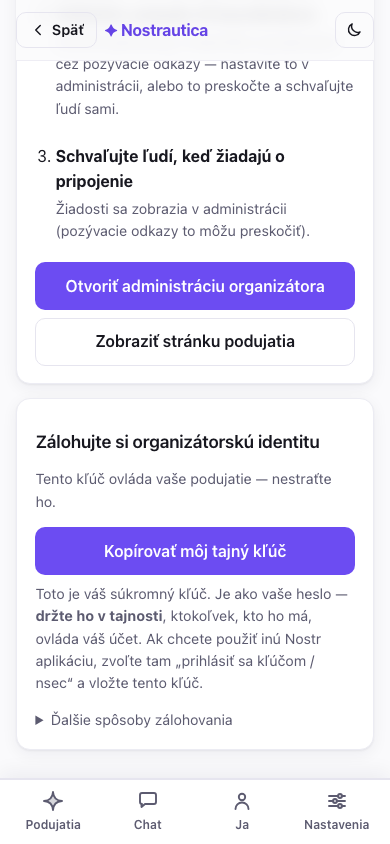

Samotné podujatie, ak ste sa dostali až sem, sa vytvorí vždy. Dva vedľajšie
kroky môžu zlyhať nezávisle pri zlom pripojení — zápis vás medzi účastníkov
a odoslanie inštalačného grantu koordinátorovi, ak ste ho vybrali na
formulári — a každý má vlastné tlačidlo **Skúsiť znova** priamo v
potvrdenke namiesto toho, aby ste museli vypĺňať celý formulár odznova.
Tretí riadok, **záloha čaká**, len znamená, že ste si ešte neuložili kľúč
(pozri krok 1) — nie je to chyba.

**Organizujete to isté podujatie znova o mesiac?** Keď už existuje, otvorte
ho a použite **Duplikovať podujatie** z menu podujatia: nový formulár na
vytvorenie, predvyplnený názvom, popisom, obrázkami, jazykom a nastaveniami
tohto podujatia (názov sa zmení na „Kópia …") — stále ho musíte prezrieť a
odoslať a vznikne z neho úplne nové podujatie s vlastnými kľúčmi a prázdnym
zoznamom účastníkov, nie kópia dát.

## 3. Otvorenie administrácie a zdieľanie

Klepnite na **Otvoriť administráciu organizátora** (kedykoľvek dostupné aj cez **Viac → Správa podujatia**). Ovládací panel má dve karty, takže bežná prevádzka podujatia nikdy neznamená rolovať cez jednorazové nastavenia:

- **Administrácia** — karta, na ktorej pristanete, a tá, na ktorú sa budete vracať najčastejšie: stavový riadok (počet čakajúcich, s odkazom na jedno klepnutie), **žiadosti o pripojenie** úplne navrchu, generovanie pozývacích kódov, zoznam schválených účastníkov (odobrať/spracovať znova), moderovanie prednášok a **Komunikácia** (príspevky/novinky).
- **Nastavenia** — jednorazové veci pre dané podujatie: AI koordinátor (§5), menu a rozloženie stránky podujatia, vzhľad/téma CSS, režim prednahratých prednášok, skupinový chat a spoluorganizátori. Ak ste koordinátora vybrali už na formulári pri vytváraní (§2), tu už uvidíte, že je pripojený.

Čerstvé podujatie, zatiaľ žiadne žiadosti:

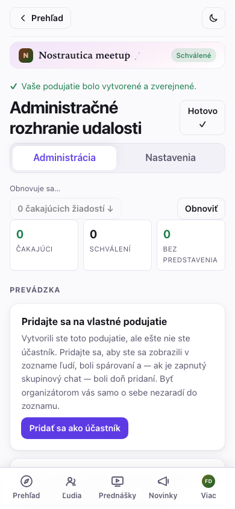

### Prehľadový pás

Navrchu Administrácie, pred akýmkoľvek detailom o jednotlivcoch, kompaktný
**prehľad** ukáže stav celého podujatia na jeden pohľad: počty čakajúcich /
schválených / bez predstavenia, či sú v poriadku párovanie, koordinátor a
fakturácia, a čokoľvek, čo si naozaj vyžaduje vašu pozornosť (zlyhané úlohy,
prednášky čakajúce na kontrolu), zobrazené nad bežným detailom, nie
zapadnuté v ňom. Pod ním **vyhľadávacie pole a filter** naraz zúžia frontu
žiadostí aj zoznam schválených — podľa mena, alebo podľa stavu (čaká,
schválený, bez predstavenia, spracovanie zlyhalo, poslaná prednáška) —
takže pri 200-člennom podujatí nemusíte rolovať, aby ste našli toho
jedného, kto vám napísal e-mail:

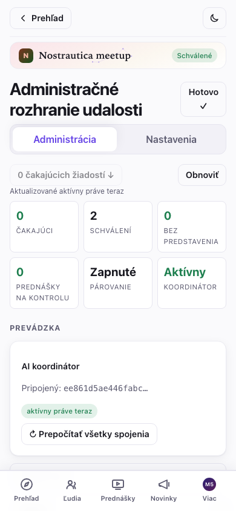

Klepnutím na riadok ktoréhokoľvek človeka otvoríte **detailný panel** — jeho
odoslaný profil, médiá a prevádzkovú históriu (stav koordinátora, odoslané
prednášky) — bez opustenia zoznamu.

Na zdieľanie máte dva druhy odkazov:

- **Otvorený odkaz na podujatie** (`…#/e/<podujatie>/join`, zobrazený bližšie k spodku s tlačidlom **Kopírovať pozývací odkaz**) — ktokoľvek si môže pozrieť verejnú stránku podujatia a požiadať o pripojenie. Dajte ho na svoj web alebo sociálne siete.
- **Pozývacie kódy** — jednorazové odkazy, ktoré držiteľa automaticky schvália *keď je pripojený koordinátor*. Nastavte počet a klepnite na **Vygenerovať**; dostanete jeden odkaz + QR kód na kód. Pošlite jeden na osobu, alebo vytlačte QR kódy. Kód sa nesie vo fragmente URL a nikdy sa nedostane na server — s každým odkazom zaobchádzajte ako s lístkom.

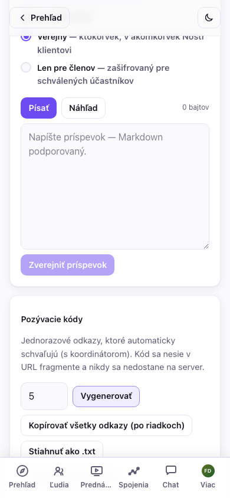

Viac než pár kódov sa už nepohodlne rozdáva odkaz po odkaze — **Kopírovať
všetko** / **Stiahnuť** vezmú všetky vygenerované odkazy ako obyčajný text
pre hromadnú korešpondenciu a **Vytlačiť pozývací hárok** rozloží po jednom
QR kóde na kód, viac na stránku, pripravené na rozstrihanie a rozdanie pri
dverách.

## 4. Schvaľovanie účastníkov

Žiadosti o pripojenie sa objavujú v sekcii **Žiadosti o pripojenie** — každá zobrazuje meno osoby, krátke id, jej zručnosti, značku **pozvánka**, ak použila kód, a značku 🎥, ak už nahrala predstavenie. Tlačidlo „N čakajúcich žiadostí ↓" navrchu vás tam presunie.

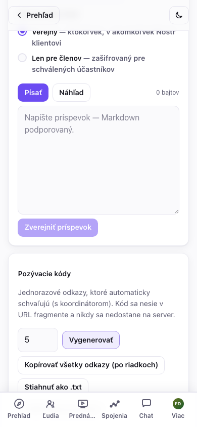

Klepnite na **Schváliť** pri ľuďoch, ktorých chcete vpustiť po jednom, alebo
na **Schváliť všetky (N)**, aby ste prešli všetkých čakajúcich naraz.
Hromadné schvaľovanie hlási výsledok pre každého jednotlivo — v poradí
frontu → zverejňuje sa → potvrdené, alebo zlyhalo —, takže výpadok
pripojenia u jedného človeka nikdy neskryje, či prešlo aj ostatných deväť;
súhrnný riadok („N schválených, M treba zopakovať") to na konci zhrnie a
každé zlyhanie má vlastné tlačidlo **Skúsiť znova**, namiesto toho, aby ste
museli opakovať celú dávku.

Nie každý čakajúci potrebuje áno alebo nie hneď teraz: **Zamietnuť** žiadosť
lokálne skryje (účastník sa to nedozvie a dá sa to vrátiť späť z malého
pruhu „N zamietnutých"), a **Nechať čakať** ju len označí ako
prezretú bez toho, aby ste sa museli rozhodnúť — obe sú len vaše lokálne
poznámky, nie akcia v protokole, takže si to môžete kedykoľvek rozmyslieť.

Schválení ľudia sa presunú do sekcie **Schválení**. Každá schválená karta má **Spracovať znova** (znovu zverejní záznam v adresári / prepočíta spojenia) a **Odobrať**.

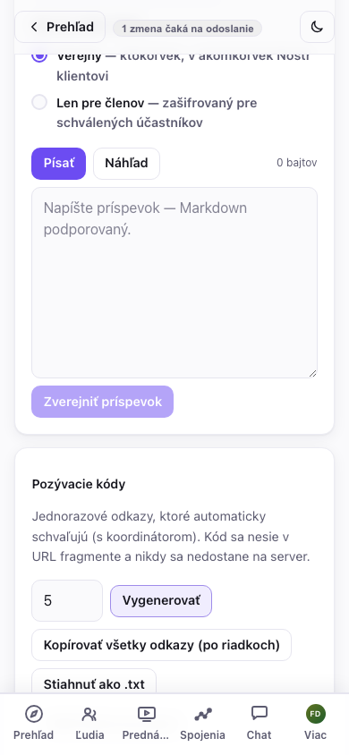

Schválení účastníci získajú prístup k zašifrovanému zoznamu účastníkov,
predstavovacím videám ostatných a (s pripojeným koordinátorom) svojim
spojeniam. Schvaľovanie funguje rovnako bez ohľadu na to, či je pripojený
koordinátor; jeho pripojenie (§5) sa stále oplatí kvôli automatickému
schvaľovaniu a spojeniam, už však nie je nutné len na to, aby fungovalo
manuálne schvaľovanie.

Jedna drobnosť bez pripojeného koordinátora: ak si účastník po schválení
upraví vlastný napísaný text predstavenia, ostatní účastníci ho uvidia až
vtedy, keď jeho záznam tu v zozname Ľudia **spracujete znova** — v tomto
konkrétnom prípade sa to nešíri samo.

### Odobratie niekoho

Klepnite na **Odobrať** pri schválenej karte. Dostanete potvrdenie vysvetľujúce dôsledok:

> *„Odobrať {meno}? Stratí prístup ku všetkému novému. To, čo už videl, sa vziať späť nedá."*

Potvrdenie automaticky otočí kľúč podujatia pre všetkých ostatných, takže odobratá osoba nedokáže dešifrovať nič zverejnené od tohto bodu ďalej. To, čo už videla, sa nedá „odvidieť" — ak si nie ste istí, odoberte skôr.

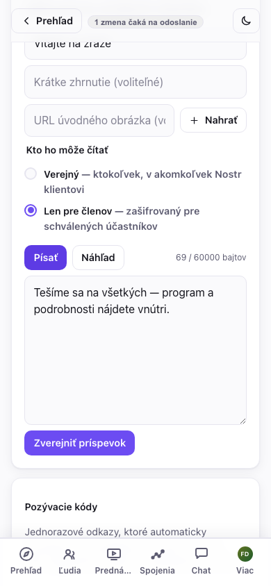

## 5. Pripojenie AI koordinátora (párovanie)

Koordinátor je malá služba, ktorá prepisuje predstavovacie videá, zostavuje profil každého účastníka a počíta, kto by mal koho stretnúť. Bez neho podujatie stále plne funguje — zoznam účastníkov, videá, sledovania — len bez automatických spojení a pozývacie odkazy potrebujú vaše manuálne schválenie.

Vybrať si ho môžete rovno na formulári pri vytváraní (§2), aby bežal od začiatku, alebo ho pripojiť neskôr — rovnaký zoznam, len na inom mieste: pri existujúcom podujatí je to v **Administrácia → Nastavenia → AI koordinátor**, nie v Administrácii (tá karta je pre veci, ktoré robíte opakovane; pripojenie koordinátora je jednorazové nastavenie). Tak či onak si **vyberiete koordinátora zo zoznamu** — každý sa na Nostri ohlasuje svojím menom, funkciami, zverejnením ochrany súkromia (ktoré kroky AI opúšťajú zabezpečenú enklávu) a svojím cenníkom (referenčný koordinátor je **Zdarma**). Klepnite na **Použiť tohto koordinátora**:

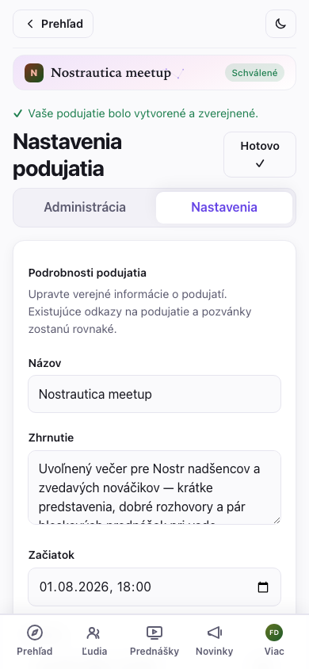

Chcete prevádzkovať vlastného, alebo vám bol daný konkrétny? Rozbaľte **Alebo vložte npub koordinátora (pokročilé)** a namiesto toho vložte jeho verejný kľúč. Tak či onak uvidíte potvrdenie:

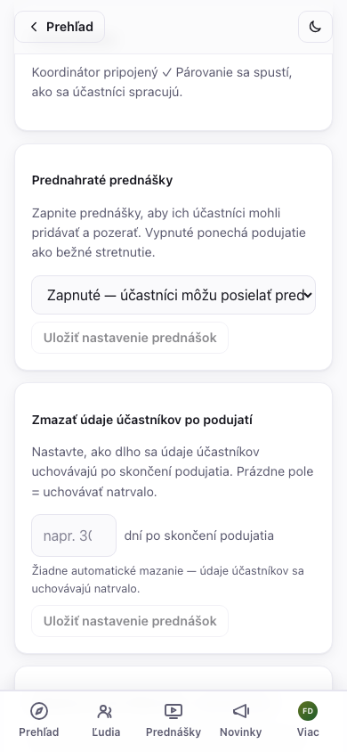

> **Platení koordinátori.** Koordinátor môže byť spoplatnený (náklady na AI párovanie rastú s počtom účastníkov), takže záznam môže zobrazovať cenu alebo bezplatnú úroveň (napr. „do 20 účastníkov zadarmo"). Ak je niekedy potrebná platba, obrazovka Nastavení zobrazí banner **Vyžaduje sa platba** s odkazom na platbu — súčasný referenčný koordinátor je zdarma.

Koordinátor nemôže podpisovať ako podujatie ani meniť verejné záznamy podujatia, konfigurácie či pozvánok, pretože nikdy nedostane `E_id`. Po pripojení však drží `E_inbox` a ECK: číta prihlášky a médiá, pri platných pozvánkach môže vydať delegované granty `21602`, publikuje adresár, zoznam účastníkov, spojenia, prednášky a stav a spravuje experimentálny Marmot chat. Vyberte si operátora, ktorému dôverujete s touto právomocou. Na karte **Administrácia** sa objaví tlačidlo **↻ Prepočítať všetky spojenia** (je to opakovaná akcia, nie nastavenie); použite ho po nápore nových účastníkov.

### Výmena alebo odpojenie koordinátora

Nie ste spokojní s tým, ktorého ste si vybrali, alebo za neho už nechcete
platiť? Na **Nastavenia → AI koordinátor** vám **Vymeniť** otvorí ten istý
zoznam na výber (alebo pole na npub) na prepnutie na iného koordinátora —
otočí sa tým kľúč podujatia a novému koordinátorovi sa udelí grant; starý
odvtedy stráca prístup. **Odpojiť** ho odstráni úplne, bez náhrady.

Oboje je pre koordinátora, ktorého opúšťate, nezvratné: pri každom pripojení,
výmene alebo odpojení aplikácia zvýši interné číslo inštalačnej generácie a
koordinátori (vrátane poctivých, ktorí si kontrolujú vlastný stav) dôverujú
vždy len *aktuálnej* generácii — starý grant sa už nedá prehrať späť do
platnosti. Odpojenie konkrétne znamená:

- **Párovanie sa zastaví**, kým nepripojíte iného koordinátora.
- **Správa chatu ostane bez majiteľa**, ak ste mali zapnutý skupinový chat —
  nikto aktívne nepridáva nových členov do zašifrovanej miestnosti, kým sa
  ujme iný koordinátor (existujúci členovia si prístup zachovajú; pozri
  poznámku o organizátorských zariadeniach v §6.5).
- Starší obsah zostáva presne tak čitateľný, ako bol vždy — odpojenie
  spätne nič neskrýva, len zastaví budúce spracovanie.

### Pripojenie alebo odpojenie počas podujatia

Obe operácie sú bezpečné aj počas bežiaceho podujatia, ale reštart
koordinátora zahodí to, čo práve spracúval v danom okamihu — logika
opakovania úloh to obnoví, ale ak aktívne beží podujatie, je ohľaduplnejšie
voči účastníkom urobiť takúto zmenu medzi nápormi spracovania (hneď po tom,
čo sa vlna nových príchodov upokojí), nie práve vo chvíli, keď niekomu
odchádza predstavenie.

> Spustenie koordinátora je samostatný, technický krok (malý démon, ktorý potrebuje `ffmpeg` a kľúč k poskytovateľovi LLM/prepisu reči). Pozrite si [`packages/coordinator/coordinator.example.toml`](../packages/coordinator/coordinator.example.toml), [operačnú príručku](COORDINATOR-OPERATOR-GUIDE.md) a README repozitára. Jeho relaye nasmerujte na ten istý relay, ktorý používa vaše podujatie.

## 6. Zverejňovanie príspevkov pre účastníkov

Karta **Príspevky podujatia** (v administrácii pod **Komunikácia**) je váš oznamovací kanál — „program je hotový", „zmena miesta konania", „dnešná večera je o…". Zadajte titulok a voliteľné zhrnutie/hlavičkový obrázok, napíšte text (**funguje Markdown** — nadpisy, zoznamy, odkazy, tučné písmo) a vyberte, **kto ho môže čítať**:

- **Verejný** — vidí ho ktokoľvek s odkazom na podujatie, prihlásený aj neprihlásený. Ide o štandardné dlhé Nostr príspevky zverejnené pod identitou podujatia, takže sú viditeľné aj v iných Nostr čítačkách.
- **Len pre členov** — zašifrovaný pre vašich schválených účastníkov. Neschválení (aj verejnosť) vidia iba zámok a výzvu „pripojte sa k podujatiu a prečítajte si toto", nikdy obsah. Použite to na adresu afterparty, kód od dverí, čokoľvek, čo má zostať vnútri miestnosti.

Klepnite na **Zverejniť príspevok**. Viditeľnosť je po zverejnení pevná (text môžete neskôr upraviť, ale verejný príspevok sa potichu nedá prepnúť na len pre členov a naopak). Priamo z výberu v editore môžete tiež vložiť odkaz na existujúci príspevok a pripnúť príspevok navrch stránky podujatia.

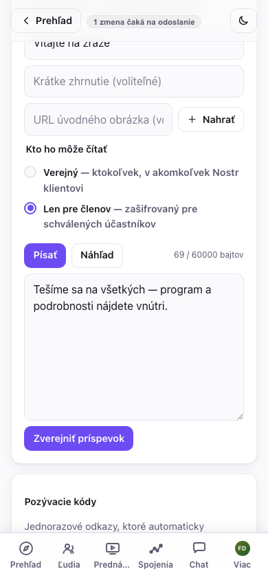

Verejné príspevky sa zobrazujú na **stránke podujatia** pre každého; príspevky len pre členov sa schváleným účastníkom zobrazujú v **Novinkách** a v pruhu „Posledné" na **Prehľade** podujatia, označené visiacim zámkom. Takto vyzerá zámok príspevku len pre členov účastníkovi, ktorý sa ešte nepripojil:

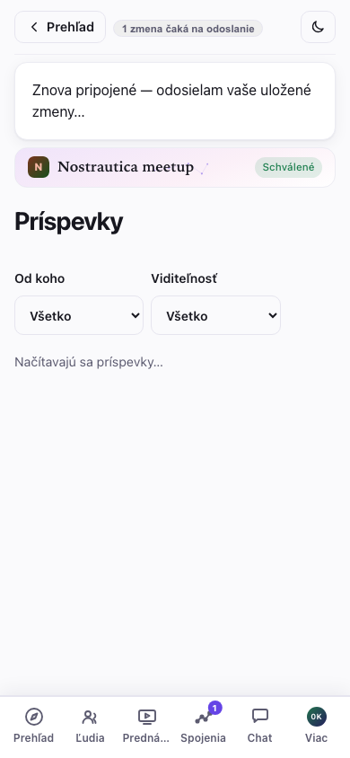

### Prispôsobenie stránky podujatia a jej vzhľadu

V **Administrácia → Nastavenia** sú ešte dva ovládacie prvky:

- **Stránka podujatia** (kind 31608) — namiesto predvoleného rozloženia si zostavíte vlastné menu a usporiadate sekcie (ktoré príspevky sa kde zobrazujú) na verejnej stránke podujatia. Poradie meníte pomocou tlačidiel ↑/↓.
- **Vzhľad** (kind 31609) — vložíte vlastné CSS a naladíte vzhľad stránok *tohto podujatia*. Pred **Zverejnením vzhľadu** máte živý **Náhľad**; opustenie administrácie bez zverejnenia obnoví všetkým posledný *zverejnený* vzhľad, ale vaše neodoslané CSS sa uloží ako koncept a po návrate sa v editore obnoví (s tlačidlom Zahodiť, ktorým ho zrušíte), takže odchod z obrazovky už nepríde o rozpracovanú prácu — to isté platí pre neodoslaný príspevok podujatia a neuložené úpravy profilu. Vrství sa nad vstavaným farebným nádychom aplikácie pre dané podujatie, takže stačí málo. (Vkladajte len CSS, ktoré ste napísali sami alebo ktorému dôverujete — štýluje stránku každému účastníkovi. Poznámka: váš vzhľad platí naprieč stránkami podujatia *okrem* zopár trás, ktoré zobrazujú citlivé údaje — odovzdávanie zariadenia chatu a obrazovky pozývaní/koordinátora v administrácii sa zámerne vykresľujú bez neho, takže nepriateľský vzhľad sa na týchto konkrétnych obrazovkách nedá zneužiť na vylákanie kľúčov či pozývacích kódov.)

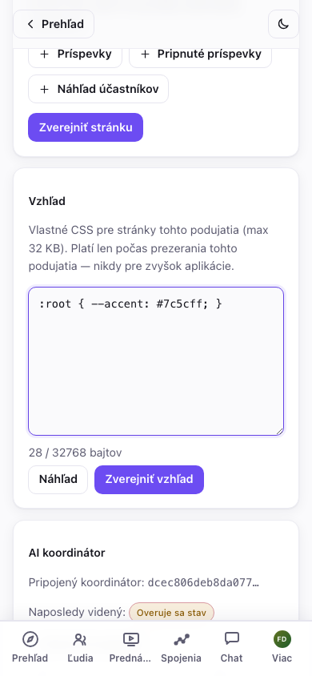

**Nie ste si istí, ako vaše zmeny vyzerajú niekomu, kto ešte nie je vnútri?**
Menu podujatia má prepínač **Zobraziť ako návštevník** — skryje všetko, čo
je len pre členov (uzamknuté príspevky, sekcie a položky menu len pre
členov), takže vidíte presne to, čo vidí cudzí človek s odkazom, s
opúšťacím pruhom na okamžitý návrat do bežného organizátorského pohľadu.
Zámerne neexistuje ekvivalentný režim „zobraziť ako člen" — váš vlastný
organizátorský pohľad *je* pohľadom člena pre všetko, čo nie je špecifické
pre návštevníka.

## 6.5 Prednášky a skupinový chat (obe novinky, obe voliteľné)

**Prednahraté prednášky.** V **Administrácia → Nastavenia → Prednahraté prednášky** to prepnite na *Zapnuté* (alebo *Najprv prednahraté*, čo v navigácii účastníkov posunie Prednášky pred Ľudí — vhodné pre formát „pozrite si vopred, stretnite sa na mieste") a **Uložte**. Schválení účastníci potom môžu posielať krátke prednášky — nahraté v prehliadači, nahraté ako súbor, alebo zadané ako neverejná **YouTube / .mp4 URL** (vhodné pre prednášky príliš veľké na nahranie; koordinátor tieto nikdy nesťahuje, takže URL prednášky sú len na sledovanie).

Všimnite si, že **prednášky už štandardne nevstupujú do spájania**: rečník pri každej prednáške zvolí, či zaškrtne *„Spracovať túto prednášku pre spájanie?"*. Majte to na pamäti, ak sa odoslaná prednáška neobjaví v zdôvodnení niečích spojení — to je očakávané, pokiaľ sa rečník neprihlásil (a pri URL prednáškach sa to nestane nikdy). Šetrí to náklady na prepis prednášok, ktoré nikto nechcel spájať.

Odoslané prednášky sa samé nezverejnia. Karta **Moderovanie prednášok** nižšie v **Administrácii** zobrazuje všetko, čo čaká na kontrolu — pri každej klepnite na **Ukážka**, potom ju buď **Zverejnite**, aby si ju účastníci mohli pozrieť, alebo **Zamietnite**. Kým to tu neurobíte, nikto okrem vás nič, čo účastník pošle, neuvidí (zverejnenie navyše potrebuje pripojeného koordinátora, rovnako ako zvyšok administrácie). Vyhľadávanie/filter v Ľuďoch (§3) má filter **Poslaná prednáška**, takže sa na rušnom podujatí viete presunúť rovno k tým, čo na vás čakajú, bez rolovania celým zoznamom.

**Skupinový chat (Marmot, experimentálne).** V **Administrácia → Nastavenia** prepnite **Skupinový chat** a uložte — potrebuje pripojeného koordinátora (koordinátor prevádzkuje zašifrovanú skupinu: pridáva ľudí pri schválení, odoberá ich pri odobratí). Keď je zapnutý, schválení účastníci dostanú záložku **Chat**: jedna end-to-end šifrovaná miestnosť pre celé podujatie, oddelená od súkromných správ — bežná konverzácia, ktorá beží, bez čohokoľvek, čo by si museli sami nastavovať, a každé zariadenie, na ktorom ho otvoria, sa pripojí automaticky (podrobnosti za jednotlivé zariadenia, ktoré vidia účastníci, sú v príručke účastníka, časť „Skupinový chat").

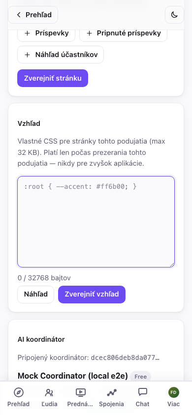

Toto je zatiaľ v ranej fáze: pripojenie do skupiny môže na strane servera chvíľu trvať aj po zapnutí, a v rozhraní je zámerne označené ako *Experimentálne* — zatiaľ sa naň nespoliehajte ako na jediný spôsob, ako sa dostať k účastníkom počas podujatia. Príspevky (§6) zostávajú spoľahlivým kanálom.

**Tichá poistka.** Skupinu deň čo deň spravuje koordinátor, ale každé
zariadenie, ktoré si k chatu pripojí **schválený organizátor**, sa
automaticky povýši aj na spoluadministrátora — bez akéhokoľvek prihlasovania,
jednoducho sa to stane. Ak sa niekedy stratí databáza vášho koordinátora bez
zálohy (pozri [operačnú príručku](COORDINATOR-OPERATOR-GUIDE.md#9-recovery-mls-admin-and-detach)),
vaše vlastné zariadenia stále dokážu pridávať alebo odoberať členov a
udržať miestnosť v chode, kým si zaobstaráte náhradného koordinátora.
Udržiavanie aktuálnych záloh koordinátora zostáva skutočným plánom
obnovy; toto je záchranná sieť pre prípad, že tento plán zlyhá.

## 7. Počas podujatia

- **Zoznam účastníkov sa dopĺňa naživo** — schválení účastníci sa objavujú, ako sa pripájajú; zoznamy spojení sa obnovujú, ako sa spracúvajú nové predstavenia.
- **Prepočítanie spojení** — po nápore nových príchodov klepnite na **↻ Prepočítať všetky spojenia** (vyžaduje koordinátora).
- **Spoluorganizátori** — v **Administrácia → Nastavenia → Spoluorganizátori** pridajte niekoho podľa jeho npub a zdieľajte plnú organizátorskú kontrolu (úprava podujatia, schvaľovanie, správa koordinátora). Ich kľúče sú im zabalené ako darček; prístup získajú, keď nabudúce otvoria podujatie. Toto je zároveň vaša záchranná sieť, ak vám padne prehliadač.
- **Podnecujte predstavenia včas.** Spojenia existujú len pre ľudí, ktorí nahrali predstavenie — najlepšie, čo môžete pre kvalitu spojení urobiť, je dostať všetkých k nahratiu ešte pred začiatkom podujatia. Nahratie je pre účastníkov voliteľné a aplikácia im to aj hovorí, no oplatí sa na to tlačiť: nahraté predstavenie dá AI viac na prácu, umožní ostatným účastníkom vopred zistiť, či by si s daným človekom naozaj sadli, ešte skôr než k nemu podídu — párovanie nie je len o projektoch a zručnostiach, je to aj pocit, ktorý AI sama o sebe nedokáže zachytiť — a ak ide o video, pomôže ľuďom spoznať svoje spojenia naživo.

## Riešenie problémov a časté otázky

- **Čo vidia účastníci, kým nie sú schválení?** Iba verejnú stránku podujatia — názov, zhrnutie, dátumy, miesto a vaše zverejnené novinky. Zoznam účastníkov, videá a spojenia sú zašifrované pre schválených účastníkov.

- **Otvoril(a) som podujatie na inom zariadení a nie je tam tlačidlo administrácie.** Prihláste sa s tou istou identitou (vložte tajný kľúč, ktorý ste si zálohovali pri vytváraní účtu) a znova otvorte podujatie — organizátorský prístup ku každému podujatiu, ktoré ste vytvorili, sa automaticky obnoví z tohto jediného kľúča, žiadna samostatná záloha podujatia netreba. Vaše kľúče podujatia sa načítajú z relayov v okamihu prihlásenia, takže na novom zariadení dajte aplikácii pár sekúnd, kým usúdite, že to nefunguje. (Pridanie **spoluorganizátora** z pôvodného zariadenia, s npub nového zariadenia, je stále najrýchlejšia možnosť, ak máte pôvodné zariadenie poruke.)

- **Pozývací odkaz niekoho automaticky neschválil.** Automatické schvaľovanie potrebuje pripojeného *a bežiaceho* koordinátora. Bez neho žiadosti z pozvánok stále prídu do vášho zoznamu **Žiadosti o pripojenie** — schváľte ich tam. (Budú mať značku **pozvánka**.)

- **Žiadosť o pripojenie sa nezobrazuje.** Klepnite na **Obnoviť** v hlavičke administrácie — žiadosti sa načítavajú na požiadanie. Ak sa stále neobjaví, účastník môže mať nestabilné pripojenie; požiadajte ho, nech znova otvorí odkaz na podujatie a žiadosť odošle znova.

- **Ako premietnem zoznam účastníkov / tabuľu spojení / prehľad administrácie
  na mieste konania?** Otvorte príslušnú stránku v prehliadači premietacieho
  počítača, prihlásení ako schválená identita (vy sami). Sú to bežné
  stránky — dajte ich na celú obrazovku:

  

- **Môžem podujatie po vytvorení upraviť?** Áno. V **Administrácia → Nastavenia → Podrobnosti podujatia** upravíte základné polia — názov, zhrnutie, začiatok/koniec, miesto aj ikonu/banner — a znova ich zverejníte. (Opätovné zverejnenie sa riadi monotónnym pravidlom poradia protokolu, takže úprava nikdy neprehrá súbeh v tej istej sekunde.) Novinky môžete zverejňovať a upravovať voľne a podujatie môžu spravovať aj spoluorganizátori. Pri zmene programu alebo miesta sa aj tak oplatí zverejniť novinku, aby účastníci dostali upozornenie, nielen ticho zmenené pole.

- **Koľko ma to bude stáť?** Štandardne nič — referenčný koordinátor je
  zadarmo a všetko, čo koordinátora nepotrebuje (zoznam účastníkov, videá,
  príspevky, manuálne schvaľovanie), nemá náklady nikdy. Ak pripojíte
  koordinátora, ktorého operátor si účtuje poplatok, uvidíte to jasne na
  jeho zázname a — ak sa niekedy spustí fakturácia — banner **Vyžaduje sa
  platba** s odkazom na platbu v Nastaveniach, nikdy prekvapivý poplatok.
