# Nostrautica — Event Organizer Guide

Nostrautica is an event app built around one idea: **the point of your event
is who meets whom**. Attendees record short intro videos; an optional AI
coordinator analyzes them and tells every attendee who they should talk to
and why. This guide takes you from nothing to a running event.

## What you'll do

1. Create your identity (once).
2. Create the event.
3. Share the event — open link, invite codes, or both.
4. Approve attendees (or let invite codes auto-approve them).
5. Optionally attach an AI coordinator for matchmaking.
6. Post updates, customize your event page, and run the event.

Everything runs in your browser. There is no server to set up — the app
stores event data, encrypted, on the open Nostr network. Your browser holds
the event's keys, so **use one browser you'll keep** (and back up your
identity when prompted).

> **A note on how the app is laid out.** Once you're inside an event, the bottom
> bar is *event-scoped* — **Overview**, **People**, **Matches**, **Updates**, and
> **More** all act on the event you're in, with a compact header showing the event's
> name and your status. Your global stuff (all your events, messages, settings, your
> identity) lives under **More**. As the organizer you also get **Manage event** in
> that menu, which opens the admin console described in §3.

## 1. Create your identity

Open the app. On the welcome screen, type your name and tap **Create my
identity** (you can add a photo too). No email, no password — the account is
created instantly. If you already use Nostr, tap **Already on Nostr? Sign in**
and use your key, browser extension, or remote signer instead.

> **Tip:** you don't have to do this as a separate step — if you go straight to
> creating an event while logged out, the app makes your organizer identity as
> part of the same submit.

When your identity is created you'll be shown a **backup card**. Do it now:
tap **Copy my secret key** and paste it somewhere safe (a password manager).
Anyone with that key *is* you; without it, a lost browser profile means a lost
event. "More ways to back up" offers an emailed recovery link or a
password-protected file.

## 2. Create the event

Choose **Create an event** and fill in the form:

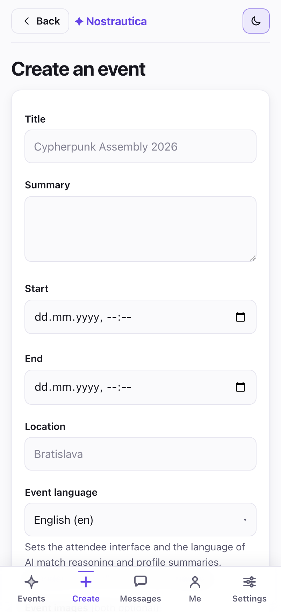

- **Title, summary, start/end, location** — shown publicly to anyone with the link.
- **Approval** — how people get in:
  - *Manual review*: every request waits for your approval.
  - *Invite codes only*: an invite link gets you in; no other way.
  - *Invite codes + manual*: invite links auto-approve (with a coordinator
    attached); people without a code wait for you. **Recommended for most events.**
- **Event language** — see below.
- **AI matchmaking** — set to *On* if you plan to attach a coordinator (§5).
  You can attach the coordinator later; leave the setting on now.
- **Join as a participant yourself** — checked by default: you're enrolled
  like any attendee, so the first person who joins sees at least you in
  **People** instead of an empty list (and you can be matched too, once you
  record an intro). Your name and bio are visible to approved attendees only;
  uncheck it if you'd rather organize without appearing in the roster.
- **Advanced** (collapsed) — upload an event icon and banner (a design is
  generated from the title otherwise) and set the intro-video length cap.

### Event language

Pick the language your event runs in. Start typing to search — by language name
in your own language *or* by its two-letter code (type "slov" or "sk" to find
Slovak). Your own language, the ones your browser prefers, and English/Slovak/
Czech are pinned to the top; everything else follows alphabetically.

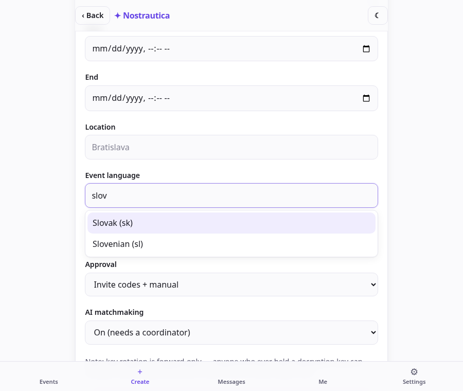

The language does three things. It sets the **default interface language** for
attendees who open your event (they can still switch it in Settings). It sets the
language the AI writes in: **match reasoning and profile summaries are always in
your event language**, no matter what language each attendee actually speaks or
records in — someone can record their intro in English at a Slovak event and
everyone still reads why-you-should-meet-them in Slovak. And when an attendee
writes their bio in a different language, the coordinator **publishes a
translation into your event language** so the rest of the room can read it — the
person's original text is always kept and shown too. English is the default; leave
it as-is for an English event.

(You never have to re-run anything for this: when an attendee updates their intro,
the system automatically recomputes only the matches that person is part of.)

Note the copy under the form: **key rotation is forward-only** — anyone who
ever held a decryption key can decrypt content that was published while that
key was current. Revoking someone (§4) protects *future* content, not past.

After creating, you get a **shareable link** and a next-steps checklist.
Capture the link — every attendee uses it.

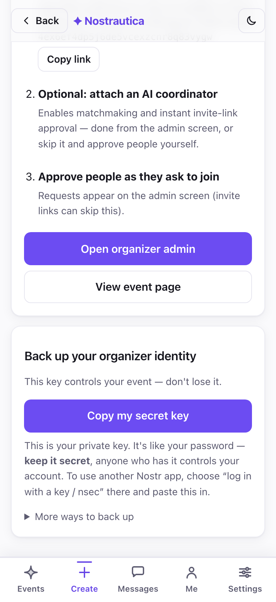

## 3. Open the admin screen and share

Tap **Open organizer admin** (also reachable any time from **More → Manage
event**). This is your control panel, and it's ordered the way a live event
actually runs — **operations first**: a status line (pending count, with a
one-tap jump) and the **join requests** sit at the very top, so admitting people
never means scrolling past setup. Below that come the things you touch less
often — **Communicate** (posts/updates), **People** (approved attendees), and
**Event setup** (invite codes, coordinator, co-organizers, event page,
appearance). Fresh event, no requests yet:

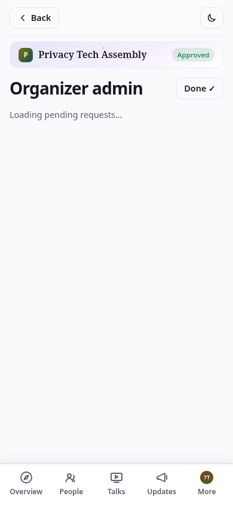

You have two kinds of links to share:

- **The open event link** (`…#/e/<event>/join`, shown near the bottom with a
  **Copy invite link** button) — anyone can view the public event page and
  request to join. Put it on your site or socials.
- **Invite codes** — single-use links that auto-approve the holder *when a
  coordinator is attached*. Set a count and tap **Generate**; you get one link
  + QR per code. Send one per person, or print the QR codes. The code rides the
  URL fragment and never touches a server — treat each link like a ticket.

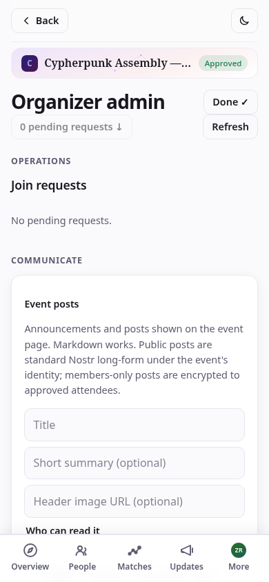

## 4. Approve attendees

Join requests appear in the **Join requests** section — each shows the
person's name, a short id, their skills, an **invite** badge if they used a
code, and a 🎥 badge if they've recorded an intro. The "N pending requests ↓"
button at the top jumps you there.

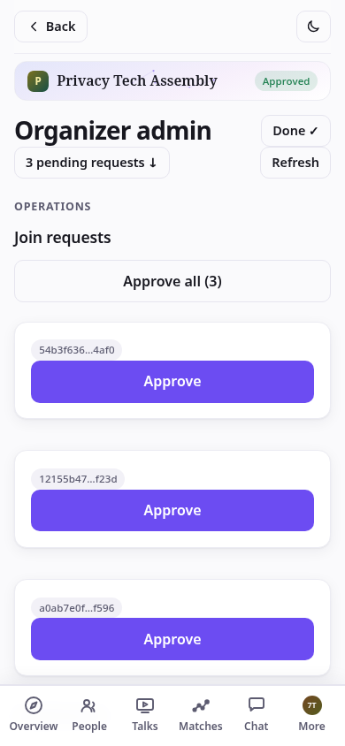

Tap **Approve** on the people you want in — or **Approve all (N)** when several
are waiting. Approved people move to the **Approved** section. Each approved
card has **Re-process** (re-publishes their directory entry / recomputes their
matches) and **Revoke**.

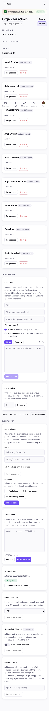

Approved attendees get access to the encrypted roster, other people's intro
videos, and (with a coordinator) their matches.

> **Known issue as of this pass (2026-07-16):** when an event has **no
> coordinator attached**, approving someone here does not currently reach
> their device — their own app keeps showing "waiting for approval" even
> though your admin screen shows them Approved, and they never see the
> roster/directory. It reproduces every time in testing. Attaching a
> coordinator (§5) sidesteps it — approval and grants
> route through the coordinator instead — so **attach a coordinator before
> your event if you can**, even one running in matching=off mode, until this
> is fixed.

### Removing someone

Tap **Revoke** on an approved card. You'll get a confirmation explaining the
consequence:

> *"Revoke {name}? They lose access to everything new. What they already saw
> can't be taken back."*

Confirming rotates the event key for everyone else automatically, so the
revoked person can't decrypt anything published from that point on. What they
already saw can't be unseen — revoke early if in doubt.

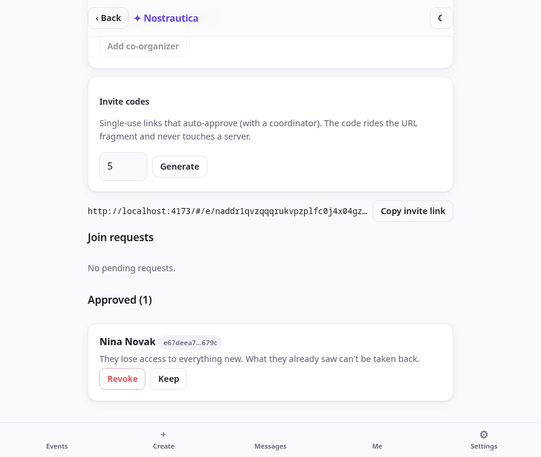

## 5. Attach the AI coordinator (matchmaking)

The coordinator is a small service that transcribes intro videos, builds a
profile of each attendee, and computes who should meet whom. Without it, the
event still fully works — roster, videos, follows — there are just no automatic
matches, and invite links need your manual approval.

In the admin **AI coordinator** section you **pick a coordinator from the list**
— each announces itself on Nostr with its name, features, a privacy disclosure
(which AI steps leave the secure enclave), and its pricing (the reference one is
**Free**). Tap **Use this coordinator**:

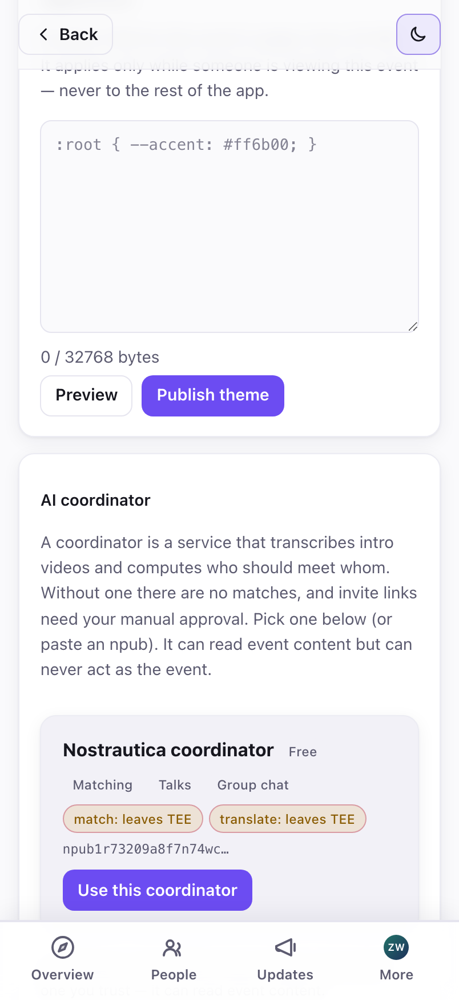

Prefer to run your own, or were given a specific one? Expand **Or paste a
coordinator npub (advanced)** and paste its public key instead. Either way you'll
see it confirmed:

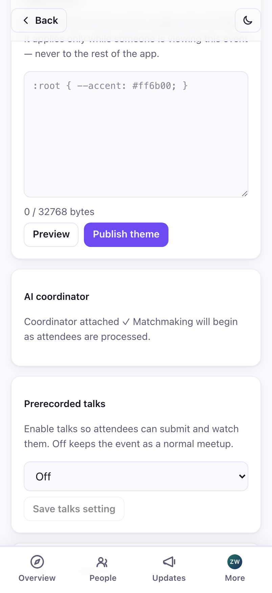

> **Paid coordinators.** A coordinator may charge (AI matchmaking costs scale
> with attendee count), so a listing can show a price or a free tier (e.g.
> "up to 20 attendees free"). If payment is ever needed, the admin screen shows
> a **Payment required** banner with a checkout link — the current reference
> coordinator is free.

The coordinator only ever *reads* event content — it can never act as the event
or approve people beyond the rules you set. Once attached, an **↻ Recompute all
matches** button appears; use it after a burst of new attendees.

> Running the coordinator is a separate, technical step (a small daemon that
> needs `ffmpeg` and an LLM/STT provider key). See
> [`packages/coordinator/coordinator.example.toml`](../packages/coordinator/coordinator.example.toml)
> and the repo README. Point its relays at the same relay your event uses.

## 6. Post to your attendees

The **Event posts** card (under **Communicate** in admin) is your announcement
channel — "schedule is live", "venue change", "tonight's dinner is at…". Give it
a title and an optional summary/header image, write the body (**Markdown works** —
headings, lists, links, bold), and pick **who can read it**:

- **Public** — anyone with the event link sees it, logged in or not. These are
  standard Nostr long-form posts published under the event's identity, so they're
  visible in other Nostr readers too.
- **Members-only** — encrypted to your approved attendees. Non-members (and the
  public) see only a lock and a "join the event to read this" prompt, never the
  content. Use it for the after-party address, the door code, anything you want
  to stay inside the room.

Tap **Publish post**. The visibility is fixed once published (you can edit the
text later, but a public post can't be quietly turned members-only or vice
versa). You can also drop a link to an existing post straight from the composer's
picker, and pin a post to the top of the event page.

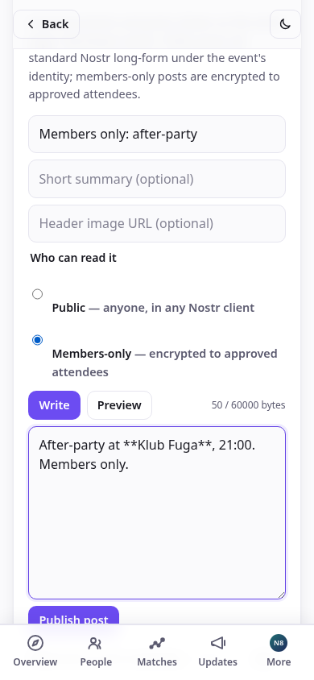

Public posts render on the **event page** for everyone; members-only posts show
up for approved attendees in **Updates** and in the event's **Overview** "Latest"
strip, marked with a lock badge. Here's the members-only lock as an attendee who
hasn't joined yet sees it:

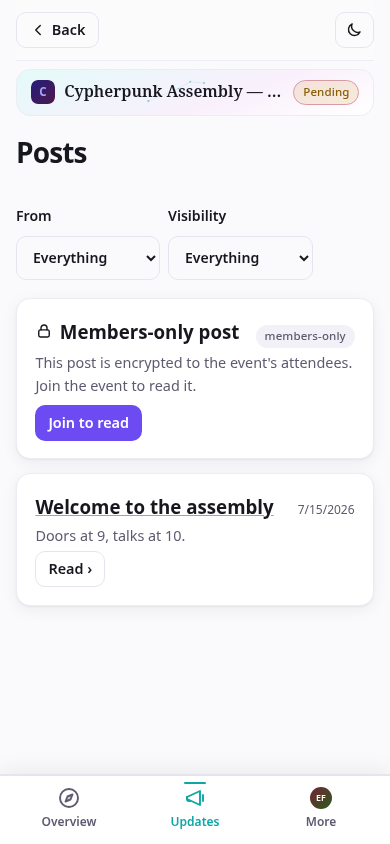

### Customize the event page and its look

Two more controls live in **Event setup**:

- **Event page** (kind 31608) — build a custom menu and arrange sections
  (which posts show where) for the public event page, instead of the default
  layout. Reorder with the ↑/↓ controls.
- **Appearance** (kind 31609) — paste custom CSS to theme *this event's* pages.
  There's a live **Preview** before you **Publish theme**; leaving admin without
  publishing restores the last saved theme. It sits on top of the app's built-in
  per-event colour wash, so a little goes a long way. (Only paste CSS you wrote
  or trust — it styles the page for every attendee.)

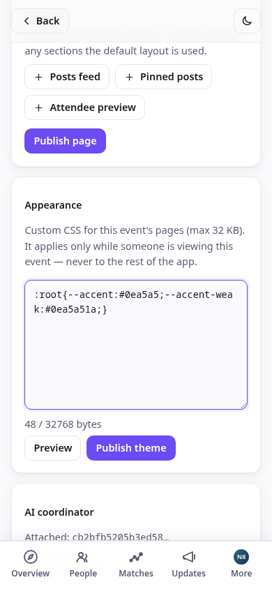

## 6.5 Talks and group chat (both new, both optional)

**Prerecorded talks.** In **Event setup → Prerecorded talks**, switch it *On*
(or *Prerecord-first*, which puts Talks ahead of People in attendees' nav —
good for a "watch ahead, meet at the venue" format) and **Save**. Approved
attendees can then submit short talks from the same composer used for intros.

> **Known gap as of this pass (2026-07-16):** there is currently no screen in
> admin to review or publish a submitted talk — attendees can submit, but
> nothing in the app lets you move a talk from "submitted" to "visible to
> attendees." Every talk you enable this round will need that moderation step
> once it ships; track it in the gap report (G-1) before promising this
> feature to attendees.

**Group chat (Marmot, experimental).** In **Event setup**, toggle **Group
chat** and save — it needs a coordinator attached (the coordinator operates
the encrypted group: adding people as they're approved, removing them on
revoke). Once on, approved attendees get a **Chat** tab: a single
end-to-end-encrypted room for the whole event, separate from 1:1 messages.

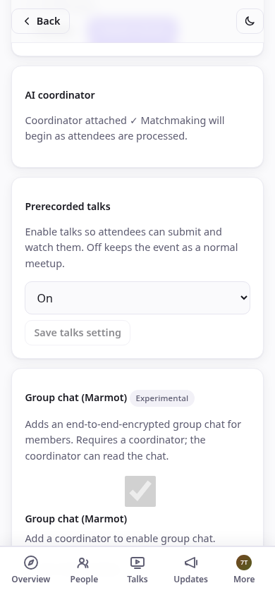

This is early: joining the group can take a little while server-side even
once toggled on, and it's marked *Experimental* in the UI on purpose — don't
lean on it as the only way to reach attendees during an event yet. Posts
(§6) remain the reliable channel.

## 7. During the event

- **Roster fills in live** — approved attendees appear as they join; match
  lists refresh as new intros are processed.
- **Recompute matches** — after a rush of arrivals, tap **↻ Recompute all
  matches** (coordinator required).
- **Co-organizers** — in the **Co-organizers** card, add someone by their
  npub to share full organizer control (edit event, approve, manage the
  coordinator). Their keys are gift-wrapped to them; they get access next time
  they open the event. This is also your safety net if your browser dies.
- **Encourage intros early.** Matches only exist for people who recorded an
  intro — the single best thing you can do for match quality is get everyone to
  record before the event starts.

## Troubleshooting & FAQ

- **What do attendees see before they're approved?** Only the public event page
  — title, summary, dates, location, and your posted updates. The roster,
  videos, and matches are encrypted to approved attendees.

- **I opened the event on another device and there's no admin button.** Sign in
  with the same identity (paste the secret key you backed up when you created
  the account) and reopen the event — as of this pass, organizer access to
  every event you created is automatically recovered from that one key alone,
  no separate event backup needed. It reads back your event keys from relays
  the moment you sign in, so give it a few seconds on a fresh device before
  concluding it didn't work. (Adding a **co-organizer** from the original
  device, using the new device's npub, is still the fastest option if you
  still have the original device handy.)

- **An invite link didn't auto-approve someone.** Auto-approval needs a
  coordinator attached *and running*. Without one, invite requests still arrive
  in your **Join requests** list — approve them there. (They'll carry an
  **invite** badge.)

- **A join request isn't showing up.** Tap **Refresh** in the admin header —
  requests are fetched on demand. If it still doesn't appear, the attendee may
  be on a flaky connection; ask them to reopen the event link and resubmit.

- **How do I project the roster / match board at the venue?** Open the event's
  attendee list on the projector's browser while logged in as an approved
  identity (yourself). It's a normal page — full-screen it.

- **Can I edit an event after creating it?** You can post updates and edit them
  freely. Co-organizers can also manage the event. Core fields (title, dates)
  aren't editable from this screen in the current build — post an update to
  communicate changes.
