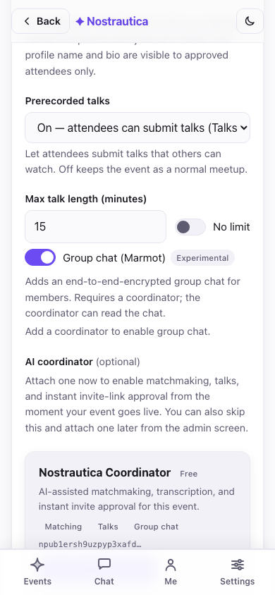
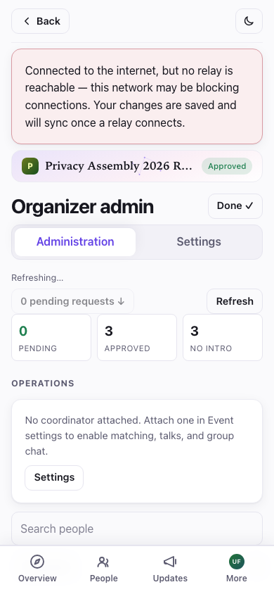
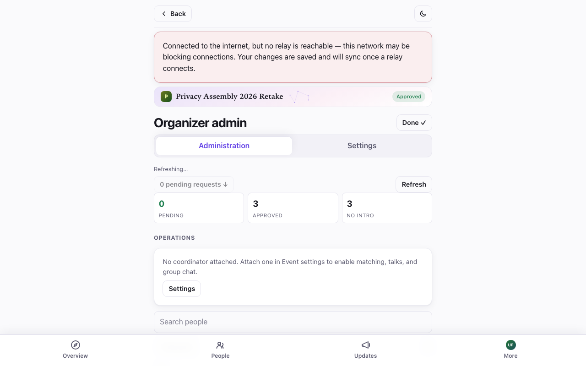

# Nostrautica — Event Organizer Guide

Nostrautica is an event app built around one idea: **the point of your event
is who meets whom**. Attendees record short intro videos; an optional AI
coordinator analyzes them and tells every attendee who they should talk to
and why. This guide takes you from nothing to a running event.

## What you'll do

1. Create your identity (once).
2. Create the event — optionally attaching an AI coordinator right there, or later.
3. Share the event — open link, invite codes, or both.
4. Approve attendees (or let invite codes auto-approve them).
5. Post updates, customize your event page, and run the event.

Everything runs in your browser. There is no server to set up — the app
stores event data, encrypted, on the open Nostr network. Your browser holds
the event's keys, so **use one browser you'll keep** (and back up your
identity when prompted).

> **A note on how the app is laid out.** Once you're inside an event, the bottom
> bar is *event-scoped* — **Overview**, **People**, **Matches**, **Updates**, and
> **More** all act on the event you're in, with a compact header showing the event's
> name and your status. Your global stuff (all your events, messages, settings, your
> identity) lives under **More**. As the organizer you also get **Manage event** in
> that menu, which opens the admin console described in §3.

## 1. Create your identity

Open the app. On the welcome screen, type your name and tap **Create my
identity** (you can add a photo too). No email, no password — the account is
created instantly. If you already use Nostr, tap **Already on Nostr? Sign in**
and use your key, browser extension, or remote signer instead.

> **Tip:** you don't have to do this as a separate step — if you go straight to
> creating an event while logged out, the app makes your organizer identity as
> part of the same submit.

When your identity is created you'll be shown a **backup card**. Do it now:
tap **Copy my secret key** and paste it somewhere safe (a password manager).
Anyone with that key *is* you; without it, a lost browser profile means a lost
event. "More ways to back up" offers an emailed recovery link or a
password-protected file.

## 2. Create the event

Choose **Create an event** and fill in the form:

- **Title, summary, start/end, location** — shown publicly to anyone with the link.
- **Approval** — how people get in:
  - *Manual review*: every request waits for your approval.
  - *Invite codes only*: an invite link gets you in; no other way.
  - *Invite codes + manual*: invite links auto-approve (with a coordinator
    attached); people without a code wait for you. **Recommended for most events.**
- **Event language** — see below.
- **AI matchmaking** — set to *On* if you plan to attach a coordinator (§5).
  You can attach the coordinator later; leave the setting on now.
- **AI coordinator** (optional) — pick one right here on the create form, the
  same discovery list described in §5, so an invite-code event can
  auto-approve and start matching from the moment it goes live. Skip it and
  attach one later from **Admin → Settings** if you'd rather decide after
  seeing how the event fills up — nothing else on this form depends on it.

  

- **Join as a participant yourself** — checked by default: you're enrolled
  like any attendee, so the first person who joins sees at least you in
  **People** instead of an empty list (and you can be matched too, once you
  record an intro). Your name and bio are visible to approved attendees only;
  uncheck it if you'd rather organize without appearing in the roster.
- **Advanced** (collapsed) — upload an event icon and banner (a design is
  generated from the title otherwise) and set the intro-video length cap.

### Event language

Pick the language your event runs in. Start typing to search — by language name
in your own language *or* by its two-letter code (type "slov" or "sk" to find
Slovak). Your own language, the ones your browser prefers, and English/Slovak/
Czech are pinned to the top; everything else follows alphabetically.

The language does three things. It sets the **default interface language** for
attendees who open your event (they can still switch it in Settings). It sets the
language the AI writes in: **match reasoning and profile summaries are always in
your event language**, no matter what language each attendee actually speaks or
records in — someone can record their intro in English at a Slovak event and
everyone still reads why-you-should-meet-them in Slovak. And when an attendee
writes their bio in a different language, the coordinator **publishes a
translation into your event language** so the rest of the room can read it — the
person's original text is always kept and shown too. English is the default; leave
it as-is for an English event.

(You never have to re-run anything for this: when an attendee updates their intro,
the system automatically recomputes only the matches that person is part of.)

Note the copy under the form: **key rotation is forward-only** — anyone who
ever held a decryption key can decrypt content that was published while that
key was current. Revoking someone (§4) protects *future* content, not past.

Configure a **retention window** in **Admin → Settings → Delete member data
after the event**. Enter a positive number of days, or leave it blank for
indefinite retention. Attendees see the declared period at join and on the
event page. Deletion is best-effort, not a guarantee if a relay ignores it.

After creating, you get a **shareable link**, a next-steps checklist, and a
**receipt** — each publishing step reported independently, so a partial
failure is obvious and retryable instead of silently missing:

The event itself always succeeds if you got this far. Two secondary steps can
fail independently on a bad connection — enrolling you as a participant, and
sending the coordinator its install grant if you picked one on the form — and
each gets its own **Retry** button right in the receipt rather than forcing
you to redo the whole form. A third line, **backup pending**, just means you
haven't saved your key yet (see step 1) — it isn't an error.

**Running this event again next month?** Once it exists, open it and use
**Duplicate event** from the event menu: a fresh Create form pre-filled from
this one's title, description, images, language, and settings (title becomes
"Copy of …") — you still review and submit it, and it becomes a brand-new
event with its own keys and an empty roster, not a copy of the data.

## 3. Open the admin screen and share

Tap **Open organizer admin** (also reachable any time from **More → Manage
event**). Your control panel is split into two tabs, so running the event day
to day never means scrolling past one-time setup:

- **Administration** — the tab you land on, and the one you'll return to most:
  a status line (pending count, with a one-tap jump), **join requests** at the
  very top so admitting people is never buried, invite-code generation, the
  approved-attendees list (revoke/re-process), talk moderation, and
  **Communicate** (posts/updates).
- **Settings** — the one-time-per-event stuff: the AI coordinator (§5), event
  page menu & layout, appearance/theme CSS, prerecorded talks mode, group
  chat, and co-organizers. If you picked a coordinator on the create form
  (§2), it's already showing as attached here.

Fresh event, no requests yet:

### The overview strip

At the top of Administration, before any per-person detail, a compact
**overview** puts the state of the whole event in one glance: pending /
approved / no-intro counts, whether matching, the coordinator, and billing
are healthy, and anything that actually needs your attention (failed jobs,
talks awaiting review) surfaced above the routine detail rather than buried
in it. Below it, a **search box and filter** narrow both the join-request
queue and the approved list at once — by name, or by status (pending,
approved, no intro, processing failed, talk submitted) — so a 200-person
event doesn't mean scrolling to find the one person who emailed you:

Tap anyone's row to open a **detail drawer** — their submitted profile, media,
and operational history (coordinator status, submitted talks) — without
leaving the list.

You have two kinds of links to share:

- **The open event link** (`…#/e/<event>/join`, shown near the bottom with a
  **Copy invite link** button) — anyone can view the public event page and
  request to join. Put it on your site or socials.
- **Invite codes** — single-use links that auto-approve the holder *when a
  coordinator is attached*. Set a count and tap **Generate**; you get one link
  + QR per code. Send one per person, or print the QR codes. The code rides the
  URL fragment and never touches a server — treat each link like a ticket.

More than a handful of codes gets tedious to hand out one link at a time —
**Copy all** / **Download** grab every generated link as plain text for a
mail-merge, and **Print invite sheet** lays out one QR per code, several to a
page, ready to cut up and hand out at the door.

## 4. Approve attendees

Join requests appear in the **Join requests** section — each shows the
person's name, a short id, their skills, an **invite** badge if they used a
code, and a 🎥 badge if they've recorded an intro. The "N pending requests ↓"
button at the top jumps you there.

Tap **Approve** on the people you want in one at a time, or **Approve all
(N)** to work through everyone waiting. Bulk approval reports each person's
outcome individually — queued → publishing → confirmed, or failed — so one
person's flaky connection never hides whether the other nine went through;
a summary line ("N approved, M need retry") wraps it up, and any failure
gets its own **Retry** rather than making you redo the batch.

Not everyone waiting needs a yes-or-no right now: **Reject** hides a request
locally (the attendee isn't notified, and it's undoable from a small "N
rejected" strip), and **Leave pending** just marks it reviewed without
committing either way — both are local bookkeeping for you, not protocol
actions, so they're free to change your mind about later.

Approved people move to the **Approved** section. Each approved card has
**Re-process** (re-publishes their directory entry / recomputes their
matches) and **Revoke**.

Approved attendees get access to the encrypted roster, other people's intro
videos, and (with a coordinator) their matches. Approving someone works the
same whether or not a coordinator is attached; attaching one (§5) is still
worthwhile for auto-approval and matches, just no longer required to make
manual approval work.

One rough edge without a coordinator attached: if an attendee updates their
typed intro text after you've already approved them, other attendees only
pick up the change once you **re-process** their entry from the People list
here — it doesn't propagate on its own in that specific case.

### Removing someone

Tap **Revoke** on an approved card. You'll get a confirmation explaining the
consequence:

> *"Revoke {name}? They lose access to everything new. What they already saw
> can't be taken back."*

Confirming rotates the event key for everyone else automatically, so the
revoked person can't decrypt anything published from that point on. What they
already saw can't be unseen — revoke early if in doubt.

## 5. Attach the AI coordinator (matchmaking)

The coordinator is a small service that transcribes intro videos, builds a
profile of each attendee, and computes who should meet whom. Without it, the
event still fully works — roster, videos, follows — there are just no automatic
matches, and invite links need your manual approval.

You can pick one right on the create form (§2) so it's live from the start, or
attach one later — same discovery list either way, just relocated: on an
existing event it's under **Admin → Settings → AI coordinator**, not
Administration (that tab is for things you do repeatedly; attaching a
coordinator is one-time setup). Either way you **pick a coordinator from the
list** — each announces itself on Nostr with its name, features, a privacy
disclosure (which AI steps leave the secure enclave), and its pricing (the
reference one is **Free**). Tap **Use this coordinator**:

Prefer to run your own, or were given a specific one? Expand **Or paste a
coordinator npub (advanced)** and paste its public key instead. Either way you'll
see it confirmed:

> **Paid coordinators.** A coordinator may charge (AI matchmaking costs scale
> with attendee count), so a listing can show a price or a free tier (e.g.
> "up to 20 attendees free"). If payment is ever needed, the Settings screen
> shows a **Payment required** banner with a checkout link — the current
> reference coordinator is free.

The coordinator cannot sign as the event or change public event/config/invite
records because it never receives `E_id`. Once attached, however, it receives
`E_inbox` and ECK custody: it reads submissions and media, can issue delegated
`21602` attendee grants for valid invite flow, publishes directory entries,
rosters, matches, talks, and status, and administers experimental Marmot chat.
Choose an operator you trust with that authority. An **↻ Recompute all matches**
button appears on the **Administration** tab (it's a recurring action, not setup);
use it after a burst of new attendees.

### Replacing or detaching a coordinator

Not happy with the one you picked, or need to stop paying for one? Back on
**Settings → AI coordinator**, **Replace** opens the same discovery list (or
the npub field) to switch to a different coordinator — this rotates the
event's keys and re-grants the new coordinator, and the old one loses access
from that point on. **Detach** removes it entirely, with no replacement.

Both are one-way for the coordinator you're leaving: every time you
attach, replace, or detach, the app bumps an internal install generation
number, and coordinators (including honest ones checking their own state)
only ever trust the *current* generation — an old grant can't be replayed
back into authority later. Detaching specifically means:

- **Matching stops** until you attach another coordinator.
- **Chat administration is orphaned** if you had group chat on — nobody is
  actively adding new members to the encrypted room until a new coordinator
  takes over (existing members keep their access; see §6.5's note on
  organizer devices as a backstop).
- Past content stays exactly as readable as it always was — detaching
  doesn't retroactively hide anything, it only stops future processing.

### Attaching or detaching mid-event

Both operations are safe to do while an event is running, but a coordinator
restart drops whatever it was mid-processing at that instant — the job
retry logic resumes it, but if you're actively running an event, it's
kinder to your attendees to do this kind of change between processing
bursts (right after a wave of arrivals settles) rather than the moment
someone's intro is uploading.

> Running the coordinator is a separate, technical step (a small daemon that
> needs `ffmpeg` and an LLM/STT provider key). See
> [`packages/coordinator/coordinator.example.toml`](../packages/coordinator/coordinator.example.toml),
> [the operator guide](COORDINATOR-OPERATOR-GUIDE.md), and the repo README. Point
> its relays at the same relay your event uses.

## 6. Post to your attendees

The **Event posts** card (under **Communicate** in admin) is your announcement
channel — "schedule is live", "venue change", "tonight's dinner is at…". Give it
a title and an optional summary/header image, write the body (**Markdown works** —
headings, lists, links, bold), and pick **who can read it**:

- **Public** — anyone with the event link sees it, logged in or not. These are
  standard Nostr long-form posts published under the event's identity, so they're
  visible in other Nostr readers too.
- **Members-only** — encrypted to your approved attendees. Non-members (and the
  public) see only a lock and a "join the event to read this" prompt, never the
  content. Use it for the after-party address, the door code, anything you want
  to stay inside the room.

Tap **Publish post**. The visibility is fixed once published (you can edit the
text later, but a public post can't be quietly turned members-only or vice
versa). You can also drop a link to an existing post straight from the composer's
picker, and pin a post to the top of the event page.

Public posts render on the **event page** for everyone; members-only posts show
up for approved attendees in **Updates** and in the event's **Overview** "Latest"
strip, marked with a lock badge. Here's the members-only lock as an attendee who
hasn't joined yet sees it:

### Customize the event page and its look

Two more controls live in **Admin → Settings**:

- **Event page** (kind 31608) — build a custom menu and arrange sections
  (which posts show where) for the public event page, instead of the default
  layout. Reorder with the ↑/↓ controls.
- **Appearance** (kind 31609) — paste custom CSS to theme *this event's* pages.
  There's a live **Preview** before you **Publish theme**; leaving admin without
  publishing restores the last saved theme. It sits on top of the app's built-in
  per-event colour wash, so a little goes a long way. (Only paste CSS you wrote
  or trust — it styles the page for every attendee. Note: your theme applies
  across the event's pages *except* a few routes that show sensitive material
  — the chat device handoff and admin invite/coordinator screens deliberately
  render without it, so a hostile theme can't be used to fish for keys or
  invite codes off those specific screens.)

**Not sure what your changes look like to someone who isn't in yet?** The
event menu has a **View as visitor** toggle — it hides everything
members-only (locked posts, members-only menu items and sections) so you see
exactly what a stranger with the link sees, with an exit bar to jump back to
your normal organizer view any time. There's deliberately no equivalent
"view as a member" mode — your own organizer view already *is* the member
view for everything that isn't visitor-specific.

## 6.5 Talks and group chat (both new, both optional)

**Prerecorded talks.** In **Admin → Settings → Prerecorded talks**, switch it *On*
(or *Prerecord-first*, which puts Talks ahead of People in attendees' nav —
good for a "watch ahead, meet at the venue" format) and **Save**. Approved
attendees can then submit short talks from the same composer used for intros.

Submitted talks don't go live by themselves. A **Talks moderation** card
further down **Administration** lists everything waiting for review — **Preview**
each one, then **Publish** it so attendees can watch, or **Reject** it.
Nothing an attendee submits is visible to anyone else until you act on it here
(and publishing needs a coordinator attached, same as the rest of admin). The
People search/filter (§3) has a **Talk submitted** filter, so on a busy event
you can jump straight to who's waiting on you without scrolling the whole
roster.

**Group chat (Marmot, experimental).** In **Admin → Settings**, toggle **Group
chat** and save — it needs a coordinator attached (the coordinator operates
the encrypted group: adding people as they're approved, removing them on
revoke). Once on, approved attendees get a **Chat** tab: a single
end-to-end-encrypted room for the whole event, separate from 1:1 messages —
a normal running conversation, nothing for them to configure, and every
device they open it on joins automatically (see the participant guide's
"Group chat" section for the per-device details attendees see).

This is early: joining the group can take a little while server-side even
once toggled on, and it's marked *Experimental* in the UI on purpose — don't
lean on it as the only way to reach attendees during an event yet. Posts
(§6) remain the reliable channel.

**A quiet safety net.** The coordinator administers the group day to day, but
every device an **approved organizer** attests to the chat is automatically
promoted to co-administrator too — no enrollment step, it just happens. If
your coordinator's database is ever lost with no backup (see the [operator
guide](COORDINATOR-OPERATOR-GUIDE.md#9-recovery-mls-admin-and-detach)), your
own devices can still add or remove members and keep the room running while
you sort out a replacement coordinator. Keeping the coordinator's backups
current is still the real recovery plan; this is the backstop for when that
plan fails.

## 7. During the event

- **Roster fills in live** — approved attendees appear as they join; match
  lists refresh as new intros are processed.
- **Recompute matches** — after a rush of arrivals, tap **↻ Recompute all
  matches** (coordinator required).
- **Co-organizers** — in **Admin → Settings → Co-organizers**, add someone by
  their npub to share full organizer control (edit event, approve, manage the
  coordinator). Their keys are gift-wrapped to them; they get access next time
  they open the event. This is also your safety net if your browser dies.
- **Encourage intros early.** Matches only exist for people who recorded an
  intro — the single best thing you can do for match quality is get everyone to
  record before the event starts. Recording is optional for attendees, and the
  app tells them so, but it's worth pushing: a recorded intro gives the AI more
  to work with, lets other attendees preview whether they'd actually vibe with
  a match before walking up to them — matching isn't only projects and skills,
  it's also a feeling AI can't capture on its own — and if it's a video, it
  helps people recognize their matches in person.

## Troubleshooting & FAQ

- **What do attendees see before they're approved?** Only the public event page
  — title, summary, dates, location, and your posted updates. The roster,
  videos, and matches are encrypted to approved attendees.

- **I opened the event on another device and there's no admin button.** Sign in
  with the same identity (paste the secret key you backed up when you created
  the account) and reopen the event — organizer access to every event you
  created is automatically recovered from that one key alone, no separate
  event backup needed. It reads back your event keys from relays the moment
  you sign in, so give it a few seconds on a fresh device before concluding
  it didn't work. (Adding a **co-organizer** from the original device, using
  the new device's npub, is still the fastest option if you still have the
  original device handy.)

- **An invite link didn't auto-approve someone.** Auto-approval needs a
  coordinator attached *and running*. Without one, invite requests still arrive
  in your **Join requests** list — approve them there. (They'll carry an
  **invite** badge.)

- **A join request isn't showing up.** Tap **Refresh** in the admin header —
  requests are fetched on demand. If it still doesn't appear, the attendee may
  be on a flaky connection; ask them to reopen the event link and resubmit.

- **How do I project the roster / match board / admin overview at the venue?**
  Open the relevant page on the projector's browser while logged in as an
  approved identity (yourself). These are normal pages — full-screen them:

  

- **Can I edit an event after creating it?** You can post updates and edit them
  freely. Co-organizers can also manage the event. Core fields (title, dates)
  aren't editable from this screen in the current build — post an update to
  communicate changes.

- **What does this cost me?** Nothing, by default — the reference coordinator
  is free, and everything that doesn't involve a coordinator (roster, videos,
  posts, manual approval) never has a cost regardless. If you attach a
  coordinator whose operator charges, you'll see that plainly on its listing
  and, if billing ever kicks in, a **Payment required** banner with a
  checkout link in Settings — never a surprise charge.
