# Nostrautica — Průvodce pro účastníky

Někdo vás pozval na akci, která běží na Nostrautice. O co jde: nahrajete si krátké video, ve kterém se představíte, a ještě před začátkem akce vám aplikace řekne, **koho přesně se vyplatí potkat — a proč**. Žádné další doufání, že u kávovaru narazíte na tu pravou osobu.

Pět minut nastavení, celé na telefonu.

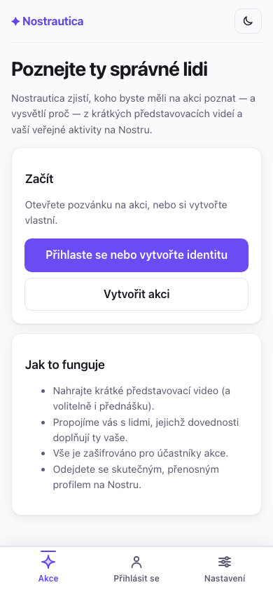

## 1. Otevřete si svůj pozvánkový odkaz

Klepněte na odkaz, který jste dostali. Zobrazí se vám **Přehled** akce — co to je, kdy a kde — a tlačítko pro připojení. Pokud organizátor zveřejnil nějaká oznámení, i ta se objeví hned tady.

Jakmile jste uvnitř akce, spodní lišta se celá týká *této* akce: **Přehled** (kde jste teď), **Lidé**, **Spojení**, **Novinky** a **Více** (váš účet, nastavení, ostatní akce). Malá hlavička nahoře vám vždycky říká, ve které akci jste a jestli jste návštěvník, čekáte, nebo jste uvnitř.

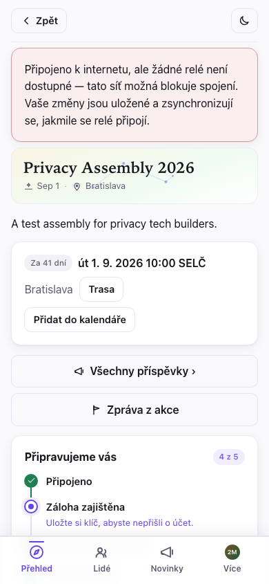

## 2. Připojení

Klepněte na **Připojit se k akci** a vyplňte, jak by vás lidé měli znát:

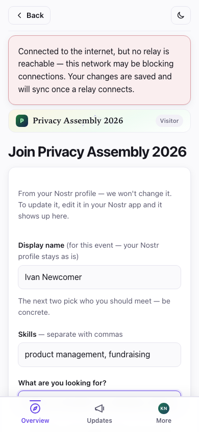

- **Fotka, jméno a „O vás"** — to je váš veřejný profil, jako v kterékoli sociální aplikaci. Formulář to i říká: *„Jméno, fotka a bio jsou veřejné — všechno ostatní zůstává uvnitř akce."*
- **Dovednosti** a **Co hledáte?** — na tomhle běží párování. Buďte konkrétní: „rust vývojář, hledám spoluzakladatele" je lepší než „technologický nadšenec". Ta minutka navíc se vyplatí.
- Je tam i políčko na **zveřejnění veřejného RSVP**, pokud chcete, aby ostatní viděli, že se zúčastníte. Nechte ho nezaškrtnuté, pokud chcete mít účast jen uvnitř akce.

Žádný e-mail, žádné heslo, žádná registrace. Když klepnete na **Vytvořit identitu a připojit se**, aplikace vám na místě vytvoří přenosnou identitu (víc o tom na konci — je to pěkný bonus).

> **Něco z toho už používáte?** Pokud klepnete na **Už jste na Nostru? Přihlaste se**, můžete se místo toho přihlásit svým existujícím klíčem, rozšířením prohlížeče nebo podepisovací aplikací v telefonu (například Amber nebo Clave). Váš existující profil se přenese a zobrazí se needitovatelně — aplikace ho nikdy nemění — a vyplnit si můžete jen pole specifická pro akci (dovednosti, co hledáte).
>
> 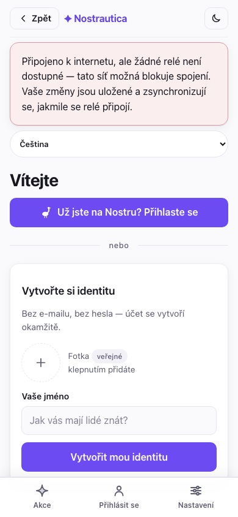

Pokud organizátor nastavil limit na to, jak dlouho si akce ponechává vaše
údaje, uvidíte to přímo na přihlašovacím formuláři — něco ve stylu *„Data z
této akce se smažou 90 dní po jejím skončení."* Je to organizátorovo vlastní
nastavení čištění dat, ne něco, co nastavujete vy; je to jen oznámeno
předem, abyste věděli, s čím souhlasíte.

Po odeslání se stane jedna ze dvou věcí, podle toho, jaký odkaz jste použili:

- **Jste uvnitř hned** (pozvánkové odkazy, když běží organizátorova párovací služba) — uvidíte obrazovku „Jste uvnitř" s tlačítkem, kde uvidíte, kdo tu je:

  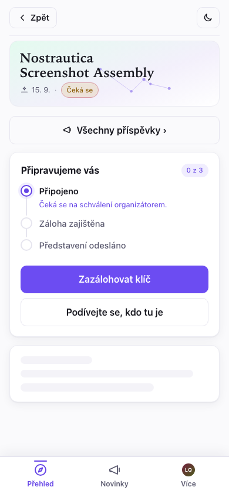

- **Organizátor vás brzy schválí** — uvidíte obrazovku „čeká se na schválení". Aplikaci můžete zavřít; dostanete se dovnitř, jakmile vás schválí.

  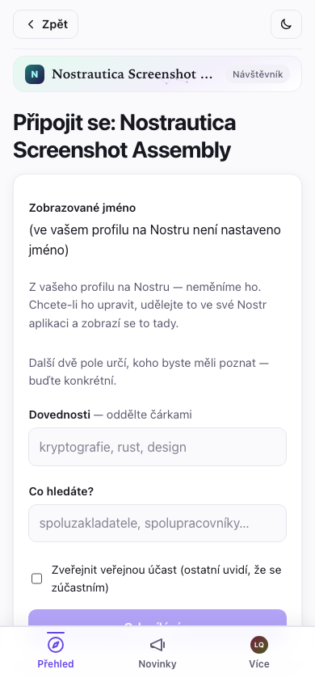

Zpátky na **Přehledu** vás krátký kontrolní seznam **„Připravujeme vás"** sleduje přesně tam, kde jste — Připojeno → Záloha zajištěna → Představení odesláno → Zpracovává se → Spojení připravena — a jako první vám ukazuje *jednu* nejbližší věc, kterou je potřeba udělat. Nemusíte hádat, proč se spojení ještě neukázala — seznam vám to řekne.

### Funguje i se špatnou Wi-Fi na místě konání

Níž na téže stránce Přehled, jakmile jste schváleni, najdete kartu
**Stáhnout pro offline použití**. Klepnutím na ni si aplikace předem stáhne
lidi, spojení a přednášky, takže se dají procházet i bez signálu — hodí se
to v přeplněné místnosti, kde si všechny telefony soupeří o stejné slabé
připojení. Samotné video a zvuk se předem nestahují (jen všechno ostatní, co
potřebujete), a kdykoli můžete klepnout na **Aktualizovat offline kopii**,
abyste si ji obnovili.

### Uložte si klíč (30 vteřin — opravdu to udělejte)

Po připojení vám aplikace ukáže **kartu se zálohou** s vaším tajným klíčem. Klepněte na **Kopírovat můj tajný klíč** a vložte ho do svého správce hesel. Je to jediná cesta zpátky do vašeho účtu, když ztratíte telefon — žádný e-mail „zapomenuté heslo" tu není, protože žádná firma váš účet nedrží. („Další způsoby zálohování" vám mohou poslat obnovovací odkaz e-mailem nebo vytvořit soubor chráněný heslem.)

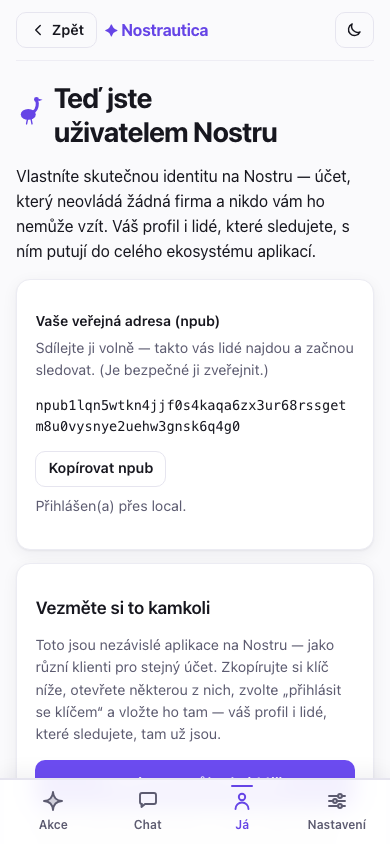

## 3. Nahrání představení

Právě tohle dělá párování dobrým. Je **nepovinné** — i bez představení vás párování zahrne, a to na základě vaší veřejné aktivity na Nostru a popisu v profilu — ale s představením má párování mnohem víc podkladů. Na stránce akce klepněte na **Nahrát / aktualizovat představení**. Máte tři způsoby, jak se představit — vyberte si ten, který vám vyhovuje:

> **Proč se s tím vůbec obtěžovat?** Nahrání představení je nepovinné, ale doporučené. Dá párování víc na práci, takže dostanete lepší spojení. Ostatní účastníci si ho můžou pustit a získat pocit, jestli byste si opravdu sedli — párování není jen o projektech a dovednostech, je to i pocit, který AI sama o sobě nedokáže zachytit. A pokud nahrajete video, lidé vás podle něj opravdu poznají, až vás zahlédnou v davu.

- **Video** (výchozí) — klepněte na **Povolit kameru**, pak na **● Nahrávat**. Mluvte až minutu: kdo jste, na čem pracujete, co hledáte. Stiskněte **■ Zastavit** (zastaví se i samo při časovém limitu), pusťte si to zpátky a klepněte na **Použít toto** — nebo **Nahrát znovu**, dokud nebudete spokojeni.
- **Zvuk** — stejný princip, bez kamery. Klepněte na **Povolit mikrofon**, sledujte ukazatel úrovně, abyste se ujistili, že vás zachycuje, a pak **● Nahrát zvuk**.
- **Text** — žádné nahrávání. Napište pár vět o tom, kdo jste a co hledáte; do spojení vstupuje přesně jako mluvené představení a (na rozdíl od videa/zvuku) nic se nepřepisuje — text, který jste napsali, je jediné, co opustí vaše zařízení.

Než se cokoli nahraje, aplikace vám jasně řekne, kdo to zpracovává — účastníci akce, organizátorova párovací služba, pokud existuje, a kteří poskytovatelé AI vidí zvuk/přepis (nebo jen text, u textových představení) — a musíte zaškrtnout políčko, že jste si to přečetli. Samotné představení nikdy neuvidí nikdo mimo účastníky této akce.

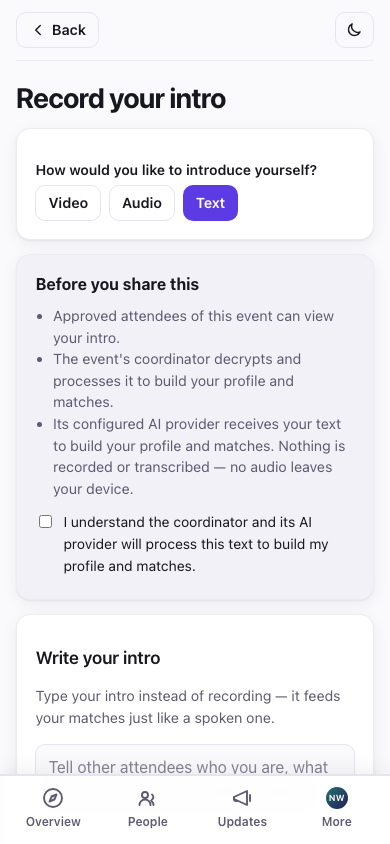

Aplikace na pozadí kontroluje nové verze sebe sama a automaticky se
aktualizuje — nikdy ale uprostřed nahrávání nebo když máte rozepsané a
neodeslané představení. Počká, až budete hotovi a pole je prázdné nebo
odeslané, teprve pak se případně znovu načte, takže aktualizace ve
špatnou chvíli vás nemůže připravit o záběr.

**Už jste něco nahráli na jiné akci?** Pokud ano, na této obrazovce se nad
nahráváním zobrazí **galerie pro opětovné použití** — každé video, zvuk nebo
text, které jste kdy vytvořili na kterékoli akci, s rychlým náhledem, abyste
je od sebe poznali. Video nebo zvuk můžete použít tak, jak je, nebo přes
**Nová kopie** ho pro tuto akci znovu zašifrovat bez nového natáčení; u textu
vás **Použít tento text** rovnou přenese do editoru, odkud ho odešlete tak,
jak je, nebo si ho ještě upravíte. Místní knihovna neukládá ani nezobrazuje
původní akci. Běžné opětovné použití videa nebo zvuku ale ponechá stejný
zašifrovaný blob, takže jeho veřejný hash může propojit vaši účast mezi akcemi.
**Nová kopie** médium znovu zašifruje novým klíčem a IV, vytvoří nový hash a
zamezí tomuto konkrétnímu propojení. Nevymaže však jiná metadata ani již
zveřejněné kopie.

Video a zvuková představení dostanou automatický přepis, jakmile je zpracuje organizátorova párovací služba — na své nebo cizí stránce klepněte pod přehrávačem na **Zobrazit přepis**, abyste si to mohli číst při poslechu nebo v tom vyhledávat, případně když zrovna nemůžete poslouchat:

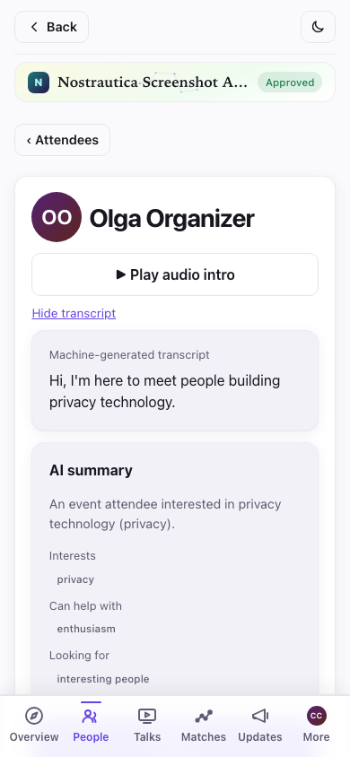

**Používejte jakýkoli jazyk chcete.** Představení nahrajte a profil napište v jazyce, ve kterém se cítíte nejpohodlněji — nemusí se shodovat s jazykem akce. Aplikace píše vaše spojení a shrnutí v jazyce akce, a pokud je vaše bio v jiném jazyce, každému zobrazí překlad s původním textem na jedno klepnutí („zobrazit originál"). Takže buďte prostě sami sebou, vlastními slovy.

### Váš vlastní profil na akci

Jakmile párovací služba zpracuje vaše představení, otevřete **Více → Můj
profil na akci** a podívejte se přesně na to, co o vás vidí ostatní,
rozdělené na dvě upřímné poloviny: **„Napsali jste"** — váš text o vás,
dovednosti, co hledáte, odkazy a textové představení, pokud jste ho poslali,
přímo upravitelné (nebo pořádně opravené novým nahráním představení) — a
**„Vygenerováno z vašeho představení"** — AI shrnutí, dovednosti, zájmy, v
čem umíte pomoct a co hledáte, to všechno odvozené z toho, co jste nahráli.
Něco je špatně ve vygenerované polovině? Kterékoli pole opravte, skryjte,
nebo skryjte celou AI část a ukažte jen to, co jste napsali sami. Je tam i
rychlá poznámka „Nahlásit problém", pokud je něco mimo a radši to nahlásíte,
než abyste to opravovali sami. Uložte, a ostatní účastníci vaši opravu uvidí
okamžitě — jejich pohled na vás dostane malou značku **„Upraveno
účastníkem"**, aby věděli, že to není čistě automatické.

## 4. Lidé

Klepněte na **Lidé** ve spodní liště a procházejte, kdo tu je. Každý řádek zobrazuje avatar (fotku, nebo iniciály na barevné dlaždici), jméno a dovednosti. **Hledejte** podle jména nebo dovednosti a filtrujte jen na lidi, které jste si označili jako **chci potkat**, **potkáno**, nebo které na Nostru **sledujete**. Každý řádek má i rychlé akce: označit **chci potkat** nebo začít **zprávu** bez otevírání jeho stránky.
Seznam se plní průběžně, jak odpovídají relaye — lidé se objevují, jak se dešifrují (jména a fotky se doplní o chvíli později), takže velký seznam na pomalém připojení nikdy nečeká na nejpomalejší relay.

Seznam účastníků je **zašifrovaný pro schválené účastníky**, takže dokud vás neschválí (nebo těsně poté, než se to ještě jen synchronizuje), obrazovka Lidé zůstává prázdná a řekne vám proč — to je model soukromí, který funguje přesně tak, jak má, ne chyba:

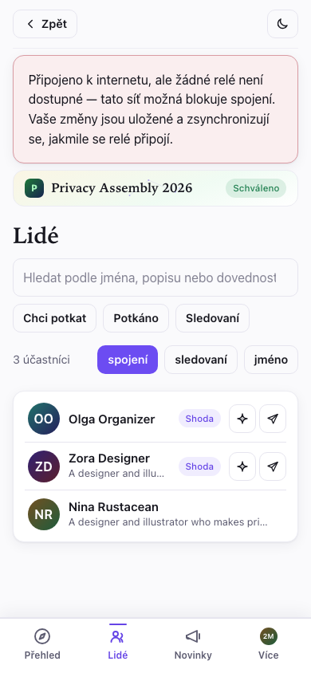

Jakmile jste uvnitř, klepnutím na kohokoli otevřete jeho stránku: představovací video, co dělá, co hledá, AI shrnutí, jakmile už párování proběhlo, a jeho nedávné veřejné příspěvky.

Na stránce někoho jiného ho můžete **Sledovat**, klepnutím na **Napsat zprávu** zahájit soukromý chat (viz §6) a — soukromě, tohle nikdo jiný nikdy neuvidí — označit **Chci potkat** nebo **Potkáno ✓** a nechat si soukromou poznámku („bubeník s mesh-network startupem"). Po znovunačtení všechno zůstane. Pokud vás někdo obtěžuje, **Ztlumení** ho skryje z vašeho seznamu Lidé, ze Spojení i ze zpráv (je to standardní Nostr ztlumení, takže se přenese i do jiných Nostr aplikací):

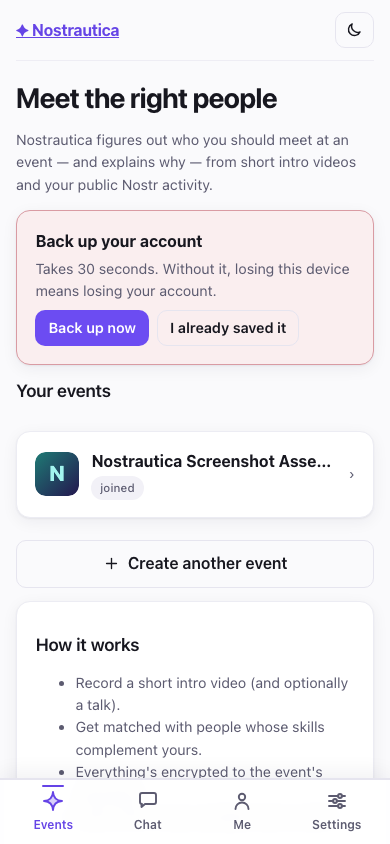

## 4.5 Přednášky (pokud je organizátor zapnul)

Některé akce umožňují účastníkům přidávat krátké přednatočené přednášky místo osobního setkání — nebo ještě před ním. Pokud je to pro vaši akci zapnuté, ve spodní liště se objeví záložka **Přednášky**. Klepněte na **Přidat přednášku**, dejte jí titulek a krátký popis, pak ji nahrajte nebo napište úplně stejně jako své představení (§3). Jde to k organizátorovi ke zveřejnění, než je vidět pro kohokoli, takže nečekejte, že se to objeví hned.

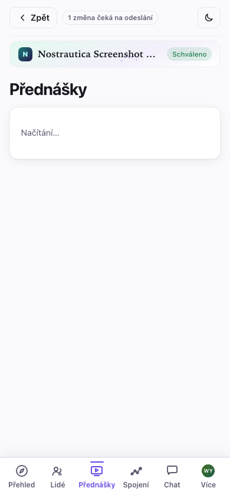

Sledování přednášky si pamatuje, kde jste skončili, takže můžete zavřít aplikaci a pokračovat později, a — stejně jako u vašeho vlastního představení — je dostupný přepis, pokud ji řečník nahrál místo napsání.

## 5. Vaše spojení

Krátce po nahrání představení klepněte na **Spojení**: žebříček lidí, které se vyplatí potkat. Každé vede tím, jak silná je shoda — **Silná shoda** nebo **Dobrá shoda** — a co je nejdůležitější, hned nahoře je vysvětlení běžným jazykem, *proč byste se měli bavit*. Pokud chcete mechaniku (nakolik jste si podobní vs. nakolik se doplňujete), je na jedno klepnutí pod „podrobnosti skóre" — ale důvod je na prvním místě. Seznam se aktualizuje, jak se přidávají další lidé. Klepnutím na spojení otevřete jeho celou stránku.

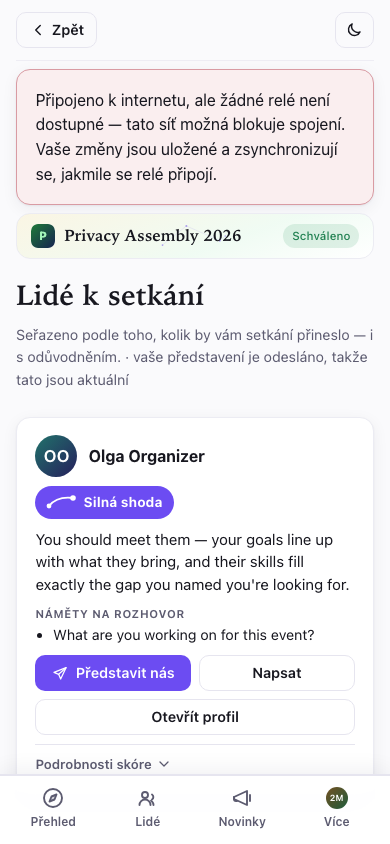

Na záložce **Spojení** se objeví malý odznak, kdykoli přibudou nová spojení
od vaší poslední návštěvy, takže nemusíte pořád kontrolovat seznam, který se
nezměnil.

Na akci ten seznam využijte: najděte si svá top spojení, zmiňte, že vám to řekla aplikace. Lepší icebreaker neexistuje.

> Spojení se objeví, až jakmile organizátorův koordinátor zpracuje představení pár lidí — takže pokud seznam říká „zatím žádná spojení", jednoduše to znamená, že se místnost teprve zaplňuje. Nejdřív nahrajte vlastní představení (§3); právě to vás dostane do spojení ostatních.

## 6. Napište někomu

Na stránce kohokoli je tlačítko **Napsat zprávu**. Klepnutím na něj otevřete soukromou, **koncově šifrovanou** konverzaci:

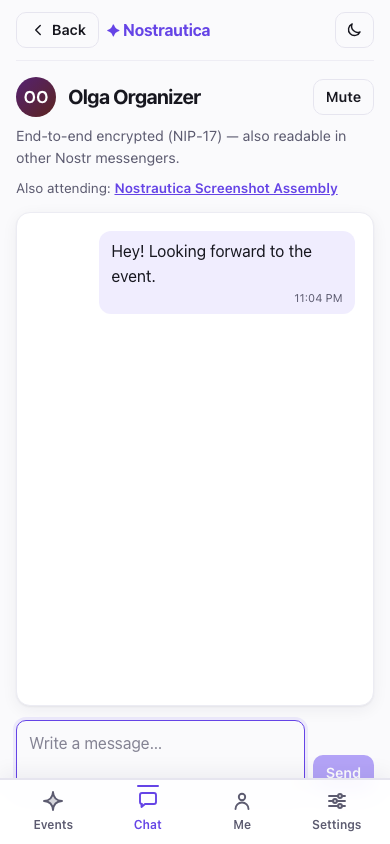

Vaše zprávy najdete pod **Více → Zprávy**, kde jsou vypsané všechny konverzace, nejnovější nahoře:

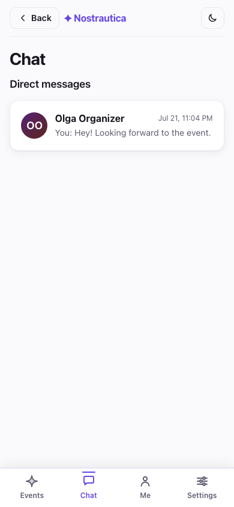

Protože jde o standardní soukromé Nostr zprávy, **fungují i s jinými Nostr aplikacemi na zprávy** — druhá osoba může odpovědět z kterékoli Nostr aplikace, kterou používá, a vaše konverzace se objeví i tam. Není uzamčená jen na tuhle akci.

## 6.5 Skupinový chat (experimentální)

Pokud organizátor zapnul **Skupinový chat**, hned po schválení se vám objeví záložka **Chat** — jedna zašifrovaná místnost pro celou akci, oddělená od soukromých zpráv. Funguje jako kterýkoli chat: zprávy se v místnosti objevují, jak je lidé posílají, oddělovače dní označují plynutí času a mezi zobrazením v bublinách a kompaktním IRC stylem můžete přepínat přepínačem nad zprávami. Je opravdu koncově šifrovaný (protokol s názvem Marmot/MLS), i když ho provozuje organizátorova párovací služba (přidává a odebírá lidi, jak jsou schváleni nebo odebráni) a dokáže ho číst — aplikace vám to říká předem, pokaždé, když otevřete záložku.

**Funguje napříč všemi vašimi zařízeními, automaticky.** Otevřete záložku
Chat na druhém telefonu nebo v jiném prohlížeči a připojí se do skupiny sám
— žádný kód ke skenování, žádné párování. Přes **Chat → Zařízení chatu**
vidíte každé zařízení napojené na váš účet pro tuto akci, můžete přejmenovat
to, na kterém zrovna jste, a odstranit ta, která už nepoužíváte (starý
telefon, prohlížeč, který jste smazali). Jedna věc vyplývá přímo z toho, jak
protokol funguje, není to chyba: zařízení vidí jen zprávy odeslané *po* tom,
co se připojilo — historii na nově přidané zařízení nelze synchronizovat.

Marmot je otevřený protokol a stejná konverzace by měla být časem dostupná i z jiných Marmot-kompatibilních chatovacích aplikací, nejen z téhle — taková spolupráce je v plánu, ale zatím se na ni nespoléhejte.

Tahle funkce je záměrně označená jako **Experimentální**: je nová a připojení do skupiny může chvíli trvat (nebo občas potřebuje nový pokus), než se začnou objevovat zprávy. Pokud záložka zůstane zaseknutá na „nastavuje se", dejte tomu pár minut a otevřete ji znovu.

## 7. Váš report z akce

Kdykoli — před, během nebo po akci — otevřete **Report akce** z menu akce a
podívejte se na přehledné shrnutí své akce, postavené výhradně na vašich
vlastních značkách **chci potkat** / **potkáno** a poznámkách (§4). Zůstává
živý a upravitelný ještě i po skončení akce, takže odráží to, co se na místě
skutečně stalo, ne jen to, koho jste si předem naplánovali.

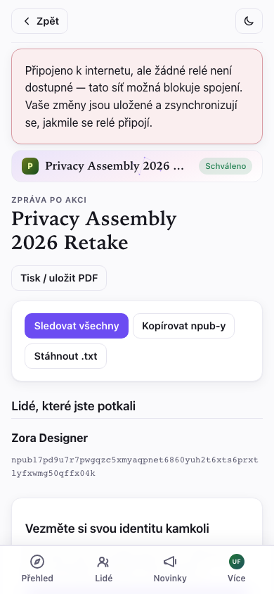

Je rozdělený na **Lidi, které jste potkali**, **Chtěli jste potkat** (lidi,
které jste si označili, ale nesetkali jste se), vaše **oblíbené přednášky** a
soukromé poznámky. Tři způsoby, jak si spojení udržet, až budete doma:

- **Sledovat všechny** — jedno klepnutí, s možností nejdřív odškrtnout
  kohokoli, koho byste raději nesledovali. Je to jediné přidání do vašeho
  vlastního Nostr seznamu sledovaných, provedené lokálně — aplikace nikdy
  nezveřejní veřejný seznam „tyto lidi jsem potkal na této akci", takže to,
  koho jste opravdu potkali, zůstává vaší věcí.
- **Kopírovat npub-y** / **Stáhnout .txt** — obyčejný seznam jmen a npub-ů
  pro vložení do vlastních poznámek. I tohle je jen lokální; nic se
  nezveřejňuje.
- **Tisk / uložit jako PDF** — čistý výtisk samotného reportu bez ovládacích
  prvků, pro ty, kdo mají radši papírovou stopu.

Pokud jste se připojili s identitou vytvořenou v aplikaci, report končí
kartou **Vezměte si svou identitu kamkoli**: ještě jedno připomenutí a přímý
odkaz na zálohování klíče a jeho vyzkoušení v jiných Nostr aplikacích —
stejný moment „přechodu na Nostr", popsaný níže, právě ve chvíli, kdy je
nejrelevantnější.

## 8. Pak: váš profil si necháváte

Překvapení: účet, který jste právě použili, je **identita na Nostru** — přihlášení, které vlastníte vy, ne tahle aplikace ani žádná firma. Záložka **Více** začíná identifikační kartou s vaší fotkou, jménem a veřejnou adresou (vaším *npub*) — klepnutím na npub ho zkopírujete:

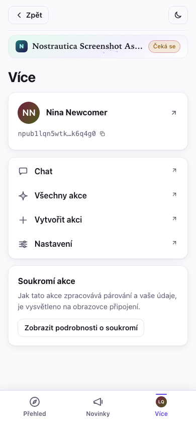

Klepnutím na kartu otevřete celý svůj profil, zkopírujete tajný klíč a přeskočíte do jiných Nostr aplikací.

Lidé, které jste na akci sledovali, váš profil, to všechno funguje napříč celým ekosystémem sociálních aplikací (Primal, Damus, Amethyst, Yakihonne…). Zkopírujte si klíč, otevřete některou z nich, zvolte „přihlásit se klíčem" a vložte ho — a jste tam.

Ještě jedna věc: **Více → Nastavení** má tmavý režim a přepínač jazyka (angličtina / slovenština / čeština), a vaše volba zůstává zapamatovaná:

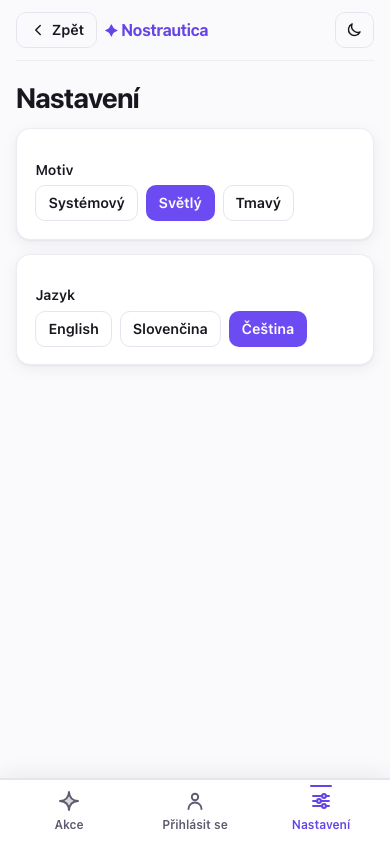

> **Příspěvky organizátora a poznámky jen pro členy.** Pod **Novinkami** najdete organizátorova oznámení. Některá mohou být **jen pro členy** — zašifrovaná tak, aby si je mohli přečíst jen schválení účastníci (adresa afterparty, kód od dveří). Pokud někdy uvidíte příspěvek se zámkem a nápisem „připojte se k akci a přečtěte si to", je to příspěvek jen pro členy, ke kterému ještě nemáte přístup.

## Pokud potřebujete odejít

Připojili jste se ke špatné akci, nebo jste si to prostě rozmysleli?
Otevřete akci, sjeďte na konec stránky a klepněte na **Opustit akci**.
Potvrďte, a váš záznam v seznamu účastníků, vaše spojení i představovací
média se odstraní — stejně čistě, jako kdyby vás odebral organizátor, jen
jste to udělali sami a nikdo to nemusí schvalovat. Později se můžete znovu
připojit; bere se to jako úplně nová žádost o připojení, ne obnovení té
staré.

## Soukromí v jednom odstavci

Vaše jméno, fotka a bio jsou veřejné (to je váš profil). Vaše představovací video, seznam účastníků a vaše spojení jsou **zašifrované tak, aby je viděli jen schválení účastníci téhle akce** — ne veřejnost, ne lidé, kteří nebyli vpuštěni dovnitř. Vaše značky chci potkat/potkáno a soukromé poznámky jsou zašifrované tak, aby je viděli **jen vy**. Vaše zprávy jsou koncově šifrované mezi vámi a druhou osobou. Párování běží na AI službě zvolené organizátorem, která čte představení a profily, aby napsala svá doporučení. Takhle vypadá seznam účastníků pro někoho, kdo není účastníkem — nijak:

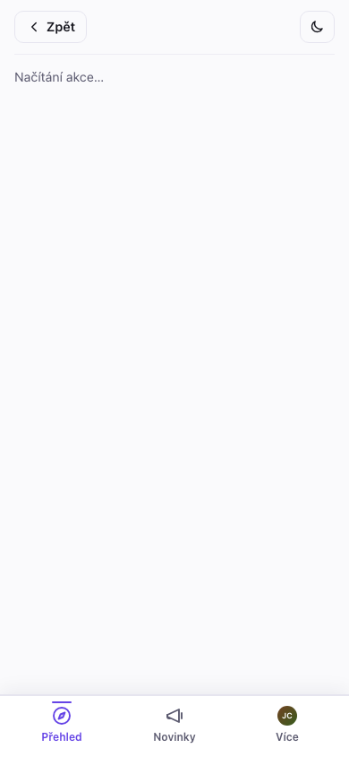

## Řešení problémů

- **Pořád mi to ukazuje „čeká se na schválení".** Pokud jste nepoužili pozvánkový odkaz, organizátor schvaluje lidi ručně — dejte tomu pár minut, nebo ho najděte přímo na akci. Aplikaci můžete klidně zavřít; zkontrolujte to opětovným otevřením odkazu na akci.

- **Kamera se mi nespouští.** Telefon nebo prohlížeč žádá o povolení ke kameře — hledejte výzvu (často v adresním řádku) a povolte ji. Pokud se výzva neobjeví, zkuste jiný prohlížeč.

- **Mám nový telefon, nebo jsem si vymazal(a) prohlížeč.** Otevřete aplikaci, klepněte na **Už jste na Nostru? Přihlaste se → Vložit klíč** a vložte tajný klíč, který jste si uložili při připojování. Stejný účet, stejné akce. (Přesně proto je uložení toho klíče důležité.) Pokud jste sami organizovali akci, vrátí se automaticky i váš plný organizátorský přístup — schvalování lidí, administrace, všechno — ze stejného klíče; samostatnou zálohu samotné akce nepotřebujete.

- **Zatím se mi nezobrazují žádná spojení.** Nahrání představení je to jediné, čím spojení zlepšíte nejvíc. Pak jim chvíli trvá, než se vypočítají, a potřebují, aby se připojilo a nahrálo i pár dalších lidí. Zkuste to brzy znovu.

- **Nevidím seznam účastníků / videa.** Nejdřív musíte být schváleni. Pokud vás právě schválili, znovu otevřete akci a dejte tomu chvíli.
