# Nostrautica: Leitfaden für Teilnehmende

Jemand hat dich zu einem Event eingeladen, das auf Nostrautica läuft. So
funktioniert das: du nimmst ein kurzes Video auf, in dem du dich vorstellst,
und noch bevor das Event beginnt, sagt dir die App **genau, wen du dort
unbedingt treffen solltest, und warum**. Schluss mit dem Hoffen, am
Kaffeeautomaten zufällig die richtige Person zu treffen.

Fünf Minuten Aufwand, alles auf deinem Handy.

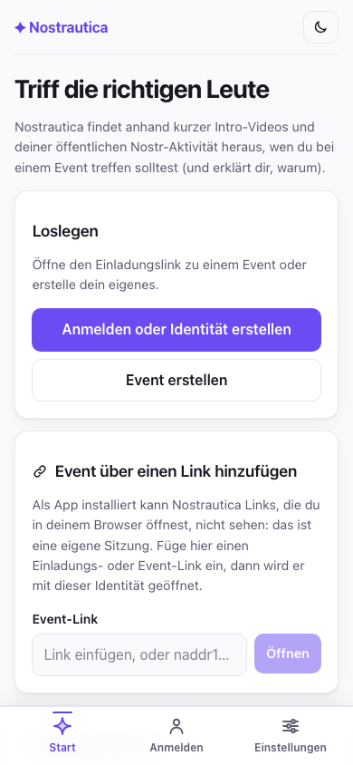

## 1. Öffne deinen Einladungslink

Tippe auf den Link, den du bekommen hast. Du landest auf der **Übersicht**
des Events (worum es geht, wann und wo), mit einem Button zum Beitreten. Hat
der Veranstalter schon Ankündigungen gepostet, siehst du auch die
aktuellsten gleich hier.

Sobald du in einem Event bist, dreht sich die Leiste unten ganz um *dieses*
Event: **Übersicht** (wo du gerade bist), **Personen**, **Updates** und
**Mehr** (dein Konto, Einstellungen, andere Events) sind immer in der
Leiste. Zwei weitere Reiter erscheinen, wenn der Veranstalter sie einschaltet:
**Talks** (§4.5) und **Chat** (§5.5). Talks steht zwischen Übersicht und
Personen, wenn der Veranstalter Talks so eingerichtet hat, dass sie *vor* dem
Event angeschaut werden („Vorab-Aufzeichnung zuerst“), sonst gleich nach
Personen. Chat kommt nach Personen, oder nach Talks, wenn beide aktiv sind.
Siehst du eines davon nicht, nutzt dieses Event es einfach nicht. Eine
kleine Kopfzeile oben zeigt dir immer, in welchem Event du bist und ob du
Gast bist, noch auf Genehmigung wartest oder schon dabei bist.

### Falls du dir Nostrautica auf den Startbildschirm installiert hast

Eine installierte App ist quasi ihr eigener Browser. Ein Link, auf den du in
einer Chat-App tippst, öffnet sich in Safari oder Chrome, und der weiß
nichts von der Identität, die du dir in der App eingerichtet hast: andere
Sitzung, keine Events. Die Einladung landet also ausgerechnet dort, wo sie
nicht funktioniert, und es sieht so aus, als wäre der Link des Veranstalters
kaputt.

Kopier den Link stattdessen, öffne Nostrautica über den Startbildschirm und
füg ihn unter **Event über einen Link hinzufügen** auf dem Events-Bildschirm
ein. Er öffnet sich genauso, wie es ein Antippen getan hätte, mit
Einladungscode und allem. Eine reine `naddr1…`-Adresse funktioniert genauso,
ebenso ein Link zu einer dauerhaften Community statt zu einem Event mit
festem Datum.

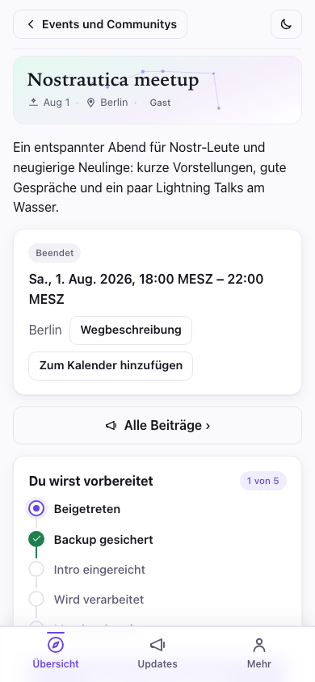

## 2. Beitreten

Tippe auf **Diesem Event beitreten** und gib an, wie dich andere kennenlernen
sollen:

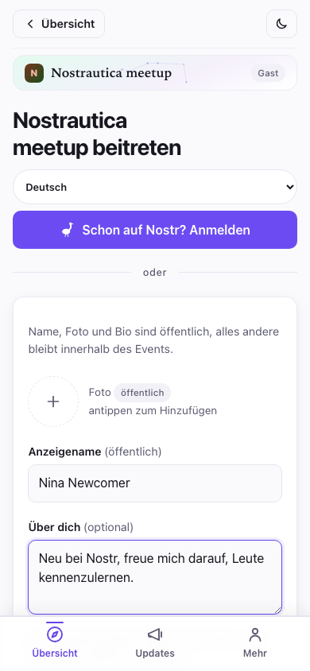

- **Foto, Name und „Über dich“**: das ist dein öffentliches Profil, wie in
  jeder anderen Social-App auch. Das Formular sagt das auch klipp und klar:
  Name, Foto und Bio sind öffentlich, alles andere bleibt innerhalb des
  Events.
- **Fähigkeiten** und **Wonach suchst du?**: darauf läuft das Matching. Sei
  konkret: „Rust-Entwicklerin, sucht einen Co-Founder“ schlägt
  „Technik-Enthusiast“ um Längen. Die zusätzliche Minute lohnt sich. Lässt du
  beides weg, und die Bio auch, kannst du trotzdem beitreten: das Formular
  weist dich nur sanft darauf hin, dass das Matching noch nichts hat, worauf
  es aufbauen kann.
- Es gibt eine Checkbox, um eine **Öffentliche Zusage veröffentlichen**, falls
  andere sehen sollen, dass du dabei bist. Lass sie deaktiviert, wenn deine
  Teilnahme innerhalb des Events bleiben soll.

Keine E-Mail, kein Passwort, keine Registrierung. Tippst du auf **Identität
erstellen & beitreten**, erstellt dir die App auf der Stelle eine portable
Identität (mehr dazu ganz am Ende: ein netter Bonus obendrauf).

> **Nutzt du schon eins davon?** Tippst du auf **Schon auf Nostr? Anmelden**,
> kannst du dich stattdessen mit deinem bestehenden Schlüssel, einer
> Browser-Erweiterung oder einer Signer-App auf dem Handy (wie Amber oder
> Clave) anmelden. Dein bestehendes Profil wird übernommen und nur lesbar
> angezeigt. Die App ändert daran nie etwas.
>
> 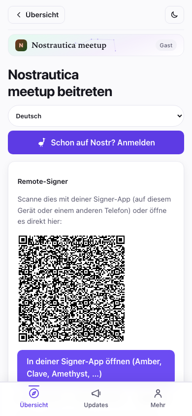

Hat dein Nostr-Profil schon eine Bio, wird sie hier unverändert übernommen.
Falls nicht, bekommst du im Beitrittsformular ein eigenes Feld **„Über
dich“**: Text nur für dieses Event, der nie in dein Nostr-Profil
zurückgeschrieben wird. So oder so füllst du **Fähigkeiten** und **Wonach
suchst du?** immer neu aus, sie gelten nur für dieses Event.

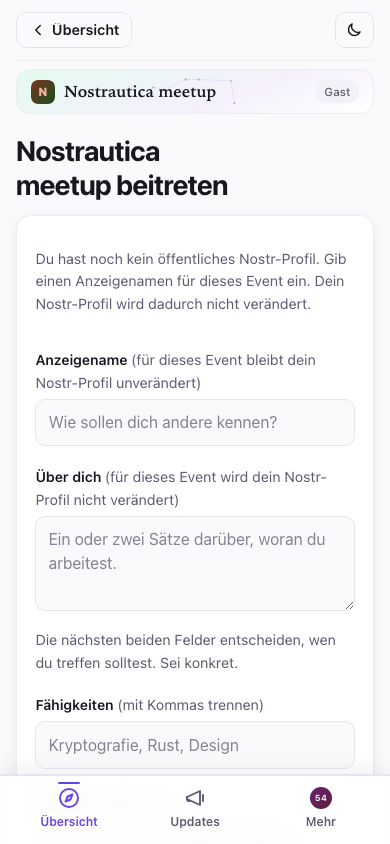

Hat der Veranstalter ein Limit gesetzt, wie lange das Event deine Daten
behält, siehst du das direkt im Beitrittsformular, etwa so: *„Die Daten
dieses Events werden 90 Tage nach seinem Ende gelöscht.“* Das legt der
Veranstalter selbst fest, du stellst daran nichts ein; es wird dir nur
vorher offengelegt, damit du weißt, worauf du dich einlässt.

Nach dem Absenden passiert eine von zwei Sachen, je nachdem, welchen Link du
hattest:

- **Du bist sofort dabei** (bei Einladungslinks, wenn der Matchmaking-Dienst
  des Veranstalters läuft). Du siehst einen Bildschirm „Du bist dabei“ mit
  dem Button **Sehen, wer hier ist**:

  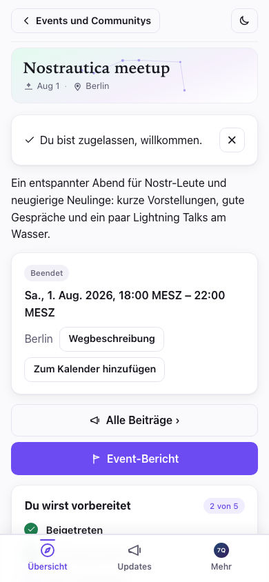

- **Der Veranstalter genehmigt dich in Kürze**: du siehst einen Bildschirm,
  der auf die Genehmigung wartet. Du kannst die App ruhig schließen, du
  kommst rein, sobald er dich genehmigt.

  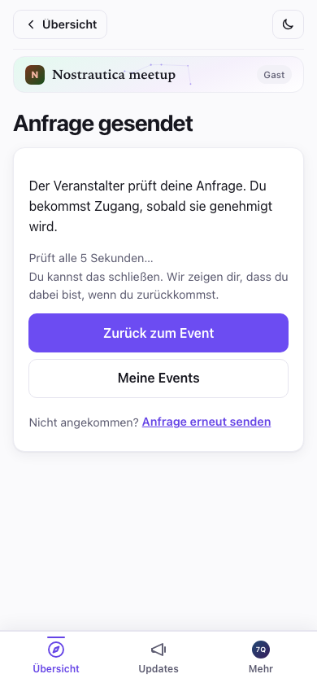

Zurück auf der **Übersicht** verfolgt eine kurze Checkliste **„Du wirst
vorbereitet“** genau, wo du gerade stehst (Beigetreten → Backup gesichert →
Intro eingereicht → Wird verarbeitet → Matches bereit), und zeigt dir ganz
vorne die *eine* nächste Sache, die ansteht. Kein Rätselraten, warum noch
keine Matches da sind: die Liste sagt es dir.

### Funktioniert auch mit schlechtem WLAN vor Ort

Weiter unten auf derselben Übersichtsseite gibt es, sobald du genehmigt
bist, eine Karte **Für offline herunterladen**. Tippst du darauf, lädt die
App Personen, Matches und Talks im Voraus herunter, *und* dazu gleich die
Bildschirme, die sie anzeigen (Personen, Talks, die Seite eines Talks,
Aufnehmen, Mein Profil, Updates), sodass du alles auch ohne Empfang
durchsehen kannst; praktisch in einem vollen Raum, in dem sich alle Handys
um dieselbe schwache Verbindung streiten. Frühere Versionen luden zwar die
Daten, konnten eine Ansicht wie Talks offline aber trotzdem nicht *öffnen*;
jetzt kommen die Bildschirme gleich mit. Die Videos und Audiodateien selbst
werden weiterhin nicht im Voraus heruntergeladen (nur alles andere), und du
kannst jederzeit auf **Offline-Kopie aktualisieren** tippen, um sie zu
erneuern. Konnte etwas nicht geladen werden, sagt dir die Karte das, statt
so zu tun, als wäre alles vollständig.

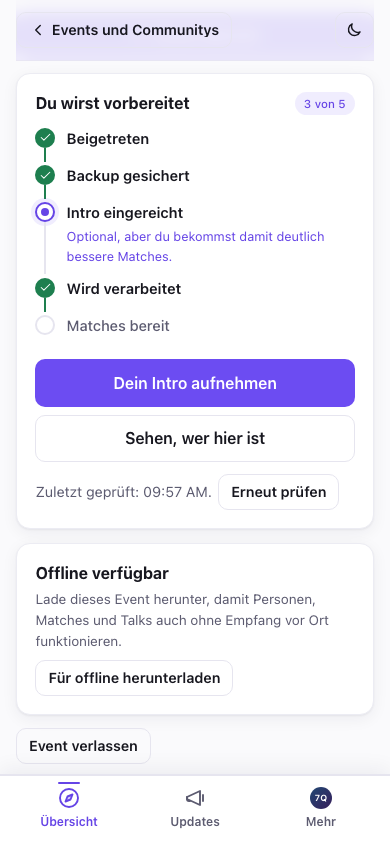

### Sichere deinen Schlüssel (30 Sekunden, mach es wirklich)

Nach dem Beitreten zeigt dir die App eine **Backup-Karte** mit deinem
geheimen Schlüssel. Tipp auf **Meinen geheimen Schlüssel kopieren** und füg
ihn in deinen Passwort-Manager ein. Es ist der einzige Weg zurück in dein
Konto, falls du dein Handy verlierst. Es gibt keine „Passwort vergessen“-Mail,
weil keine Firma dein Konto verwaltet. („Weitere Möglichkeiten zum Sichern“
kann dir einen Wiederherstellungslink per E-Mail schicken oder eine
passwortgeschützte Datei erstellen.)

## 3. Nimm dein Intro auf

Das ist der Teil, der das Matching wirklich gut macht. Er ist **optional**:
auch ohne Intro wirst du gematcht, anhand deiner öffentlichen
Nostr-Aktivität und deiner Profil-Bio, aber mit Intro hat das Matching viel
mehr, worauf es aufbauen kann. Tippe auf der Event-Seite auf **Intro
aufnehmen / aktualisieren**. Du hast drei Wege, dich vorzustellen. Wähl,
was zu dir passt:

> **Warum der Aufwand?** Die Aufnahme einer Intro ist optional, aber
> empfohlen. Sie gibt dem Matching mehr, womit es arbeiten kann, also
> bekommst du bessere Matches. Andere Teilnehmende können sie sich anhören
> oder ansehen und ein Gefühl dafür bekommen, ob es zwischen euch passen
> könnte. Projekte und Fähigkeiten sind beim Matching nur die halbe
> Geschichte, der Rest ist ein Gefühl, das eine KI allein nicht erfassen
> kann. Und nimmst du ein Video auf, erkennen dich die Leute später
> tatsächlich wieder, wenn sie dich in der Menge entdecken.

- **Video** (die Standardoption): tippe auf **Kamera aktivieren**, dann auf
  **● Aufnehmen**. Sprich bis zu eine Minute lang: wer du bist, woran du
  arbeitest, wonach du suchst. Drück auf **■ Stopp** (die Aufnahme stoppt
  beim Zeitlimit auch von selbst), sieh sie dir noch mal an, und tippe auf
  **Übernehmen**, oder auf **Neu aufnehmen**, bis du zufrieden bist.
- **Audio**: dasselbe Prinzip, ohne Kamera. Tippe auf **Mikrofon
  aktivieren**, behalte den Pegelanzeiger im Blick, um sicherzugehen, dass
  du zu hören bist, und dann auf **● Audio aufnehmen**.
- **Text**: gar keine Aufnahme. Schreib ein paar Sätze darüber, wer du bist
  und wonach du suchst; das fließt genauso in deine Matches ein wie eine
  gesprochene Intro, und (anders als bei Video/Audio) wird nie etwas
  transkribiert: der Text, den du geschrieben hast, ist das Einzige, was
  dein Gerät verlässt.

Bevor irgendetwas hochgeladen wird, sagt dir die App unmissverständlich, wer
es verarbeitet: die Teilnehmenden des Events, der Matchmaking-Dienst des
Veranstalters, falls es einen gibt, und welche KI-Anbieter das Audio bzw.
Transkript zu sehen bekommen (oder bei Text-Intros nur den Text). Du musst
eine Checkbox anhaken, dass du das gelesen hast. Deine Intro selbst sieht
niemand außerhalb der Teilnehmenden dieses Events.

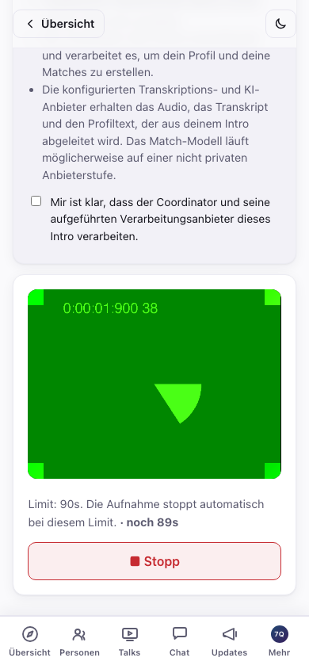

Die App aktualisiert sich im Hintergrund von selbst, aber nie in einem
Moment, der dich Arbeit kosten würde. Sie wartet mit dem Neuladen, bis du
gesendet oder verworfen hast, damit ein Update nicht mitten in der Aufnahme
landet und dir eine Aufnahme zunichtemacht. (Sieh unter Fehlerbehebung nach,
falls du dich fragst, warum ein Update zu warten scheint.)

**Schon für ein anderes Event aufgenommen?** Falls ja, zeigt dieser
Bildschirm oberhalb der Aufnahme eine **Wiederverwendungsgalerie**: jedes
Video, Audio oder jede Text-Intro, die du je bei einem früheren Event
erstellt hast, mit einer kurzen Vorschau, damit du sie auseinanderhalten
kannst. Verwende ein Video oder eine Audioaufnahme unverändert weiter, oder
nimm **Neue Kopie**, um sie für dieses Event neu zu verschlüsseln, ohne neu
aufzunehmen; bei Text übernimmt **Diesen Text verwenden** den Inhalt direkt
in den Editor, sodass du ihn unverändert senden oder erst noch anpassen
kannst. Die lokale Bibliothek speichert oder zeigt das Ursprungsevent nicht
an, und falls du lieber willst, dass sich die Kopie für dieses Event nicht
zu jenem zurückverfolgen lässt, erledigt das **Neue Kopie** (die
Fehlerbehebung erklärt den Mechanismus, falls dich das interessiert).

Video- und Audio-Intros bekommen automatisch ein Transkript, sobald sie der
Matchmaking-Dienst des Veranstalters verarbeitet hat. Auf deiner eigenen
oder einer fremden Profilseite tippst du unter dem Player auf **Transkript
anzeigen**, um mitzulesen oder darin zu suchen, oder wenn du gerade einfach
nicht zuhören kannst:

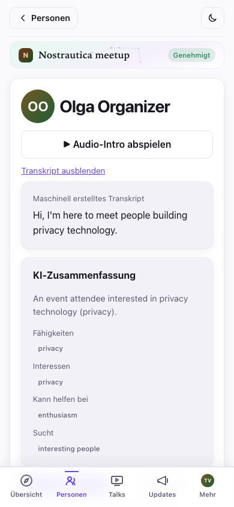

**Nutze, welche Sprache du willst.** Nimm deine Intro auf und schreib dein
Profil in der Sprache, in der du dich am wohlsten fühlst. Sie muss nicht mit
der Sprache des Events übereinstimmen. Die App schreibt deine Matches und
Zusammenfassungen in der Sprache des Events, und ist deine Bio in einer
anderen Sprache, zeigt sie allen eine Übersetzung, mit dem Original nur
einen Klick entfernt (**„Original anzeigen“**). Also sei einfach du selbst,
in deinen eigenen Worten.

### Dein eigenes Event-Profil

Sobald der Matchmaking-Dienst deine Intro verarbeitet hat, öffne **Mehr →
Mein Event-Profil**, um genau zu sehen, was alle anderen über dich sehen,
aufgeteilt in zwei ehrliche Hälften. **„Du hast geschrieben“** umfasst
deinen Über-dich-Text, Fähigkeiten, Wonach-du-suchst, Links und deine
Text-Intro, falls du eine geschickt hast; direkt bearbeitbar (oder richtig
korrigiert, indem du deine Intro neu aufnimmst). **„Aus deiner Intro
generiert“** enthält die von der KI geschriebene Zusammenfassung,
Fähigkeiten, Interessen, womit du helfen kannst und wonach du suchst, alles
abgeleitet aus dem, was du aufgenommen hast. Stimmt etwas in der generierten
Hälfte nicht? Bearbeite ein einzelnes Feld, blende nur dieses aus, oder
blende den ganzen KI-Abschnitt aus und zeig nur, was du selbst geschrieben
hast. Es gibt auch eine kurze Notiz **„Ein Problem melden“**, falls etwas
nicht stimmt und du es lieber meldest, statt es selbst zu korrigieren.
Speicherst du, sehen andere Teilnehmende deine Korrektur sofort, und ihre
Ansicht von dir zeigt ein kleines Abzeichen **„Von der teilnehmenden Person
bearbeitet“**, damit sie wissen, dass es nicht rein automatisch entstanden
ist.

## 4. Personen

Tippe unten in der Leiste auf **Personen**, um zu sehen, wer alles da ist.
Es ist eine einzige Liste, und deine Matches, falls du welche hast, stehen
ganz oben.

Ein **Suchfeld** oben findet Personen nach Name, Bio oder Fähigkeit.

Hat dich der Coordinator mit jemandem gematcht, stehen diese Personen ganz
oben, gruppiert unter den Überschriften **Starke Matches** und **Gute
Matches**. Jedes Match zeigt Namen, eine Zeile aus der eigenen Bio und die
ganze Begründung, warum ihr euch treffen solltet, direkt in der Zeile.
Darunter liegt ein eingeklappter Abschnitt **Gesprächseinstiege** mit den
vorgeschlagenen Eröffnungssätzen des Coordinators.

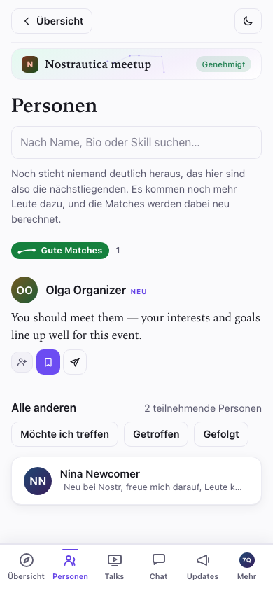

Sticht noch niemand deutlich heraus, steht das auch so über der Liste: das
hier sind vorerst deine nächstliegenden Personen, und die Matches werden neu
berechnet, sobald mehr Leute dazukommen.

Unter den Matches nennt die Überschrift **Alle anderen** die Zahl der
Teilnehmenden, danach kommen die Filter-Buttons **Möchte ich treffen** /
**Getroffen** / **Gefolgt**, und dann die komplette Liste als einzeilige
Einträge: Avatar (Foto, oder die Initialen auf einer farbigen Kachel), Name
und Fähigkeiten. Die Liste füllt sich, sobald Relays antworten: Personen
erscheinen, während sie entschlüsselt werden (Namen und Fotos folgen einen
Moment später), sodass eine große Liste auf einer langsamen Verbindung nie
am langsamsten Relay hängen bleibt. Suchst du, oder tippst du einen Filter
an, klappen die Abschnitte zu einer einzigen flachen Ergebnisliste
zusammen.

Jede Person, ob gematcht oder nicht, hat dieselben drei schnellen Aktionen
direkt in ihrer Zeile: **Folgen**, **Möchte treffen** und **Nachricht**.
Alle drei kannst du nutzen, ohne die Profilseite zu öffnen.

Die Teilnehmerliste ist **für genehmigte Teilnehmende verschlüsselt**, bis
du also genehmigt bist (oder gerade eben erst, bevor es synchronisiert ist),
bleibt der Bildschirm Personen leer und sagt dir, warum. Das ist das
Datenschutzmodell, das genau so funktioniert, wie es soll, kein Fehler:

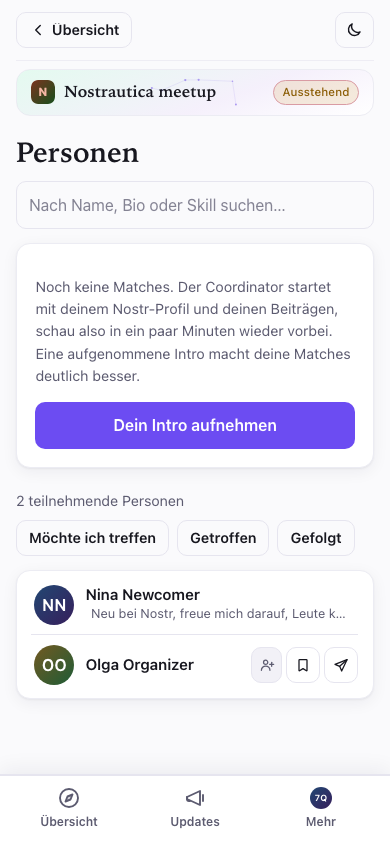

Tippst du auf Namen oder Zeile einer Person, öffnet sich ihre Profilseite:
ihr Intro-Video, was sie macht, wonach sie sucht, eine von der KI
geschriebene Zusammenfassung, sobald das Matching gelaufen ist, und ihre
neuesten öffentlichen Beiträge. Bist du mit ihr gematcht, wiederholt die
Seite die Begründung und ergänzt **Details zur Bewertung** (Ähnlichkeit,
Komplementarität und Gesamt, jeweils in Prozent) sowie einen Button **Uns
vorstellen**.

Auf der Profilseite einer Person kannst du ihr **Folgen**, mit **Nachricht**
einen privaten Chat starten (siehe §5), und, privat (das sieht sonst
niemand), **Möchte treffen** oder **Getroffen ✓** markieren sowie eine
private Notiz hinterlegen („der Schlagzeuger mit dem Mesh-Network-Startup“).
Nach dem Neuladen bleibt alles erhalten. Bei einem Match öffnet
**Nachricht** den Editor schon mit dem vorgeschlagenen Eröffnungssatz des
Coordinators, den du vor dem Senden bearbeiten oder löschen kannst. Nervt
dich jemand, blendet **Stummschalten** die Person aus deiner Liste Personen
und aus deinen Nachrichten aus (das ist eine normale Nostr-Stummschaltung,
sie gilt also auch in anderen Nostr-Apps):

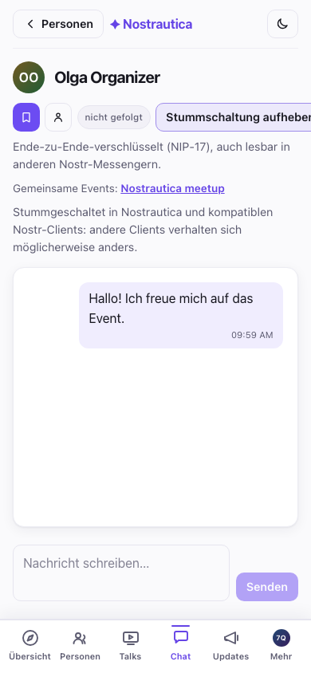

Beim Event nutz die Liste aktiv: such dir deine besten Matches, und erwähn,
dass dir die App das gesagt hat. Besseren Eisbrecher gibt's nicht.

> Matches erscheinen erst, wenn der Coordinator des Veranstalters ein paar
> Intros verarbeitet hat. Sticht also noch niemand heraus, wärmt sich der
> Raum einfach noch auf. Nimm zuerst deine eigene Intro auf (§3): erst das
> bringt dich in die Matches der anderen.

## 4.5 Talks (wenn der Veranstalter sie aktiviert hat)

Manche Events lassen Teilnehmende kurze, vorab aufgezeichnete Talks
einreichen, statt sich persönlich zu treffen, oder schon vorher dazu. Ist
das bei deinem Event aktiviert, erscheint unten in der Leiste ein Reiter
**Talks**. Tippe auf **Talk einreichen**, gib ihm einen Titel und eine
kurze Beschreibung, und wähl dann, wie du das Video bereitstellst:

- **Aufnehmen** im Browser (wie bei deiner Intro, §3),
- **Datei hochladen**, die du schon hast, oder
- **URL einfügen**: ein nicht gelisteter **YouTube**-Link oder ein direkter
  **.mp4**-Link. Das ist die richtige Wahl für einen Talk, der zum
  Hochladen zu groß ist; das Video bleibt dort, wo du es hostest, und
  verschlüsselt für das Event wird nur der *Link*.

Es gibt außerdem eine Checkbox **„Diesen Talk fürs Matching
verarbeiten?“**, standardmäßig aus: lässt du sie aus, wird dein Talk
einfach zum Ansehen veröffentlicht; hakst du sie an, transkribiert der
Coordinator ihn zusätzlich und nutzt ihn, um deine Matches zu schärfen.
(Talks per eingefügter URL werden nie verarbeitet: sie sind nur zum
Ansehen.) So oder so geht der Talk erst an den Veranstalter zur
Veröffentlichung, bevor ihn irgendjemand sieht, erwarte also nicht, dass er
sofort auftaucht.

Fügst du einen Link ein, bestätigt die App kurz, sobald sie ihn erkennt:

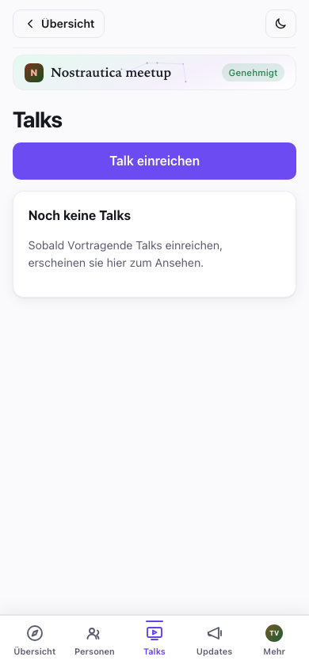

Beim Ansehen eines Talks merkt sich die App, wo du aufgehört hast, du
kannst die App also schließen und später weitermachen. Der Player hat
außerdem eine Einstellung für die **Geschwindigkeit** (1×/1,5×/2×), um
lange Talks schneller durchzubekommen. Ein Transkript gibt es, wenn der
Vortragende seinen Talk fürs Matching verarbeiten ließ.

## 5. Schreib jemandem eine Nachricht

Jede Profilseite hat einen Button **Nachricht**. Tipp ihn an, um eine
private, **Ende-zu-Ende-verschlüsselte** Unterhaltung zu öffnen:

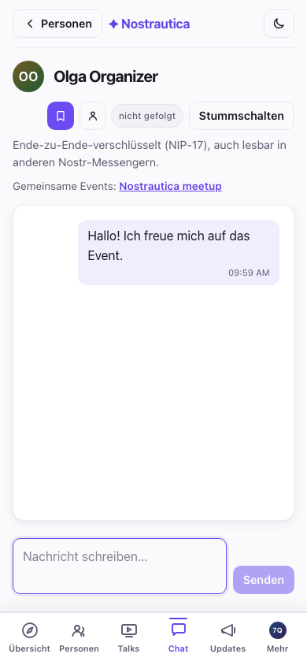

Deine Nachrichten findest du unter **Mehr → Nachrichten**, dort stehen alle
Unterhaltungen, die neueste zuerst:

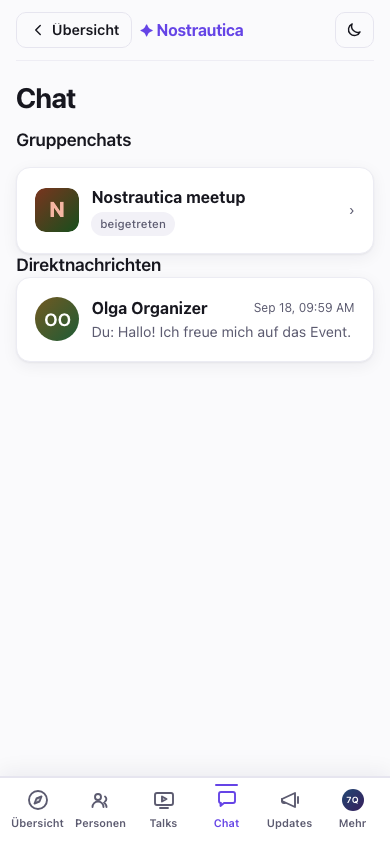

Weil das ganz normale private Nostr-Nachrichten sind, **funktionieren sie
auch mit anderen Nostr-Messengern**: die andere Person kann aus jeder
beliebigen Nostr-App antworten, die sie nutzt, und eure Unterhaltung taucht
auch dort auf. Sie ist nicht an dieses Event gebunden.

## 5.5 Gruppenchat (experimentell)

Hat der Veranstalter den **Gruppenchat** aktiviert, erscheint, sobald du
genehmigt bist, ein Reiter **Chat**: ein einziger verschlüsselter Raum für
das ganze Event, getrennt von den privaten Nachrichten. Er funktioniert wie
jeder Chat: Nachrichten erscheinen im Raum, sobald sie jemand sendet,
Tagestrenner markieren den Ablauf der Zeit, und über einen Umschalter
oberhalb der Nachrichten kannst du zwischen Sprechblasenansicht und einem
kompakten IRC-Stil-Log wechseln. Er ist wirklich Ende-zu-Ende-verschlüsselt
(ein Protokoll namens Marmot/MLS), auch wenn der Matchmaking-Dienst des
Veranstalters die Gruppe betreibt (fügt Personen hinzu oder entfernt sie,
wenn sie genehmigt oder ausgeschlossen werden) und mitlesen kann. Die App
sagt dir das offen, jedes Mal, wenn du den Reiter öffnest.

**Es funktioniert automatisch über alle deine Geräte hinweg.** Öffne den
Chat-Reiter auf einem zweiten Handy oder in einem anderen Browser, und er
tritt der Gruppe von selbst bei, ohne Code zum Scannen und ohne
Kopplungsschritt. Ein Haken liegt daran, wie das zugrunde liegende Protokoll
funktioniert, kein Fehler: ein Gerät sieht nur Nachrichten, die *nach*
seinem Beitritt gesendet wurden. Der Verlauf lässt sich auf ein neu
hinzugefügtes Gerät nicht nachträglich übertragen.

Diese Funktion ist nicht ohne Grund als **Experimentell** markiert: sie ist
neu (Interoperabilität mit anderen Marmot-kompatiblen Apps ist geplant,
aber noch nichts, worauf du dich verlassen solltest), und der Beitritt zur
Gruppe kann eine Weile dauern oder gelegentlich einen erneuten Versuch
brauchen, bevor Nachrichten ankommen. Bleibt der Reiter bei „wird
eingerichtet“ hängen, gib ihm ein paar Minuten und öffne ihn erneut.

## 6. Dein Event-Bericht

Jederzeit vor, während oder nach dem Event öffnest du über das Event-Menü
**Event-Bericht**, um eine übersichtliche Zusammenfassung deines Events zu
sehen, komplett aus deinen eigenen Markierungen **Möchte treffen** /
**Getroffen** und Notizen aufgebaut (§4). Er bleibt bis weit über das Ende
des Events hinaus live und bearbeitbar, damit er widerspiegelt, was vor Ort
tatsächlich passiert ist, nicht nur, wen du vorher zu treffen geplant
hattest.

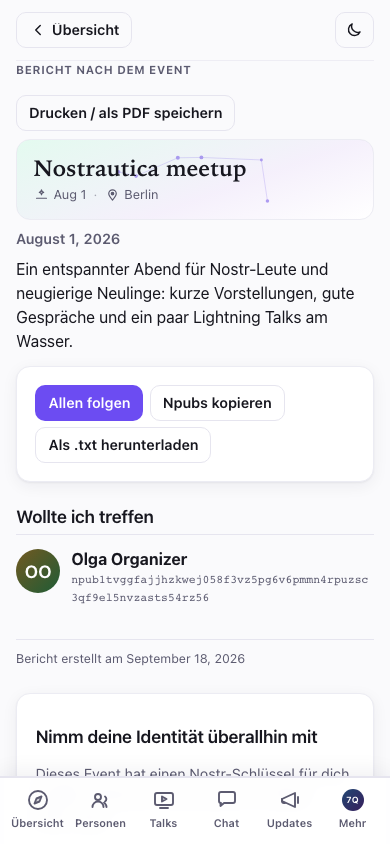

Er gliedert sich in **Personen, die du getroffen hast**, **Wollte ich
treffen** (Personen, die du markiert, aber nicht getroffen hast),
**Favorisierte Talks** und deine privaten Notizen. Drei Wege, die Kontakte
zu behalten, sobald du wieder daheim bist:

- **Allen folgen**: ein Tipp, mit einer Checkliste, um vorher jeden
  abzuwählen, dem du lieber nicht folgen möchtest. Das ist eine einzige,
  lokal ausgeführte Ergänzung deiner eigenen Nostr-Follow-Liste. Die App
  veröffentlicht nie eine öffentliche Liste „Diese Leute habe ich bei diesem
  Event getroffen“, wen du tatsächlich getroffen hast, bleibt also deine
  Sache.
- **Npubs kopieren** / **Als .txt herunterladen**: eine einfache Liste aus
  Namen und npubs, zum Einfügen in deine eigene Notiz-App. Auch das rein
  lokal; nichts wird veröffentlicht.
- **Drucken / als PDF speichern**: ein sauberer Ausdruck des Berichts
  selbst, ohne Bedienelemente, für alle, die lieber eine Papierspur
  behalten.

Bist du mit einer von der App erstellten Identität beigetreten, endet der
Bericht mit **Nimm deine Identität überallhin mit**: noch ein Anstoß, mit
einem direkten Link, um deinen Schlüssel zu sichern und ihn in Primal,
Damus, Amethyst oder Yakihonne auszuprobieren, derselbe „Wechsel zu
Nostr“-Moment, der weiter unten beschrieben wird, genau dann, wenn er am
relevantesten ist.

## 7. Danach: dein Profil gehört dir

Überraschung: das Konto, das du gerade benutzt hast, ist eine
**Nostr-Identität**: ein Login, das dir gehört, nicht dieser App oder
irgendeiner Firma. Der Reiter **Mehr** beginnt mit einer Identitätskarte,
die dein Foto, deinen Namen und dein öffentliches Handle (deinen *npub*)
zeigt. Tipp auf den npub, um ihn zu kopieren:

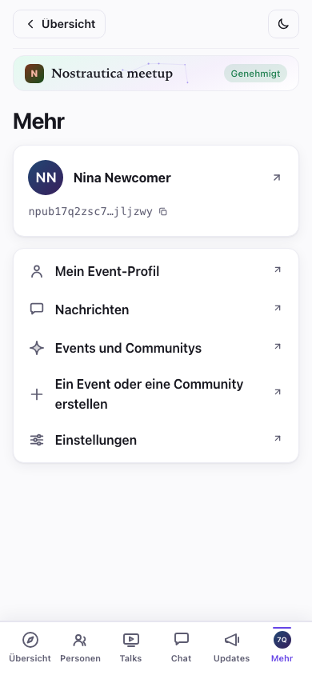

Tipp auf die Karte, um dein vollständiges Profil zu öffnen, deinen geheimen
Schlüssel zu kopieren und zu anderen Nostr-Apps zu wechseln.

Die Personen, denen du beim Event gefolgt bist, dein Profil, das alles
funktioniert über ein ganzes Ökosystem von Social-Apps hinweg (Primal,
Damus, Amethyst, Yakihonne…). Kopier deinen Schlüssel, öffne eine davon,
wähl „Mit einem Schlüssel anmelden“ und füg ihn dort ein. Du bist schon da.

Noch etwas: unter **Mehr → Einstellungen** gibt es einen dunklen Modus und
eine Sprachauswahl (Deutsch, Englisch, Slowakisch, Tschechisch und Spanisch),
und deine Wahl bleibt gespeichert:

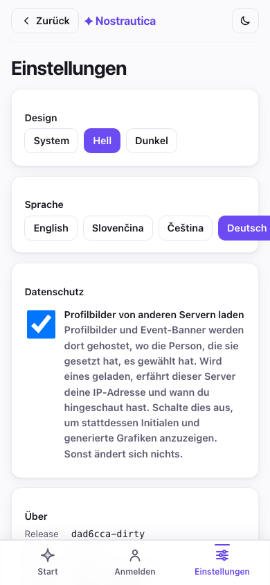

> **Beiträge des Veranstalters und Notizen nur für Mitglieder.** Unter
> **Updates** findest du die Ankündigungen des Veranstalters. Manche sind
> **nur für Mitglieder**, verschlüsselt, sodass sie nur genehmigte
> Teilnehmende lesen können (die Adresse der Afterparty, ein Türcode).
> Siehst du mal einen Beitrag mit Schloss und „Beitreten, um zu lesen“, ist
> das ein Beitrag nur für Mitglieder, zu dem du noch keinen Zugang hast.

## Falls du das Event verlassen musst

Bist du dem falschen Event beigetreten, oder hast du es dir einfach anders
überlegt? Öffne das Event, scroll ganz nach unten und tippe auf **Event
verlassen**. Bestätige, und die App schickt eine Austrittsanfrage: dein
Eintrag in der Teilnehmerliste, deine Matches und deine Intro-Medien werden
auf der Seite des Coordinators (oder des Veranstalters) aufgeräumt, und du
bist raus. Du kannst später wieder beitreten; das zählt dann als ganz neue
Beitrittsanfrage, nicht als Wiederbelebung der alten.

## Datenschutz in einem Absatz

Dein Name, dein Foto und deine Bio sind öffentlich (das ist dein Profil).
Dein Intro-Video, die Teilnehmerliste und deine Matches sind **so
verschlüsselt, dass nur die genehmigten Teilnehmenden dieses Events sie
sehen können**, nicht die Öffentlichkeit und nicht Leute, die nicht
reingelassen wurden. Deine Markierungen Möchte-treffen/Getroffen und deine
privaten Notizen sind so verschlüsselt, dass sie **nur du** siehst. Deine
Nachrichten sind Ende-zu-Ende-verschlüsselt zwischen dir und der anderen
Person. Das Matching läuft auf einem vom Veranstalter gewählten KI-Dienst,
der Intros und Profile liest, um seine Empfehlungen zu schreiben. So sieht
die Teilnehmerliste für jemanden aus, der nicht dabei ist. Nichts:

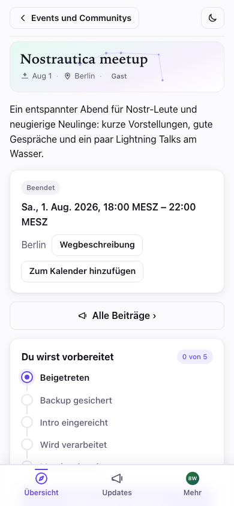

## Fehlerbehebung

- **Bei mir steht immer noch „wartet auf Genehmigung“.** Außer du hast einen
  Einladungslink genutzt, genehmigt der Veranstalter Leute von Hand, gib ihm
  also ein paar Minuten, oder sprich ihn direkt beim Event an. Du kannst die
  App ruhig schließen; schau nach, indem du den Event-Link erneut öffnest.

- **Der Einladungslink hat sich in einem Browser geöffnet, in dem ich nicht
  angemeldet bin.** Die installierte App ist ein eigener Browser, getrennt
  von dem, der Links öffnet. Kopier den Link, öffne Nostrautica über den
  Startbildschirm und füg ihn unter **Event über einen Link hinzufügen** auf
  dem Events-Bildschirm ein (§1).

- **Meine Kamera startet nicht.** Dein Handy oder Browser fragt nach der
  Kameraberechtigung. Halt Ausschau nach der Abfrage (oft in der
  Adressleiste) und erlaub sie. Erscheint keine, probier einen anderen
  Browser.

- **Ich habe ein neues Handy, oder meinen Browser geleert.** Öffne die App,
  tippe auf **Schon auf Nostr? Anmelden → Schlüssel einfügen**, und füg den
  geheimen Schlüssel ein, den du beim Beitreten gesichert hast. Gleicher
  Account, gleiche Events. (Genau deshalb ist es wichtig, diesen Schlüssel
  zu sichern.) Hast du selbst ein Event organisiert, kommt dein voller
  Organisator-Zugang (Personen genehmigen, die Admin-Ansicht, alles)
  automatisch mit demselben Schlüssel zurück; ein separates Backup für das
  Event selbst brauchst du nicht.

- **Es werden noch keine Matches angezeigt.** Eine Intro aufzunehmen ist die
  größte einzelne Verbesserung, die du hier vornehmen kannst. Danach dauert
  es eine Weile, bis die Matches berechnet sind, und es müssen auch ein
  paar andere Leute beigetreten sein und aufgenommen haben. Schau bald
  wieder vorbei.

- **Ich sehe die Teilnehmerliste / die Videos nicht.** Dafür musst du erst
  genehmigt sein. Bist du gerade erst genehmigt worden, öffne das Event neu
  und gib ihm einen Moment.

- **Ich habe auf Event verlassen getippt, aber es zeigt immer noch
  „Ausstehend“.** Warst du offline, als du getippt hast, wird die Anfrage in
  eine Warteschlange gestellt, und die App sagt dir unmissverständlich, dass
  du noch nicht draußen bist. Sie wird gesendet, sobald du wieder verbunden
  bist.

- **Warum scheint die App mit ihrem eigenen Update zu warten?** Sie schiebt
  das Neuladen auf, solange du aufnimmst, eine fertige, aber noch nicht
  gesendete Aufnahme hast, eine Datei oder Talk-URL noch unversendet ist,
  oder eine Intro als Entwurf getippt ist, damit ein Update nicht in einem
  Moment landet, der dich Arbeit kostet. Solange sie wartet, wird nichts auf
  die Festplatte geschrieben, lass eine fertige Aufnahme also nicht tagelang
  liegen; sende oder verwirf sie, und das Update landet gleich danach.

- **Verknüpft mich die Wiederverwendung einer alten Intro über Events
  hinweg?** Verwendest du ein Video oder eine Audioaufnahme unverändert
  weiter, bleibt es derselbe verschlüsselte Datenblock, dessen öffentlicher
  Chiffretext-Hash also deine Anwesenheit bei zwei Events verknüpfen kann.
  **Neue Kopie** verschlüsselt das Medium neu mit einem neuen Schlüssel und
  IV, gibt ihm einen neuen Hash und vermeidet genau diese Verknüpfung, kann
  aber weder andere Metadaten noch schon anderswo veröffentlichte Kopien
  löschen.

- **Ich möchte meine Chat-Geräte verwalten.** Öffne **Chat → Chat-Geräte**,
  um jedes Gerät zu sehen, das für dieses Event mit deinem Account verbunden
  ist, das Gerät umzubenennen, auf dem du gerade bist, oder eines zu
  entfernen, das du nicht mehr nutzt (ein altes Handy, ein Browser, den du
  geleert hast).

- **Der Gruppenchat hängt, oder Nachrichten werden nicht gesendet und es
  heißt, ich könnte entfernt worden sein.** Tippe auf **Diesem Chat erneut
  beitreten** (erscheint neben der Fehlermeldung oder unter dem Hinweis
  „wird eingerichtet“). Das bittet den Dienst des Veranstalters, dein Gerät
  wieder hinzuzufügen. Meist dauert das unter einer Minute, und du behältst
  das Gerät, auf dem du gerade bist; wie bei jedem neu hinzugefügten Gerät
  setzt sich deine Sicht auf die Unterhaltung ab diesem Zeitpunkt fort.
