# Nostrautica: Guía del participante

Alguien te invitó a un evento que funciona con Nostrautica. La idea es esta:
grabas un video corto para presentarte, y antes de que empiece el evento la
aplicación te dice **exactamente a quién vale la pena conocer, y por qué**. Se
acabó eso de esperar toparte con la persona correcta junto a la cafetera.

Cinco minutos de preparación, todo desde el teléfono.

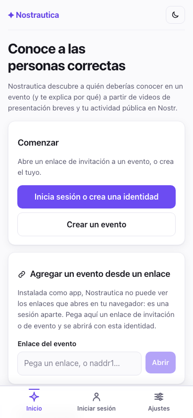

## 1. Abre tu enlace de invitación

Toca el enlace que te dieron. Verás el **Resumen** del evento (qué es, cuándo
y dónde) y un botón para unirte. Si el organizador publicó algún anuncio,
también aparece aquí.

Una vez dentro de un evento, la barra inferior gira en torno a *ese* evento:
**Resumen** (donde estás ahora), **Personas**, **Novedades** y **Más** (tu
cuenta, ajustes, otros eventos) están siempre en la barra. Aparecen dos
pestañas más cuando el organizador las activa: **Charlas** (§4.5) y **Chat**
(§5.5). Charlas queda justo después de Resumen cuando el organizador configuró
las charlas para verse *antes* del evento ("prerecord-first"), y justo
después de Personas en caso contrario. Chat queda después de Personas, o
después de Charlas si ambas están activas. Si no ves alguna de las dos, es
simplemente que este evento no las usa. Un pequeño encabezado arriba siempre
te dice en qué evento estás y si eres visitante, si estás esperando
aprobación, o si ya estás dentro.

### Si instalaste Nostrautica en la pantalla de inicio

Una aplicación instalada es su propio navegador. Un enlace que tocas dentro de
una app de chat se abre en Safari o Chrome, que no sabe nada de la identidad
que creaste dentro de la app (es otra sesión, sin eventos), así que la
invitación llega justo al único lugar donde no se puede usar, y parece que el
enlace del organizador está roto.

Mejor copia el enlace, abre Nostrautica desde la pantalla de inicio y pégalo
en **Agregar un evento desde un enlace**, en la pantalla de eventos. Se abre
exactamente igual que si lo hubieras tocado, con código de invitación
incluido. También funciona con una dirección `naddr1…` sola, y con el enlace
de una comunidad permanente en vez de un evento con fecha.

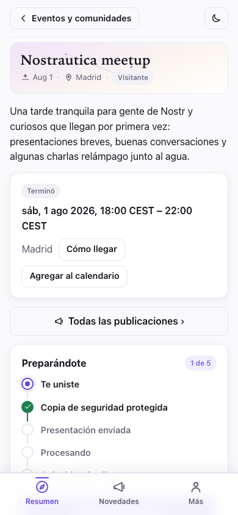

## 2. Únete

Toca **Únete a este evento** y completa cómo quieres que te conozcan:

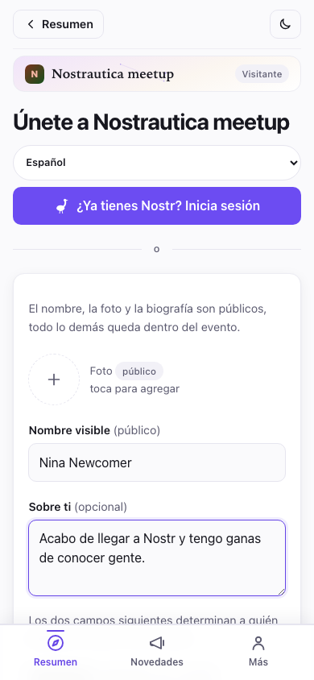

- **Foto, nombre y "Sobre ti"**: este es tu perfil público, como en cualquier
  red social. El propio formulario lo dice: el nombre, la foto y la
  biografía son públicos, todo lo demás queda dentro del evento.
- **Habilidades** y **¿Qué buscas?**: sobre esto funciona el emparejamiento.
  Da detalles concretos: "programo en rust, quiero cofundar algo" es mejor
  que "entusiasta de la tecnología". El minuto extra vale la pena. Puedes
  saltarte ambos campos, y también la biografía, y aun así unirte. El
  formulario solo avisa, con suavidad, de que todavía no hay nada con qué
  emparejarte.
- Hay una casilla para **publicar una confirmación de asistencia pública** si
  quieres que otros vean que vas a asistir. Déjala sin marcar si prefieres que
  tu asistencia quede solo dentro del evento.

Nada de correo, nada de contraseña, ningún registro. Cuando tocas **Crear
identidad y unirte**, la aplicación te crea al instante una identidad
portátil (más sobre esto al final: es un buen extra).

> **¿Ya usas algo de esto?** Si tocas **¿Ya tienes Nostr? Inicia sesión**,
> puedes iniciar sesión con tu clave existente, una extensión del navegador o
> una aplicación firmadora en el teléfono (como Amber o Clave). Tu perfil
> existente se traslada y se muestra de solo lectura. La aplicación nunca lo
> modifica.
>
> 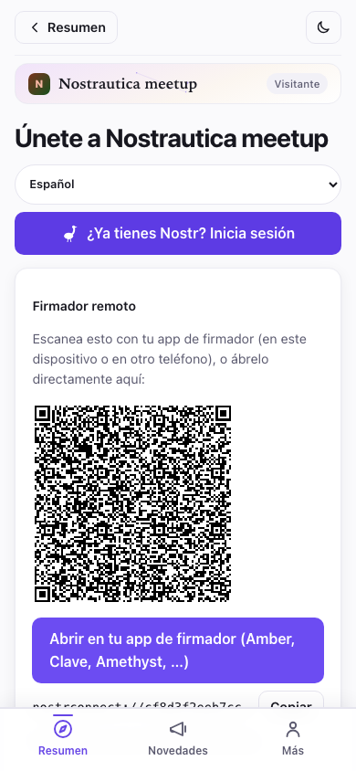

Si tu perfil en Nostr ya tiene una biografía, aquí se usa tal cual. Si no la
tiene, el formulario para unirte te da tu propio recuadro **"Sobre ti"**:
texto solo para este evento, que nunca se escribe de vuelta en tu perfil de
Nostr. En cualquier caso, **habilidades** y **qué buscas** siempre los
completas de nuevo, son específicos de este evento.

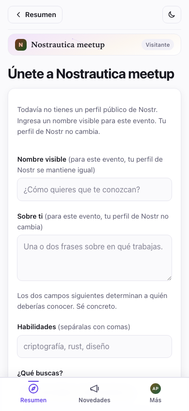

Si el organizador puso un límite de cuánto tiempo el evento conserva tus
datos, lo verás directo en el formulario, algo como *"Los datos de este
evento se eliminan 90 días después de que termine."* Es un ajuste de limpieza
propio del organizador, no algo que tú configures, y solo se avisa de
antemano para que sepas con qué estás de acuerdo.

Después de enviarlo, pasa una de dos cosas según el enlace que hayas usado:

- **Entras de inmediato** (enlaces de invitación, cuando el servicio de
  emparejamiento del organizador está activo). Verás una pantalla de "Ya
  estás dentro" con un botón para ver quién está aquí:

  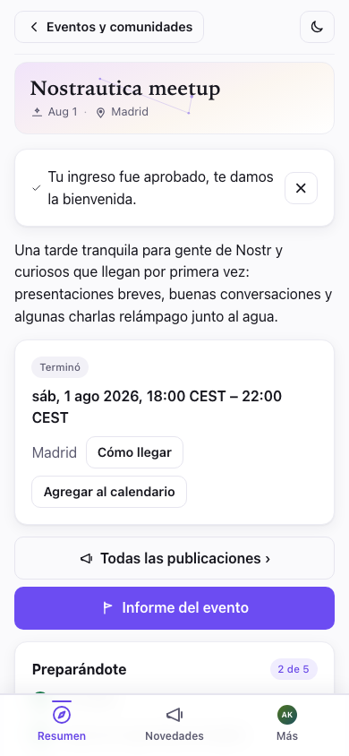

- **El organizador te aprueba en poco tiempo**: verás una pantalla de
  "esperando aprobación". Puedes cerrar la aplicación; entrarás en cuanto te
  aprueben.

  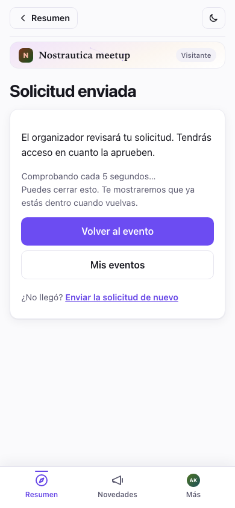

De vuelta en **Resumen**, una lista corta llamada **"Preparándote"** sigue
exactamente en qué punto estás (Te uniste → Copia de seguridad protegida →
Presentación enviada → Procesando → Coincidencias listas) y te muestra, en
primer plano, la *única* siguiente cosa por hacer. Nada de adivinar por qué
no aparecieron las coincidencias todavía: la lista te lo dice.

### También funciona con mal Wi-Fi en el lugar del evento

Más abajo, en esa misma página de Resumen, una vez que te aprobaron, hay una
tarjeta de **Descargar para uso sin conexión**. Tócala y la aplicación
descarga por adelantado a las personas, las coincidencias y las charlas, *y
además* carga las pantallas que las muestran (Personas, Charlas, la página de
una charla, Grabar, Mi perfil, Novedades), así que todo se puede explorar
incluso sin señal, algo útil en una sala llena donde todos los teléfonos
compiten por la misma conexión débil. Las versiones anteriores descargaban
los datos, pero aun así podían fallar al *abrir* una pantalla como Charlas
sin conexión; ahora las pantallas se descargan junto con todo lo demás. Sigue
sin descargar por adelantado los propios videos y audios (solo todo lo
demás), y puedes tocar **Actualizar copia sin conexión** cuando quieras para
refrescarla. Si algo no se pudo descargar, la tarjeta lo dice en vez de
aparentar que está completa.

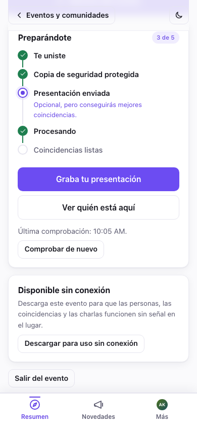

### Guarda tu clave (30 segundos, hazlo de verdad)

Después de unirte, la aplicación te muestra una **tarjeta de copia de seguridad**
con tu clave secreta. Toca **Copiar mi clave secreta** y pégala en tu gestor
de contraseñas. Es la única forma de volver a tu cuenta si pierdes el
teléfono. No hay ningún correo de "olvidé mi contraseña", porque no hay
ninguna empresa que guarde tu cuenta. ("Más formas de hacer una copia de
seguridad" puede enviarte por correo un enlace de recuperación o crear un
archivo protegido con contraseña.)

## 3. Graba tu presentación

Esta es la parte que hace bueno el emparejamiento. Es **opcional**: sin ella
igual te emparejan, a partir de tu actividad pública en Nostr y la biografía
de tu perfil, pero con una presentación el emparejamiento tiene mucho más con
qué trabajar. Desde la página del evento, toca **Graba o actualiza tu
presentación**. Tienes tres formas de presentarte. Elige la que prefieras:

> **¿Vale la pena molestarse?** Grabar una presentación es opcional, pero se
> recomienda. Le da al emparejamiento más con qué trabajar, así que obtienes
> mejores coincidencias. Los demás asistentes pueden reproducirla y hacerse
> una idea de si de verdad conectarían contigo. El emparejamiento no es solo
> proyectos y habilidades, también es una sensación que la IA no puede
> captar por sí sola. Y si grabas video, la gente te va a reconocer por él
> cuando te vea entre la multitud.

- **Video** (la opción predeterminada): toca **Activar cámara** y luego **●
  Grabar**. Habla hasta un minuto: quién eres, en qué trabajas, qué buscas.
  Presiona **■ Detener** (también se detiene sola al llegar al límite de
  tiempo), revisa cómo quedó y toca **Usar esta**, o **Volver a grabar**
  hasta que quedes conforme.
- **Audio**: la misma idea, sin cámara. Toca **Habilitar micrófono**, mira el
  medidor de nivel para confirmar que te está captando y luego toca **●
  Grabar audio**.
- **Texto**: sin grabar nada. Escribe unas frases sobre quién eres y qué
  buscas; alimenta tus coincidencias exactamente igual que una presentación
  hablada, y (a diferencia del video o el audio) nunca se transcribe nada: el
  texto que escribiste es lo único que sale de tu dispositivo.

Antes de subir nada, la aplicación te dice con claridad quién la procesa: los
asistentes del evento, el servicio de emparejamiento del organizador si
existe, y qué proveedores de IA ven el audio o la transcripción (o solo el
texto, en las presentaciones de texto). Tienes que marcar una casilla
confirmando que lo leíste. Nadie fuera de los asistentes de este evento puede
ver jamás la presentación en sí.

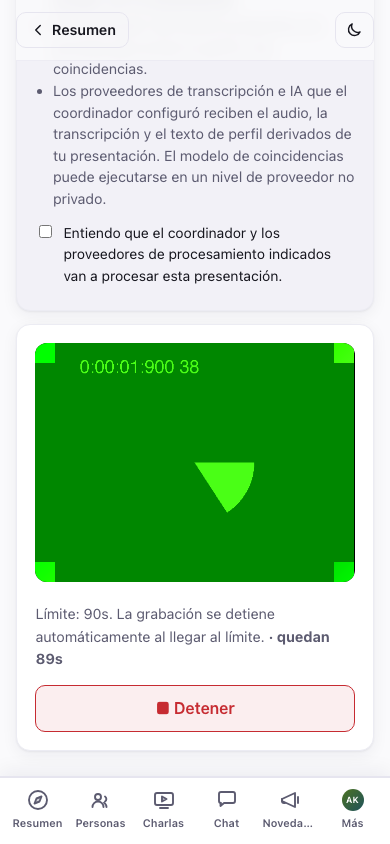

La aplicación se actualiza sola en segundo plano, pero nunca en un momento
que te cueste trabajo. Espera a que envíes o descartes tu grabación antes de
recargar, así una actualización no puede aparecer a mitad de una grabación y
hacerte perder una toma. (Si te parece que una actualización está esperando,
revisa Solución de problemas.)

**¿Ya grabaste una para otro evento?** Si es así, esta pantalla muestra una
**galería para reutilizar** arriba del grabador: cada video, audio o texto de
presentación que hayas hecho en cualquier evento anterior, cada uno con una
vista previa rápida para que los distingas. Reutiliza un video o audio tal
cual, o toca **Copia nueva** para volver a cifrarlo para este evento sin
grabar de nuevo; para el texto, **Usar este texto** lo coloca directo en el
editor para que lo envíes tal cual o lo ajustes primero. La biblioteca local
no guarda ni muestra el evento de origen, y si prefieres que la copia de este
evento no se pueda vincular con aquel, **Copia nueva** se encarga de eso
(Solución de problemas explica el mecanismo, si tienes curiosidad).

Las presentaciones en video y audio reciben una transcripción automática en
cuanto el servicio de emparejamiento del organizador las procesa. En tu
propia página o en la de cualquier otra persona, toca **Mostrar
transcripción** debajo del reproductor para leer mientras escuchas o buscar
algo en ella, o para cuando simplemente no puedas escuchar en ese momento:

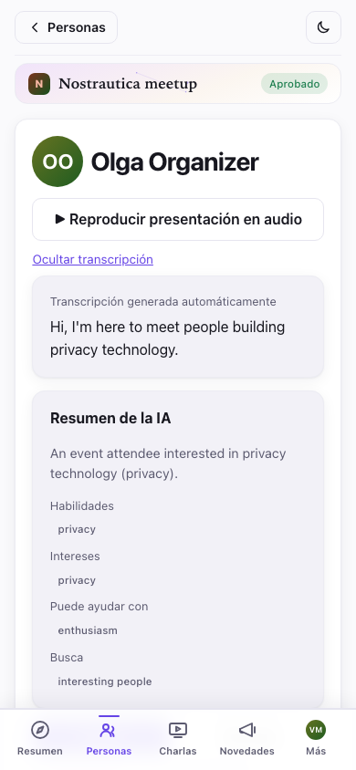

**Usa el idioma que quieras.** Graba tu presentación y escribe tu perfil en
el idioma en el que te sientas más cómodo. No tiene que coincidir con el
idioma del evento. La aplicación escribe tus coincidencias y resúmenes en el
idioma del evento, y si tu biografía está en otro idioma, le muestra a todos
una traducción con el texto original a un toque de distancia ("mostrar
original"). Así que exprésate, con tus propias palabras.

### Tu propio perfil del evento

En cuanto el servicio de emparejamiento procesa tu presentación, abre **Más →
Mi perfil del evento** para ver exactamente lo que ven de ti los demás,
dividido en dos mitades bien diferenciadas. **"Lo que escribiste"** reúne tu
"Sobre ti", habilidades, qué buscas, enlaces y tu presentación de texto si
enviaste una, editables directamente (o corregidos del todo volviendo a
grabar tu presentación). **"Generado a partir de tu presentación"** contiene
el resumen escrito por la IA, habilidades, intereses, en qué puedes ayudar y
qué buscas, todo deducido de lo que grabaste. ¿Algo salió mal en la mitad
generada? Edita cualquier campo, ocúltalo, o esconde toda la sección de IA y
muestra solo lo que escribiste tú. También hay una nota rápida de **"Reportar
un problema"** por si algo está mal y prefieres avisarlo en vez de
corregirlo por tu cuenta. Guarda, y los demás asistentes ven tu corrección de
inmediato, y su vista de tu perfil muestra una pequeña insignia de **"Editado
por el asistente"** para que sepan que no es puramente automático.

## 4. Personas

Toca **Personas** en la barra inferior para ver quién está en el evento. Es
una sola lista, y tus coincidencias, si tienes alguna, van arriba de todo.

Un **campo de búsqueda** arriba encuentra personas por nombre, biografía o
habilidad.

Si el coordinador ya te emparejó con alguien, esas personas aparecen primero,
agrupadas bajo los encabezados **Coincidencias fuertes** y **Buenas
coincidencias**. Cada coincidencia muestra el nombre de la persona, una línea
de su propia biografía y todo el razonamiento de por qué deberían conocerse,
justo ahí en la fila. Debajo, una sección plegada de **Temas para romper el
hielo** guarda las líneas de apertura que sugiere el coordinador.

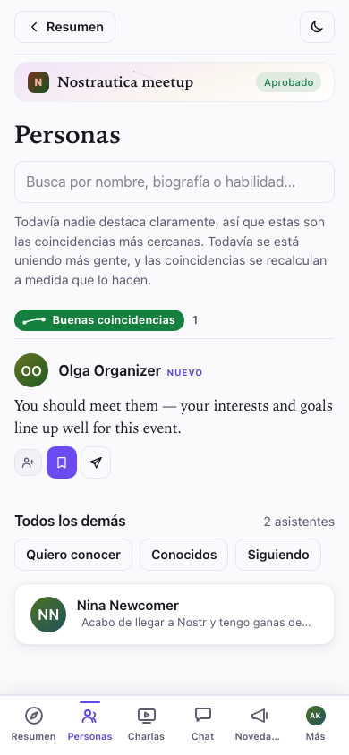

Si todavía nadie destaca con claridad, una línea arriba de la lista lo dice:
son tus personas más cercanas por ahora, y las coincidencias se recalculan a
medida que se une más gente.

Debajo de las coincidencias, un encabezado de **Todos los demás** muestra el
número de asistentes, luego los botones de filtro **Quiero conocer** /
**Conocidos** / **Siguiendo**, y después el resto de la lista completa, fila
por fila: un avatar (su foto, o sus iniciales sobre un cuadro de color),
nombre y habilidades. La lista se va llenando a medida que responden los
relays: las personas aparecen conforme se descifran (los nombres y las fotos
se completan un momento después), así que una lista grande en una conexión
lenta nunca se queda esperando al relay más lento. Si buscas, o tocas un
filtro, las secciones se juntan en una sola lista plana de resultados.

Cada persona, sea coincidencia o no, tiene las mismas tres acciones rápidas
en su fila: **seguir**, **quiero conocer** y **mensaje**. Puedes usar las
tres sin abrir su página.

La lista de asistentes está **cifrada para los asistentes aprobados**, así
que hasta que te aprueben (o justo en el momento antes de que se sincronice)
la pantalla Personas se queda vacía y te dice por qué. Eso es el modelo de
privacidad funcionando, no un error:

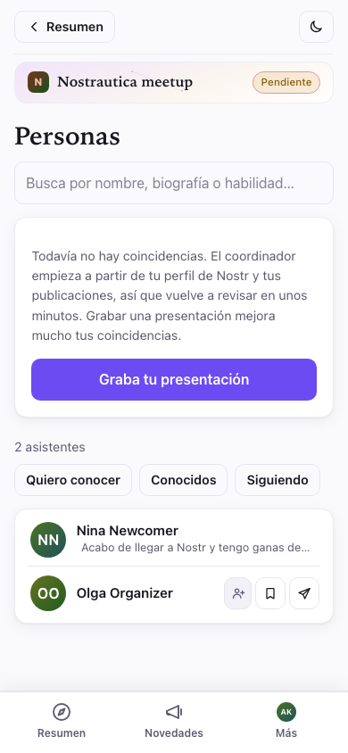

Toca el nombre o la fila de una persona para abrir su página: su video de
presentación, en qué trabaja, qué busca, un resumen escrito por la IA una vez
que corrió el emparejamiento, y sus publicaciones públicas recientes. Si es
una coincidencia tuya, la página repite el razonamiento y agrega **Detalles
de la puntuación** (similitud, complementariedad y puntuación general, en
porcentajes) y un botón de **Preséntanos**.

En la página de una persona puedes **Seguir** a esa persona, tocar
**Mensaje** para iniciar un chat privado (ver §5) y, en privado (nadie más ve
esto jamás), marcar **Quiero conocer** o **Ya nos conocimos ✓**, y dejar una
nota privada ("el baterista con la startup de redes mesh"). Vuelve a cargar
la página y todo queda guardado. En una coincidencia, **Mensaje** abre el
editor ya con la línea de apertura sugerida por el coordinador, que puedes
editar o borrar antes de enviar. Si alguien te está molestando, **Silenciar**
lo saca de tu lista de Personas y de tus mensajes (es un silenciamiento
estándar de Nostr, así que también se aplica en otras aplicaciones de Nostr):

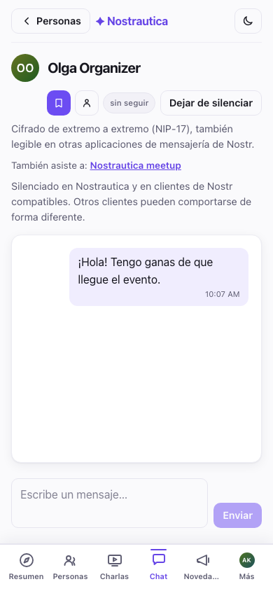

En el evento, usa la lista: busca a tus mejores coincidencias, menciona que
la aplicación te lo dijo. No hay mejor manera de romper el hielo.

> Las coincidencias solo aparecen cuando el coordinador del organizador
> procesó las presentaciones de unas cuantas personas, así que si todavía
> nadie destaca, solo significa que la sala apenas se está calentando. Graba
> primero tu propia presentación (§3); eso es lo que te pone en las
> coincidencias de los demás.

## 4.5 Charlas (si el organizador las activó)

Algunos eventos permiten que los asistentes envíen charlas cortas
pregrabadas en vez de reunirse en persona, o antes de hacerlo. Si está
activado para tu evento, aparece una pestaña de **Charlas** en la barra
inferior. Toca **Enviar una charla**, dale un título y una descripción
corta, y luego elige cómo vas a dar el video:

- **Grabar**lo en el navegador (como tu presentación, §3),
- **Subir archivo** si ya tienes uno, o
- **Pegar una URL**: un enlace de **YouTube** que no sale en las búsquedas o
  un enlace directo a un **.mp4**. Esta es la opción para una charla
  demasiado pesada para subir; el video se queda donde lo alojes y solo el
  *enlace* queda cifrado para el evento.

También hay una casilla de **"¿Procesar esta charla para las
coincidencias?"**, desactivada por defecto: déjala así y tu charla simplemente
se publica para que la gente la vea; actívala y el coordinador también la
transcribe y la usa para afinar tus coincidencias. (Las charlas con URL
pegada nunca se procesan: son solo para ver.) De cualquier forma, la charla
pasa primero por el organizador para publicarse antes de que nadie la vea,
así que no esperes que aparezca al instante.

Al pegar un enlace, la aplicación confirma enseguida que lo reconoció:

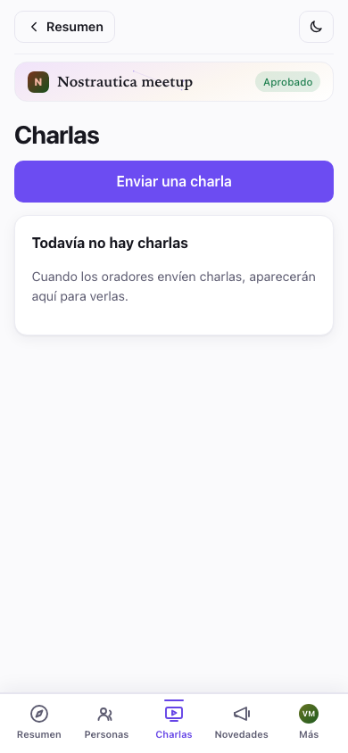

Ver una charla recuerda dónde te quedaste, así que puedes cerrar la
aplicación y retomarla después, y el reproductor tiene un **control de
velocidad** (1×/1,5×/2×) para avanzar más rápido en una charla larga. Hay
transcripción disponible cuando quien la presentó activó el procesamiento.

## 5. Escribe a otras personas

La página de cualquier persona tiene un botón de **Mensaje**. Tócalo para
abrir una conversación privada y **cifrada de extremo a extremo**:

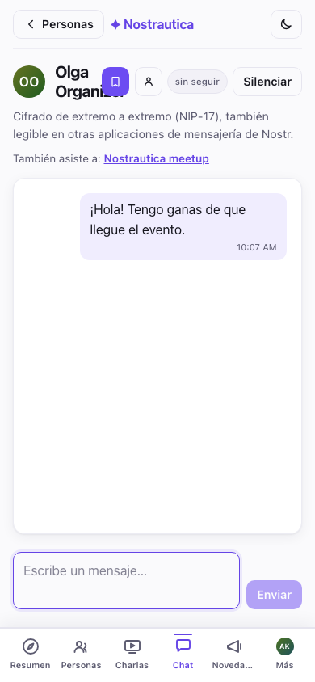

Tus mensajes viven bajo **Más → Mensajes**, que lista cada conversación, la
más reciente primero:

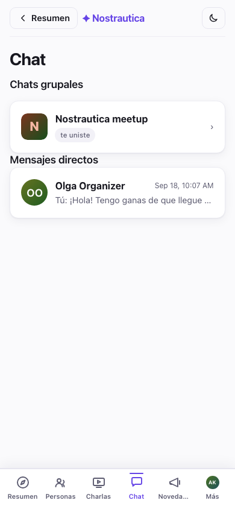

Como son mensajes privados estándar de Nostr, **también funcionan con otras
aplicaciones de mensajería de Nostr**: la otra persona puede responder desde
la app de Nostr que use, y tu conversación aparece ahí también. No está
encerrada dentro de este evento.

## 5.5 Chat grupal (experimental)

Si el organizador activó el **Chat grupal**, aparece una pestaña de **Chat**
en cuanto te aprueban: una sola sala cifrada para todo el evento, separada de
los mensajes uno a uno. Funciona como cualquier chat: los mensajes aparecen
en la sala a medida que la gente los envía, los separadores de día marcan el
paso del tiempo, y puedes alternar entre una vista de burbujas y un registro
compacto estilo IRC con un interruptor arriba de los mensajes. Es de verdad
cifrado de extremo a extremo (un protocolo llamado Marmot/MLS), aunque el
servicio de emparejamiento del organizador administra el grupo (agrega y
quita personas conforme las aprueban o las revocan) y puede leerlo. La
aplicación te lo dice de antemano, cada vez que abres la pestaña.

**Funciona en todos tus dispositivos, automáticamente.** Abre la pestaña Chat
en un segundo teléfono o en otro navegador y se une al grupo por sí solo, sin
ningún código que escanear ni ningún paso de emparejamiento previo. Hay algo
que viene directo de cómo funciona el protocolo, no es un error: un
dispositivo solo ve los mensajes enviados *después* de unirse. No hay forma
de sincronizar el historial en un dispositivo recién agregado.

Esta función está marcada como **Experimental** por una razón: es nueva (la
interoperabilidad con otras aplicaciones compatibles con Marmot está
planeada, pero todavía no es algo con lo que contar), y unirte al grupo puede
tardar un poco, o de vez en cuando necesitar un reintento, antes de que
empiecen a llegar los mensajes. Si la pestaña se queda atascada en
"configurando", dale unos minutos y vuelve a abrirla.

## 6. Tu informe del evento

En cualquier momento, antes, durante o después del evento, abre **Informe
del evento** desde el menú del evento para ver un resumen ordenado de tu
paso por él, construido enteramente con tus propias marcas de **quiero
conocer** / **ya nos conocimos** y notas (§4). Se mantiene activo y
editable incluso después de que termine el evento, así que refleja lo que de
verdad pasó en el lugar, no solo a quién planeabas ver de antemano.

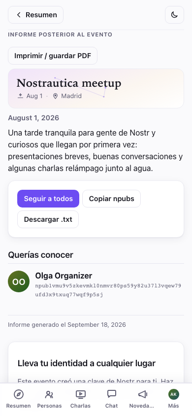

Está organizado en **Personas que conociste**, **Querías conocer** (personas
que marcaste pero con las que no llegaste a conectar), tus **charlas
favoritas** y tus notas privadas. Tres formas de conservar los contactos una
vez que estés de vuelta en casa:

- **Seguir a todos**: un solo toque, con una lista para desmarcar antes a
  quien prefieras no seguir. Es un único agregado a tu propia lista de
  seguidos de Nostr, hecho de forma local. La aplicación nunca publica una
  lista pública de "estas son las personas que conocí en este evento", así
  que a quién conociste de verdad sigue siendo asunto tuyo.
- **Copiar npubs** / **Descargar .txt**: una lista simple de nombres y
  npubs, para pegar en tu propia app de notas. También es solo local, nada
  se publica.
- **Imprimir / guardar PDF**: una impresión limpia y sin adornos del informe
  mismo, para quienes prefieren conservar un rastro en papel.

Si te uniste con una identidad creada por la aplicación, el informe termina
con **Lleva tu identidad a cualquier lugar**: un empujón más, con un enlace
directo, para hacer una copia de seguridad de tu clave y verla funcionando en
Primal, Damus, Amethyst o Yakihonne: el mismo momento de "cambiar a Nostr"
que se describe más abajo, justo cuando es más relevante.

## 7. Después: tu perfil es tuyo para quedártelo

Sorpresa: la cuenta que acabas de usar es una **identidad de Nostr**: un
inicio de sesión que te pertenece a ti, no a esta aplicación ni a ninguna
empresa. La pestaña **Más** empieza con una tarjeta de identidad que muestra
tu foto, tu nombre y tu dirección pública (tu *npub*). Toca el npub para
copiarlo:

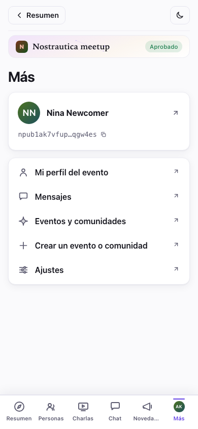

Toca la tarjeta para abrir tu perfil completo, copiar tu clave secreta y
saltar a otras aplicaciones de Nostr.

Las personas que seguiste en el evento, tu perfil, todo eso funciona en todo
un ecosistema de aplicaciones sociales (Primal, Damus, Amethyst,
Yakihonne…). Copia tu clave, abre una de ellas, elige "iniciar sesión con una
clave" y pégala. Ya estás ahí.

Una cosa más: **Más → Ajustes** tiene modo oscuro y un selector de idioma
(inglés, eslovaco, checo, alemán y español), y tu elección se mantiene:

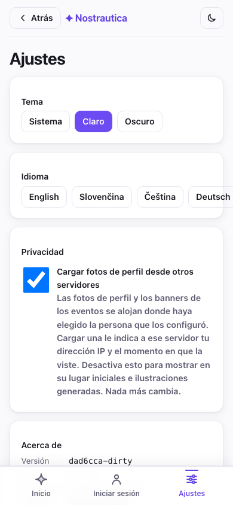

> **Publicaciones del organizador y notas solo para miembros.** Bajo
> **Novedades** encontrarás los anuncios del organizador. Algunos pueden ser
> **solo para miembros**, cifrados para que solo los asistentes aprobados
> puedan leerlos (la dirección de la fiesta posterior, un código de la
> puerta). Si alguna vez ves una publicación con un candado y el texto
> "Únete para leer", es una publicación solo para miembros a la que todavía
> no tienes acceso.

## Si necesitas irte

¿Te uniste al evento equivocado, o simplemente cambiaste de opinión? Abre el
evento, desplázate hasta abajo y toca **Salir del evento**. Confirma, y la
aplicación envía una solicitud de salida: tu entrada en el directorio,
coincidencias y presentación se limpian del lado del coordinador (o del
organizador), y quedas fuera. Puedes volver a unirte más tarde; se trata
como una solicitud de unión completamente nueva, no como una resurrección de
la anterior.

## Privacidad, en un párrafo

Tu nombre, foto y biografía son públicos (eso es tu perfil). Tu video de
presentación, la lista de asistentes y tus coincidencias están **cifrados
para que solo los vean los asistentes aprobados de este evento**, no el
público y no las personas a las que no dejaron entrar. Tus marcas de quiero
conocer o ya nos conocimos y notas privadas están cifradas para que
**solo tú** puedas verlas. Tus mensajes están cifrados de extremo a extremo
entre tú y la otra persona. El emparejamiento corre sobre un servicio de IA
elegido por el organizador, que lee presentaciones y perfiles para escribir
sus recomendaciones. Esto es lo que ve alguien externo si abre la lista de
asistentes. Nada:

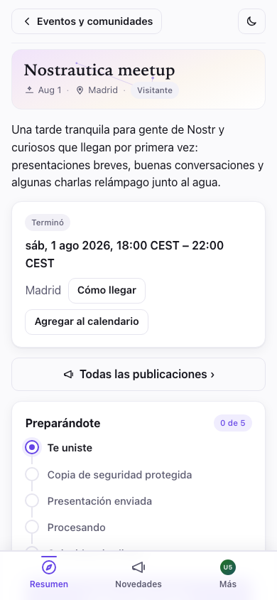

## Solución de problemas

- **Sigo en "esperando aprobación".** A menos que hayas usado un enlace de
  invitación, el organizador aprueba a las personas a mano, así que dale
  unos minutos, o búscalo en el evento. Puedes cerrar la aplicación sin
  problema; revisa de nuevo abriendo otra vez el enlace del evento.

- **El enlace de invitación abrió un navegador donde no tengo sesión
  iniciada.** La aplicación instalada es un navegador distinto del que abre
  los enlaces. Copia el enlace, abre Nostrautica desde la pantalla de inicio
  y pégalo en **Agregar un evento desde un enlace**, en la pantalla de
  eventos (§1).

- **La cámara no arranca.** El teléfono o el navegador está pidiendo permiso
  de cámara. Busca el aviso (a menudo en la barra de direcciones) y
  permítelo. Si no aparece ningún aviso, prueba con otro navegador.

- **Tengo un teléfono nuevo, o borré el navegador.** Abre la aplicación,
  toca **¿Ya tienes Nostr? Inicia sesión → Pegar una clave** y pega la clave
  secreta que guardaste al unirte. Misma cuenta, mismos eventos. (Por eso
  importa guardar esa clave.) Si tú organizaste un evento, tu acceso
  completo de organizador (aprobar personas, la pantalla de administración,
  todo) vuelve también, de forma automática, con esa misma clave; no
  necesitas una copia de seguridad aparte del evento en sí.

- **Todavía no aparecen coincidencias.** Grabar una presentación es la
  mejora individual más grande que puedes hacer aquí. Después de eso, las
  coincidencias tardan un poco en calcularse y necesitan que se unan y
  graben también otras personas. Revisa de nuevo pronto.

- **No veo la lista de asistentes ni los videos.** Primero te tienen que
  aprobar. Si te acaban de aprobar, vuelve a abrir el evento y dale un
  momento.

- **Toqué Salir del evento pero sigue apareciendo pendiente.** Si estabas
  sin conexión cuando lo tocaste, la solicitud queda en cola y la aplicación
  te dice con claridad que todavía no has salido. Se envía en cuanto vuelvas
  a conectarte.

- **¿Por qué parece que la aplicación está esperando para actualizarse?**
  Pospone la recarga mientras estás grabando, mientras tienes una toma
  terminada pero sin enviar, un archivo o una URL de charla todavía sin
  enviar, o una presentación escrita como borrador, para que una
  actualización no pueda aparecer en un momento que te cueste trabajo.
  Mientras espera, nada se guarda en el disco, así que no dejes una toma
  terminada ahí por días; envíala o descártala y la actualización se aplica
  justo después.

- **¿Reutilizar una presentación antigua me vincula entre eventos?**
  Reutilizar un video o audio tal cual mantiene el mismo bloque cifrado, así
  que su hash público de texto cifrado puede vincular tu presencia en dos
  eventos. **Copia nueva** vuelve a cifrar el archivo con una clave e IV
  nuevos, le da un hash nuevo y evita ese vínculo específico, aunque no
  puede borrar otros metadatos ni copias ya publicadas en otro lugar.

- **Quiero administrar mis dispositivos de chat.** Abre **Chat →
  Dispositivos de chat** para ver cada dispositivo conectado a tu cuenta en
  este evento, renombrar el que estás usando o quitar los que ya no uses (un
  teléfono viejo, un navegador que borraste).

- **El chat grupal está atascado, o no envía y dice que tal vez me
  quitaron.** Toca **Volver a unirte a este chat** (aparece junto al error, o
  bajo el aviso de "configurando"). Le pide al servicio del organizador que
  vuelva a agregar tu dispositivo. Por lo general tarda menos de un minuto y
  conserva el dispositivo en el que estás; como con cualquier dispositivo
  recién agregado, tu vista de la conversación continúa desde ese punto.
