# Nostrautica — Príručka účastníka

Niekto vás pozval na podujatie, ktoré beží na Nostrautike. O čo ide: nahráte si krátke video, v ktorom sa predstavíte, a ešte pred začiatkom podujatia vám aplikácia povie, **koho presne sa oplatí stretnúť — a prečo**. Už žiadne dúfanie, že pri kávovare narazíte na tú správnu osobu.

Päť minút nastavenia, celé na telefóne.

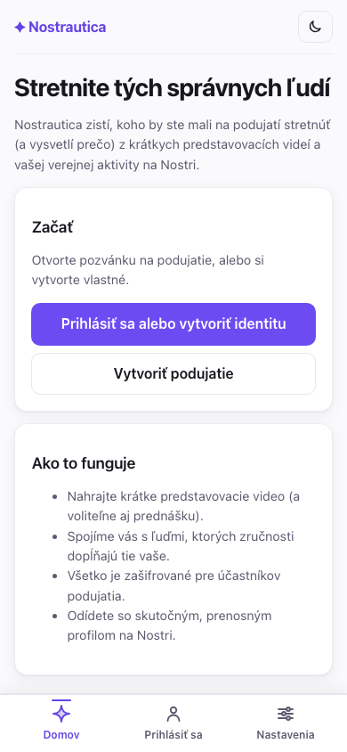

## 1. Otvorte si svoj pozývací odkaz

Klepnite na odkaz, ktorý ste dostali. Zobrazí sa vám **Prehľad** podujatia — čo to je, kedy a kde — a tlačidlo na pripojenie. Ak organizátor zverejnil nejaké oznámenia, aj tie sa objavia hneď tu.

Keď ste vnútri podujatia, spodná lišta sa celá týka *tohto* podujatia: **Prehľad** (kde ste teraz), **Ľudia**, **Spojenia**, **Novinky** a **Viac** (váš účet, nastavenia, ostatné podujatia). Ďalšie dve karty sa objavia len vtedy, keď organizátor tie funkcie zapne: **Prednášky** (§4.5) a **Chat** (§6.5) — ak ich nevidíte, toto podujatie ich jednoducho nepoužíva. Malá hlavička navrchu vám vždy hovorí, v ktorom podujatí ste a či ste návštevník, čakáte, alebo ste vnútri.

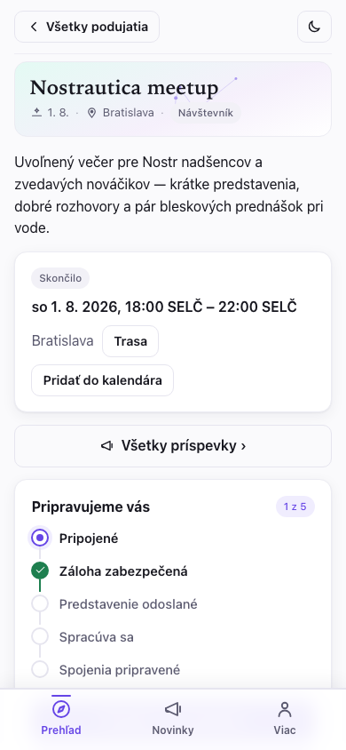

## 2. Pripojenie

Klepnite na **Pripojiť sa k podujatiu** a vyplňte, ako by vás mali ľudia poznať:

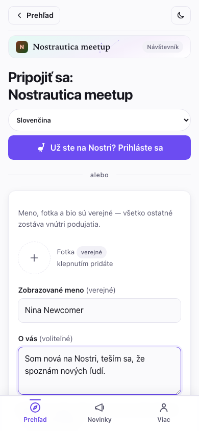

- **Fotka, meno a „O vás"** — toto je váš verejný profil, ako v ktorejkoľvek sociálnej aplikácii. Formulár to aj hovorí: *„Meno, fotka a bio sú verejné — všetko ostatné zostáva vnútri podujatia."*
- **Zručnosti** a **Čo hľadáte?** — na tomto beží párovanie. Buďte konkrétni: „rust developer, hľadám spoluzakladateľa" je lepšie ako „technologický nadšenec". Tá minútka navyše sa oplatí. Preskočte oboje, aj bio, a aj tak sa môžete pripojiť — formulár len jemne upozorní, že párovanie zatiaľ nemá z čoho vychádzať.
- Je tam aj políčko na **zverejnenie verejného RSVP**, ak chcete, aby ostatní videli, že sa zúčastníte. Nechajte ho odškrtnuté, ak si chcete účasť nechať len vnútri podujatia.

Žiadny e-mail, žiadne heslo, žiadna registrácia. Keď klepnete na **Vytvoriť identitu a pripojiť sa**, aplikácia vám na mieste vytvorí prenosnú identitu (viac o tom na konci — je to pekný bonus).

> **Už niečo z toho používate?** Ak klepnete na **Už ste na Nostri? Prihláste sa**, môžete sa namiesto toho prihlásiť svojím existujúcim kľúčom, rozšírením prehliadača alebo podpisovacou appkou v telefóne (napríklad Amber alebo Clave). Váš existujúci profil sa prenesie a zobrazí sa ako needitovateľný — aplikácia ho nikdy nemení.
>
> 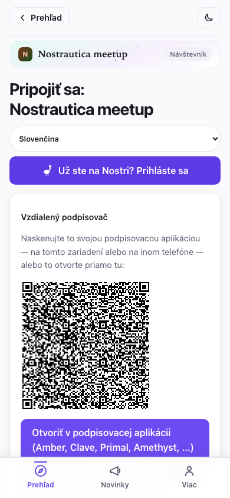

Ak váš profil na Nostri už má bio, použije sa tu presne také, aké je. Ak žiadne nemá, formulár na pripojenie vám ponúkne vlastné políčko **„O vás"** — text len pre toto podujatie, ktorý sa do vášho profilu na Nostri nikdy nezapíše. Tak či onak, **zručnosti** a **čo hľadáte** vždy vypĺňate nanovo — sú špecifické pre toto podujatie.

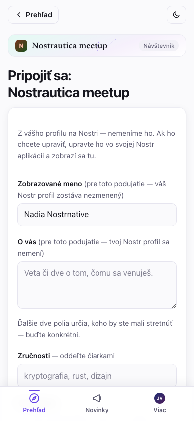

Ak organizátor nastavil limit na to, ako dlho si podujatie ponecháva vaše
údaje, uvidíte to priamo na prihlasovacom formulári — niečo v štýle *„Údaje z
tohto podujatia sa vymažú 90 dní po jeho skončení."* Je to organizátorovo
vlastné nastavenie čistenia dát, nie niečo, čo nastavujete vy; je to len
oznámené vopred, aby ste vedeli, s čím súhlasíte.

Po odoslaní sa stane jedna z dvoch vecí, podľa toho, aký odkaz ste použili:

- **Ste vnútri hneď** (pozývacie odkazy, keď beží organizátorova párovacia služba) — uvidíte obrazovku „Ste vnútri" s tlačidlom, kde uvidíte, kto tu je:

  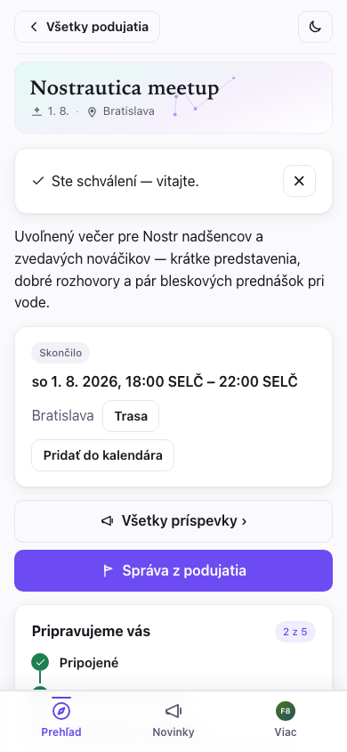

- **Organizátor vás čoskoro schváli** — uvidíte obrazovku „čaká sa na schválenie". Aplikáciu môžete zatvoriť; dostanete sa dnu, hneď ako vás schváli.

  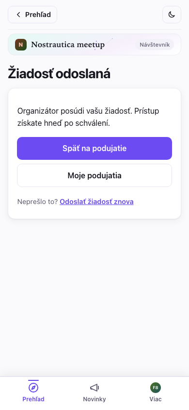

Späť na **Prehľade** vás krátky kontrolný zoznam **„Pripravujeme vás"** sleduje presne tam, kde ste — Pripojené → Záloha zabezpečená → Predstavenie odoslané → Spracúva sa → Spojenia pripravené — a ukazuje vám na prvom mieste *jednu* najbližšiu vec, ktorú treba urobiť. Netreba hádať, prečo sa spojenia ešte neukázali — zoznam vám to povie.

### Funguje aj so zlým Wi-Fi na mieste konania

Nižšie na tej istej stránke Prehľad, keď ste už schválení, nájdete kartu
**Stiahnuť na offline použitie**. Klepnutím na ňu si aplikácia vopred stiahne
ľudí, spojenia a prednášky *a zároveň načíta aj samotné obrazovky*, ktoré ich
zobrazujú (Ľudia, Spojenia, Prednášky, stránka prednášky, Nahrávanie, Môj profil,
Novinky), takže sa všetko dá prezerať aj bez signálu — hodí sa to v preplnenej
miestnosti, kde si všetky telefóny súperia o rovnaké slabé pripojenie. Staršie verzie
síce stiahli údaje, ale niektorú obrazovku (napríklad Prednášky) sa offline aj tak
nemuselo podariť *otvoriť*; teraz sa obrazovky sťahujú spolu s nimi. Samotné video a
zvuk sa vopred stále nesťahujú (len všetko ostatné, čo potrebujete), a kedykoľvek
môžete klepnúť na **Aktualizovať offline kópiu**, aby ste si ju obnovili. Ak sa
niečo nepodarilo stiahnuť, karta to povie namiesto toho, aby predstierala, že je
kompletná.

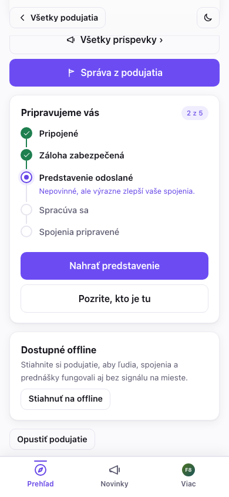

### Uložte si kľúč (30 sekúnd — naozaj to urobte)

Po pripojení vám aplikácia ukáže **záložnú kartu** s vaším tajným kľúčom. Klepnite na **Kopírovať môj tajný kľúč** a vložte ho do svojho správcu hesiel. Je to jediná cesta späť do vášho účtu, ak stratíte telefón — žiadny e-mail „zabudol som heslo" tu nie je, pretože žiadna firma váš účet nedrží. („Ďalšie spôsoby zálohovania" vám môžu poslať obnovovací odkaz e-mailom alebo vytvoriť súbor chránený heslom.)

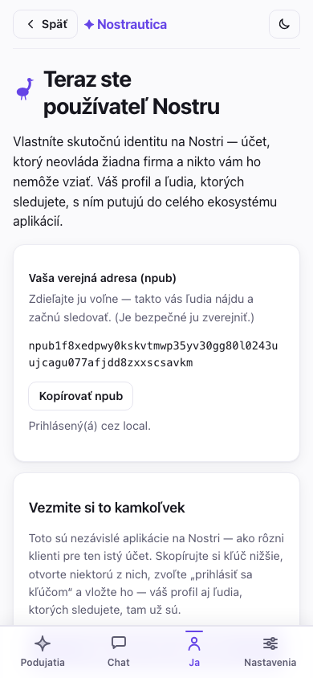

## 3. Nahratie predstavenia

Práve toto robí párovanie dobrým. Je **nepovinné** — aj bez predstavenia vás párovanie zahrnie, a to na základe vašej verejnej aktivity na Nostri a popisu v profile — ale s predstavením má párovanie oveľa viac podkladov. Na stránke podujatia klepnite na **Nahrať / aktualizovať predstavenie**. Máte tri spôsoby, ako sa predstaviť — vyberte si, ktorý vám vyhovuje:

> **Prečo sa s tým vôbec obťažovať?** Nahratie predstavenia je nepovinné, ale odporúčané. Dá párovaniu viac na prácu, takže dostanete lepšie spojenia. Ostatní účastníci si ho môžu prehrať a získať pocit, či by ste si naozaj sadli — párovanie nie je len o projektoch a zručnostiach, je to aj pocit, ktorý AI sama o sebe nedokáže zachytiť. A ak nahráte video, ľudia vás podľa neho naozaj spoznajú, keď vás zbadajú v dave.

- **Video** (predvolené) — klepnite na **Povoliť kameru**, potom na **● Nahrávať**. Hovorte až minútu: kto ste, na čom pracujete, čo hľadáte. Stlačte **■ Zastaviť** (zastaví sa aj samo pri časovom limite), pozrite si to späť a klepnite na **Použiť toto** — alebo **Nahrať znova**, kým nebudete spokojní.
- **Zvuk** — rovnaký princíp, bez kamery. Klepnite na **Povoliť mikrofón**, sledujte ukazovateľ úrovne, aby ste sa uistili, že vás zachytáva, a potom **● Nahrať zvuk**.
- **Text** — žiadne nahrávanie. Napíšte pár viet o tom, kto ste a čo hľadáte; do spojení vstupuje presne ako hovorené predstavenie a (na rozdiel od videa/zvuku) nič sa neprepisuje — text, ktorý ste napísali, je jediné, čo opustí vaše zariadenie.

Skôr než sa čokoľvek nahrá, aplikácia vám jasne povie, kto to spracúva — účastníci podujatia, organizátorova párovacia služba, ak existuje, a ktorí poskytovatelia AI vidia zvuk/prepis (alebo len text, pri textových predstaveniach) — a musíte zaškrtnúť políčko, že ste si to prečítali. Samotné predstavenie nikdy neuvidí nikto mimo účastníkov tohto podujatia.

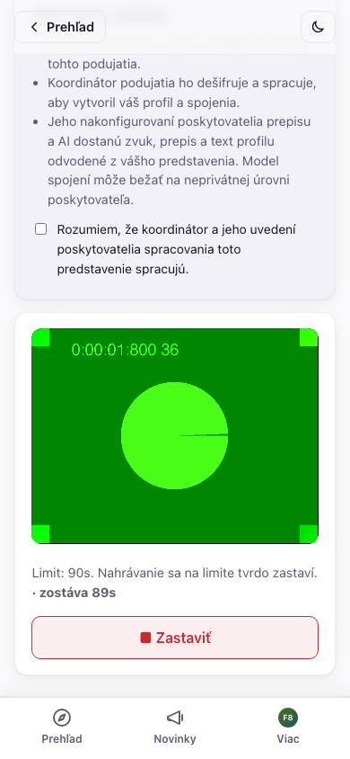

Aplikácia sa na pozadí sama aktualizuje, ale nikdy vo chvíli, ktorá by vás
pripravila o prácu — počká, kým to odošlete alebo zahodíte, až potom sa znova
načíta, takže aktualizácia sa nemôže trafiť doprostred nahrávania a pripraviť
vás o záber. (Ak sa vám zdá, že aktualizácia čaká, pozrite Riešenie
problémov.)

**Už ste niečo nahrali na inom podujatí?** Ak áno, na tejto obrazovke sa nad
nahrávaním zobrazí **galéria na opätovné použitie** — každé video, zvuk alebo
text, ktoré ste kedy vytvorili na ktoromkoľvek podujatí, s rýchlym náhľadom,
aby ste ich vedeli rozlíšiť. Video alebo zvuk môžete použiť tak, ako je, alebo
cez **Nová kópia** ho pre toto podujatie znova zašifrovať bez nového
nahrávania; pri texte vás **Použiť tento text** rovno prenesie do editora,
odkiaľ ho pošlete tak, ako je, alebo si ho ešte upravíte. Miestna knižnica
neukladá ani nezobrazuje pôvodné podujatie, a ak by ste chceli, aby sa kópia
pre toto podujatie nedala prepojiť s tým predošlým, postará sa o to **Nová
kópia** (mechanizmus je v Riešení problémov, ak vás zaujíma).

Video a zvukové predstavenia dostanú automatický prepis, keď ich spracuje organizátorova párovacia služba — na svojej alebo cudzej stránke klepnite pod prehrávačom na **Zobraziť prepis**, aby ste si to mohli prečítať popri sledovaní alebo v tom vyhľadávať, prípadne keď práve nemôžete počúvať:

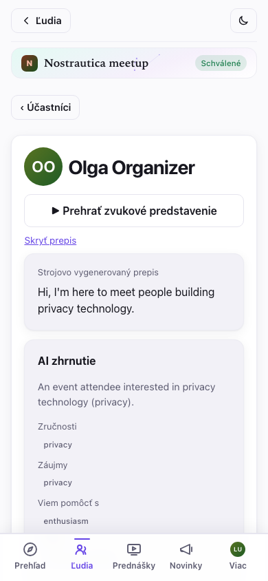

**Používajte akýkoľvek jazyk chcete.** Predstavenie nahrajte a profil napíšte v jazyku, v ktorom sa cítite najpohodlnejšie — nemusí sa zhodovať s jazykom podujatia. Aplikácia píše vaše spojenia a zhrnutia v jazyku podujatia, a ak je vaše bio v inom jazyku, každému zobrazí preklad s pôvodným textom na jedno klepnutie („zobraziť originál"). Takže buďte jednoducho sami sebou, vo vlastných slovách.

### Váš vlastný profil na podujatí

Keď párovacia služba spracuje vaše predstavenie, otvorte **Viac → Môj profil
na podujatí** a pozrite si presne to, čo o vás vidia ostatní, rozdelené na
dve úprimné polovice: **„Napísali ste"** — váš text o vás, zručnosti, čo
hľadáte, odkazy a textové predstavenie, ak ste ho poslali, priamo upraviteľné
(alebo poriadne opravené opätovným nahratím predstavenia) — a **„Vygenerované
z vášho predstavenia"** — AI-generované zhrnutie, zručnosti, záujmy, v čom
viete pomôcť a čo hľadáte, to všetko odvodené z toho, čo ste nahrali. Niečo
je zle vo vygenerovanej polovici? Ktorékoľvek pole upravte, skryte, alebo
skryte celú AI časť a ukážte len to, čo ste napísali sami. Je tam aj rýchla
poznámka „Nahlásiť problém", ak je niečo mimo a radšej to nahlásite, než by
ste to opravovali sami. Uložte, a ostatní účastníci vašu opravu uvidia
okamžite — ich pohľad na vás dostane malú značku **„Upravené účastníkom"**,
aby vedeli, že to nie je čisto automatické.

## 4. Ľudia

Klepnite na **Ľudia** v spodnej lište a prezerajte si, kto tu je. Každý riadok zobrazuje avatar (fotku, alebo iniciály na farebnej dlaždici), meno a zručnosti. **Hľadajte** podľa mena alebo zručnosti a filtrujte len na ľudí, ktorých ste si označili ako **chcem stretnúť**, **stretnuté**, alebo ktorých na Nostri **sledujete**. Každý riadok má aj rýchle akcie: označiť **chcem stretnúť** alebo začať **správu** bez otvárania jeho stránky.
Zoznam sa napĺňa priebežne, ako odpovedajú relaye — ľudia sa objavujú, ako sa dešifrujú (mená a fotky sa doplnia o chvíľu), takže veľký zoznam na pomalom pripojení nikdy nečaká na najpomalší relay.

Zoznam účastníkov je **zašifrovaný pre schválených účastníkov**, takže kým vás neschvália (alebo tesne po tom, než sa to ešte len synchronizuje), obrazovka Ľudia zostáva prázdna a povie vám prečo — to je model súkromia, ktorý funguje presne tak, ako má, nie chyba:

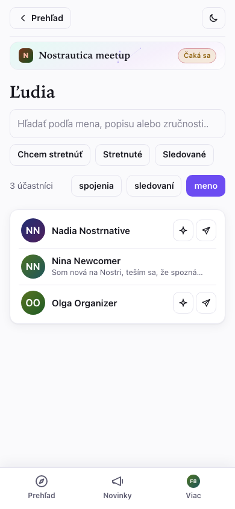

Keď ste vnútri, klepnutím na kohokoľvek otvoríte jeho stránku: predstavovacie video, čo robí, čo hľadá, AI-generované zhrnutie, ak už párovanie prebehlo, a jeho nedávne verejné príspevky.

Na stránke niekoho iného ho môžete **Sledovať**, klepnutím na **Napísať správu** začať súkromný chat (pozri §6), a — súkromne, tieto nikto iný nikdy neuvidí — označiť **Chcem stretnúť** alebo **Stretnuté ✓** a nechať si súkromnú poznámku („bubeník s mesh-network startupom"). Po znovunačítaní všetko zostane. Ak vás niekto obťažuje, **Stlmenie** ho skryje z vášho zoznamu Ľudia, zo Spojení aj zo správ (je to štandardné Nostr stlmenie, takže sa prenesie aj do iných Nostr aplikácií):

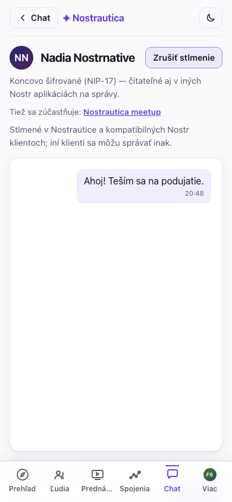

## 4.5 Prednášky (ak ich organizátor zapol)

Niektoré podujatia umožňujú účastníkom posielať krátke prednahraté prednášky namiesto stretnutia naživo — alebo ešte pred ním. Ak je to pre vaše podujatie zapnuté, v spodnej lište sa objaví záložka **Prednášky**. Klepnite na **Pridať prednášku**, dajte jej titulok a krátky popis a potom zvoľte, ako video poskytnete:

- **Nahrať** priamo v prehliadači (ako predstavenie, §3),
- **Nahrať súbor**, ktorý už máte, alebo
- **Vložiť URL** — neverejný **YouTube** odkaz alebo priamy **.mp4** odkaz. Toto je najlepšia voľba pre prednášku, ktorá je príliš veľká na nahranie; video zostáva tam, kde ho hostujete, a šifrovaný je pre podujatie len *odkaz*.

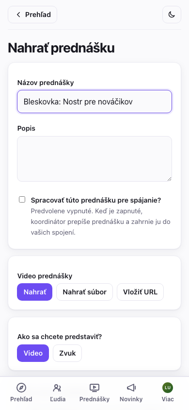

Je tu aj políčko **„Spracovať túto prednášku pre spájanie?"**, štandardne vypnuté: nechajte ho vypnuté a prednáška sa jednoducho zverejní na sledovanie; zapnite ho a koordinátor ju aj prepíše a použije na zlepšenie vašich spojení. (Prednášky s vloženou URL sa nikdy nespracúvajú — sú len na sledovanie.) Tak či onak ide prednáška k organizátorovi na zverejnenie, kým to nie je vidieť pre nikoho, takže nečakajte, že sa to objaví okamžite.

Po vložení odkazu appka hneď potvrdí, že ho rozpoznala:

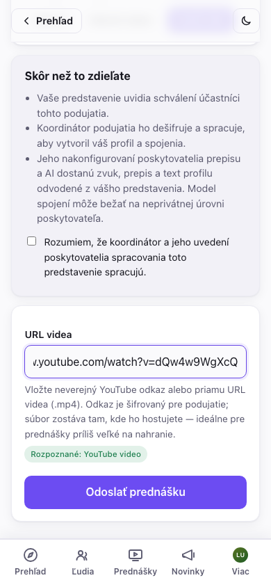

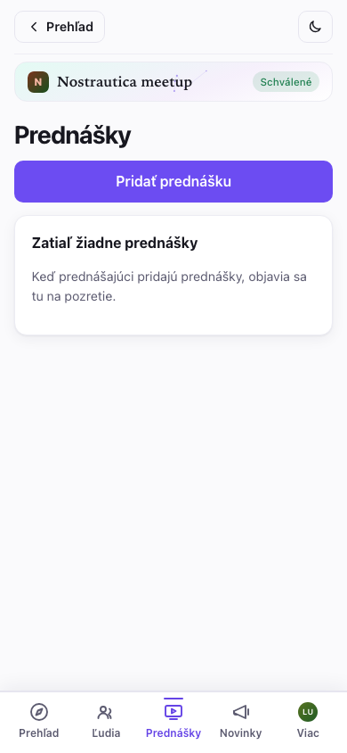

Sledovanie prednášky si pamätá, kde ste skončili, takže môžete zatvoriť aplikáciu a pokračovať neskôr, a prehrávač má **ovládanie rýchlosti** (1×/1,5×/2×) na rýchlejšie zvládnutie dlhej prednášky. Prepis je dostupný, keď rečník prednášku zapol na spracovanie.

## 5. Vaše spojenia

Krátko po nahratí predstavenia klepnite na **Spojenia**: rebríček ľudí, ktorých sa oplatí stretnúť. Každé vedie s tým, aká silná je zhoda — **Silná zhoda** alebo **Dobrá zhoda** —, farebne odstupňované na jedinej zelenej škále tak, že silnejšia zhoda je viditeľne jasnejšia a odlíšite ich skôr, než si prečítate čo i len slovo — a čo je najdôležitejšie, hneď navrchu je vysvetlenie v bežnom jazyku, *prečo by ste sa mali porozprávať*. Ak chcete mechaniku (nakoľko ste si podobní vs. nakoľko sa dopĺňate), je na jedno klepnutie pod „podrobnosti skóre" — ale dôvod je na prvom mieste. Zoznam sa aktualizuje, ako sa pridávajú ďalší ľudia. Klepnutím na spojenie otvoríte jeho celú stránku.

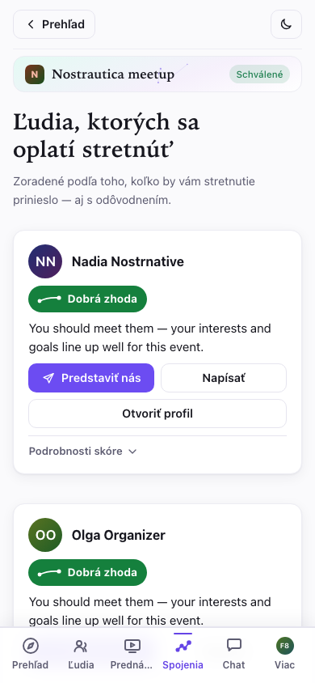

Na záložke **Spojenia** sa objaví malý odznak vždy, keď pribudnú nové
spojenia od vašej poslednej návštevy, takže nemusíte stále kontrolovať
zoznam, ktorý sa nezmenil.

Na podujatí ten zoznam využite: nájdite si svoje top spojenia, spomeňte, že vám to povedala aplikácia. Lepší icebreaker neexistuje.

> Spojenia sa objavia až vtedy, keď organizátorov koordinátor spracuje predstavenia pár ľudí — takže ak zoznam hovorí „zatiaľ žiadne spojenia", jednoducho to znamená, že sa miestnosť ešte len zapĺňa. Najprv nahrajte vlastné predstavenie (§3); práve to vás dostane do spojení ostatných.

## 6. Napíšte niekomu

Na stránke kohokoľvek je tlačidlo **Napísať správu**. Klepnutím naň otvoríte súkromnú, **koncovo šifrovanú** konverzáciu:

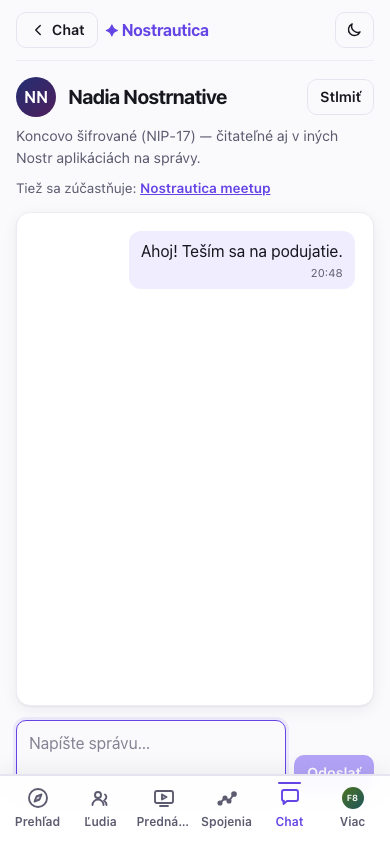

Vaše správy nájdete pod **Viac → Správy**, kde sú vypísané všetky konverzácie, najnovšie navrchu:

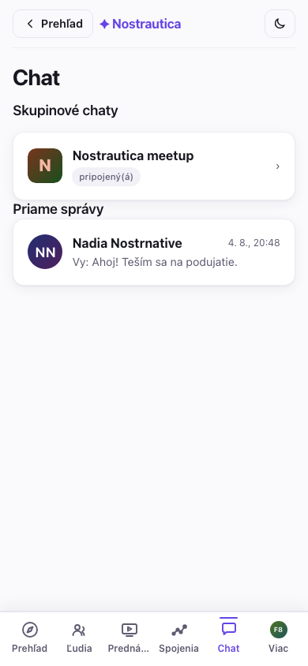

Keďže ide o štandardné súkromné Nostr správy, **fungujú aj s inými Nostr aplikáciami na správy** — druhá osoba môže odpovedať z ktorejkoľvek Nostr aplikácie, ktorú používa, a vaša konverzácia sa objaví aj tam. Nie je uzamknutá len na toto podujatie.

## 6.5 Skupinový chat (experimentálne)

Ak organizátor zapol **Skupinový chat**, hneď po schválení sa vám objaví záložka **Chat** — jedna zašifrovaná miestnosť pre celé podujatie, oddelená od súkromných správ. Funguje ako ktorýkoľvek chat: správy sa v miestnosti objavujú, ako ich ľudia posielajú, oddeľovače dní označujú plynutie času a medzi zobrazením v bublinách a kompaktným IRC-štýlovým logom môžete prepínať prepínačom nad správami. Je naozaj end-to-end šifrovaný (protokol s názvom Marmot/MLS), hoci ho prevádzkuje organizátorova párovacia služba (pridáva a odoberá ľudí, ako sú schválení alebo odobratí) a dokáže ho čítať — aplikácia vám to hovorí vopred, zakaždým, keď otvoríte záložku.

**Funguje naprieč všetkými vašimi zariadeniami, automaticky.** Otvorte
záložku Chat na druhom telefóne alebo v inom prehliadači a pripojí sa do
skupiny sám — žiadny kód na naskenovanie, žiadne párovanie. Jedna vec
vyplýva priamo z toho, ako protokol funguje, nie je to chyba: zariadenie
vidí len správy odoslané *po* tom, čo sa pripojilo — históriu na novo
pridané zariadenie nie je možné synchronizovať.

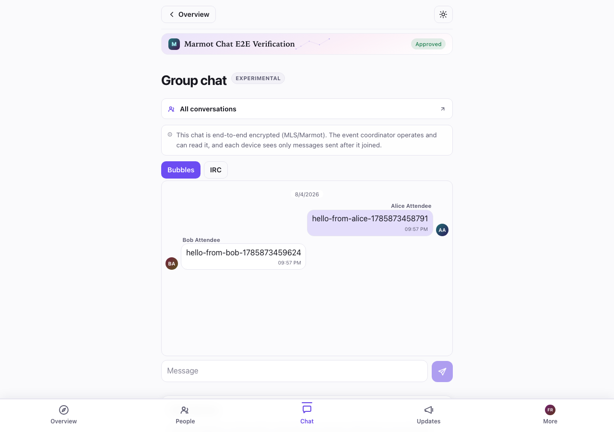

Táto funkcia je zámerne označená ako **Experimentálne**: je nová (spolupráca s inými Marmot-kompatibilnými appkami je v pláne, ale zatiaľ sa na ňu nespoliehajte) a pripojenie do skupiny môže chvíľu trvať, alebo občas potrebuje nový pokus, kým sa začnú objavovať správy. Ak záložka zostane zaseknutá na „nastavuje sa", dajte tomu pár minút a otvorte ju znova.

## 7. Váš report z podujatia

Kedykoľvek — pred, počas alebo po podujatí — otvorte **Report podujatia** z
menu podujatia a pozrite si prehľadné zhrnutie svojho podujatia, postavené
výhradne na vašich vlastných značkách **chcem stretnúť** / **stretnuté** a
poznámkach (§4). Zostáva živý a upraviteľný ešte aj po skončení podujatia,
takže odráža to, čo sa na mieste skutočne stalo, nielen to, koho ste si
vopred naplánovali.

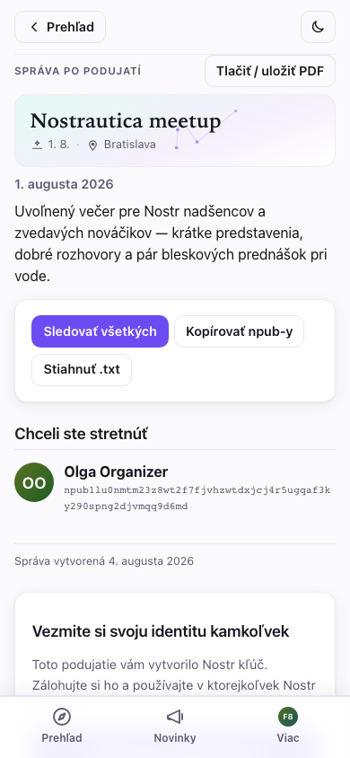

Je rozdelený na **Ľudí, ktorých ste stretli**, **Chceli ste stretnúť** (ľudia,
ktorých ste si označili, no nestretli ste sa), vaše **obľúbené prednášky** a
súkromné poznámky. Tri spôsoby, ako si spojenia udržať, keď ste doma:

- **Sledovať všetkých** — jedno klepnutie, s možnosťou najprv odškrtnúť
  kohokoľvek, koho by ste radšej nesledovali. Je to jediné pridanie do vášho
  vlastného Nostr zoznamu sledovaných, urobené lokálne — aplikácia nikdy
  nezverejní verejný zoznam „týchto ľudí som stretol na tomto podujatí",
  takže to, koho ste naozaj stretli, zostáva vašou vecou.
- **Kopírovať npub-y** / **Stiahnuť .txt** — obyčajný zoznam mien a npub-ov na
  vloženie do vlastných poznámok. Aj toto je len lokálne; nič sa
  nezverejňuje.
- **Tlačiť / uložiť ako PDF** — čistý výtlačok samotného reportu bez
  ovládacích prvkov, pre tých, čo radšej majú papierovú stopu.

Ak ste sa pripojili s identitou vytvorenou v aplikácii, report končí kartou
**Vezmite si svoju identitu kamkoľvek**: ešte jedno pripomenutie a priamy
odkaz na zálohovanie kľúča a jeho vyskúšanie v iných Nostr aplikáciách —
rovnaký moment „prechodu na Nostr", opísaný nižšie, práve vo chvíli, keď je
najrelevantnejší.

## 8. Potom: váš profil si necháte

Prekvapenie: účet, ktorý ste práve použili, je **identita na Nostri** — prihlásenie, ktoré vlastníte vy, nie táto aplikácia ani žiadna firma. Záložka **Viac** začína identifikačnou kartou s vašou fotkou, menom a verejnou adresou (vaším *npub*) — klepnutím na npub ho skopírujete:

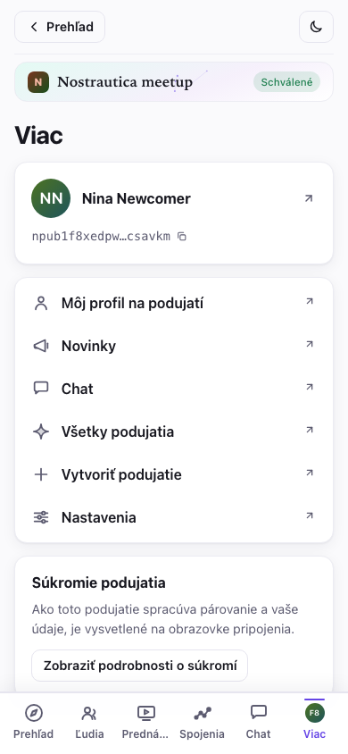

Klepnutím na kartu otvoríte celý svoj profil, skopírujete tajný kľúč a preskočíte do iných Nostr aplikácií.

Ľudia, ktorých ste na podujatí sledovali, váš profil, to všetko funguje naprieč celým ekosystémom sociálnych aplikácií (Primal, Damus, Amethyst, Yakihonne…). Skopírujte si kľúč, otvorte niektorú z nich, zvoľte „prihlásiť sa kľúčom" a vložte ho — a ste tam.

Ešte jedna vec: **Viac → Nastavenia** má tmavý režim a prepínač jazyka (angličtina / slovenčina / čeština), a vaša voľba zostáva zapamätaná:

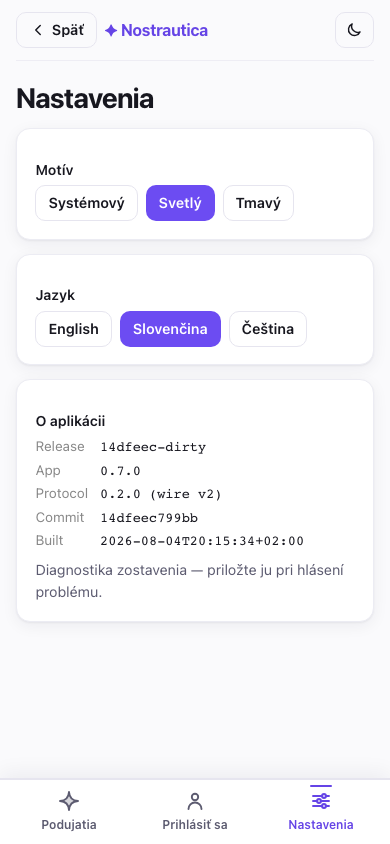

> **Príspevky organizátora a poznámky len pre členov.** Pod **Novinkami** nájdete organizátorove oznámenia. Niektoré môžu byť **len pre členov** — zašifrované tak, aby si ich mohli prečítať len schválení účastníci (adresa afterparty, kód od dverí). Ak niekedy uvidíte príspevok so zámkom a nápisom „pripojte sa k podujatiu a prečítajte si toto", je to príspevok len pre členov, ku ktorému ešte nemáte prístup.

## Ak potrebujete odísť

Pripojili ste sa k nesprávnemu podujatiu, alebo ste si to jednoducho
rozmysleli? Otvorte podujatie, prejdite na koniec stránky a klepnite na
**Opustiť podujatie**. Po potvrdení aplikácia odošle žiadosť o odchod — váš
záznam v zozname účastníkov, spojenia aj predstavovacie médiá sa upratajú na
strane koordinátora (alebo organizátora) a ste vonku. Neskôr sa môžete znova
pripojiť; berie sa to ako úplne nová žiadosť o pripojenie, nie obnovenie tej
starej.

## Súkromie v jednom odseku

Vaše meno, fotka a bio sú verejné (to je váš profil). Vaše predstavovacie video, zoznam účastníkov a vaše spojenia sú **zašifrované tak, aby ich videli len schválení účastníci tohto podujatia** — nie verejnosť, nie ľudia, ktorých nevpustili dnu. Vaše značky chcem stretnúť/stretnuté a súkromné poznámky sú zašifrované tak, aby ich videli **len vy**. Vaše správy sú koncovo šifrované medzi vami a druhou osobou. Párovanie beží na AI službe zvolenej organizátorom, ktorá číta predstavenia a profily, aby napísala svoje odporúčania. Takto vyzerá zoznam účastníkov pre niekoho, kto nie je účastníkom — nijako:

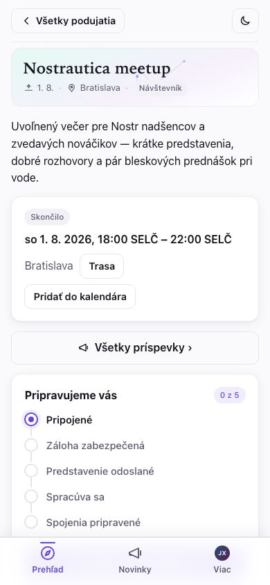

## Riešenie problémov

- **Stále mi to ukazuje „čaká sa na schválenie".** Pokiaľ ste nepoužili pozývací odkaz, organizátor schvaľuje ľudí ručne — dajte tomu pár minút, alebo ho nájdite priamo na podujatí. Aplikáciu môžete pokojne zatvoriť; skontrolujte to opätovným otvorením odkazu na podujatie.

- **Kamera sa mi nespúšťa.** Telefón alebo prehliadač žiada o povolenie na kameru — hľadajte výzvu (často v adresnom riadku) a povoľte ju. Ak sa výzva neobjaví, skúste iný prehliadač.

- **Mám nový telefón, alebo som si vymazal(a) prehliadač.** Otvorte aplikáciu, klepnite na **Už ste na Nostri? Prihláste sa → Vložiť kľúč** a vložte tajný kľúč, ktorý ste si uložili pri pripájaní. Rovnaký účet, rovnaké podujatia. (Presne preto je uloženie tohto kľúča dôležité.) Ak ste sami organizovali podujatie, vráti sa automaticky aj váš plný organizátorský prístup — schvaľovanie ľudí, administrácia, všetko — z toho istého kľúča; samostatnú zálohu samotného podujatia nepotrebujete.

- **Zatiaľ sa mi nezobrazujú žiadne spojenia.** Nahratie predstavenia je to jediné, čím spojenia zlepšíte najviac. Potom im chvíľu trvá, kým sa vypočítajú, a potrebujú, aby sa pripojilo a nahralo aj pár ďalších ľudí. Skúste to čoskoro znova.

- **Nevidím zoznam účastníkov / videá.** Najprv musíte byť schválení. Ak vás práve schválili, znova otvorte podujatie a dajte tomu chvíľu.

- **Klepol(a) som na Opustiť podujatie, ale stále to ukazuje „čaká sa".** Ak ste boli pri klepnutí offline, žiadosť sa zaradí do fronty a aplikácia vám jasne povie, že ste ešte neodišli — odošle sa hneď, ako sa znova pripojíte.

- **Prečo sa aplikácia zdá byť „zaseknutá" pri aktualizácii?** Znovunačítanie odloží, kým nahrávate, kým máte hotový, no neodoslaný záber, neodoslaný súbor alebo odkaz na prednášku, alebo rozpísané predstavenie — aby vás aktualizácia nepripravila o prácu. Kým čaká, nič sa neukladá na disk, takže hotový záber tam nenechávajte celé dni; odošlite ho alebo zahoďte a aktualizácia sa hneď potom uplatní.

- **Prepojí ma opätovné použitie starého predstavenia medzi podujatiami?** Opätovné použitie videa alebo zvuku ako je zostáva rovnaký zašifrovaný blob, takže jeho verejný hash ciphertextu môže prepojiť vašu prítomnosť na dvoch podujatiach. **Nová kópia** médium znovu zašifruje novým kľúčom a IV, dá mu nový hash a zabráni tomuto konkrétnemu prepojeniu — inú metadátu ani už zverejnené kópie inde však vymazať nedokáže.

- **Chcem si spravovať zariadenia chatu.** Cez **Chat → Zariadenia chatu** vidíte každé zariadenie napojené na váš účet pre toto podujatie, môžete premenovať to, na ktorom práve ste, alebo odstrániť tie, ktoré už nepoužívate (starý telefón, prehliadač, ktorý ste vymazali).

- **Skupinový chat je zaseknutý, alebo správa neodíde a hovorí, že som možno bol(a) odstránený(á).** Klepnite na **Znova sa pripojiť k tomuto chatu** (objaví sa vedľa chybovej hlášky alebo pod hláškou „nastavuje sa") — požiada organizátorovu službu, aby vaše zariadenie pridala späť. Zvyčajne to trvá pod minútu a zariadenie, na ktorom ste, si ponecháte; podobne ako pri každom novo pridanom zariadení, váš pohľad na konverzáciu pokračuje od tohto momentu.
