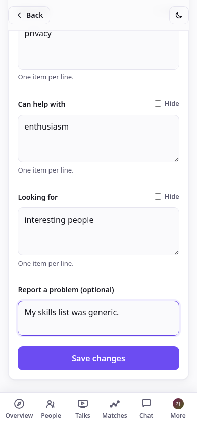
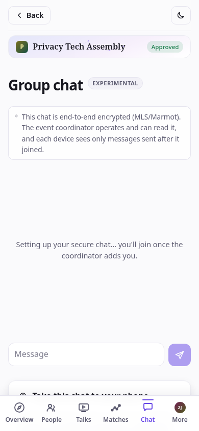

# Nostrautica — Participant Guide

Someone invited you to an event that runs on Nostrautica. Here's the deal:
you record a short video introducing yourself, and before the event starts
the app tells you **exactly who there is worth meeting — and why**. No more
hoping you bump into the right person at the coffee machine.

Five minutes of setup, all on your phone.

## 1. Open your invite link

Tap the link you were given. You'll see the event's **Overview** — what it is,
when, where — and a button to join. If the organizer has posted any
announcements, the latest show up here too.

Once you're in an event, the bar along the bottom is all about *this* event:
**Overview** (where you are now), **People**, **Matches**, **Updates**, and
**More** (your account, settings, other events). A small header at the top always
tells you which event you're in and whether you're a visitor, waiting, or in.

## 2. Join

Tap **Join this event** and fill in how people should know you:

- **Photo, name, and "About you"** — this is your public profile, like any
  social app. The form says so: *"Name, photo and bio are public — everything
  else stays inside the event."*
- **Skills** and **What are you looking for?** — this is what the matching runs
  on. Be concrete: "rust developer, looking for a co-founder" beats "tech
  enthusiast". It's worth the extra minute.
- There's a checkbox to **publish a public RSVP** if you want others to see
  you're attending. Leave it off to keep your attendance inside the event.

No email, no password, no signup. When you tap **Create identity & join**, the
app makes a portable identity for you on the spot (more on that at the end —
it's a nice bonus).

> **Already use one of these?** If you tap **Already on Nostr? Sign in**, you
> can sign in with your existing key, a browser extension, or a phone signer
> app (like Amber or Clave) instead. Your existing profile carries over and is
> shown read-only — the app never changes it — and only the event-specific
> fields (skills, looking-for) are yours to fill in.
>
> 

After you submit, one of two things happens depending on your link:

- **You're in right away** (invite links, when the organizer's matchmaking
  service is running) — you'll see a "You're in" screen with a button to see
  who's here:

  

- **The organizer approves you shortly** — you'll see a "waiting for approval"
  screen. You can close the app; you'll get in as soon as they approve.

  

Back on **Overview**, a short **"Getting you ready"** checklist tracks exactly
where you are — Joined → Backup secured → Intro submitted → Processing →
Matches ready — and shows you the *one* next thing to do, front and center. No
guessing why matches haven't appeared yet: the list tells you.

### Save your key (30 seconds — actually do it)

After joining, the app shows a **backup card** with your secret key. Tap **Copy
my secret key** and paste it into your password manager. It's the only way back
into your account if you lose your phone — there's no "forgot password" email,
because there's no company holding your account. ("More ways to back up" can
email you a recovery link or make a password-protected file.)

## 3. Record your intro

This is the important part — **no intro, no matches**. From the event page, tap
**Record / update your intro**. You get three ways to introduce yourself — pick
whichever suits you:

- **Video** (the default) — tap **Enable camera**, then **● Record**. Talk for
  up to a minute: who you are, what you're working on, what you're looking for.
  Hit **■ Stop** (it also stops itself at the time limit), watch it back, and
  tap **Use this** — or **Re-record** until you're happy.
- **Audio** — same idea, no camera. Tap **Enable microphone**, watch the level
  meter to confirm it's picking you up, then **● Record audio**.
- **Text** — no recording at all. Type a few sentences about who you are and
  what you're looking for; it feeds your matches exactly like a spoken intro,
  and (unlike video/audio) nothing is ever transcribed — the text you wrote is
  the only thing that leaves your device.

Before anything uploads, the app tells you plainly who processes it — the
event's attendees, the organizer's matchmaking service if there is one, and
which AI providers see the audio/transcript (or just the text, for text
intros) — and you have to tick a box confirming you've read that. Nobody
outside this event's attendees can ever see the intro itself.

Video and audio intros get an automatic transcript once the organizer's
matchmaking service has processed them — on your own or anyone else's page,
tap **Show transcript** under the player to read along or search it, or if you
just can't listen right now:

**Use whatever language you like.** Record your intro and write your profile in
the language you're most comfortable in — it doesn't have to match the event's
language. The app writes your matches and summaries in the event's language, and
if your bio is in a different language it shows everyone a translation with your
original one tap away ("show original"). So just be yourself in your own words.

### Your own event profile

Once the matchmaking service has processed your intro, open **More → My event
profile** to see exactly what everyone else sees about you: the bits you wrote
yourself, and — separately — the AI-written summary, skills, interests, and
"looking for" generated from your intro. Got something wrong? You can edit any
generated field, hide just that field, or hide the whole AI summary and show
only what you wrote. There's also a quick "report a problem" note if something
is off and you'd rather flag it than fix it yourself. Save, and other attendees
see your correction immediately — their view of you shows a small **"Edited by
attendee"** badge so they know it's not purely automated.

## 4. People

Tap **People** in the bottom bar to browse who's here. Each row shows an avatar
(their photo, or their initials on a coloured tile), their name, and their
skills. **Search** by name or skill, and filter to just the people you've marked
**want to meet**, **met**, or people you **follow** on Nostr. Each row also
has quick actions: mark **want to meet** or start a **message** without
opening their page.
The list streams in as relays answer — people appear as they decrypt (names and
photos fill in a moment later), so a big roster on a slow connection never
blocks on the slowest relay.

The roster is **encrypted to approved attendees**, so until you're approved (or
in the moment right after, before it syncs) the People screen stays empty and
tells you why — that's the privacy model working, not a bug:

Once you're in, tap anyone to open their page: their intro video, what they do,
what they're looking for, an AI-written summary once the matchmaking has run, and
their recent public posts.

On a person's page you can **Follow** them, tap **Message** to start a private
chat (see §6), and — privately, nobody else ever sees these — mark
**Want to meet** or **Met ✓**, and keep a private note ("the drummer with the
mesh-network startup"). Reload and it all persists. If someone's bothering you,
**Mute** hides them from your People list, Matches, and messages (it's a standard
Nostr mute, so it carries to other Nostr apps too):

## 4.5 Talks (if the organizer turned them on)

Some events let attendees submit short prerecorded talks instead of — or ahead
of — meeting in person. If it's on for your event, a **Talks** tab appears in
the bottom bar. Tap **Submit a talk**, give it a title and a short description,
then record or write it exactly like your intro (§3). It goes to the organizer
to publish before it's visible to anyone, so don't expect it to show up
instantly.

Watching a talk remembers where you left off, so you can close the app and
pick it up later, and — like your own intro — a transcript is available if the
speaker recorded rather than wrote it.

## 5. Your matches

Shortly after you record your intro, tap **Matches**: a ranked list of people to
meet. Each one leads with how strong the match is — **Strong match** or **Good
match** — and, most importantly, a plain-language explanation of *why you two
should talk*, right up front. If you want the mechanics (how similar vs. how
complementary you are), they're one tap away under "score details" — but the
reason comes first. The list updates as more people join. Tap a match to open
their full page.

At the event, work the list: find your top matches, mention the app told you to.
Best icebreaker there is.

> Matches only appear once the organizer's coordinator has processed a few
> people's intros — so if the list says "no matches yet", it just means the room
> is still warming up. Record your own intro first (§3); that's what puts you in
> everyone else's matches.

## 6. Message people

Anyone's page has a **Message** button. Tap it to open a private,
**end-to-end encrypted** conversation:

Your messages live under **More → Messages**, which lists every conversation,
newest first:

Because these are standard Nostr private messages, **they also work with other
Nostr messengers** — the person can reply from whatever Nostr app they use, and
your conversation shows up there too. It isn't locked to this event.

## 6.5 Group chat (experimental)

If the organizer has turned on **Group chat**, a **Chat** tab appears once
you're approved — a single encrypted room for the whole event, separate from
one-to-one messages. It's genuinely end-to-end encrypted (a protocol called
Marmot/MLS), though the organizer's matchmaking service operates the group
(adds and removes people as they're approved or revoked) and can read it — the
app tells you this up front, every time you open the tab. Each device only
sees messages sent after it joined, so a new phone won't see old history.

Want push notifications instead of checking the tab? Tap **Show my chat key**
and follow the steps to open the same conversation in
[Whitenoise](https://github.com/parres-hq/whitenoise), a dedicated Marmot chat
app — history there starts from whenever your phone joins.

This feature is marked **Experimental** for a reason: it's new, and joining
the group can take a little while (or occasionally need a retry) before
messages start flowing. If the tab is stuck on "setting up," give it a few
minutes and reopen it.

## 7. Afterwards: your profile is yours to keep

Surprise: the account you just used is a **Nostr identity** — a login you own,
not tied to this app or any company. The **More** tab leads with an identity
card showing your photo, your name, and your public handle (your *npub*) — tap
the npub to copy it:

Tap the card to open your full profile, copy your secret key, and jump to other
Nostr apps.

The people you followed at the event, your profile, all of it works across a
whole ecosystem of social apps (Primal, Damus, Amethyst, Yakihonne…). Copy your
key, open one of them, choose "log in with a key", and paste it in — you're
already there.

One more thing: **More → Settings** has a dark mode and a language switch
(English / Slovenčina), and your choice sticks:

> **Organizer posts and members-only notes.** Under **Updates** you'll find the
> organizer's announcements. Some may be **members-only** — encrypted so only
> approved attendees can read them (the after-party address, a door code). If you
> ever see a post with a lock and "join the event to read this", that's a
> members-only post you don't yet have access to.

## Privacy, in one paragraph

Your name, photo, and bio are public (that's your profile). Your intro video,
the attendee list, and your matches are **encrypted so only this event's
approved attendees can see them** — not the public, not people who weren't let
in. Your want-to-meet/met marks and private notes are encrypted so **only you**
can see them. Your messages are end-to-end encrypted between you and the other person.
The matching runs on an AI service chosen by the organizer, which reads intros
and profiles to write its recommendations. Here's what a non-attendee sees if
they open the attendee list — nothing:

## Troubleshooting

- **I'm still "waiting for approval".** Unless you used an invite link, the
  organizer approves people by hand — give it a few minutes, or find them at the
  event. You can safely close the app; check back by reopening the event link.

- **My camera won't start.** Your phone or browser is asking for camera
  permission — look for the prompt (often in the address bar) and allow it. If
  there's no prompt, try another browser.

- **I got a new phone, or cleared my browser.** Open the app, tap **Already on
  Nostr? Sign in → Paste a key**, and paste the secret key you saved when you
  joined. Same account, same events. (This is why saving that key matters.) If
  you organized an event yourself, your full organizer access — approving
  people, the admin screen, everything — comes back too, automatically, from
  that one key; you don't need a separate backup of the event itself.

- **No matches are showing yet.** Record your intro first — no intro, no
  matches. After that, matches take a little while to compute and need a few
  other people to have joined and recorded too. Check back soon.

- **I don't see the attendee list / videos.** You have to be approved first. If
  you were just approved, reopen the event and give it a moment.
