# Nostrautica — Participant Guide

Someone invited you to an event that runs on Nostrautica. Here's the deal:
you record a short video introducing yourself, and before the event starts
the app tells you **exactly who there is worth meeting — and why**. No more
hoping you bump into the right person at the coffee machine.

Five minutes of setup, all on your phone.

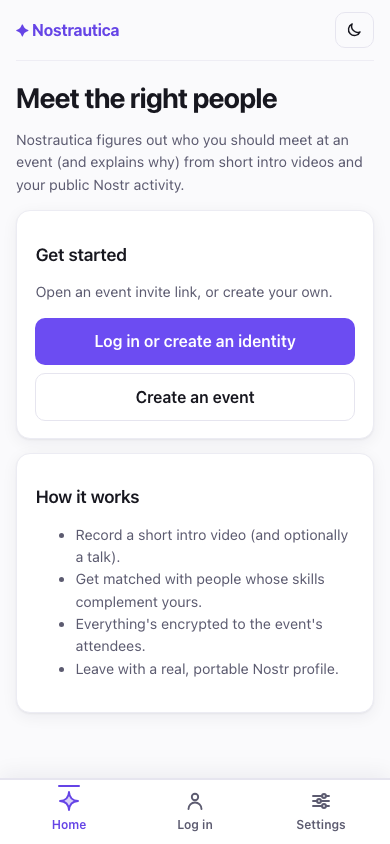

## 1. Open your invite link

Tap the link you were given. You'll see the event's **Overview** — what it is,
when, where — and a button to join. If the organizer has posted any
announcements, the latest show up here too.

Once you're in an event, the bar along the bottom is all about *this* event:
**Overview** (where you are now), **People**, **Matches**, **Updates**, and
**More** (your account, settings, other events). Two more tabs appear only when the
organizer has switched those features on: **Talks** (§4.5) and **Chat** (§6.5) — if
you don't see them, this event simply doesn't use them. A small header at the top
always tells you which event you're in and whether you're a visitor, waiting, or in.

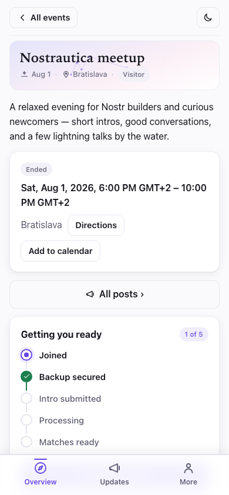

## 2. Join

Tap **Join this event** and fill in how people should know you:

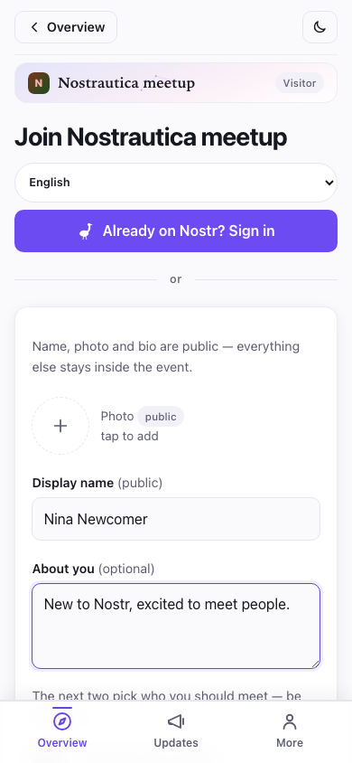

- **Photo, name, and "About you"** — this is your public profile, like any
  social app. The form says so: *"Name, photo and bio are public — everything
  else stays inside the event."*
- **Skills** and **What are you looking for?** — this is what the matching runs
  on. Be concrete: "rust developer, looking for a co-founder" beats "tech
  enthusiast". It's worth the extra minute. Skip both, and the bio too, and
  you can still join — the form just flags, gently, that there's nothing yet
  for matching to work with.
- There's a checkbox to **publish a public RSVP** if you want others to see
  you're attending. Leave it off to keep your attendance inside the event.

No email, no password, no signup. When you tap **Create identity & join**, the
app makes a portable identity for you on the spot (more on that at the end —
it's a nice bonus).

> **Already use one of these?** If you tap **Already on Nostr? Sign in**, you
> can sign in with your existing key, a browser extension, or a phone signer
> app (like Amber or Clave) instead. Your existing profile carries over and is
> shown read-only — the app never changes it.
>
> 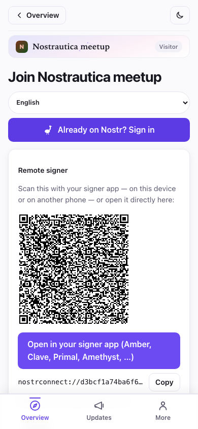

If your Nostr profile already has a bio, it's used as-is here. If it doesn't,
the join form gives you an **"About you"** box of your own — text for this
event only, never written back to your Nostr profile. Either way, **skills**
and **looking-for** are always yours to fill in fresh; they're specific to
this event.

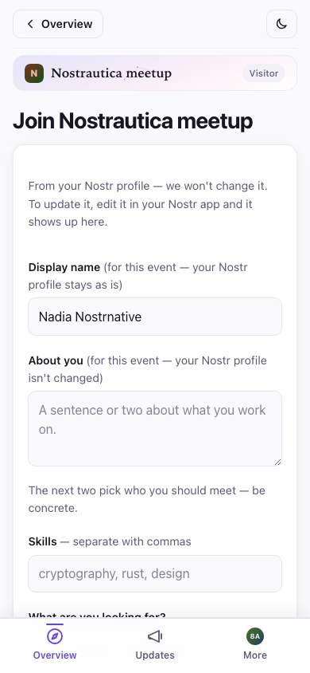

If the organizer set a limit on how long the event keeps your data, you'll see
a line saying so right on the join form — something like *"This event's data
is deleted 90 days after it ends."* That's the organizer's own cleanup
setting, not something you configure; it's just disclosed up front so you
know what you're agreeing to.

After you submit, one of two things happens depending on your link:

- **You're in right away** (invite links, when the organizer's matchmaking
  service is running) — you'll see a "You're in" screen with a button to see
  who's here:

  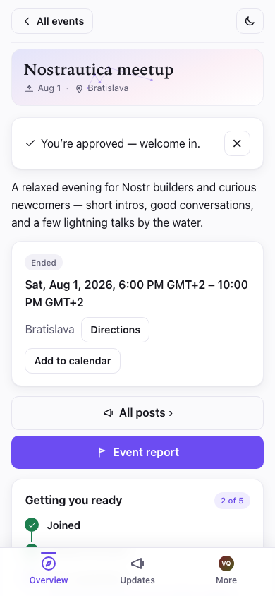

- **The organizer approves you shortly** — you'll see a "waiting for approval"
  screen. You can close the app; you'll get in as soon as they approve.

  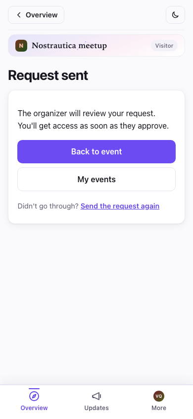

Back on **Overview**, a short **"Getting you ready"** checklist tracks exactly
where you are — Joined → Backup secured → Intro submitted → Processing →
Matches ready — and shows you the *one* next thing to do, front and center. No
guessing why matches haven't appeared yet: the list tells you.

### Works with bad venue Wi-Fi too

Further down the same Overview page, once you're approved, there's a
**Download for offline** card. Tap it and the app pre-fetches people, matches,
and talks *and* loads the screens that show them (People, Matches, Talks, a talk's
page, Record, My profile, Updates) so they're all browsable even with no signal —
handy in a packed room where everyone's phone is fighting over the same weak
connection. Earlier versions fetched the data but could still fail to *open* a
screen like Talks offline; now the screens come down with it. It still doesn't
pre-download the videos and audio themselves (just everything else), and you
can tap **Update offline copy** any time to refresh it. If a piece couldn't be
fetched, the card says so rather than pretending it's complete.

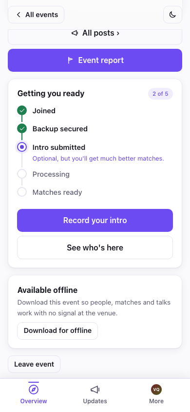

### Save your key (30 seconds — actually do it)

After joining, the app shows a **backup card** with your secret key. Tap **Copy
my secret key** and paste it into your password manager. It's the only way back
into your account if you lose your phone — there's no "forgot password" email,
because there's no company holding your account. ("More ways to back up" can
email you a recovery link or make a password-protected file.)

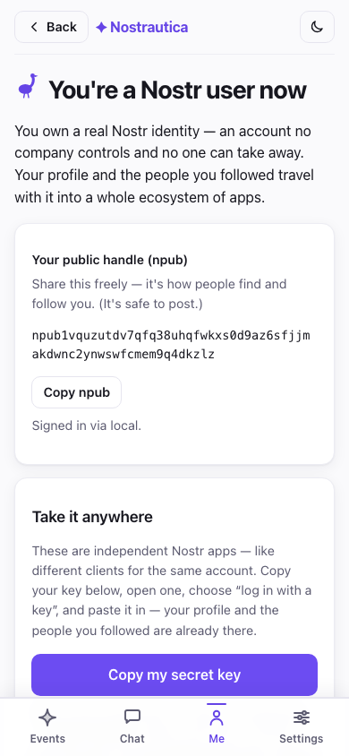

## 3. Record your intro

This is the part that makes the matching good. It is **optional** — without one
you are still matched, from your public Nostr activity and profile bio — but an
intro gives the matching far more to work with. From the event page, tap
**Record / update your intro**. You get three ways to introduce yourself — pick
whichever suits you:

> **Why bother?** Recording an intro is optional, but recommended. It gives
> the matching more to work with, so you get better matches. Other attendees
> can play it back and get a feel for whether you'd actually click — matching
> isn't only projects and skills, it's also a feeling that AI can't capture on
> its own. And if you record video, people will actually recognize you from it
> when they spot you in the crowd.

- **Video** (the default) — tap **Enable camera**, then **● Record**. Talk for
  up to a minute: who you are, what you're working on, what you're looking for.
  Hit **■ Stop** (it also stops itself at the time limit), watch it back, and
  tap **Use this** — or **Re-record** until you're happy.
- **Audio** — same idea, no camera. Tap **Enable microphone**, watch the level
  meter to confirm it's picking you up, then **● Record audio**.
- **Text** — no recording at all. Type a few sentences about who you are and
  what you're looking for; it feeds your matches exactly like a spoken intro,
  and (unlike video/audio) nothing is ever transcribed — the text you wrote is
  the only thing that leaves your device.

Before anything uploads, the app tells you plainly who processes it — the
event's attendees, the organizer's matchmaking service if there is one, and
which AI providers see the audio/transcript (or just the text, for text
intros) — and you have to tick a box confirming you've read that. Nobody
outside this event's attendees can ever see the intro itself.

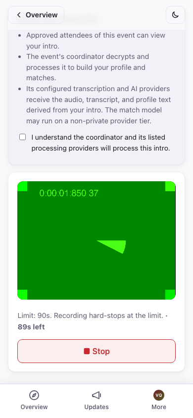

The app updates itself automatically in the background, but never at a
moment that would cost you work — it waits until you've submitted or
discarded before it reloads, so an update can't land mid-recording and lose
a take. (See Troubleshooting if you're wondering why an update seems to be
waiting.)

**Already recorded one for a different event?** If you have, this screen
shows a **reuse gallery** above the recorder — every video, audio, or text
intro you've made at any past event, each with a quick preview so you can
tell them apart. Reuse a video or audio clip as-is, or **Fresh copy** to
re-encrypt it for this event without re-recording; for text, **Use this
text** drops it into the composer so you can send it as-is or tweak it
first. The local library does not store or show the source event, and if
you'd rather this event's copy not be linkable back to that one, **Fresh
copy** takes care of it (Troubleshooting has the mechanism, if you're
curious).

Video and audio intros get an automatic transcript once the organizer's
matchmaking service has processed them — on your own or anyone else's page,
tap **Show transcript** under the player to read along or search it, or if you
just can't listen right now:

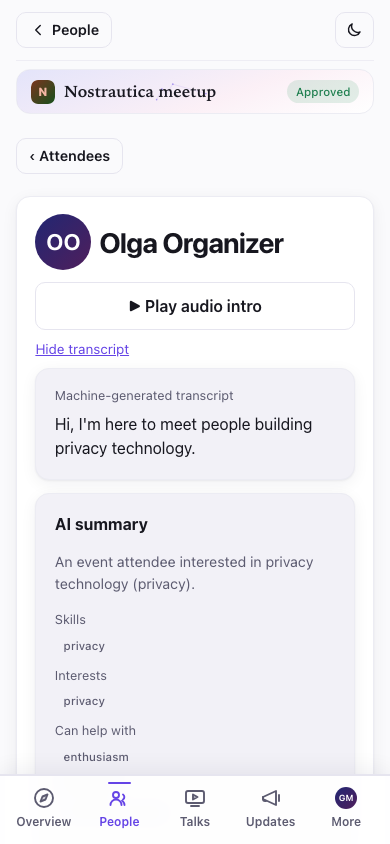

**Use whatever language you like.** Record your intro and write your profile in
the language you're most comfortable in — it doesn't have to match the event's
language. The app writes your matches and summaries in the event's language, and
if your bio is in a different language it shows everyone a translation with your
original one tap away ("show original"). So just be yourself in your own words.

### Your own event profile

Once the matchmaking service has processed your intro, open **More → My event
profile** to see exactly what everyone else sees about you, split into two
honest halves: **"You wrote"** — your about text, skills, looking-for, links,
and text intro if you sent one, editable directly (or fixed properly by
re-recording your intro) — and **"Generated from your intro"** — the
AI-written summary, skills, interests, what you can help with, and what
you're looking for, all inferred from what you recorded. Got something wrong
in the generated half? Edit any field, hide just that field, or hide the
whole AI section and show only what you wrote. There's also a quick "report a
problem" note if something is off and you'd rather flag it than fix it
yourself. Save, and other attendees see your correction immediately — their
view of you shows a small **"Edited by attendee"** badge so they know it's not
purely automated.

## 4. People

Tap **People** in the bottom bar to browse who's here. Each row shows an avatar
(their photo, or their initials on a coloured tile), their name, and their
skills. **Search** by name or skill, and filter to just the people you've marked
**want to meet**, **met**, or people you **follow** on Nostr. Each row also
has quick actions: mark **want to meet** or start a **message** without
opening their page.
The list streams in as relays answer — people appear as they decrypt (names and
photos fill in a moment later), so a big roster on a slow connection never
blocks on the slowest relay.

The roster is **encrypted to approved attendees**, so until you're approved (or
in the moment right after, before it syncs) the People screen stays empty and
tells you why — that's the privacy model working, not a bug:

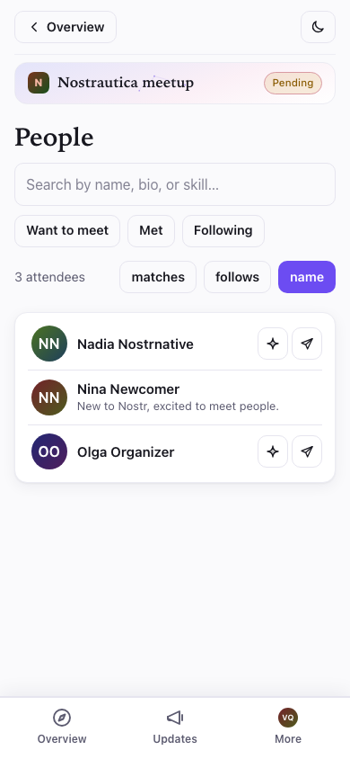

Once you're in, tap anyone to open their page: their intro video, what they do,
what they're looking for, an AI-written summary once the matchmaking has run, and
their recent public posts.

On a person's page you can **Follow** them, tap **Message** to start a private
chat (see §6), and — privately, nobody else ever sees these — mark
**Want to meet** or **Met ✓**, and keep a private note ("the drummer with the
mesh-network startup"). Reload and it all persists. If someone's bothering you,
**Mute** hides them from your People list, Matches, and messages (it's a standard
Nostr mute, so it carries to other Nostr apps too):

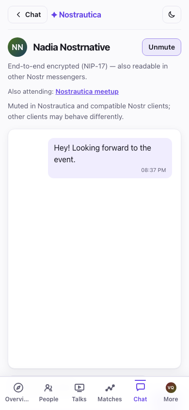

## 4.5 Talks (if the organizer turned them on)

Some events let attendees submit short prerecorded talks instead of — or ahead
of — meeting in person. If it's on for your event, a **Talks** tab appears in
the bottom bar. Tap **Submit a talk**, give it a title and a short description,
then choose how to provide the video:

- **Record** it in the browser (like your intro, §3),
- **Upload a file** you already have, or
- **Paste a URL** — an unlisted **YouTube** link or a direct **.mp4** link. This
  is the way to go for a talk too large to upload; the video stays wherever you
  host it and only the *link* is encrypted to the event.

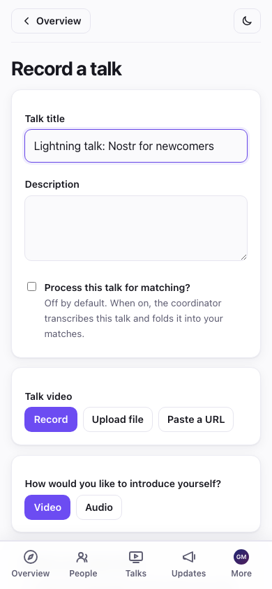

There's also a **"Process this talk for matching?"** checkbox, off by default:
leave it off and your talk is simply published for people to watch; tick it and
the coordinator will also transcribe it and use it to sharpen your matches.
(Pasted-URL talks are never processed — they're watch-only.) Either way the talk
goes to the organizer to publish before it's visible to anyone, so don't expect
it to show up instantly.

Pasting a link shows a quick confirmation once the app recognizes it:

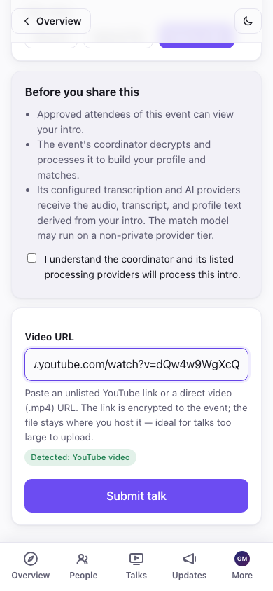

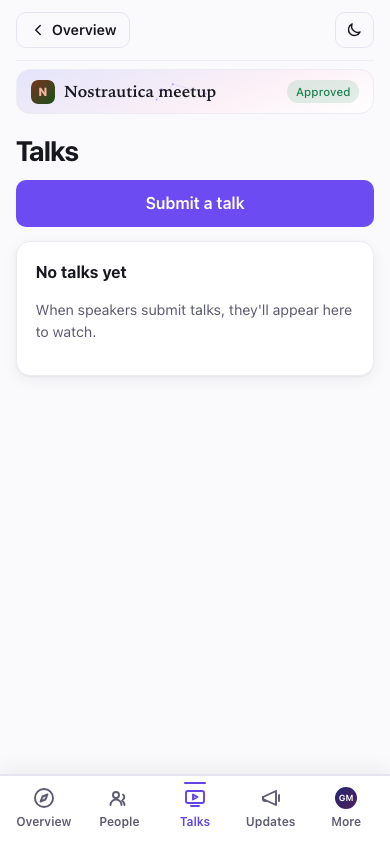

Watching a talk remembers where you left off, so you can close the app and pick
it up later, and the player has a **speed control** (1×/1.5×/2×) for getting
through a long talk faster. A transcript is available when the speaker opted
their talk into processing.

## 5. Your matches

Shortly after you record your intro, tap **Matches**: a ranked list of people to
meet. Each one leads with how strong the match is — **Strong match** or **Good
match**, colour-graded on a single green ramp so the stronger badge is
visibly brighter and you can tell them apart before reading a word — and,
most importantly, a plain-language explanation of *why you two should talk*,
right up front. If you want the mechanics (how similar vs. how complementary
you are), they're one tap away under "score details" — but the reason comes
first. The list updates as more people join. Tap a match to open their full
page.

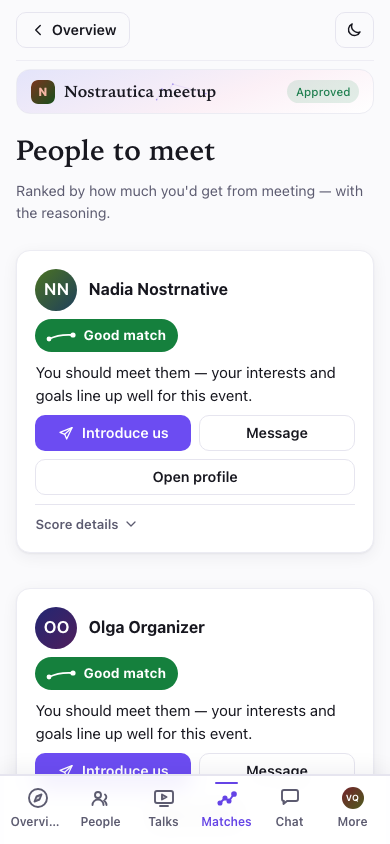

A small badge appears on the **Matches** tab whenever there are new matches
since you last looked, so you don't have to keep re-checking a list that
hasn't changed.

At the event, work the list: find your top matches, mention the app told you to.
Best icebreaker there is.

> Matches only appear once the organizer's coordinator has processed a few
> people's intros — so if the list says "no matches yet", it just means the room
> is still warming up. Record your own intro first (§3); that's what puts you in
> everyone else's matches.

## 6. Message people

Anyone's page has a **Message** button. Tap it to open a private,
**end-to-end encrypted** conversation:

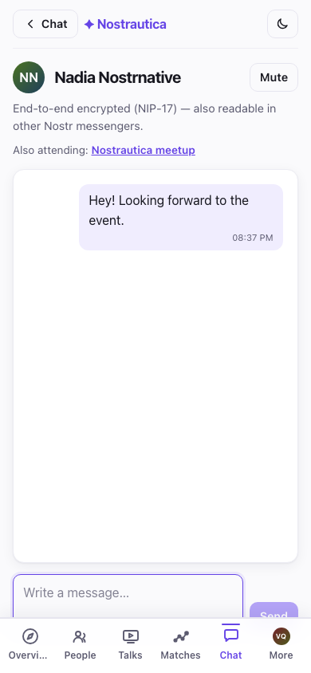

Your messages live under **More → Messages**, which lists every conversation,
newest first:

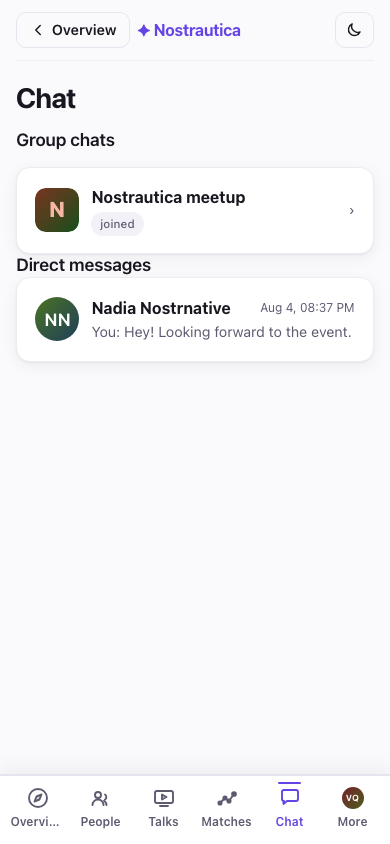

Because these are standard Nostr private messages, **they also work with other
Nostr messengers** — the person can reply from whatever Nostr app they use, and
your conversation shows up there too. It isn't locked to this event.

## 6.5 Group chat (experimental)

If the organizer has turned on **Group chat**, a **Chat** tab appears once
you're approved — a single encrypted room for the whole event, separate from
one-to-one messages. It works like any chat: messages appear in the room as
people send them, day separators mark the passage of time, and you can switch
between a bubble view and a compact IRC-style log from a toggle above the
messages. It's genuinely end-to-end encrypted (a protocol called Marmot/MLS),
though the organizer's matchmaking service operates the group (adds and
removes people as they're approved or revoked) and can read it — the app
tells you this up front, every time you open the tab.

**It works across all your devices, automatically.** Open the Chat tab on a
second phone or another browser and it joins the group on its own — no code
to scan, no pairing step. One catch is inherent to how the underlying
protocol works, not a bug: a device only ever sees messages sent *after* it
joined — there's no syncing history onto a freshly added device.

This feature is marked **Experimental** for a reason: it's new (interop with
other Marmot-compatible apps is planned but not something to rely on yet),
and joining the group can take a little while, or occasionally need a retry,
before messages start flowing. If the tab is stuck on "setting up," give it a
few minutes and reopen it.

## 7. Your event report

Any time — before, during, or after the event — open **Event report** from
the event menu to see a tidy summary of your event, built entirely from your
own **want to meet** / **met** marks and notes (§4). It stays live and
editable right up to and past the end of the event, so it reflects what
actually happened at the venue, not just who you planned to see beforehand.

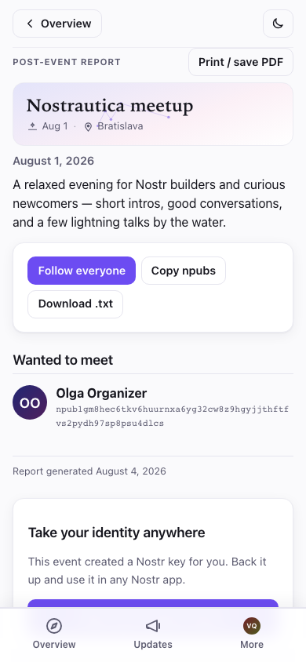

It's organized into **People you met**, **Wanted to meet** (people you
flagged but didn't connect with), your **favorite talks**, and your private
notes. Three ways to keep the connections once you're home:

- **Follow everyone** — one tap, with a checklist to uncheck anyone you'd
  rather not follow first. It's a single append to your own Nostr follow
  list, done locally — the app never publishes a public "I met these people
  at this event" list, so who you actually met stays your business.
- **Copy npubs** / **Download .txt** — a plain list of names and npubs, for
  pasting into your own notes app. Also local-only; nothing is published.
- **Print / save PDF** — a clean, chrome-free printout of the report itself,
  for people who'd rather keep a paper trail.

If you joined with an app-created identity, the report ends with **Take your
identity anywhere**: one more nudge, and a direct link, to back up your key
and see it working in Primal, Damus, Amethyst, or Yakihonne — the same
"switch to Nostr" moment described below, right when it's most relevant.

## 8. Afterwards: your profile is yours to keep

Surprise: the account you just used is a **Nostr identity** — a login you own,
not tied to this app or any company. The **More** tab leads with an identity
card showing your photo, your name, and your public handle (your *npub*) — tap
the npub to copy it:

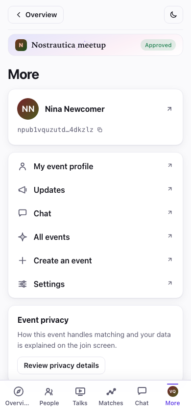

Tap the card to open your full profile, copy your secret key, and jump to other
Nostr apps.

The people you followed at the event, your profile, all of it works across a
whole ecosystem of social apps (Primal, Damus, Amethyst, Yakihonne…). Copy your
key, open one of them, choose "log in with a key", and paste it in — you're
already there.

One more thing: **More → Settings** has a dark mode and a language switch
(English / Slovenčina / Čeština), and your choice sticks:

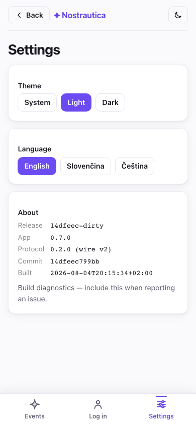

> **Organizer posts and members-only notes.** Under **Updates** you'll find the
> organizer's announcements. Some may be **members-only** — encrypted so only
> approved attendees can read them (the after-party address, a door code). If you
> ever see a post with a lock and "join the event to read this", that's a
> members-only post you don't yet have access to.

## If you need to leave

Joined the wrong event, or just changed your mind? Open the event, scroll to
the bottom, and tap **Leave event**. Confirm, and the app sends a withdrawal
request — your directory entry, matches, and intro media get cleaned up on
the coordinator's (or organizer's) side, and you're out. You can rejoin
later; it's treated as a brand-new join request, not a resurrection of the
old one.

## Privacy, in one paragraph

Your name, photo, and bio are public (that's your profile). Your intro video,
the attendee list, and your matches are **encrypted so only this event's
approved attendees can see them** — not the public, not people who weren't let
in. Your want-to-meet/met marks and private notes are encrypted so **only you**
can see them. Your messages are end-to-end encrypted between you and the other person.
The matching runs on an AI service chosen by the organizer, which reads intros
and profiles to write its recommendations. Here's what a non-attendee sees if
they open the attendee list — nothing:

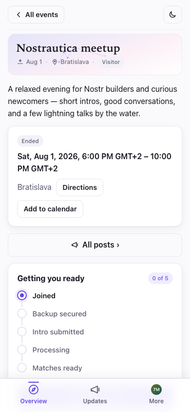

## Troubleshooting

- **I'm still "waiting for approval".** Unless you used an invite link, the
  organizer approves people by hand — give it a few minutes, or find them at the
  event. You can safely close the app; check back by reopening the event link.

- **My camera won't start.** Your phone or browser is asking for camera
  permission — look for the prompt (often in the address bar) and allow it. If
  there's no prompt, try another browser.

- **I got a new phone, or cleared my browser.** Open the app, tap **Already on
  Nostr? Sign in → Paste a key**, and paste the secret key you saved when you
  joined. Same account, same events. (This is why saving that key matters.) If
  you organized an event yourself, your full organizer access — approving
  people, the admin screen, everything — comes back too, automatically, from
  that one key; you don't need a separate backup of the event itself.

- **No matches are showing yet.** Recording an intro is the biggest single
  improvement you can make here. After that, matches take a little while to compute and need a few
  other people to have joined and recorded too. Check back soon.

- **I don't see the attendee list / videos.** You have to be approved first. If
  you were just approved, reopen the event and give it a moment.

- **I tapped Leave event but it still shows pending.** If you were offline
  when you tapped it, the request is queued and the app tells you plainly you
  haven't left yet — it sends as soon as you reconnect.

- **Why does the app seem to be waiting to update itself?** It defers
  reloading while you're recording, while you have a finished-but-unsent
  take, a file or talk URL that's still unsent, or a draft intro typed — so
  an update can't land at a moment that would cost you work. Nothing is
  written to disk while it waits, so don't leave a finished take sitting for
  days; submit or discard it and the update lands right after.

- **Does reusing an old intro link me across events?** Reusing a video or
  audio clip as-is keeps the same encrypted blob, so its public ciphertext
  hash can tie your presence at two events together. **Fresh copy**
  re-encrypts the media with a new key and IV, giving it a new hash and
  avoiding that specific link — though it can't erase other metadata or
  copies already published elsewhere.

- **I want to manage my chat devices.** Open **Chat → Chat devices** to see
  every device attached to your account for this event, rename the one
  you're on, or remove any you no longer use (an old phone, a browser you
  cleared).

- **Group chat is stuck, or won't send and says I may have been removed.**
  Tap **Rejoin this chat** (it appears next to the error, or under the
  "setting up" notice) — it asks the organizer's service to add your device
  back. It usually takes under a minute and keeps the device you're on; like
  any newly added device, your view of the conversation continues from that
  point on.
